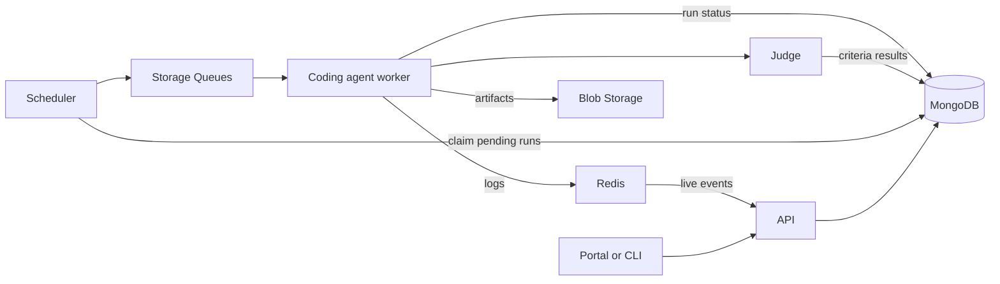

<div align="center">

  <h1>&nbsp;Scope</h1>

  <p><strong>An open-source agentic experience evaluation platform.</strong></p>

  <p>
    Evaluate how AI agents use your product, approach real tasks and respond to feedback. Compare accross surfaces (CLI, MCP, Skills, doc, ...), context, tasks, operating systems, ...
    Define success with reusable criteria, follow each run live, and inspect the
    evidence behind every result through the Portal or CLI.
  </p>

  <p>
    <a href="https://nodejs.org/"></a>
    <a href="https://pnpm.io/"></a>
    <a href="https://www.typescriptlang.org/"></a>
    <a href="./LICENSE"></a>
  </p>

  <p>
    <a href="#why-scope">Why Scope</a> |
    <a href="#how-it-works">How it works</a> |
    <a href="#getting-started">Get started</a> |
    <a href="#documentation">Documentation</a> |
    <a href="#contributing">Contributing</a>
  </p>
</div>

## Why Scope?

A working result is only part of the agentic experience. Scope helps you
evaluate the output, the steps an agent took, and how it responded to feedback.
Use repeatable evaluations to understand both successes and failures.

- **Define what success means.** Organize evaluation criteria into a directed
  acyclic graph (DAG), with dependencies between checks.
- **Inspect the evidence.** Follow live logs and review generated files,
  workspace snapshots, criteria results, and captured agent activity.
- **Evaluate changes.** Reuse tasks and saved profiles to understand how the
  agent, model, skills, tools, or starting codebase affect the experience.
- **Automate evaluations.** Submit and manage runs from the CLI or REST API,
  and explore results, reports, and insights in the Portal.

Scope is for product managers, developers, researchers, and teams evaluating how their software is being used by coding agents.
Results describe the tasks and configurations you tested, not a universal agent
ranking. The automated Judge can make mistakes; important conclusions need human
review.

## How it works



1. **Define** a task, its evaluation criteria, and the agent configuration.
2. **Submit** a request through the Portal or CLI. The scheduler dispatches
   pending runs to the appropriate worker queue.
3. **Execute and evaluate.** The worker runs the agent and asks the Judge to
   evaluate its output. Runs can include multiple feedback iterations.
4. **Inspect and compare.** Review logs, snapshots, and criteria results.
   Post-processing and report workers produce additional analysis when enabled.

MongoDB holds evaluation configuration and run records. Blob Storage holds larger
artifacts, and Redis relays live events. Local development uses MongoDB, Redis,
Azurite (the Azure Storage emulator), and Lowkey Vault. See the
[system architecture](./docs/architecture/system-architecture.md) for service
details and production deployment considerations.

### Coding agents

| Worker | Integration | Getting started |
| --- | --- | --- |
| GitHub Copilot | Agent Client Protocol (ACP) | `pnpm docker:dev:copilot` |
| Claude Code | ACP | `pnpm docker:dev:claude-code` |
| GitHub Copilot on Windows | Windows ACP worker | Deployment-specific; see [system architecture](./docs/architecture/system-architecture.md) |

The default local workflow below uses the Copilot worker. The
`pnpm docker:dev:all` command enables both local ACP workers, not every
deployment-specific integration. Each provider requires its own credentials
and access to the selected models.

## Getting started

### Prerequisites

| Tool | Requirement |
| --- | --- |
| Git | Clone the repository; fork it first if you plan to contribute. |
| Node.js | Version 22, matching CI. |
| pnpm | Version 10.29.1, pinned in `package.json`. |
| Docker with Compose v2 | Run the local stack. Use a current version with Compose Watch support. |
| [mkcert](https://github.com/FiloSottile/mkcert#installation) | Create trusted HTTPS certificates for the local sign-in emulator. |
| [GitHub CLI](https://cli.github.com/) | Obtain a token for the Copilot quick start with `gh auth login`. |

The Copilot worker requires an **active GitHub Copilot entitlement** on the
account supplying its token. Authenticating with `gh auth login` alone does not
grant Copilot access. You also need credentials with access to the models used
by the Judge and other AI features. Provider usage may incur charges or consume
quotas. The local backing services don't require an Azure subscription.

**Setting up a new machine?** Use
[`scripts/setup-linux-prereqs.sh`](./scripts/setup-linux-prereqs.sh) to check and
install the tools above on Linux (or Ubuntu on WSL2). On Windows, run
[`scripts/install-wsl-ubuntu.ps1`](./scripts/install-wsl-ubuntu.ps1) first to
install WSL2 and Ubuntu. See [CONTRIBUTING.md](./CONTRIBUTING.md#quick-start-with-the-setup-scripts)
for details.

The commands below use a Bash-compatible shell. Rust is only required on the
host if you build or modify the gateway outside Docker.

### 1. Clone and install

```bash
git clone https://github.com/microsoft/scope.git
cd scope
corepack enable
pnpm install --frozen-lockfile
```

If you cloned a fork, run the remaining commands from that checkout instead.

### 2. Configure and start the stack

Authenticate with an account that has an active Copilot entitlement:

```bash
gh auth login
GITHUB_TOKEN="$(gh auth token)" pnpm docker:dev:copilot
```

This builds and starts the Copilot worker, Portal, API, scheduler, Judge,
token manager, gateway, post-processing and reporting services, and their local
dependencies. Database migrations and development agent registration run
automatically. The first build downloads several images and can take some time.

The startup scripts also generate `.env` from [`.env.base`](./.env.base) and
configure local sign-in over HTTPS. Local authentication requires your browser
to trust the development certificate. The scripts run `mkcert -install` to add
a local certificate authority to the OS/browser trust store and generate the
emulator's `localhost` certificate. On first use, you may be prompted to approve
this trust-store change. See the
[local authentication instructions](./ENV_VARIABLES.md#local-dev-setup-entra-local).

For persistent overrides, copy [`.env.local.example`](./.env.local.example) to
`.env.local` and edit it locally. Don't put credentials in `.env.base` or commit
them. Avoid editing the generated `.env`, which is regenerated by the scripts.
See the [environment reference](./ENV_VARIABLES.md) for provider credentials,
Judge models, and optional Azure AI Foundry configuration.

### 3. Open the Portal

In a second terminal, from the repository root:

```bash
pnpm open:portal
```

The default address is `http://localhost:5100`. Git worktrees get their own port
assignments; `pnpm open:portal` resolves the correct address automatically.
Local sign-in uses the seeded emulator users, such as `alice@entralocal.dev`,
not a production Microsoft Entra tenant. See
[local authentication setup](./ENV_VARIABLES.md#local-dev-setup-entra-local).

> **Local development is not a security sandbox.** The ACP worker configuration
> mounts the Docker socket so agents can run containers. Use a dedicated
> environment for untrusted tasks, and don't expose this development stack to
> the internet.

## Run your first evaluation

### From the Portal

1. Select or create a project to keep your evaluation data together.
2. Create a task and at least one observable evaluation criterion. For example,
   ask the agent to create a Node.js HTTP server and evaluate whether its source
   implements a `GET /health` route returning JSON.
3. Open the run submission page, select the running Copilot agent and an
   available model, and attach your task and criteria. You can save the agent
   configuration as a reusable profile.
4. Submit the run, follow its live logs, and inspect the Judge's results and
   workspace artifacts.

If no models are available, check your provider access and the model-scanner
logs before submitting. A registered agent isn't necessarily running; choose
the worker enabled by your Compose command.

### From the CLI

Build the CLI and its shared dependency, then explore the available commands:

```bash
pnpm build:cli
pnpm cli --help
pnpm cli project list
```

Select a project using the ID returned by `project list`:

```bash
pnpm cli project use <project-id>
pnpm cli criteria list
pnpm cli run submit --help
pnpm cli run list
```

Replace `<project-id>` with an actual ID. Submission requires a selected project,
a task, and evaluation criteria. Use `--project <project-id>` or `SCOPE_PROJECT`
to select a project explicitly in automation. The CLI reads local port settings
from the generated `.env`; set `SCOPE_API_URL` to target another instance.

### Evaluation building blocks

| Concept | Purpose |
| --- | --- |
| Tasks and scenarios | Define the work the agent should perform. |
| Criteria | Define observable checks and dependencies for the Judge. |
| Personas | Configure the evaluation perspective and feedback style. |
| Profiles and variations | Save an agent configuration and compare changes against a baseline. |
| Skills and MCP servers | Provide agent instructions and tools through the Model Context Protocol. |
| Codebases | Seed a run with a versioned starting workspace. |

The YAML files in [`config/`](./config/) are portable examples, not the live
configuration database. MongoDB is the runtime source of truth. Manage
configuration through the Portal or CLI; don't assume that editing an example
file changes an existing evaluation.

## Development

The repository is a pnpm workspaces monorepo, primarily TypeScript, with a React
Portal and a Rust AI gateway.

| Path | Contents |
| --- | --- |
| [`apps/api/`](./apps/api/) | REST API and live event streaming |
| [`apps/portal/`](./apps/portal/) | Web UI and Storybook components |
| [`apps/cli/`](./apps/cli/) | CLI for evaluation management and automation |
| [`apps/scheduler/`](./apps/scheduler/) and [`apps/judge/`](./apps/judge/) | Run dispatch and criteria evaluation |
| [`apps/workers/`](./apps/workers/) | Coding-agent, post-processing, and report workers |
| [`apps/gateway/`](./apps/gateway/) and [`apps/token-manager/`](./apps/token-manager/) | AI traffic capture and credential management |
| [`packages/`](./packages/) | Shared types, storage clients, migrations, and supporting libraries |
| [`config/`](./config/) and [`docs/`](./docs/) | Evaluation examples and documentation |

Useful commands from the repository root:

```bash
pnpm test                  # Unit tests
pnpm lint                  # Workspace lint and type checks
pnpm build                 # Workspace builds
pnpm storybook             # Portal component catalog
pnpm test:integration      # Integration tests; requires .env and backing services
```

For service-by-service development, Rust commands, migrations, and code
conventions, read [CONTRIBUTING.md](./CONTRIBUTING.md).

## Documentation

| Topic | Guide |
| --- | --- |
| Architecture and run lifecycle | [System architecture](./docs/architecture/system-architecture.md) |
| Domain models and API design | [Application design](./docs/architecture/app-design.md) |
| Project organization | [Projects](./docs/architecture/data-organization-projects.md) |
| Evaluation and criteria DAGs | [Criteria provider](./docs/architecture/criteria-provider.md) |
| Agent context | [Skills](./docs/architecture/skills.md) and [codebases](./docs/architecture/codebases.md) |
| Scheduling and recovery | [Queue scheduler](./docs/architecture/queue-scheduler.md) |
| Configuration and authentication | [Environment variables](./ENV_VARIABLES.md) |
| AI limitations and data handling | [Responsible AI FAQ](./docs/responsible-ai-faq.md) |
| More architecture, operations, and research | [Documentation index](./docs/README.md) |

## Contributing

Contributions aren't limited to new workers. Documentation improvements,
reproducible bug reports, evaluation examples, tests, and accessibility fixes
are useful ways to get involved.

Search [existing issues](https://github.com/microsoft/scope/issues) before
reporting a bug or proposing a feature. For larger changes, open an issue to
discuss the approach before implementation. Include reproduction steps and
relevant versions in bug reports, and remove credentials and sensitive run
content from logs.

Read the [contribution guide](./CONTRIBUTING.md) for setup, conventions, and the
pull request process. Open pull requests against `microsoft/scope` on `main`,
including when working from a fork. Most contributions require the Microsoft
Contributor License Agreement; the CLA bot will guide you through it.

Everyone participating in the project is expected to follow the
[Code of Conduct](./CODE_OF_CONDUCT.md).

## Support and security

For usage questions, bugs, and feature requests, see [SUPPORT.md](./SUPPORT.md).
Report vulnerabilities privately through [SECURITY.md](./SECURITY.md), never
through a public GitHub issue.

Evaluation artifacts can contain prompts, source code, tool output, and network
metadata. Only use data and credentials approved for your deployment, configure
appropriate access controls, and review generated code before using it. Scope
doesn't certify that an agent or its output is safe or production-ready. Read
the [Responsible AI FAQ](./docs/responsible-ai-faq.md) before running sensitive
or untrusted workloads.

## License and trademarks

Scope is licensed under the [MIT License](./LICENSE). Third-party attributions
are in [`NOTICE`](./NOTICE); contributors changing dependencies should follow
the [notice maintenance instructions](./CONTRIBUTING.md#third-party-notices).

This project may contain trademarks or logos for projects, products, or
services. Authorized use of Microsoft trademarks or logos must follow
[Microsoft's Trademark and Brand Guidelines](https://www.microsoft.com/en-us/legal/intellectualproperty/trademarks/usage/general).
Use of Microsoft trademarks or logos in modified versions of this project
must not cause confusion or imply Microsoft sponsorship. Any use of
third-party trademarks or logos is subject to those parties' policies.
