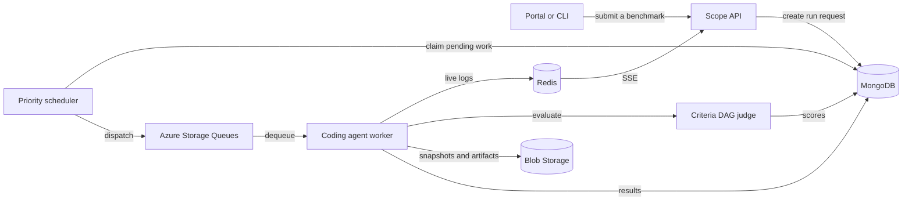

<div align="center">

  <h1>&nbsp;Scope Agentic Experience Platform (Research Preview)</h1>

  <p><strong>Evaluate the agentic experience of product surfaces with repeatable, evidence-backed runs.</strong></p>

  <p>
    Compare agents, models, skills, and product surfaces against realistic tasks.
    Watch each run live, evaluate the result against clear criteria, and keep the
    artifacts that explain what happened.
  </p>

  <p>
    <a href="https://nodejs.org/"></a>
    <a href="https://pnpm.io/"></a>
    <a href="https://www.typescriptlang.org/"></a>
    <a href="./LICENSE"></a>
  </p>

  <p>
    <a href="#why-scope">Why Scope</a> |
    <a href="#how-it-works">How it works</a> |
    <a href="#quick-start">Quick start</a> |
    <a href="#documentation">Documentation</a> |
    <a href="#contributing">Contributing</a>
  </p>
</div>

## Why Scope

AI coding agents change quickly. A useful evaluation platform needs to show more
than a pass or fail result. Scope turns a coding task into a repeatable
experiment: define the context, run it across agents, inspect the evidence, and
compare the outcomes.

| Define the challenge | Run the experiment | Learn from the evidence |
| --- | --- | --- |
| Create tasks, personas, skills, codebases, and reusable criteria that reflect real work. | Submit the same benchmark to GitHub Copilot, Claude Code, or VS Code based workers from the Portal or CLI. | Follow live logs, evaluate a criteria DAG, retain workspace snapshots, and compare trajectories across runs. |

### Built for useful comparisons

- **Realistic contexts**: Test prompts alongside personas, skills, MCP servers,
  and optional seeded codebases.
- **Clear evaluation**: Express quality as a criteria DAG, then let the Judge
  score each run with explicit dependencies between checks.
- **Agent and model coverage**: Track worker versions and discovered model
  capabilities so a benchmark is tied to the software that ran it.
- **Live visibility**: Stream run activity to the Portal and CLI over SSE while
  preserving artifacts in MongoDB and Blob Storage.
- **Fair scheduling**: Prioritize urgent work without losing control of the
  queue, then let KEDA scale workers to demand.
- **Analysis beyond one task**: Compare criteria state transitions across
  scenarios with an MDP-based view of agent behavior.

### Agent surfaces

| Surface | How Scope runs it |
| --- | --- |
| GitHub Copilot | Agent Client Protocol worker and VS Code based workers |
| Claude Code | Agent Client Protocol worker |
| VS Code with Copilot Chat | Browser automation and Electron driver-extension workers |
| New agent integrations | Shared worker, queue, evaluation, and reporting foundations |

## How it works

Every run follows the same path, whether it starts in the Portal, the CLI, or
your own automation.



The API accepts a benchmark request. The scheduler selects pending work by
priority, workers execute the selected agent, and the Judge records a
criteria-level result. Logs and artifacts stay attached to the run so results
are inspectable, not just summarized.

For the full production topology, including token management, AI traffic
capture, deployment, and service ownership, see the
[system architecture](./docs/architecture/system-architecture.md).

## Quick start

### What you need

- Node.js 22
- pnpm 10.29.1, enabled through [Corepack](https://nodejs.org/api/corepack.html)
- Docker and Docker Compose
- [GitHub CLI](https://cli.github.com/) authenticated with `gh auth login` when
  running the GitHub Copilot worker

### Start a local benchmark stack

```bash
corepack enable
pnpm install
GITHUB_TOKEN="$(gh auth token)" pnpm docker:dev:copilot
```

This starts the local data services, API, scheduler, Judge, token manager,
Copilot worker, report generator, and Portal with hot reload enabled.

Open the Portal in a second terminal:

```bash
pnpm open:portal
```

The default Portal address is `http://localhost:5100`. In a Git worktree,
`pnpm open:portal` resolves that worktree's assigned port automatically.

<details>
  <summary><strong>Prefer to run services natively?</strong></summary>

  ```bash
  pnpm docker:up:infra
  pnpm dev:api
  pnpm dev:portal
  ```

  Start an individual worker with `pnpm dev:coder-acp-copilot` or
  `pnpm dev:coder-acp-claude-code`. See
  [Contributing](./CONTRIBUTING.md#local-development) for the full local
  development workflow.
</details>

### Find your way around

| I want to... | Start here |
| --- | --- |
| Submit or automate a benchmark | `pnpm cli --help` |
| Discover available run commands | `pnpm cli run --help` |
| Start all available workers locally | `pnpm docker:dev:all` |
| Run unit tests | `pnpm test` |
| Configure Portal AI assistance | [Environment variables](./ENV_VARIABLES.md#llm-configuration-portal-ai-features) |

## Shape the benchmark

Scope keeps the pieces of an evaluation separate, so you can reuse and
change them independently.

| Building block | Purpose | Where to learn more |
| --- | --- | --- |
| Tasks and scenarios | Define the coding challenge and acceptance context. | [`config/scenarios/`](./config/scenarios/) |
| Personas | Set the perspective, experience, and communication style behind a task. | [`config/personas/`](./config/personas/) |
| Criteria | Describe observable quality checks and their dependencies. | [Criteria provider](./docs/architecture/criteria-provider.md) |
| Skills and codebases | Give agents the tools and starting context that mirror a real product surface. | [Skills](./docs/architecture/skills.md) and [codebases](./docs/architecture/codebases.md) |
| Profiles and variations | Compose an agent configuration, then compare changes against a baseline. | [Application design](./docs/architecture/app-design.md) |

MongoDB is the runtime source of truth. The YAML files in `config/` make
configuration portable and easy to version alongside your work.

## A platform that grows with your experiments

The monorepo keeps the benchmark experience, worker runtime, and deployment
model together.

```text
apps/       API, Portal, CLI, scheduler, Judge, gateway, token manager, workers
packages/   Shared types, storage clients, migrations, auth, model scanning, evaluation
config/     Portable examples for scenarios, personas, criteria, and prompt features
docs/       Architecture, operations, research, and design documentation
```

## Documentation

| Topic | Read |
| --- | --- |
| Platform topology and request lifecycle | [System architecture](./docs/architecture/system-architecture.md) |
| API, domain models, and project boundaries | [Application design](./docs/architecture/app-design.md) |
| Queue priority, recovery, and scaling | [Queue scheduler](./docs/architecture/queue-scheduler.md) |
| Criteria DAGs and evaluation providers | [Criteria provider](./docs/architecture/criteria-provider.md) |
| Writing and delivering agent skills | [Skills architecture](./docs/architecture/skills.md) |
| CLI installation and automation | [CLI distribution](./docs/architecture/cli-distribution.md) |
| Environment settings | [Environment variable reference](./ENV_VARIABLES.md) |
| All docs | [Documentation index](./docs/README.md) |

## Contributing

Contributions are welcome. The [contribution guide](./CONTRIBUTING.md) covers
local setup, testing, code conventions, the Microsoft Contributor License
Agreement, and the pull request process.

Please report security issues through the process in
[SECURITY.md](./SECURITY.md), not in a public issue. This project follows the
[Microsoft Open Source Code of Conduct](./CODE_OF_CONDUCT.md).

## License

Scope is available under the [MIT License](./LICENSE).

<details>
  <summary>Trademark notice</summary>

  This project may contain trademarks or logos for projects, products, or
  services. Authorized use of Microsoft trademarks or logos must follow
  [Microsoft's Trademark and Brand Guidelines](https://www.microsoft.com/en-us/legal/intellectualproperty/trademarks/usage/general).
  Use of Microsoft trademarks or logos in modified versions of this project
  must not cause confusion or imply Microsoft sponsorship. Any use of
  third-party trademarks or logos is subject to those parties' policies.
</details>

## Third-party notices

Scope redistributes third-party open-source components (npm production dependencies shipped in
the service images and the Rust crates linked into the `gateway` binary). Their attributions and
license texts are collected in the root [`NOTICE`](NOTICE) file.

`NOTICE` is generated — do not edit it by hand. Regenerate it after changing dependencies:

```bash
pnpm notice          # regenerate NOTICE (and NOTICE-REVIEW.txt)
pnpm notice:check    # CI check: fail if NOTICE is out of date
```

The generator (`scripts/generate-notice.ts`) only orchestrates purpose-built license tooling
and concatenates its verbatim output — it never authors or edits license text. It uses
[`generate-license-file`](https://generate-license-file.js.org) for the npm production
dependencies (exclusions and multi-license disambiguation are configured in
`scripts/generate-notice.ts`, which emits the tool's config as JSON) and
[`cargo-about`](https://github.com/EmbarkStudios/cargo-about) for the crates compiled into the
`gateway` binary (config: `apps/gateway/about.toml`, template: `apps/gateway/about.hbs`). Only
the header (`scripts/notice-header.txt`) is written by hand. Any production package whose
license cannot be resolved as standard OSS is excluded from `NOTICE` and listed in
`NOTICE-REVIEW.txt` for manual / legal (CELA) review.

`generate-license-file` runs via `npx` (no install needed). Regenerating the Rust portion
requires `cargo install cargo-about --features cli`. Set `SKIP_CARGO=1` to reuse the cached
Rust section and skip the (slower) cargo step.

`NOTICE` and `NOTICE-REVIEW.txt` are platform-independent: per-platform native binaries
(`@os-theme/*` and the `@github/copilot-<os>-<arch>` variants) and macOS-only packages
(`fsevents`, absent from the shipped Linux images) are excluded so the tools produce
byte-identical output on macOS and the Linux CI runner — the verbatim license text of any
excluded native binary is carried by its platform-independent parent package (e.g. `os-theme`,
MIT), which remains in `NOTICE`. The `notice-check` job in
[`.github/workflows/ci.yml`](.github/workflows/ci.yml) runs `pnpm notice:check` on every pull
request and fails if the committed files drift from the installed dependencies.
