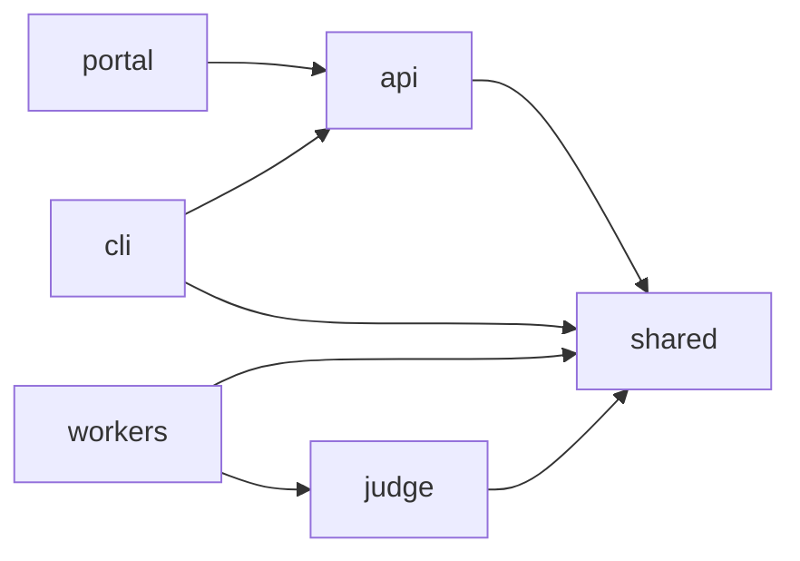
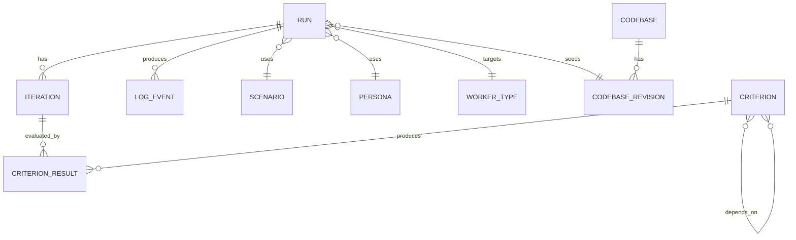
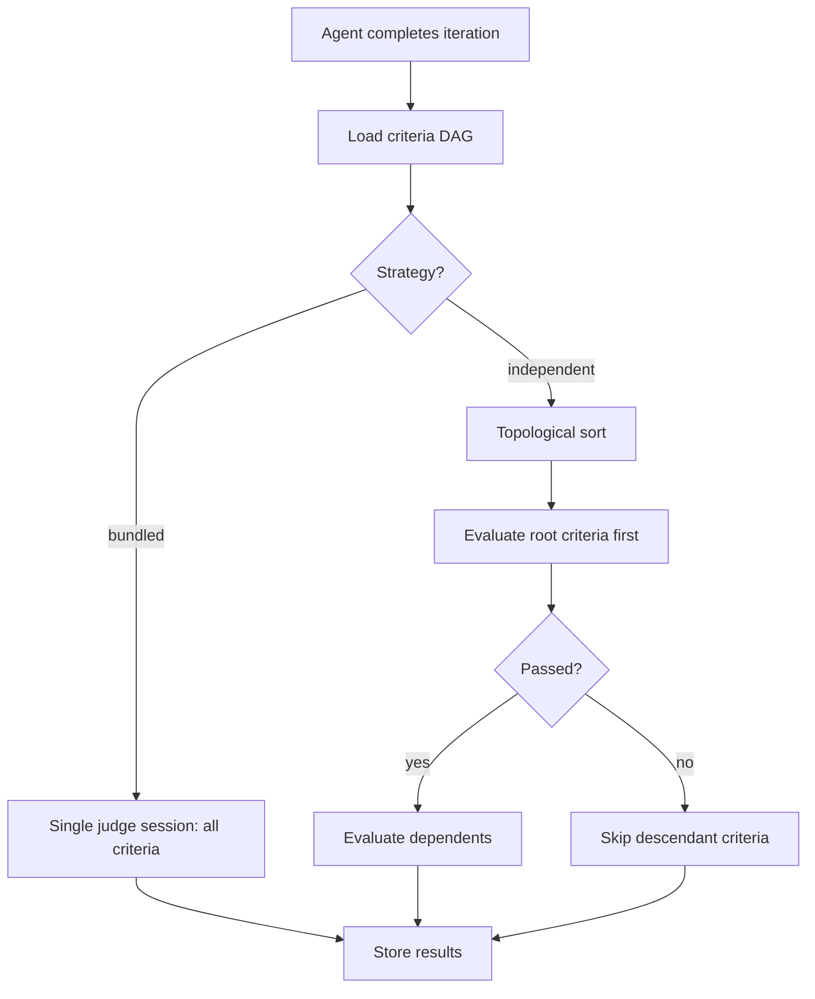

# Application Design

> **Status:** Seed document — expand as the application evolves.

This document describes the internal design of the Scope application layer (`scope-mt-app/`).

## Package Architecture

Scope uses a **pnpm workspaces** monorepo. Packages share types and utilities via the `shared` package.



| Package | Responsibility |
|---------|---------------|
| `api` | REST API (Express), SSE log streaming, run management, criteria CRUD |
| `cli` | Command-line interface for submitting tasks, streaming logs, managing runs |
| `portal` | React web UI for run management, insights, criteria graph editing |
| `judge` | Evaluation engine — executes criteria against agent output |
| `shared` | Types, database models, queue/blob/redis clients, config loaders, codebase/skill stores and clients |
| `workers/*` | Coding agent adapters — each implements the same interface for a different agent |

## Data Model

### Application users and access resolution

`users._id` is a Scope-owned UUID. The unique external identity is
`(idp, idpTenant, idpSubject)` (`idp`, Entra `tid`, Entra `oid`), never email.
`UserStore.upsertOnLogin()` is called only by the explicit
`POST /api/v1/users/me` path for JIT/profile/`lastLoginAt`/eligible
bootstrap-admin writes. `lastLoginAt` records that upsert, not request activity or
proof of an interactive prompt; the disabled check still occurs after the upsert.

After IdP verification, `UserAccessResolver.resolveExisting()` uses a validated
`RedisUserAccessCache` snapshot or `UserStore.findByIdentity()` on cache miss/outage.
It never upserts. The versioned cache key includes independently encoded Mongo
database namespace, provider, tenant, and subject; only active users are positively
cached. Fixed/non-sliding TTL defaults to 300 seconds
(`AUTH_USER_CACHE_TTL_SECONDS`), so DB-only role/disable edits can remain stale until
expiry. Redis failure falls back to Mongo, not anonymous access.

The Portal handshake uses POST `/me` after callback and GET `/me` after an
MSAL-cached reload, gating all queries until its API-authoritative UUID/role arrives.
The singular stored role is metadata today: the permission bundles, ownership
enforcement, service credentials, and internal JWTs in
[Authentication & RBAC](auth-rbac.md) are deferred, not a global API lockdown.

### Benchmark entities

Runs are the central entity:



- **Run** — A single benchmark execution: one scenario + one persona + one worker
- **Iteration** — A coding agent turn within a run (agent may iterate multiple times)
- **Criterion** — An evaluation check (e.g., "has a working Express server"). Criteria form a DAG (directed acyclic graph) with dependencies.
- **CriterionResult** — Pass/fail result of evaluating a criterion against a specific iteration
- **Codebase** — Mutable first-class project entity in `codebases`, with a unique slug, source type (`git` or `archive`), optional GitHub source/default branch, revision counter, latest revision pointer, and soft-delete metadata.
- **CodebaseRevision** — Immutable snapshot in `codebase-revisions`. Every Git resolution or archive upload creates a fresh UUID revision with the next per-codebase `revisionNumber` and canonical `{slug}@r{N}` ref.

### Typed prompts, AGENTS.md, and size-based storage

Task prompts live in a single `task-prompts` collection that is now **typed** and
shared by two prompt kinds:

- `TaskPromptDocument.type?: 'task' | 'agents.md'` — absent ⇒ `'task'` (backward
  compatible; existing docs are untouched).
- **`_id` is the content hash.** `computeTaskPromptId(text, type?)` hashes the
  trimmed text for `task` (or absent) — identical to the legacy hash, so every
  existing task prompt keeps its `_id` — and namespaces non-task types as
  `hash(type + '\n' + text)` so an AGENTS.md prompt never collides with a task
  prompt of the same text. `findOrCreate` deduplicates on this hash.
- **Body storage is decided by size, not type.** A prompt body at/under
  `PROMPT_INLINE_MAX_BYTES` (default 16 KB, UTF-8) is stored inline as `text`;
  larger bodies are uploaded to blob (`prompts/{promptId}.txt`) and the doc carries
  `contentBlobUrl` with no inline `text`. Exactly one of `text` / `contentBlobUrl`
  is set. `resolvePromptText(doc)` returns the inline body or downloads the blob, so
  callers (feature extraction, the worker text endpoint) get plain text regardless
  of location.
- **Prompt features are typed the same way.** `PromptFeatureDocument.type?:
  'task' | 'agents.md'` (absent ⇒ `'task'`); feature extraction selects only
  features of the prompt's type.

### AGENTS.md delivery

To support submitting an AGENTS.md prompt with a run, the request carries:

- `RequestDocument.agentsMdPromptId?: string` — set when the create-request body
  includes `agentsMd` (raw text); the API `findOrCreate`s an `agents.md`-typed
  prompt and stores its id. Before the run starts, the shared queue-processor
  resolves the text (downloading from blob if needed) and writes
  `<workspace>/AGENTS.md` once (constant for the whole run). It **fails the run**
  if the prompt id is set but cannot be resolved — never silently runs the baseline.
- `RequestDocument.agentsMdParentIds?: string[]` — best-effort lineage edges
  (`[]`/absent = root, `[p]` = mutation, `[i, j]` = merge) for callers that know
  parentage at submit time.

## Data Organization: Projects

A **Project** (`projects` collection, `ProjectStore`) is the top-level container that
partitions all user-facing data. Every scoped entity carries one **immutable `projectId`**,
set at creation and never changed. This is the data-organization layer only — it is a
**filter, not a security boundary** (future ownership/RBAC is specified in
[`auth-rbac.md`](auth-rbac.md); any caller admitted by the current auth rollout may
pass any `projectId`).

### Scoped vs. unscoped entities

| Class | Collections | How `projectId` is set |
|-------|-------------|------------------------|
| **Root** (no parent) | `requests`, `profiles`, `criteria`, `prompt-features`, `mcp-servers`, `report-templates`, `skills`, `extensions`, `codebases` | From the `?projectId=` query param at create time |
| **Child** (references a parent) | `runs` (history), `profile-versions`, `codebase-revisions`, `reports`, `insights` | Copied from the parent doc's `projectId` |
| **Special** (deterministic key → per-project copies) | `task-prompts`, `skill-revisions` | From the run's `projectId`; see below |
| **Unscoped** | `projects`, `agents`, `models`, tokens/accounts, feature-flags | n/a — never filtered by project |

### Resolution model (no default, fail-fast)

`projectId` is always **explicit and visible** — never a header, never ambient middleware,
never defaulted. The single carrier is the **`?projectId=` query parameter**. Helpers live in
`apps/api/src/utils/project-scope.ts`.

| Operation | `projectId` source | If unresolvable |
|-----------|--------------------|-----------------|
| Create a **root** entity | `?projectId=` query param | **400** |
| Create a **child** entity | Copied from the referenced parent | **400** (parent missing / cross-project) |
| **Top-level list** (`GET /api/v1/{requests,profiles,criteria,…}`) | `?projectId=` (**required**) | **400** |
| **List-like reads** (`GET /api/v1/criteria/graph`, `/criteria/mdp`, `/analysis`) | `?projectId=` (**required**) | **400** |
| **Nested list** (under a parent in the path) | Derived from the parent id | n/a |
| **By-`id`/slug get · edit · soft-delete** (`GET/PUT/DELETE /:id` on scoped catalogs) | `?projectId=` (**required**), or derived from context (e.g. a run's `projectId`) — filter is always `{ projectId, slug\|id }` | **400** |
| **By true `_id`** (internal code already holding the globally-unique UUID `_id`) | Act on `{ _id }` directly — already unambiguous | n/a |

The **runs list** (`GET /api/v1/requests`) requires `?projectId=` and AND-filters every page,
probe, facet, and grouping pipeline by it (`flat.projectId` → `composeFilter`). The
`groupBy: "project"` option and the project facet were **removed** — moot under a required
single-project list.

### Never a global, slug-only action on a project-scoped entity (the by-id invariant)

A **project-scoped** entity must **never** be read, edited, or soft-deleted by a global,
slug-only query. The Mongo/Cosmos filter for every get / edit / soft-delete must always contain
**`_id`** *or* **`projectId`** — a human slug/business `id` is **never a key on its own**.
`projectId` is derived from **context** when available (a parent doc or the run-request), else
supplied by the **client** (`?projectId=`), else the request **fails 400**. There is no
`{ _id: slug }` / `{ id }` global fallback.

| Caller holds | What the API does |
|--------------|-------------------|
| `projectId` + slug | Filter `{ projectId, slug }` (or `{ projectId, id }`). No widening, no global fallback. |
| slug only, `projectId` in context (parent / run-request) | Derive `projectId` from context, then identical to row 1. |
| slug only, no `projectId` anywhere | Issue **no query → 400**. Never fall back to `{ _id: slug }`. |
| a real `_id` (globally-unique UUID) | Filter `{ _id }` directly — already unambiguous; `projectId` not needed. |

Because post-migration the by-id CRUD routes receive a `:id` that is usually a **slug** (the route
cannot tell a slug from a UUID), those routes **require** `?projectId=` and resolve scoped. The
resolver signatures enforce this structurally — `findXBySlug(slug, projectId: string)` takes a
**required** `projectId` with no global `else`, so the compiler rejects any unscoped call site. The
only callers holding a true `_id` are internal code paths that already resolved the document.

On CosmosDB this is also the RU-friendly shape: these catalog collections declare no shard key, so
a `{ projectId, slug }` equality is served by the `{projectId, slug}` index in one logical
partition. Cosmos degrades that index to **non-unique**, so per-project uniqueness is enforced at
the app layer (scoped `findOrCreate` / existence checks) — which is *why* edits resolve the row
first and then write by its real `_id`. See `db.md` for the index details. This invariant is
recorded so future routes and entities keep obeying it; see also `criteria-provider.md`.

A bounded audit brought every project-scoped catalog under this rule. Besides mcp-servers, skills,
extensions, criteria, and prompt-features (whose resolvers now take a required `projectId`),
**`report-templates`** by-id `GET/PUT/DELETE /:id` were switched from a global `{ id }` filter to
the scoped `{ projectId, id }` and now require `?projectId=`; the report-generation path
(`POST /api/v1/reports`) resolves its `templateId` within the **run's** `projectId` (context) rather
than globally. `report-templates` keeps a globally-unique `id` (it is not part of the migration-026
slug-reuse set), so scoping is a guardrail: a caller must know the project to touch the row, and a
wrong-project id returns 404. Create-vs-upsert consistency across catalogs is tracked separately in
issue #1266.

### Per-project copies for deterministic-key entities

`task-prompts` and `skill-revisions` are content/ref-addressed, so the same key can legitimately
exist in multiple projects. Each keeps a **fresh-UUID `_id`** plus a stable key (`keyId` =
`computePromptId(type,text)` for prompts; `ref` for skill-revisions) and a project-scoped index
(`{projectId, keyId}` / `{projectId, ref}`) — **unique on real MongoDB**, and **non-unique on
Azure Cosmos DB** (which cannot build a unique index on a populated collection), where per-project
uniqueness is enforced by `findOrCreate` instead. `findOrCreate`/`getByRef(s)`
lookups are all scoped by `projectId`. Because skill refs resolve **per project**, the run's
`projectId` is threaded through the shared queue-processor into `SkillClient.resolveSkills` /
`downloadSkillArchive` (which append `?projectId=`) and the electron worker's own `setup()`.
Skill and extension **catalog** entries are isolated per-project too, but via a different
mechanism — see [Per-project catalog isolation (migration 026)](#per-project-catalog-isolation-migration-026) below.

### Cross-service write paths

Entities the pipeline **creates** are persisted with the run's `projectId` (derived from the
request doc, never a query param): reports (report-generator / trigger endpoint), insights
(judge / agent-authored via `sourceReportId`), demoted retry attempts (`insertHistoricalRun`),
codebase-revisions, and profile-versions. The DoD asserts these land in the right project.

### Migration & rollout (migrate-then-enforce)

Migration **`025-create-projects`** creates the `projects` collection, seeds **one ordinary
initial project** (fresh `_id`, human name via optional `SCOPE_INITIAL_PROJECT_NAME`, **no
`isDefault` flag**), backfills `projectId` on 100% of existing scoped docs, backfills
`keyId`/`ref` on the special collections, and swaps the unique indexes to their
project-scoped form (degrading to non-unique on Cosmos — see `db.md`). It is idempotent and
RU-paced.

Making `?projectId=` **required** is a breaking change for every existing caller, so rollout is
strictly ordered **migrate-then-enforce**:

1. **Deploy migration 025 first** — backfills `projectId` on all pre-existing docs, so there is
   never an "unset" window and no read-time coalescing is needed. Any doc still missing
   `projectId` afterward is a bug to surface, not silently bucketed.
2. **Ship the `projectId`-aware clients** (API + CLI + Portal) together.
3. **Then enforce.** Because all first-party callers ship in this monorepo and deploy together
   (there are no external API consumers), enforcement is **hard-400 from day one** — a scoped
   request without a resolvable project is rejected immediately rather than run through a
   soft log-and-warn window. Deploying the migration before the enforcing API guarantees live
   traffic never 400s on already-stored data.

### Per-project catalog isolation (migration 026)

Migration 025 tagged every catalog with `projectId`, but four **catalog families** were still
keyed/deduped **globally** by their human slug/id, so the same slug couldn't exist in two projects
(a second create returned 409). Migration **`026-isolate-catalogs-per-project`** finishes the job
for these four (**MCP servers are deferred** — see below):

| Family | Global key (before) | Per-project key (after) | Create semantics |
|--------|---------------------|-------------------------|------------------|
| `skills` | `_id = "{source}/{skillName}"` | `_id` = UUID + `slug`, unique `{projectId, slug}` | scoped **upsert** (200 existing / 201 new) |
| `extensions` | `_id = "{publisher}.{name}"` | `_id` = UUID + `slug`, unique `{projectId, slug}` | scoped **upsert** (200 / 201) |
| `criteria` | unique `{id}` + global `findOne({id})` | unique `{projectId, id}` | scoped **create** (real same-project 409) |
| `prompt-features` | unique `{id}` + global `findOne({id})` | unique `{projectId, id}` | scoped **create** (real same-project 409) |

Key properties:

- **API-observable ids are unchanged.** Skills/extensions still return `id = slug ?? _id`, so URLs
  and payloads stay identical. Only the internal `_id` and the dedup scope change.
- **Slug lookups are project-scoped.** `resolveSkillBySlug` / the extension equivalent match
  `{projectId, slug}` with a legacy `{projectId, _id}` fallback for un-backfilled rows. Per the
  **by-id invariant** above, a by-slug get/edit/soft-delete **without** a resolvable `projectId`
  is rejected with **400** — there is no global `findOne({_id: slug})` fallback. The Portal/CLI
  flag these slug point-reads as hard-scoped so project-switching resolves the right copy and a
  project-less deep-link errors clearly.
- **criteria** additionally confines DAG `dependsOn` resolution to the criterion's own `projectId`,
  so a dependency edge can never cross projects.
- **Judge threading.** Because criteria are now project-scoped, the judge threads the **run's
  `projectId`** (from the request body) into `getCriteriaProvider(projectId)`, which binds a
  per-project `RestApiCriteriaProvider` that appends `?projectId=` to its criteria fetches; the API
  criteria route then resolves them via `getCriteriaStore(projectId)`. This mirrors the
  skill-resolution precedent.

Migration 026 is **additive and non-destructive** (no deletes, no `_id` changes): it backfills
`slug = _id` on skills/extensions, swaps the `{id}` unique index to `{projectId, id}` on
criteria/prompt-features, pre-asserts no composite duplicates, and reuses 025's Cosmos-safe helpers
(so the composite indexes degrade to non-unique on Cosmos, unique on real MongoDB). `down()` unsets
`slug`; index changes are log-only.

### Per-project entity keying (migration 027)

Migration **`027-uuid-keys-mcp-profileversions`** picks up the MCP family 026 deferred and extends
the uniform **"opaque UUID `_id` + human reference key + project-scoped resolution"** model to two
more entities, and deletes one dead collection:

| Entity | `_id` (before) | After | Reference key (unchanged) | Per-project index |
|--------|----------------|-------|---------------------------|-------------------|
| `mcp-servers` | slug | UUID `_id` + `slug` | `slug` (in `requests.mcpServers[]`, `profileVersion.mcpServers[]`, `mcp-secrets.mcpId`) | `{projectId, slug}` |
| `profile-versions` | `"<profileId>@<version>"` | UUID `_id` + `ref` | `ref` (in `requests.profileVersionId`) | `{projectId, ref}` |
| `prompt-feature-extractions` | ObjectId | **collection dropped** (dead code) | — | — |

Key properties:

- **Reference-key formats do not change** — only *primary keys* and *resolution filters* change, so
  no referencing collection is rewritten. Cross-entity references keep holding the human key
  (`requests.mcpServers[]` and `mcp-secrets.mcpId` keep the **slug**; `requests.profileVersionId`
  keeps the composite `ref`).
- **API-observable ids are unchanged** (governing principle: the API always surfaces the human key,
  the UUID `_id` is internal only). `mcp-servers` still returns `id = slug`; `profile-versions`
  surface `ref`. This **removes the cross-project 409** on `mcp-servers` (slug reusable per project)
  and makes slug/ref resolution a cross-project isolation guardrail.
- **Worker threading.** Run preparation resolves each MCP server by `{projectId, slug}`
  (`McpServerClient.resolveServers(projectId, slugs)`) and hydrates its secret by
  `{projectId, mcpId, name}` (`McpSecretClient.resolveSecrets(projectId, slug)`), threaded from
  `requestDoc.projectId` in `queue-processor.ts`. The gateway keeps naming servers by **`config.slug`**
  (`mapToMcpServerConfig` sets `config.slug = data.slug ?? data._id`) — see
  [mcp-gateway.md](mcp-gateway.md) for the cross-project isolation invariant.
- **MCP secrets** are project-scoped in the **Token Manager's own DB** (`{projectId, mcpId, name}`
  index + startup backfill), not migration 027 — see [token-manager.md](token-manager.md).

Migration 027 is **additive and non-destructive** for the surviving entities (no `_id` rewrite of
existing rows; only new rows get a UUID `_id`): it backfills `slug`/`ref` from the legacy `_id`,
pre-asserts no composite duplicates, reuses 025's Cosmos-safe helpers (composite indexes degrade to
non-unique on Cosmos, unique on real MongoDB), and its `down()` unsets `slug`/`ref` (index changes
log-only). The dead `prompt-feature-extractions` drop is guarded against a missing namespace.

## Judge Pipeline

The judge evaluates coding agent output against criteria. Two strategies are supported:

| Strategy | Behavior |
|----------|----------|
| `bundled` | All criteria evaluated in one judge session (faster, less granular) |
| `independent` | Criteria evaluated separately in topological order following the DAG; descendants of failed criteria are skipped (slower, more accurate) |



## Gates — multi-phase evaluation pipeline

Runs execute through a hard-coded, ordered sequence of **gates**: `Select → Build
→ Test → Run → Deploy`. Each gate runs the per-iteration coding + judge loop
against the **same** workspace, with its own prompt, its own subset of criteria,
and its own iteration budget. Gates run **stop-on-failure**: when a gate exhausts
its budget without passing, downstream gates are recorded as `skipped`.

- A request carries an optional `gates: GateConfig[]` (`{ gate, promptId, criteria,
  maxIterations? }`). When absent, the request is normalised to a single **Select**
  gate built from the legacy `scenario.criteria` + `maxIterations` + `taskPromptId`
  — so existing requests behave identically.
- Criteria declare a `gates: GateId[]` compatibility list (empty = all gates); the
  list is **downward-closed** along the DAG (a parent is compatible with at least
  every gate its children are).
- Prompts are **typed** (`type: PromptType`, one literal per gate); a gate's prompt
  must have `type === gate`. The Select gate's prompt is the request's task prompt.
- Whenever the coding agent captured tool calls in an iteration — **any gate,
  including Select** — the judge can inspect the captured tool-call history from the
  **whole run** (cumulative across iterations; issue #1255) via the
  `list_tool_calls` / `search_tool_outputs` / `get_tool_output` tools, not just the
  workspace files (availability is gate-agnostic; see `buildEvidenceGuidance`). The
  judge can also read the coding agent's own response for the iteration under
  evaluation via the `read_agent_response` tool (issue #1136), so criteria that
  grade what the agent *said* (Q&A / no-code-change deliverables) are gradeable.
- Per-gate outcomes are persisted on the request as `gateSummaries:
  GateRunSummary[]`; each `ConversationTurn` is tagged with its `gate`.

The orchestration lives in `runGatedLoop` (`packages/shared/src/judge/gated-loop.ts`),
which wraps the per-gate `runMultiTurnLoop`. See the full
[gates design doc](../design/gates.md).

## Queue Pattern

The agent registry is the sole source of truth for runnable workers. An agent is
runnable only when it is not deleted, has `available: true`, and has an active
version with a non-empty `AgentVersion.queueName`. Display names, capabilities,
versions, and queue names all come from the same registry document; platform
services do not maintain worker allowlists or derive queue names.

```
Agent registry → pending request → scheduler → AgentVersion.queueName → worker pods
```

Multiple agents or versions may advertise the same queue. The scheduler
deduplicates that queue and claims requests only for the exact registered
`workerType` + `agentVersion` targets mapped to it.

The API owns only the report-generation queue. Its `RouteContext` exposes one
`reportQueueClient`, not coding-agent queue clients or a queue-client factory;
those belong to the scheduler.

Capabilities are explicit opt-ins. The supported keys are
`supportsReasoningEffort`, `supportsMcpServers`, `supportsSkills`, and
`supportsExtensions`; an omitted or false key means unsupported.
`SCOPE_STRICT_AGENT_CAPABILITIES=false` temporarily permits capability-bearing
requests for agents that have not opted in, but agent existence, deletion,
availability, active-version, and queue validation are always enforced.
`GET /api/v1/version` exposes the current mode as
`strictAgentCapabilities`; Portal controls remain in compatibility mode unless
that property is `true`.

Profile-pinned `agentVersion` values take precedence over request-level version
values and must still be active with a non-empty advertised queue. Legacy
agent-version records may omit `queueName`; registry readers treat missing,
blank, and whitespace-only values as unavailable rather than throwing. New
registrations continue to require a non-empty queue.

### Run submission flow

1. User submits via Portal or CLI with: **task**, **criteria** (required), **worker**, **model** (required), and optionally **agentVersion**, a **codebase** selection, and/or a per-gate **`gates`** configuration (see [Gates](#gates--multi-phase-evaluation-pipeline))
2. API rejects unknown, deleted, unavailable, versionless, or explicitly inactive targets and resolves `agentVersion`: explicit selection → validate active; omitted → latest active by `createdAt`
3. API resolves `model`: explicit → validate against `supportedModels`; omitted → `defaultModel`
4. API validates requested reasoning effort, MCP servers, skills, and extensions when strict capability enforcement is enabled
5. `workerType`, `agentVersion`, and `model` are persisted on the pending `RequestDocument`
6. On every dispatch cycle, the scheduler refreshes the registry and sends the request only to the selected version's advertised queue

Profiles, profile variations, bulk resubmission, and retries use the same target
resolver. Retries preserve and revalidate the original exact version; bulk
resubmission resolves a currently active version unless a version is explicitly
pinned. Invalid historical pending targets stay pending and produce scheduler
telemetry rather than being sent to a guessed queue.

When a codebase is selected, the API resolves the submitted spec (`codebaseRevisionId`, `{slug}@r{N}`, or bare `{slug}`) before enqueueing. Bare archive slugs resolve to the latest existing revision; bare Git slugs resolve the default branch at submit time and create a new immutable revision. The resolved revision UUID is stored as `RequestDocument.codebaseRevisionId`, and workers seed the workspace from that revision after setup and before skills extraction.

Profile fan-out mode is also supported for comparative runs:

1. User selects a base `profileId` (optionally pinned via `profileId@version`) and a `profileVariations[]` array of profile spec strings to compare against (e.g. `["def456", "ghi789@2"]`)
2. API parses each spec, validates every variation upfront, then expands one submit call into multiple requests under one shared `submissionId`
3. Each expanded request resolves configuration from its variation profile; unpinned specs resolve to `latestVersion`
4. Expanded requests persist `profileId` and `profileVersionId` on each `RequestDocument` for indexing and traceability

## Runs List Query API

`GET /api/v1/requests` powers the Portal **Runs** list and `scope run list`. All
filtering, sorting, and grouping are evaluated **server-side** so they compose with
cursor pagination over the whole dataset (not just the loaded page). The CLI exposes the
same filters and sort controls as the Portal — see CLI↔Portal parity below.

### Filtering

Every categorical dimension accepts **multi-value** input, supplied either as repeated
query keys (`?status=done&status=processing`) or comma-separated (`?status=done,processing`).
A single value compiles to an equality clause; multiple values compile to `$in`.

| Query param | Stored field |
|-------------|--------------|
| `worker` | `workerType` |
| `status` | `run.status` |
| `outcome` | `run.outcome` |
| `model` | `model` |
| `os` | `run.os.platform` |
| `priority` | `priority` (coerced to number) |
| `agentVersion` | `agentVersion` |
| `profileId` | `profileId` |
| `taskPromptId` | `taskPromptId` |
| `submissionId` | `submissionId` (prefix match) |
| `criteria` | `scenario.criteria` |
| `turns` / `maxIterations` | `run.turns` size / `maxIterations` |

Additional cross-cutting filters:

- **`(Unknown)` sentinel** — the literal value `__empty__` (exported as `EMPTY_FILTER_VALUE`)
  matches rows where the field is missing or null (`{ $or: [{ field: { $exists: false } }, { field: null }] }`),
  and OR-composes with explicit values selected in the same dimension.
- **Free-text `search`** — case-insensitive regex `$or` across run id, `taskPromptId`,
  `scenario.task`, `model`, and `workerType`. Cosmos DB has no `$text` index, so regex is
  used (the term is regex-escaped).
- **Date range** — `createdAfter` / `createdBefore` (ISO-8601 datetimes, `z.coerce.date()`)
  apply a `createdAt` `$gte`/`$lte` window. An invalid datetime or an inverted range
  (`createdAfter > createdBefore`) returns **400**.

Internally the handler collects clauses into a flat single-field map plus an `$and` array
(for `$or`/repeated-field groups), so the multi-value, sentinel, search, criteria, and
cursor-seek groups compose under one `$and` without clobbering each other.

### Sorting

`sortBy` selects an allowlisted, indexable stored field and `sortDir` (`asc`/`desc`, default
`desc`) the direction:

| `sortBy` | Stored field |
|----------|--------------|
| `created` (default) | `createdAt` |
| `updated` | `updatedAt` |
| `priority` | `priority` |
| `worker` | `workerType` |
| `status` | `run.status` |
| `id` | `_id` |
| `duration` | `run.durationMs` |

The cursor seek is generalized to `{ <sortField>, _id }`: the cursor encodes the active
sort field's value plus the `_id` tiebreaker, and the seek `$or`, `sort` object, and
`hasMore` probes are all built from `(sortField, dir)`. Rows whose sort field is unset
(e.g. `run.durationMs` on unfinished runs) sort null-last. **The no-`sortBy` default stays
byte-for-byte `createdAt desc`, so in-flight cursors keep working.**

`run.durationMs` is a **denormalized** field (`run.finishedAt − run.startedAt`, ms): duration
is computed, so it can't be sorted/indexed directly. It is stamped on write at every run
completion site (the queue processors' terminal writes via `durationSetFields`, plus
`cancel.ts` and the stuck-run reaper) and **backfilled** for existing finished runs by
migration 022. Unfinished runs leave it unset.

### Facets

`GET /api/v1/requests/facets` drives the filter rail: it returns, per categorical dimension,
every distinct value with a **full-dataset count**, plus a `total`. Counts are **absolute over
all non-deleted runs** — they intentionally ignore every active filter (search, date range,
numeric, and categorical selections), so all values stay visible/selectable even when not on the
current page and the numbers don't shift as the user narrows the query. Because the response is
input-independent, it is served from a process-wide in-memory cache (short TTL, in-flight
de-duplicated) so the underlying scan runs at most once per window per API replica. `total` is
derived for free by summing any one dimension's bucket counts (every run lands in exactly one
bucket, `(Unknown)` included), avoiding a separate count query. Because Cosmos DB has limited
`$facet` support — and serves no index-only `GROUP BY`, so each `$group` scans the matched set —
the endpoint runs one `$group` aggregation **per dimension in parallel** (`Promise.all`) rather
than a single `$facet`.

### Grouping

When `groupBy` is set (e.g. `task`, `profile`, `submissionId`), the endpoint returns
`RunGroup[]` (via `buildGroupingPipeline`) using the **same** `filter` object, so all filters
compose with grouping. The Portal consumes this through `api.listRunGroups` (flat list gated
on `groupBy === "none"`, groups gated otherwise) and **lazily fetches each expanded group's
member runs** by passing the group key as an extra filter alongside all active filters. Group
member runs reuse the flat `sortBy`/`sortDir`; group order stays deterministic by group key.

Member runs are **cursor-paged** rather than capped: the list API limits `limit` to 100, so
an expanded group fetches one 100-run page at a time and the group footer surfaces
`Showing X of N` (N = the group's full-dataset `aggregates.count`) with a **Load more**
button that walks `cursors.next` for one more page. Collapsing a group or changing the
filter/sort/grouping resets a group's loaded depth back to the first page.

### Total count

`estimatedTotal` is **filter-aware**: when a flat-list filter is active it uses
`countDocuments(filter)` for an accurate total; with no active filter it falls back to the
O(1) `estimatedDocumentCount()`. Grouped mode keeps `estimatedDocumentCount()` to preserve
group-pagination semantics.

### Indexes (Cosmos-friendly)

Per the [Cosmos DB skill](../../.agents/skills/cosmosdb-mongodb/SKILL.md), filters use
**single-field** indexes (Cosmos intersects them) and each `ORDER BY` field gets a **2-field**
compound `{ <field>: 1, _id: 1 }`:

| Migration | Indexes |
|-----------|---------|
| `021-add-runs-filter-indexes` | single-field on `model`, `run.os.platform`, `priority`, `agentVersion` (other dimensions already indexed) |
| `022-add-runs-sort-indexes` | 2-field compound `{ <field>, _id }` for `updatedAt`, `priority`, `workerType`, `run.status`, `run.durationMs` (`{ createdAt, _id }` exists from migration 010); also backfills `run.durationMs` |

Both are registered in `required-migrations.ts`; their `down()` is log-only (non-destructive).
Because Cosmos silently drops unsupported compound indexes, `getIndexes()` is verified after
applying them.

### CLI↔Portal parity

`scope run list` exposes every Portal filter and the sort controls, forwarding them to the
same API params: `--worker` (multi), `--status`, `--outcome`, `--task`, `--profile`,
`--criteria`, `--model`, `--os`, `--priority`, `--agent-version`, `--search`,
`--created-after`, `--created-before`, `--sort-by`, `--sort-dir`. (The CLI list stays flat;
grouping is a Portal view.)

## Real-Time Log Streaming

Workers publish log events to Redis Pub/Sub channels keyed by run ID. The API subscribes and relays them as Server-Sent Events (SSE) to CLI and Portal clients.

## Portal Shell

The Portal desktop shell uses a persistent left navigation sidebar. It defaults to the compact icon rail, and users can expand it to show navigation labels; the choice is stored in `localStorage` under `scope:layout:sidebar-expanded`. Mobile navigation remains a sheet-based menu with labels always visible.

### Project scoping (selected project, no default)

The Portal mirrors the API's fail-fast model: it holds a **selected project** (never a default) and injects it as `?projectId=` on every scoped request.

- **`contexts/ProjectContext.tsx`** persists the selection to `localStorage` (`scope:selectedProject`) and exposes `useProjectContext()` / `hasProject`. A module-level holder (`lib/project-scope.ts`) lets the non-hook `lib/api.ts` chokepoint read the current id; scoped methods are flagged `{ scoped: true }` and prepend `?projectId=` inside the shared `lib/api-client.ts` facade, throwing `ProjectRequiredError` when none is selected (no silent cross-project fetch).
- **`components/ProjectSwitcher.tsx`** is the header control (beside `ThemeToggle`) that lists projects, switches the active one — invalidating all scoped queries via `hooks/useSelectProject.ts`, since query keys don't embed `projectId` — and offers inline create + a link to `/projects`. Its presentational `ProjectSwitcherView` is story/play-tested.
- **`components/ProjectGate.tsx`** guards scoped routes: when no project is selected it renders a first-run pick/create screen (`ProjectFirstRunView`) instead of firing a scoped request that would 400. Point-read detail routes (resolve by `_id`) and unscoped areas (agents, models, secrets, admin, `/projects`) stay ungated. The index route `/` is served by **`components/HomeRoute.tsx`**, the unscoped **home**: on entry it clears any active project (`useSelectProject(undefined)`, which also resets scoped query caches) and renders the picker, then forwards to `/statistics` once the user picks a project. Reaching `/` by any means (the logo, a typed URL, the back button, a bookmark) therefore de-scopes; there is no default project.
- **`components/Layout.tsx`** hides project-scoped sidebar entries until a project is in use: with no selection (`hasProject === false`) only the global entries render (Projects, the Platform group of Agents/Models/Secrets, and the footer), while the New Run CTA and the Activity / Library / Resources / Dev groups appear once a project is selected. This keeps the first-run sidebar from advertising links that would only hit the `ProjectGate`. Scoped-vs-global mirrors `App.tsx` (`<ProjectGate>`-wrapped routes are scoped). The **Scope logo** doubles as home: it is a plain link to `/`, so clicking it lands on `HomeRoute`, which does the de-scoping — no click-handler side effect and no open-in-new-tab special-casing.
- **`pages/Projects.tsx`** (`/projects`, unscoped) manages projects themselves — create / rename / describe / soft-delete. Delete always succeeds (**204**), even for a non-empty project, because it is a reversible soft-delete. A **Show deleted** toggle lists soft-deleted projects (`GET /projects?includeDeleted=true`) and offers a **Restore** action per row (`POST /projects/:id/restore`); deleted projects are not selectable until restored. The same affordances exist in the CLI (`project list --include-deleted`, `project restore <id>`).

### User disclosures

The shared `components/VersionFooter.tsx` tells users that Scope is an AI
evaluation platform and that they should not attribute human qualities or
intent to it. The notice also warns that AI-generated content may be inaccurate
and asks users to review and edit generated output. The footer links to the
public data collection and privacy document so users can understand what Scope
handles and why. `components/Layout.tsx` renders this footer on both standard
and full-bleed routes so the disclosures remain visible throughout the Portal.

### Hover-preview + navigate badges

Criteria and task prompts appear across many surfaces (Run Detail, Runs list and its
right-hand preview panel, Statistics, Criteria list/graph, Task Prompt list,
report-template triggers). Wherever one is shown, two
reusable badge components provide a consistent **hover-to-preview + click-to-navigate** affordance:

| Component | Entity | Links to | Hover preview |
|-----------|--------|----------|---------------|
| `components/CriteriaBadge.tsx` | Criterion | `/criteria/:id` | Criterion prompt snippet |
| `components/TaskPromptBadge.tsx` | Task prompt (any type) | `/task-prompts/:id` | Type label, text snippet, list of detected features, created date, **Open details** button |
| `components/AgentBadge.tsx` | Coding agent | `/agents/:id` | Registry name, internal ID, deleted state, version, **View agent** button |

Both follow the same rules:

- **Self-contained tooltip.** Each wraps its trigger in a Radix `Tooltip` (a local
  `TooltipProvider`, mirroring `StatusBadge`) and a React Router `Link`. The link calls
  `e.stopPropagation()` so a badge inside a clickable table row navigates to the detail page
  without also firing the row's `onRowClick`.
- **No request fan-out.** Callers that already have the object/text pass it via props
  (`prompt`) and **no** request fires. Otherwise the entity is fetched lazily via React Query
  **only when the tooltip opens** (gated on an internal `open` state), so dense lists never
  issue one request per row on mount. Blob-backed task prompts (no inline `text`) additionally
  lazy-load their body via `getTaskPromptContent` on open.
- **`TaskPromptBadge` is type-agnostic.** Gate prompts (`select`/`build`/`test`/`run`/`deploy`),
  `agents.md`, and legacy untyped prompts all render the same hover + the same
  `/task-prompts/:id` navigation; only the human label differs (via `promptTypeLabel`). It also
  renders content plainly (no link/tooltip) when no `taskPromptId` is available.
- **Detected-features list + explicit navigate button.** `TaskPromptBadge`'s preview lists only
  the prompt's **detected** features by id (it never shows undetected features or an `x/y` count)
  and ends with an obvious button-styled **Open details** `Link` (not plain text). Because the
  popup is interactive (hoverable feature badges + a clickable button), its `TooltipContent` is
  wrapped in a Radix `Tooltip.Portal` with `collisionPadding` so it can't be clipped by an
  overflow container (e.g. a table cell) — the same portaling `ShortId` uses.
- **Agent identity presentation.** `workerType` and `agentId` are stable routing/storage keys, not
  user-facing labels. Outside the Agents list and Agent detail technical views, the Portal renders
  the registry `name` through `AgentBadge`; the raw ID is available only in its hover content and
  route. Filter and selector triggers stay non-linking so selection behavior is preserved, while
  the hover action still opens Agent detail. A shared React Query catalog request includes
  soft-deleted records so historical runs keep their saved name and link to a read-only detail
  view. Missing records render **Unknown agent** without a dead link.

A sibling affordance, `components/ShortId.tsx`, applies the same hoverable-tooltip pattern to
**identifiers**: the Runs list renders run and submission IDs truncated to 8 chars
(`formatId`), and on hover the tooltip reveals the full ID plus a copy-to-clipboard button. The
trigger stays an inline `<span>` (not a link) so the row click still navigates to the run; the
copy button calls `e.stopPropagation()` so copying never triggers row navigation.

## Criteria System

Criteria are reusable evaluation rules stored in the database and optionally defined in `config/criteria/*.yaml`. They support:

- **DAG dependencies** — criterion A can depend on criterion B (B must pass before A is evaluated)
- **AI-generated prompts** — natural language behavior descriptions can be converted to evaluation prompts via LLM
- **Traits** — reusable labels for filtering and composition (e.g., `has_azure`, `has_node`)
- **Gate compatibility** — a `gates: GateId[]` list controls which [gates](#gates--multi-phase-evaluation-pipeline) a criterion may be selected for (empty = all); the list is downward-closed along the DAG

See [`ENV_VARIABLES.md`](../../scope-mt-app/ENV_VARIABLES.md) for related configuration options.

## Statistics Analysis

The Statistics page (`apps/portal/src/pages/Statistics.tsx`) is backed by `GET /api/v1/analysis` (`computeAnalysis` in `apps/api/src/analysis.ts`), which aggregates pass rates, iteration distribution, and duration stats across runs. The endpoint is **project-scoped**: it requires `?projectId=` (400 if absent) and aggregates only the selected project's done runs, so Statistics is a per-project dashboard (the Portal gates it behind project selection). It supports two independent, composable filters via query params:

| Param | Filter | Semantics |
|-------|--------|-----------|
| `criteria` | Success criteria (comma-separated `criterionId`s) | A run counts as a pass only if **all** selected criteria pass; runs lacking a selected criterion are excluded |
| `features` | Task prompt features (comma-separated `featureId`s) | Keep a run iff its task prompt was **detected** to have **every** selected feature (AND) |

The response exposes the option lists and current selection for each filter so the Portal can render filter bars: `availableCriteria` / `selectedCriteria` and `availableFeatures` / `selectedFeatures`. Both `available*` lists are computed over the full valid-run set **before** filtering, so the bars stay populated even when a filter combination matches zero runs (the Portal then shows a "no runs match" empty state instead of the "no data yet" state).

**Detected-based feature semantics (intentional divergence).** A task prompt's `features[]` stores a `{featureId, detected}` row for *every* evaluated feature, so presence is near-universal and meaningless as a filter. `availableFeatures` is therefore the sorted union of featureIds with `detected === true` across valid runs, and the feature filter matches on `detected === true`. This is deliberately stricter than the MDP route (`GET /api/v1/criteria/mdp`), whose feature filter is presence-based. Runs join to task prompts by effective id (`taskPromptId || computeTaskPromptId(scenario.task)`) so legacy runs without a stored `taskPromptId` still resolve their features.

Feature data is produced by the `extract-features` endpoint (`POST /api/v1/task-prompts/:id/extract-features`), which evaluates a task prompt against the configured prompt-feature definitions (`config/prompt-features/*.yaml`, seedable via `POST /api/v1/prompt-features/seed`). The feature filter bar only appears once at least one referenced task prompt has a detected feature.

**Bounded run set (memory).** `computeAnalysis` runs in Node over a materialized array, so the endpoint caps how many runs it loads to keep memory bounded as history grows. It fetches the most-recent `ANALYSIS_MAX_RUNS` (default 5000) done runs sorted by `createdAt` desc — served by the existing `createdAt` index (migration 010), so no extra index is needed — using a **slim projection** that includes only the fields the analysis reads (`run.status`, `run.outcome`, and per-turn `iteration` / `passed` / `durationMs` / `criteriaResults`). The heavy per-turn payloads (`codingAgentResponse`, `judgeFeedback`, legacy inline `toolCalls`, HAR/video URLs) are excluded — a single run document can otherwise approach Cosmos's 2 MB limit. To detect "more exist", it fetches `limit + 1` and trims via `capRunsToLimit`; when trimmed, the response sets `truncated: true` and `runLimit`, and the Portal shows a "most recent N runs" banner so capped metrics are never presented as all-time. Tune the cap with the `ANALYSIS_MAX_RUNS` env var (see [ENV_VARIABLES.md](../../ENV_VARIABLES.md)). The long-term scaling path is DB-side aggregation, but that is gated on Cosmos's partial aggregation-pipeline support.

## Codebase System

Codebases are reusable source snapshots that can be attached to run submissions. The shared package owns the core types (`CodebaseDocument`, `CodebaseRevisionDocument`, `CodebaseConfig`), stores, resolver, API client, and worker seeder. The API exposes CRUD, Git resolution, archive upload, and archive-download proxy endpoints; workers use `CodebaseClient` to fetch a normalized root-level tar.gz and extract it into the run workspace.

Two MongoDB collections back the feature:

| Collection | Purpose |
|------------|---------|
| `codebases` | Mutable codebase metadata, slug uniqueness, source type/source, `revisionCounter`, `latestRevisionId`, and soft deletion |
| `codebase-revisions` | Immutable revisions addressed by UUID or `{slug}@r{N}`, with Git/archive provenance and the normalized archive URL |

See [Codebases Architecture](codebases.md) for revision addressing, blob storage naming, REST endpoints, and worker seeding details.

## OpenAPI Documentation

The REST API exposes an auto-generated **OpenAPI 3.1** spec built with [Zod](https://zod.dev/) schemas and [`@asteasolutions/zod-to-openapi`](https://github.com/asteasolutions/zod-to-openapi).

| Endpoint | Description |
|----------|-------------|
| `GET /openapi.json` | Raw OpenAPI 3.1 specification (JSON) |
| `GET /api-docs` | Interactive Swagger UI |

### Schema organization

Zod schemas live in `packages/shared/src/schemas/` (16 files, ~78 schemas) so they can be reused by the API, CLI, and workers. Each entity has separate **input** (what the client sends) and **response** (what the API returns) schemas.

OpenAPI route registrations live in `apps/api/src/openapi/routes/` — one file per resource group. The registry and generator are in `apps/api/src/openapi/registry.ts`.

### Authentication metadata

The registry declares `bearerAuth` as an HTTP bearer scheme for unchanged IdP
access tokens. `apiRoute()` accepts optional OpenAPI `security` metadata;
both `GET` and `POST /api/v1/users/me` set `security: [{ bearerAuth: [] }]`. In Swagger UI,
use **Authorize** and paste the access token without its `Bearer` prefix.

The requirement is operation-scoped: there is no global security requirement,
and existing anonymous endpoints are not advertised as protected. This metadata
does not install authentication or authorization guards; runtime enforcement
remains in the existing middleware and route handlers.

### Generated artifact

The static documentation site consumes the committed artifact at
`website/src/openapi/scope-openapi.json`. Generate it from the API
registry with `pnpm --filter api generate:openapi` rather than fetching
the spec from a deployed environment. The API snapshot test verifies
that the artifact remains current.
