# Authentication & RBAC

> Status: **Proposed** — implementation plan. Date: 2026-06-10.

## Problem

Scope currently has **no authentication or authorization**. The API (`apps/api/`)
serves every endpoint unauthenticated, the Portal (`apps/portal/`) talks to it over a
same-origin nginx proxy with no credentials, and the CLI (`apps/cli/`) issues bare
`fetch` calls against `SCOPE_API_URL`. Any caller can read, submit, mutate, or delete
any run and any catalog resource.

We need to:

1. **Authenticate** every human-facing caller (CLI, API, Portal) using **Microsoft
   Entra ID** (formerly Azure AD).
2. Support a **pluggable identity-provider (IdP) abstraction** so that, once the
   project is open-sourced, other IdPs (Google, GitHub, generic OIDC, Keycloak,
   Auth0…) can be added without touching call sites.
3. Introduce **two roles** — `user` and `admin` — but model them as **named bundles of
   fine-grained permissions** (e.g. `scope/run:write`) so the system can grow to
   arbitrary roles/custom permission sets later **without a schema change**.
4. **Scope data ownership**: model ownership so that **owning data grants discoverability
   and editability**, while **shared deep links grant read-only access without ownership**.
   A first cut uses **two levels — personal (private) and global (shared)**: private data
   is discoverable, usable, and editable only by its owner; shared data is globally
   discoverable and usable by everyone but **read-only unless you own it**. An `admin` sees
   everything. (See §5.)
5. Keep **anonymous/public mode out of scope.** The `anonymous` principal carries **zero
   permissions** and is rejected by any permission-gated route. Treating it as a named
   principal is a guard *mechanism* convenience only — it is **not** a public experience and
   must not be granted permissions until a future, explicit public/demo mode is introduced
   over **public-only** data (see Open Question J).

> **Primary milestone — authenticate the user.** The one must-ship outcome of this work is
> **user authentication across Portal, API, and CLI** (Entra ID identity, with ownership
> scoping built on it). Everything else is sequenced around that. In particular,
> **Scope-issued PAT / API tokens delivered through `SCOPE_TOKEN`** are very likely the
> right long-term answer for **user CI integrations and user-attributed automation**, but
> they are **explicitly out of scope for, and must not block, the user-auth milestone**
> (see Open Question H). Until then `SCOPE_TOKEN` is treated as a raw bearer escape hatch,
> not a Scope-managed credential.

> **Note on the Token Manager.** [apps/token-manager](../../apps/token-manager) is **not**
> a user-identity system. It stores **provider credentials** (GitHub Copilot / Claude /
> Cursor / Anthropic accounts and API keys) that the *agents* consume. This feature does
> **not** build on or extend the token-manager's `accounts`/`keys` schema. We reuse only
> its **infrastructure patterns** (MongoDB collection + Azure Key Vault via External
> Secrets) where relevant.

This document is the architecture spec and implementation plan. It deliberately
**lists open questions** (notably the exact permission matrix for `user` vs `admin`) that
must be resolved with stakeholders before or during implementation.

---

## Current State (investigation summary)

| Component | Today | Relevant files |
|-----------|-------|----------------|
| API | Express app, no auth middleware. Routes registered via `apiRoute()` helper that also feeds the OpenAPI registry. CORS open, `express.json()` only. | [apps/api/src/index.ts](../../apps/api/src/index.ts), [apps/api/src/openapi/api-route.ts](../../apps/api/src/openapi/api-route.ts), [apps/api/src/route-context.ts](../../apps/api/src/route-context.ts) |
| Runs data model | `RequestResponseSchema` + embedded `RunStateSchema`; history in `runs` collection (`RunHistoryDocumentSchema`). **No owner field.** | [packages/shared/src/schemas/request.ts](../../packages/shared/src/schemas/request.ts) |
| Run listing | Cursor-paginated `GET /api/v1/requests` with filters; no per-user scoping. | [apps/api/src/routes/requests.ts](../../apps/api/src/routes/requests.ts) |
| CLI | `commander` CLI, each command takes `-u/--url` (`SCOPE_API_URL`), bare `fetch`, **no auth header**. | [apps/cli/src/commands/run.ts](../../apps/cli/src/commands/run.ts), [apps/cli/src/index.ts](../../apps/cli/src/index.ts) |
| Portal | React 19 SPA, `fetch` against same-origin `/api/v1` via nginx proxy, **no token**. | [apps/portal/src/lib/api.ts](../../apps/portal/src/lib/api.ts), [apps/portal/src/main.tsx](../../apps/portal/src/main.tsx), [apps/portal/nginx.conf](../../apps/portal/nginx.conf) |
| Token Manager | Already has a `users`-like pattern for **provider** credentials (not app users). Reuse its KeyVault/Mongo patterns, not its schema. | [apps/token-manager/src/account-routes.ts](../../apps/token-manager/src/account-routes.ts) |
| Migrations | `mongo-migrate-ts`, numbered files with `up()`/`down()`. CosmosDB-compatible constraints apply. | [packages/db-migrations/src/migrations](../../packages/db-migrations/src/migrations) |

Key constraint: **coder workers** do **not** call the API for run state — they write to
MongoDB directly, so their traffic is out of scope for user auth. **But there is one
concrete internal API consumer today: the report-generator worker**
([apps/workers/report-generator](../../apps/workers/report-generator)). It calls the API
over HTTP (`SCOPE_MT_API_URL`) to read a specific run and write insights/reports:
`GET /api/v1/requests/:id`, `GET /api/v1/requests/:id/snapshots/:iteration`,
`GET /api/v1/report-templates/:id`, `GET /api/v1/insights/search`,
`POST /api/v1/insights`, `POST /api/v1/reports/:id/insights`
([tools.ts](../../apps/workers/report-generator/src/tools.ts),
[report-queue-processor.ts](../../apps/workers/report-generator/src/report-queue-processor.ts)).
The **scheduler** ([apps/scheduler](../../apps/scheduler)) does **not** call the API (it
touches MongoDB + Storage Queues directly), so it needs no API auth.

> **This makes service-to-service auth an immediate requirement, not a future one.** The
> moment ownership scoping (§5) lands, `GET /api/v1/requests/:id` becomes owner-scoped and
> the report-generator — which has no user identity — would receive `404`s and its
> insight/report writes would be rejected. Service-to-service auth (§6) must therefore
> ship **together with** ownership scoping. Because the report-generator operates on **one
> specific user's run**, it should use the **on-behalf-of internal token** (§6) carrying
> that run's owner id, so `readScope`/`writeScope` resolve naturally — not a broad system
> credential (which would let any report job read any run).

---

## Architecture

### Overview

```mermaid
flowchart TB
    subgraph Clients
        CLI[CLI<br/>device-code flow]
        Portal[Portal SPA<br/>auth-code + PKCE]
    end

    subgraph IdP[Microsoft Entra ID]
        OIDC[OIDC / OAuth2<br/>JWKS, token endpoint]
    end

    subgraph API[API service]
        MW[authn middleware<br/>verify JWT via AuthProvider]
        RBAC[authz: role + ownership scope]
        Routes[Routes apiRoute&#40;&#41;]
        Users[(users collection)]
    end

    CLI -->|1 device-code login| OIDC
    Portal -->|1 redirect login| OIDC
    OIDC -->|access token JWT| CLI
    OIDC -->|access token JWT| Portal
    CLI -->|2 Bearer token| MW
    Portal -->|2 Bearer token| MW
    MW -->|verify sig/aud/iss/exp<br/>JWKS cache| OIDC
    MW -->|JIT upsert + role lookup| Users
    MW --> RBAC --> Routes
```



| Credential | Identity supplied | Verification contract |
|---|---|---|
| IdP access token | External identity mapped to a Scope user | [Identity-provider verification](#identity-provider-verification) |
| Scope PAT | Its issuing Scope user | [PAT lifecycle and API](#pat-lifecycle-and-api) |
| Per-service credential | Named, narrow service identity | [Service-to-service auth](#service-to-service-auth) |
| Scope on-behalf-of token | Initiating Scope user | [Service-to-service auth](#service-to-service-auth), with live user and project-membership resolution |

**Token Manager is not user identity.** It stores provider credentials consumed by
coding agents. This work does not extend its `accounts` or `keys` schema; it follows
only its MongoDB, Key Vault, and External Secrets infrastructure patterns.

### Identity-provider verification

`packages/shared/src/auth/` defines a pluggable backend `AuthProvider`. It returns
identity only and never interprets IdP roles or groups.

```ts
export interface VerifiedIdentity {
  idp: string;
  email?: string;
  name?: string;
}

export interface AuthProvider {
  readonly id: string;
  verifyAccessToken(token: string): Promise<VerifiedIdentity>;
}

export interface AuthClientConfig {
  provider: string;
  authority: string;
  clientId: string;
  scopes: string[];
  audience: string;
}

export interface ResolvedDirectoryIdentity {
  idp: string;
  idpTenant: string;
  idpSubject: string;
  displayPrincipal?: string;
}

export type DirectoryIdentitySelector =
  | {
      idpTenant: string;
      emailOrUpn: string;
      idpSubject?: never;
    }
  | {
      idpTenant: string;
      idpSubject: string;
      emailOrUpn?: never;
    };

export interface IdentityDirectory {
  resolveIdentity(
    input: DirectoryIdentitySelector,
  ): Promise<ResolvedDirectoryIdentity>;
}
```

The initial `EntraIdAuthProvider`:

- **Multi-tenant**: validates against the Entra **common/organizations** issuer pattern
  and accepts **any tenant** — no `tid` pinning in code. Tenant restriction (if any) is
  configured at the **App Registration** level. JWKS is resolved per-tenant via OIDC
  discovery (or common metadata) and cached by `(tenant, kid)` with TTL + rotation.
- Verifies signature (RS256), `iss` (per-tenant issuer template), `aud`
  (`AUTH_API_CLIENT_ID`), `exp`, `nbf`.
- Extracts `oid` → `idpSubject`, `tid` → `idpTenant`, `preferred_username`/`email`
  (+ the `email_verified`/`verified_primary_email` signal where present), `name`. The
  `(idp, idpTenant, idpSubject)` triple — **not** email — is the durable identity key
  (see §2 and Open Question D).
- Uses `jose` for JWKS + verification (no heavyweight MSAL dependency on the API).

The provider is instantiated from env in API bootstrap:

```
AUTH_PROVIDER=entra                # selects implementation
AUTH_AUTHORITY=https://login.microsoftonline.com/common   # multi-tenant (or /organizations)
AUTH_API_CLIENT_ID=<api-app-id>    # expected audience (pinned)
AUTH_CLIENT_ID=<public-client-id>  # CLI/portal client id (hardcoded by clients too)
AUTH_SCOPES=api://<api-app-id>/access_as_user
# Bootstrap admins are matched on the *verified subject*, NOT a mutable email — see §2 / Q C:
AUTH_BOOTSTRAP_ADMINS=entra:<tid>/<oid>,entra:<tid>/<oid>   # (idp:tenant/subject) tuples
AUTH_BOOTSTRAP_TENANTS=<tid-1>,<tid-2>   # tenant allowlist that bootstrap may apply within
# Tenant filtering, if needed, is enforced at the App Registration — not here.
```
> **No dev/bypass mode — by design.** There is **no `AUTH_ENABLED` switch and no
> env-selectable synthetic principal**. The middleware **always** verifies a real token; no
> environment variable, header, or flag can mint a user or elevate a role. The previous
> `local-user`/`local-admin` + `X-Dev-User`/`DEV_USER` bypass is **removed entirely** — it
> was a standing privilege-escalation and "ships to prod by accident" risk.
>
> Local development authenticates against a **real IdP** like every other environment. A
> dedicated **Entra ID local emulator** (built as a **separate project**) will provide a
> standards-compliant local OIDC issuer; Scope consumes it purely as **another IdP
> configuration** (`AUTH_AUTHORITY`/`AUTH_API_CLIENT_ID`/JWKS pointed at the emulator) via
> the existing `AuthProvider` abstraction — **no Scope code path knows it is "dev".**

### 2. App users, roles & permissions (`users` collection)

Authorization lives entirely in **our** database, not in the IdP, so RBAC is portable
across IdPs and survives IdP migration. The IdP only proves *identity*; Scope owns
*authorization*.

**Permissions are the atomic unit.** A permission is a namespaced `resource:action`
string, e.g. `scope/run:write`. A **role** is just a named bundle of permissions. Today
we ship exactly two roles (`user`, `admin`), but because the model is
permission-first, adding custom roles or per-user permission overrides later is **not** a
schema change.

```ts
// packages/shared/src/auth/permissions.ts
export type Action = "read" | "write" | "delete" | "admin";
export type Permission = `${string}/${string}:${Action}`;

// Examples: "scope/run:read", "scope/run:write", "scope/run:delete",
//           "scope/criteria:write", "scope/user:admin", ...

/** Persisted application roles (what a `users` doc may store). */
export type UserRole = "user" | "admin";

/** Roles a *request principal* may carry at runtime. `anonymous`/`service` are never
 *  persisted on a `users` doc — they exist only on the in-flight principal. Keeping these
 *  separate from `UserRole` avoids the typing conflicts (and unsafe casts) that arise from
 *  overloading one `Role` union for both storage and request shapes. */
export type PrincipalRole = UserRole | "anonymous" | "service";

/** Roles are bundles of permissions. The set is data, not hardcoded logic. */
export const ROLE_PERMISSIONS: Record<UserRole, Permission[]> = {
  user:  ["scope/run:read", "scope/run:write", "scope/run:delete", /* own-scoped */ ],
  admin: ["scope/*:admin" /* resource wildcard ⇒ admin on every resource — see below */],
};
```

> **Wildcard semantics — specified, not implied.** `hasPermission(user, required)` must be
> precisely defined and **negatively unit-tested**, because wildcard authorization is a
> classic bypass source. Rules:
> - The **resource** segment may be the literal `*` meaning "every resource" (e.g.
>   `scope/*:admin` = admin on all resources). The `*` is a wildcard **only** in the
>   resource position; namespaces and actions are never wildcards.
> - **Action subsumption**: `admin` implies `read`/`write`/`delete` on the **same
>   resource**. So `scope/run:admin` satisfies `scope/run:read`. There is **no** cross-axis
>   implication: it does **not** satisfy `write`/`delete`/`read` on a *different* resource.
> - A held permission `H = hRes/hAct` satisfies a required `R = rNs/rRes:rAct` iff
>   `H.namespace == R.namespace` **and** (`hRes == rRes` or `hRes == "*"`) **and**
>   (`hAct == rAct` or `hAct == "admin"`).
> - **Required mandatory negative cases** (must be asserted in tests):
>   `scope/run:write` is **not** satisfied by `scope/criteria:admin` (different resource);
>   `scope/run:write` is **not** satisfied by `scope/run:read` (no action upgrade);
>   a required permission is **never** satisfied by the empty/anonymous set.

```ts
// users collection
{
  _id: string,                 // **Scope User ID** — app-owned UUID; this is what
                               //   `ownerId` references everywhere (NOT the idpSubject).
                               //   Reserved value "system" is NEVER assigned to a live
                               //   principal (see middleware §3).
  idp: string,                 // "entra"
  idpTenant: string,           // Entra `tid` — part of the identity key (multi-tenant)
  idpSubject: string,          // Entra `oid` — stable per (tenant, user); identity link only
  email?: string,              // mutable, advisory; never an authorization input
  emailVerified?: boolean,     // captured when the IdP asserts it (bootstrap gate)
  name?: string,
  role: UserRole,              // "user" | "admin"  (persisted role union only)
  /** Optional explicit grants/denies layered on top of the role. Empty today;
   *  present in the schema so future custom permissions need no migration. */
  permissionsAdd?: Permission[],
  permissionsRemove?: Permission[],
  createdAt: Date,
  updatedAt: Date,
  lastLoginAt?: Date,
  disabledAt?: Date,           // soft-disable
}
```

> `_id` is **minted by Scope** on first login and is **stable for the lifetime of the
> user**, independent of the IdP. The `(idp, idpTenant, idpSubject)` triple is the *link*
> to the external identity; re-linking it to a new IdP keeps the same `_id` (and thus all
> owned data). `ownerId` on runs always stores this `_id`, and **never** the reserved
> `"system"` id.

**Effective permissions** = `ROLE_PERMISSIONS[role]` ∪ `permissionsAdd` −
`permissionsRemove`. The authz layer always checks **permissions**, never role names
directly — so swapping or adding roles never touches route code.

**The `anonymous` principal is a guard *mechanism*, not a public experience.** A reserved,
non-persisted principal (`{ id: "anonymous", role: "anonymous", permissions: [] }`)
represents unauthenticated callers so route guards have a uniform shape. It carries
**zero permissions** and **any** permission-gated route rejects it. This convenience does
**not** make a public mode "free": route authors still own the *policy*, and the easy
default of "just check the permission" would silently expose data if anyone ever granted
`anonymous` a real permission. Therefore: **no permission is ever added to the anonymous
set in v1**; a future public/demo mode is a deliberate, explicit change scoped to
public-only data (Open Questions J), not an emergent property of this principal.

**JIT provisioning**: on first successful token verification, upsert a `users` doc with
default role `user`. **Admin bootstrap is identity-keyed, not email-keyed** (Entra
`email`/`preferred_username` is mutable and not guaranteed verified, and in multi-tenant
mode any tenant can sign users in):

- A user is bootstrapped to `admin` **only if** their `(idp, idpTenant, idpSubject)`
  appears in `AUTH_BOOTSTRAP_ADMINS` **and** their `idpTenant` is in
  `AUTH_BOOTSTRAP_TENANTS`. Email is **never** the match key.
- `email_verified` (where the IdP asserts it) is required before any email is even stored
  as advisory; an unverified email never influences a grant.
- **Bootstrap promotes but does not silently demote.** Presence in the list grants admin;
  *removal* from the list does **not** auto-demote a sitting admin (that requires an
  explicit admin action via §6), so a bad ConfigMap edit can't quietly strip admins. The
  reconcile is **append-only promotion**, logged to the security audit (§F) on every change.

Index: unique compound `(idp, idpTenant, idpSubject)`; secondary on `email` (advisory
lookup only). Folding `idpTenant` into the key is mandatory — `oid` is unique only *within*
a tenant, so `(idp, idpSubject)` alone collides across tenants and mis-identifies guest/B2B
users (Open Question D).

### 3. API authentication middleware

A single Express middleware mounted **before** route registration:

1. Skip public routes (`/health`, `/ready`, `/about`, `/openapi.json`,
   `/api/v1/version`). **There is no `/api/v1/auth/config`** — clients hardcode their IdP
   config (§7/§8).
2. Extract `Authorization: Bearer <token>`. Missing ⇒ attach the `anonymous` principal
   (routes that require a permission will then return `401`/`403`).
3. Verify the token. Two issuer paths share one shape (`AuthProvider`-style verification):
   - **IdP token** (`iss` = Entra) ⇒ `authProvider.verifyAccessToken(token)` ⇒
     `VerifiedIdentity` (invalid ⇒ `401`).
   - **Scope internal token** (`iss = scope-api`) ⇒ verify against the Scope **public**
     key, `aud = scope-internal`, `exp`, and `jti` against the revocation list (§6).
4. JIT-upsert `users`, load role, compute **effective permissions**, attach
   `req.user: AuthenticatedUser`
   (`{ id, role: PrincipalRole, permissions, email, idp, idpTenant, idpSubject, isService? }`).
5. **Liveness/revocation re-check on *every* path** (not just the IdP path): if the
   resolved user's `disabledAt` is set ⇒ `403`; if a carried `jti` is revoked ⇒ `401`.
   Internal tokens that carry permissions are re-validated against the live user wherever
   feasible (see §6 — preference is to carry `sub` only and re-resolve downstream).
6. **`req.user.id` must never be `"system"` for a live caller.** The reserved `"system"`
   id is a backfill sentinel only (§5); the middleware refuses to ever assign it to an
   authenticated principal, and treats any token that resolves to it as a hard `401`. A
   missing/fallback user is `anonymous`, never `"system"`.

`AuthenticatedUser` is added to the `TypedRequest` type; it rides on the request object
(no change to `RouteContext`). A typed accessor `getUser(req)` and a
`hasPermission(user, perm)` helper (wildcard semantics per §2) are provided.

### 4. Route-level authorization

Extend `ApiRouteConfig` (the `apiRoute()` helper) with optional fields so authz is
declarative and shows up in the OpenAPI spec (`security` + `401`/`403` responses):

```ts
interface ApiRouteConfig<...> {
  // ...existing...
  /** Default true. Set false for public endpoints. */
  auth?: boolean;
  /** Permission(s) required to call this route. Omit ⇒ any authenticated
   *  principal. e.g. "scope/run:write", or ["scope/user:admin"]. */
  permissions?: Permission | Permission[];
}
```

`apiRoute()` injects a per-route guard that runs after the global authn middleware:
if `auth !== false` and the principal is `anonymous` ⇒ `401`; if `permissions` is set
and the principal's **effective permissions** don't satisfy them (per the **specified
wildcard/subsumption semantics in §2** — e.g. `scope/*:admin` matches, but
`scope/criteria:admin` does **not** satisfy `scope/run:write`) ⇒ `403`. Guards check
**permissions, never role names**, so new roles work without touching routes.

> Roles still exist as the *authoring* convenience (you assign a user a role, which
> expands to permissions). Routes are authored against permissions.

### 5. Data ownership & scoping

The model rests on two ideas, kept deliberately small for v1:

1. **Ownership grants discoverability *and* editability.** The owner can find, use, and
   edit their data.
2. **Sharing is decoupled from ownership.** Data can be made readable to others **without
   transferring ownership** — either by marking it *shared* (globally discoverable,
   read-only to non-owners) or by handing out a *deep link* (read-only access to one
   specific item).

> **`ownerId` is a Scope User ID — never an IdP subject, never trusted from the client.**
> Ownership is keyed on the **Scope-owned** `users._id` (minted during JIT provisioning),
> **not** the Entra `oid` / OIDC `sub` (`idpSubject`). It is **always derived server-side
> from the authenticated principal** — never read from the request body. Consistency rules:
> - It survives **IdP migration** — re-link `(idp, idpTenant, idpSubject)` on the *same*
>   `users._id` and all owned data stays owned.
> - It keeps the data model **IdP-agnostic** (the open-source goal) — documents never embed
>   provider-specific identifiers.
> - `req.user.id` **is** the `users._id`. Any code that writes `ownerId` must use
>   `req.user.id`; writing an `idpSubject`, or a client-supplied `ownerId`, into `ownerId`
>   is a bug.
> - The reserved id `"system"` is a **legacy-backfill sentinel only** and is **never** a
>   live principal (§3). It is not a login, not an account, and grants no session.

#### Two-level visibility (v1): personal vs global

Every piece of **user-owned data** (runs and the user-authored catalog data —
criteria, profiles, MCP servers, etc.) carries:

- `ownerId: string` — the Scope User ID of the creator (set server-side).
- `visibility: "private" | "shared"` — **chosen by the user at creation** (default
  `"private"`). This is the "personal vs global" choice:
  - **private** — discoverable, usable, **and editable only by the owner** (and admins).
  - **shared** — **globally discoverable and usable by everyone**, but **read-only unless
    you own it**. Only the owner (or an admin) can edit or delete it.

Concretely, on `POST` (create) of a user-owned resource:

```ts
interface PersonalAccessTokenDocument {
  _id: string; // opaque token ID; safe to show as a token-list identifier
  userId: string; // users._id, immutable
  secretHash: string; // keyed HMAC-SHA-256 of the high-entropy secret
  note: string; // short, user-only label; never authorization data
  expiresAt: Date;
  revokedAt?: Date;
  lastUsedAt?: Date;
  createdAt: Date;
  updatedAt: Date;
}
```

`personal_access_tokens` has a unique `_id` index, a `userId` index for self-service
lists, and an `expiresAt` index for operational expiry cleanup. Do not use a TTL
index that would erase revoked-token audit evidence. The
[lifecycle contract](#pat-lifecycle-and-api) defines validation and revocation.

#### Readonly shares

```ts
// DISCOVERY / READ: your own data (any visibility) PLUS everyone's shared data.
// Admins on the resource see everything.
function readScope(user: AuthenticatedUser, resource: string): Filter {
  if (hasPermission(user, `scope/${resource}:admin`)) return {};
  return { $or: [{ ownerId: user.id }, { visibility: "shared" }] };
}

// EDIT / DELETE: owner only (admins on the resource bypass).
function writeScope(user: AuthenticatedUser, resource: string): Filter {
  if (hasPermission(user, `scope/${resource}:admin`)) return {};
  return { ownerId: user.id };
}
```

- **Every** read/list merges `readScope`; **every** mutation merges `writeScope`.
- For single-resource fetches, return `404` (not `403`) when the doc exists but is neither
  owned, shared, nor reachable via a valid deep link — to avoid leaking existence.
- For a mutation on a *shared* doc the caller doesn't own, return `403` (the resource is
  legitimately discoverable, so existence isn't secret — it's an authorization failure).
- **Runs default to `private`** and are primarily shared via **deep links** (below);
  marking a run `shared` is allowed but is the global-discovery path.

#### Read-only deep-link sharing

A user may share a **deep link** that grants **read-only** access to **one specific item**
**without** ownership and **without** making it globally discoverable:

- A deep link is a **signed, revocable, read-only capability** bound to a single resource
  id (and optionally an `exp`). It is resolved on the read path **only** — it can never
  satisfy `writeScope`.
- The read handler accepts the link capability as an alternative to `readScope` **for that
  id alone**: `isOwnerOrShared(doc) || validDeepLink(token, doc._id)`.
- Deep-link grants are recorded (Scope-owned) so they can be **revoked** and audited; they
  confer **no** edit/delete and **no** broader discovery.

#### Associated data & analytics

- **Associated data** (run attempts, logs/SSE, archives, snapshots, reports tied to a run)
  is authorized **through its parent request**: resolve the parent with `readScope` (or a
  valid deep link) before serving the derived resource. No derived endpoint queries
  blob/secondary storage before the access check passes.
- Cross-cutting analytics (`/api/v1/analysis`, grouping) apply `readScope` for callers
  without the resource `:admin` permission; admins see global aggregates. (Whether *shared*
  data appears in another user's aggregates is an Open Question — see A.)

#### Future-proofing: sharing, groups & projects

The v1 axes above (`ownerId`, `visibility`, deep-link grants) are designed so that
**group/project** ownership can be added later **without re-modelling existing data or
rewriting every query**:

- **Keep all authorization flowing through the two chokepoints** (`readScope`/`writeScope`).
  When groups arrive, they generalize to include the ids of any group/project the user
  belongs to (a Mongo `$or`), and call sites don't change.
- **Reserve the remaining shape now, populate later** (all optional, ignored by v1 logic):
  - `ownerType: "user" | "group"` (defaults to `"user"`).
  - `groupId?: string` / `projectId?: string` — owning group/project (future
    `groups`/`projects` collections, also keyed by Scope-owned ids).
  - `sharedWith?: Array<{ principalId: string; principalType: "user" | "group";
    permissions: Permission[] }>` — explicit ACL entries beyond the deep-link case.
  - A future third visibility level (e.g. `group`) extends the union additively.
- **Permissions already namespace cleanly.** Group/project administration slots in as new
  permissions (e.g. `scope/group:write`) under the existing model — no route-guard change.
- **Membership lives in Scope, not the IdP** — keyed on `users._id`; any IdP group claims
  are advisory at most.

See Open Question **B** for the decisions (per-item ACL vs project-scoped, group roles)
that must be settled before that work is scheduled. **v1 ships `ownerId` +
`private`/`shared` visibility + read-only deep links**; the `group`/`project`/`sharedWith`
fields above are documented intent, not implemented yet.


### 6. Service-to-service auth

Internal callers (scheduler, report-generator, future internal API consumers) and any
worker that reaches the API authenticate with a **service principal**, not a user.
**No Entra App Roles are used**, and **no single all-powerful shared key exists** — each
service has its **own identity** and a **narrow, least-privilege** permission set owned by
Scope:

- **Per-service identity (primary).** Every internal caller is registered as a named
  service principal with an **explicit, minimal** permission set — **never** blanket
  `scope/*:admin`. Two interchangeable credential mechanisms:
  - **Per-service signed JWT (preferred).** Each service presents a Scope-signed service
    token (`iss = scope-api`, `aud = scope-internal`, `sub = service:<name>`, short `exp`,
    `jti`) verified with the Scope **public** key. The principal's permissions are
    **resolved from a Scope-owned service registry by `<name>`**, not read from the token,
    so they can be tightened/revoked centrally.
  - **Per-service key.** Where a pre-shared secret is simpler, each service gets its **own**
    `INTERNAL_API_KEY_<NAME>` (distinct secret, constant-time compared) presented on
    `X-Internal-Key` + `X-Service-Name`. There is **no** global key shared by all services.
- The resulting principal is
  `{ id: "service:<name>", role: "service", permissions: <registry[name]>, isService: true }`,
  where `<registry[name]>` is the **least-privilege** set for that service (e.g. the
  report-generator gets only `scope/insight:write`, `scope/report:write`, and reads runs
  **on behalf of the owner**, not a global run-read admin).
- **Optional (Entra client-credentials)**: a deployment may instead present a
  client-credentials access token mapped (by verified `oid` in `AUTH_SERVICE_SUBJECTS`) to
  the **same named, narrow** service principal. **Identity only** — no Entra app-role claim
  is read. This Entra token **terminates at the API** and is never forwarded.

> **Decided (Question E)**: per-service identities with **narrow** permissions are the
> design; a single shared `scope/*:admin` key is **rejected** (blast-radius). The optional
> Entra client-credentials path remains a footnote for deployments that already have one.

Service principals are scoped to **exactly their granted permissions** — they do **not**
get implicit full admin. A service may bypass *ownership* only for the resources its
permissions cover (system action), and every service mutation / cross-user read is
auditable (§F).

#### Propagating user identity downstream (Scope-minted internal token)

Some downstream calls need to run **on behalf of the originating user** (e.g. so the
downstream service applies the same ownership scoping). When that's required:

- **Never propagate the IdP token or any IdP settings.** The external Entra/OIDC access
  token (and its `authority`, `audience`, JWKS, tenant, scopes, etc.) **must not** leave
  the API boundary. Downstream services have **no** knowledge of the IdP and must never
  be configured with IdP verification material. The IdP token is verified once, at the
  edge, and discarded.
- **Mint a short-lived Scope internal bearer token instead.** The API issues its own
  signed JWT: `sub = users._id` (the **Scope User ID**), `iss = "scope-api"`,
  `aud = "scope-internal"`, a short `exp`, and a `jti`. It is signed with a **Scope-owned
  asymmetric signing key** — the API holds the **private** key; downstream services hold
  only the **public** key to verify. (An HMAC `INTERNAL_JWT_SECRET` is a simpler
  single-deployment alternative, but the public/private split is the chosen design.)
  **Independent of the IdP.**
- **Permissions are NOT baked into the token (revocation must work).** Embedding a
  `permissions` array means a disabled user, a demoted admin, or a removed permission keeps
  working until `exp` — revocation becomes theoretical. So:
  - **Preferred: carry `sub` only.** Downstream **re-resolves** role + effective
    permissions **and `disabledAt`** from the live `users` record (the same JIT/lookup path
    as the IdP flow), so revocation and demotion take effect immediately. The
    `disabledAt → 403` check applies on the **internal-JWT path**, not just the IdP path.
  - **If permissions must be carried** (e.g. downstream can't reach Mongo), bound the
    staleness explicitly: a hard **`exp` ceiling of ≤ 5 minutes** (not a vague "minutes")
    **and** a **`jti` revocation list** the verifier consults, so a token can be killed
    before `exp`. Both are required together; neither alone is sufficient.
- **Downstream validates the internal token, not the IdP token.** Each internal service
  verifies signature + `iss`/`aud`/`exp` against the Scope **public** key, checks `jti`
  against the revocation list, then reconstructs the same `AuthenticatedUser` (re-resolving
  permissions per above), so `readScope`/`writeScope` work identically downstream. This is
  a normal `AuthProvider`-style verification path, just with the **internal issuer**.
- **`X-Internal-Key`/service JWT vs internal user token are distinct.** A service credential
  authenticates a **service acting as itself** (narrow system principal). The minted user
  token authenticates a **service acting on behalf of a user** (carries the Scope User ID,
  subject to ownership scoping). A call uses one or the other; it must not use the IdP token
  for either.

> **Concrete v1 consumer — report-generator.** The report-generator worker reads a
> **specific user's run** to produce a report. So when the API enqueues a report job it
> includes the run's `ownerId`; the worker calls back with an **on-behalf-of internal
> token** minted for that owner (not the system `X-Internal-Key`), so the report-generator
> sees exactly what the run's owner can see. Flow:
>
> ```mermaid
> sequenceDiagram
>     participant API
>     participant Q as Report Queue
>     participant RG as report-generator
>     API->>Q: enqueue report job { reportId, requestId, ownerId }
>     RG->>API: GET /api/v1/requests/:id  (Bearer on-behalf-of token for ownerId)
>     API-->>RG: run (owner-scoped → 200)
>     RG->>API: POST /api/v1/reports/:id/insights (same token)
> ```
>
> The minting endpoint is API-internal: the worker exchanges its **own service** credential
> (a per-service JWT or `INTERNAL_API_KEY_<NAME>`) + the job's `ownerId` for a short-lived
> on-behalf-of token, or the token is handed to it directly on the queue message (short
> `exp`). Either way the IdP is never involved.

- New command group `scope auth`:
  - `scope auth login` — Entra **device-code flow** via
    `@azure/msal-node` `PublicClientApplication.acquireTokenByDeviceCode`. Provides a
    **great login UX** (see below).
  - `scope auth logout` — clears the cached tokens from the `SecretStore` (OS keychain).
  - `scope auth status` / `scope auth whoami` — shows the signed-in identity + role
    (calls `GET /api/v1/users/me`).
- **Secure token storage via a Scope `SecretStore` abstraction.** We do **not** depend on
  `keytar` (unmaintained). Instead, Scope defines its **own** small `SecretStore` interface
  and wires the MSAL token cache (access + refresh tokens) through it:

  ```ts
  // packages/shared (or cli) — Scope-owned, swappable backend
  export interface SecretStore {
    get(account: string): Promise<string | null>;
    set(account: string, secret: string): Promise<void>;
    delete(account: string): Promise<void>;
  }
  ```

  - **Default backend: [`cross-keychain`](https://www.npmjs.com/package/cross-keychain)**
    (`magarcia/cross-keychain`) — cross-platform native storage (macOS Keychain via
    Security.framework, Windows Credential Manager, Linux Secret Service) with a
    `setPassword`/`getPassword`/`deletePassword` API. Used under service `scope-cli`,
    account = the API origin. Wired into MSAL as the `ICachePlugin`
    (`beforeCacheAccess`/`afterCacheAccess`). **Silent refresh** before each request; falls
    back to device-code when the refresh token is expired.
  - Because the backend sits behind `SecretStore`, swapping `cross-keychain` for another
    implementation later is a one-file change with **no call-site impact**.
  - *Fallback*: where no Secret Service is available (e.g. headless Linux/CI without a
    keyring), a `SecretStore` file backend writes a `0600` file at
    `~/.config/scope/auth.json` with a loud warning.
- **Device-code login UX** (`scope auth login`):
  1. Copy the user code to the **clipboard** (via `clipboardy`) and tell the user it's
     copied.
  2. Attempt to **open the browser** to the verification URL
     (`https://microsoft.com/devicelogin`) using the workspace convention
     `"$BROWSER" <url>` (fall back to `open`/`xdg-open`/`start`).
  3. Always **print the URL + code** as a manual fallback (for headless/SSH/remote
     sessions). A `--no-browser` flag skips the auto-open.
  4. Poll until authenticated; show a spinner and a clear success/identity summary.
- **Auth config is hardcoded** (authority, clientId, scopes, audience) in the CLI for now —
  there is **no** `GET /api/v1/auth/config` endpoint. Retargeting the IdP is a config/code
  change in the CLI (and Portal) rather than a runtime fetch.
- Every API call attaches `Authorization: Bearer <token>`. Resolution order:
  1. `SCOPE_TOKEN` env — a **raw bearer escape hatch** for CI / scripted use. (This is the
     slot a future **Scope-issued PAT** will fill for user-attributed automation; that PAT
     work is **out of scope** for this milestone — see Open Question H. Today it is just a
     bearer the caller supplies.)
  2. Cached token from the `SecretStore` (refresh if near expiry).
  3. No token ⇒ friendly error: "run `scope auth login`".

> **No dev-user shortcut.** There is **no `--dev-user`/`SCOPE_DEV_USER`/`X-Dev-User`**
> path: dev mode is gone (§1). Actual internal **services** authenticate with their own
> per-service credential (§6), not via the human CLI.

> [!IMPORTANT]
> **Large cross-cutting refactor — centralized `apiFetch()` on top of [`ky`](https://github.com/sindresorhus/ky).**
> The CLI today calls `fetch` directly in ~every command
> ([apps/cli/src/commands/run.ts](../../apps/cli/src/commands/run.ts)
> alone has a dozen call sites, plus `run-get-action.ts`, and every other command
> module), and the **Portal** has its own ad-hoc `fetch` paths in
> [apps/portal/src/lib/api.ts](../../apps/portal/src/lib/api.ts) and
> `hooks/useHarExtraction.ts`. Auth makes a **single shared `apiFetch()` wrapper**
> mandatory — it must own bearer/service header injection, `401`→re-auth handling,
> base-URL normalization, and error shaping. **Migrating all existing call sites to it
> is a large, repo-wide change** and should be treated as its own tracked workstream
> (it touches every CLI command, the Portal API layer, and their tests), not a side
> effect of one subtask.
>
> **Use `ky` as the internal HTTP engine — keep an API-client facade in front of it.**
> Do **not** hand-roll a `fetch` wrapper. The facade (`apiFetch()` in the CLI, the
> `api`/`request()` layer in the Portal) is the only surface call sites see; **`ky`**
> lives *behind* it as the transport. This buys us `ky`'s hook pipeline
> (`beforeRequest` for auth-header injection, `afterResponse`/`beforeError` for
> response handling), first-class `Request`/`Response` semantics, and a single place to
> later enable retry/backoff. The facade configures one `ky` instance with
> `throwHttpErrors: false` (call sites keep their existing `response.ok` / `response.json()`
> handling and **must not** start catching thrown `HTTPError`s), `timeout: false`, and
> `retry: 0` for now (transient-retry is a later, opt-in tightening). Auth is injected
> in a `beforeRequest` hook from a **pluggable token provider** (CLI: `SCOPE_TOKEN` today,
> `SecretStore` later; Portal: MSAL token later) and must never clobber a caller-supplied
> `Authorization`. **Note:** `ky` invokes the global `fetch` with a `Request` object
> (`fetch(request, options)`), so tests that asserted `fetch(urlString, init)` must be
> updated to inspect the `Request` instead — this is expected and the assertions stay
> semantically equivalent (same URL, method, body, headers).
>
> **Design `apiFetch()` for debuggability from day one.** Route every request/response
> through a pluggable logging sink that can capture: method, URL, redacted headers
> (tokens/keys **always** scrubbed), request/response bodies (size-capped, secrets
> redacted), status, timing, and a correlation id. Because `ky`'s `afterResponse` hook
> clones the response on every call, the sink is wired in the **facade** (guarded so it
> only clones when a sink is actually registered) rather than as an always-on `ky` hook —
> this keeps the zero-overhead default path and avoids breaking thin mock responses in
> tests. This unlocks a **`scope --debug-zip <file>`** global flag: run any command with
> full request/response + client log capture, then bundle a redacted, shareable **support
> package** (a `.zip` containing the request log, CLI version/`about` info, OS info, and
> sanitized config) that users can send to the developers. Redaction is mandatory and
> tested — the zip must never contain a live token, refresh token, or any service key
> (`INTERNAL_API_KEY_<NAME>`).

### 8. Portal authentication

- Add `@azure/msal-browser` + `@azure/msal-react`. Wrap the app in `<MsalProvider>` in
  [apps/portal/src/main.tsx](../../apps/portal/src/main.tsx).
- **Auth Code + PKCE** redirect flow. MSAL config (authority, clientId, scopes, audience)
  is **hardcoded** in the Portal build for now — there is **no** `GET /api/v1/auth/config`
  fetch. Retargeting the IdP is a config change in the Portal (mirroring the CLI).
- `<MsalAuthenticationTemplate>` (or a route guard) gates the app; unauthenticated
  users are redirected to login.
- The `request()` helper in [apps/portal/src/lib/api.ts](../../apps/portal/src/lib/api.ts)
  acquires a token silently (`acquireTokenSilent`, falling back to redirect) and sets
  the `Authorization` header. On `401`, it triggers re-auth.
- **Permission-aware UI**: an `AuthContext` exposes `{ user, role, permissions }` (from
  `GET /api/v1/users/me`). Nav items, the Tokens/Accounts/Admin/Users pages, and
  catalog-write actions are shown/enabled based on **permissions** (e.g.
  `hasPermission("scope/user:admin")`), not hardcoded role names. (UI gating is
  convenience only; the API is the enforcement boundary.)
- **No dev role switcher.** Dev mode is removed (§1); the Portal always authenticates
  against a real IdP. There is no `X-Dev-User` toggle and no synthetic-principal
  bypass. The per-environment `SCOPE_AUTH_ENABLED` (integration/production, runtime)
  and `VITE_AUTH_ENABLED_LOCAL` (local dev, build-time) controls (subtask 10) are
  **not** such a bypass: they turn the auth **feature** off wholesale (no gate, no
  token, **no fabricated principal**) as a rollout gate while the API lacks token
  verification — they never authenticate a request as a user.

### 9. SSE / log streaming

`EventSource` cannot set custom headers, so **`fetch`-based streaming (`ReadableStream`)
is the preferred transport** for the live-log SSE endpoints in both Portal and CLI: it can
send the **normal `Authorization: Bearer` header**, identical to every other request. A
query-param token (`?access_token=`) is a **fallback only** (for clients that genuinely
cannot use fetch-streaming) and, when used, the token **must be short-lived and narrowly
scoped** to the stream, and **must never be logged** (scrubbed at the proxy and app layers).
The SSE endpoint applies the same `readScope` access check on the parent run.

### 10. Where secrets are stored

We classify the auth-related material and store each appropriately. The guiding rule:
**public verification material is fetched, not stored; real secrets go to Key Vault via
the existing External Secrets pipeline.**

| Material | Secret? | Where it lives | Notes |
|----------|---------|----------------|-------|
| **IdP JWKS** (signing public keys) | No | **Fetched at runtime** from the IdP's `jwks_uri`, cached in-memory in the API with TTL + `kid` rotation | Public keys; never persisted to disk or DB. |
| **OIDC discovery / authority / clientId / scopes / audience** | No | Plain env / ConfigMap for the API; **hardcoded into the CLI and Portal builds** (no `/auth/config` endpoint) | Non-secret configuration. |
| **`INTERNAL_API_KEY_<NAME>`** (per-service key, service-to-service) | **Yes** | **Azure Key Vault** \u2192 synced to a K8s Secret by **External Secrets Operator** (same pattern as `mongo-secrets`/`redis-secrets`); each service gets its **own** key mounted as env | Constant-time compared; **no single global key**; rotate per-service in Key Vault. || **`INTERNAL_JWT_SECRET` / internal signing key** (mints on-behalf-of user tokens) | **Yes** | **Azure Key Vault** → External Secret. **Asymmetric (chosen)**: API holds the **private** key; downstream verifiers hold only the **public** key. HMAC secret is a single-deployment alternative. | Scope-owned, **independent of the IdP**; rotate via Key Vault. || **Entra API client secret** (only if the optional confidential-client/client-credentials path in \u00a76 is used) | **Yes** | **Azure Key Vault** \u2192 External Secret | The public CLI/Portal clients are **public** clients (PKCE / device-code) and have **no** secret. |
| **CLI user tokens** (access/refresh) | **Yes** | User's machine via the Scope **`SecretStore`** abstraction (default backend **`cross-keychain`** → OS keychain, service `scope-cli`); `0600` file backend only where no keyring exists | MSAL token cache; never logged; silent refresh. **No `keytar`.** |
| **Portal tokens** | **Yes** | Browser memory via MSAL (session/`localStorage` per MSAL cache config) | No tokens in app code or repo. |
| **App user records / roles / permissions** | No (PII) | MongoDB `users` collection | Identity + authorization data, not credentials. |

Local dev (`docker:up:infra` + Lowkey Vault) follows the same shape: per-service
`INTERNAL_API_KEY_<NAME>` values come from `.env`, and IdP verification points at a real
IdP (or the future **Entra ID local emulator**, §1) — there is **no** auth-bypass mode, so
local dev exercises the same verification path as production. New env vars are documented in
[ENV_VARIABLES.md](../../ENV_VARIABLES.md) and wired through the API's
External Secrets / SecretStore manifests.

---

## Subtasks

> Ordered. Each `auth?`/`permissions` default keeps unlisted routes authenticated.
> Tests are Vitest, co-located as `<file>.test.ts`.

1. ⬜ **Auth abstraction in `shared`** — Add `packages/shared/src/auth/` with
   `AuthProvider`, `VerifiedIdentity`, `AuthClientConfig` (the **hardcoded-by-clients**
   config shape), `AuthError`, the `Permission`/`Action` types, `UserRole` +
   `PrincipalRole`, the `ROLE_PERMISSIONS` map + `hasPermission()` (with the **specified
   wildcard/subsumption semantics**, §2), and `EntraIdAuthProvider` (JWKS verify via
   `jose`, extracting `oid`/`tid`/`email_verified`). Add `UserDocument` schema (role +
   `permissionsAdd`/`permissionsRemove` + `idpTenant`/`emailVerified`). Export from
   `shared`. **Done when** unit tests verify a signed JWT (mocked JWKS) passes,
   tampered/expired/wrong-aud tokens throw, and `hasPermission` resolves role bundles +
   wildcards correctly **including the mandatory negative cases** (e.g. `scope/run:write`
   not satisfied by `scope/criteria:admin` or by `scope/run:read`).

2. ⬜ **`users` collection + migration** — New migration: create `users` with unique
   `(idp, idpTenant, idpSubject)` index + `email` index; add `ownerId` (a **Scope User
   ID** = `users._id`) **and `visibility` (`"private"|"shared"`, default `private`)** to
   `requests`/`runs` and the user-owned catalog collections, with indexes (incl. a
   `visibility`+`ownerId` index for `readScope`); backfill `ownerId = "system"` (a reserved
   **sentinel** Scope User ID — **never** a login/live principal) for existing docs (see
   Decisions). **Done when** `pnpm migrate:up`/`down` succeed locally and indexes exist.
   Depends on 1.

3. ⬜ **API authn middleware + bootstrap** — Instantiate `AuthProvider` from env;
   mount global middleware; JIT-provision users; **bootstrap admins matched on
   `(idp, idpTenant, idpSubject)` within `AUTH_BOOTSTRAP_TENANTS`** (never email),
   promote-only; resolve effective permissions; `anonymous` principal for no-token;
   **per-service principal recognition** (per-service JWT or `INTERNAL_API_KEY_<NAME>`,
   narrow perms). **No dev/bypass principals and no `AUTH_ENABLED`.** Enforce
   `disabledAt → 403` on **both** the IdP and internal-JWT paths, and **never** assign
   `req.user.id = "system"` to a live caller. Add `getUser(req)`/`hasPermission` + typed
   `req.user`. **Done when** protected routes return `401` anonymous / `200` with a valid
   token, a disabled user is rejected mid-session, and a per-service credential
   authenticates with only its granted permissions. Depends on 1, 2.

4. ⬜ **Route authz in `apiRoute()`** — Add `auth`/`permissions` to `ApiRouteConfig`,
   per-route permission guard (wildcard-aware, per §2 semantics incl. negative cases), and
   OpenAPI `security`/`401`/`403` documentation. **Done when** a route requiring
   `scope/user:admin` returns `403` for a `user` token and `200` for `admin`, and the
   OpenAPI snapshot reflects security. Depends on 3.

5. ⬜ **Ownership: stamp + scope** — Split for sequencing (see Implementation Plan):
   - **5a (provenance, Phase 2)**: set `ownerId = req.user.id` (**derived server-side,
     never from the request body**) and `visibility` (validated `private`/`shared`) on
     creation (`POST /api/v1/requests` and user-owned catalog creates) and on
     retry/new-attempt runs. Return `ownerId`/`visibility` in responses. No read/write
     blocking yet.
   - **5b (enforcement, Phase 3)**: apply `readScope` (own + shared) and `writeScope`
     (owner only) to all `requests`/`runs` + user-owned catalog reads, lists, mutations,
     analysis, grouping, and derived-data endpoints (attempts, logs/SSE, archive,
     snapshots); add **read-only deep-link** resolution on the read path.
   **Done when** new items carry a real Scope User ID + visibility (5a); a `user` cannot
   get/mutate another user's **private** item (`404`), can read but not edit a **shared**
   item (`403` on write), and a valid deep link grants read-only access (5b); `admin` sees
   all. **5b must ship with subtask 11.** Depends on 3 (5a) / 3, 4, 11 (5b).

6. ⬜ **User endpoints** — `GET /api/v1/users/me` (self; returns role + effective
   permissions), `GET/PATCH /api/v1/users` + `/:id/role` and permission overrides
   (requires `scope/user:admin`, soft-disable). **No `/api/v1/auth/config` endpoint** —
   client config is hardcoded (§7/§8). **Done when** endpoints return correct data and
   role/permission changes take effect on next request. Depends on 3, 4.

7. ✅ **Centralized `apiFetch()` refactor on `ky`** *(large, cross-cutting)* — Introduce a single
   `apiFetch()` wrapper in the CLI — **built on [`ky`](https://github.com/sindresorhus/ky)** as the
   internal transport behind the facade — that owns base-URL normalization, **`Authorization:
   Bearer` injection** (from `SecretStore`/`SCOPE_TOKEN`) via a `ky` `beforeRequest` hook, `401`→re-auth
   handling, error shaping, and a **pluggable logging sink** with mandatory secret redaction (no
   `X-Dev-User` path — dev mode is gone). **Migrate every existing `fetch` call site** — the CLI
   ([apps/cli/src/commands/run.ts](../../apps/cli/src/commands/run.ts), `run-get-action.ts`, and all
   other command modules) **and the Portal** ([apps/portal/src/lib/api.ts](../../apps/portal/src/lib/api.ts)
   `request()` + raw `fetch` sites, `hooks/useHarExtraction.ts`) — plus their tests. **Done when** no
   CLI/Portal module calls `fetch` directly (bar the documented health/external exceptions) and the
   existing CLI **and** Portal test suites pass against the wrapper. Depends on 6 (independent of 8 for
   the refactor itself, but auth header injection lands here).
   > **Delivered.** **CLI** — [apps/cli/src/utils/api-client.ts](../../apps/cli/src/utils/api-client.ts)
   > (tests in `api-client.test.ts`): `apiFetch(baseUrl, path, init?)` joins `normalizeUrl(baseUrl)` + path
   > and calls a cached `ky` instance (`throwHttpErrors: false`, `timeout: false`, `retry: 0`). A `ky`
   > `beforeRequest` hook injects `Authorization: Bearer` from the pluggable token provider
   > (default `process.env.SCOPE_TOKEN`) without clobbering caller headers and honouring a per-call
   > `skipAuth`. `401`→re-auth retry-once and the redacting logging sink live in the facade (the sink
   > clones the response only when registered, so the default path stays zero-overhead and thin test
   > mocks don't need `clone()`). Seams for subtasks 8/9: `setTokenProvider`, `setReauthHandler`,
   > `setApiLogSink`, `resetApiClient`; error shaping via `ApiError` + `readApiError(response)`. **Portal** —
   > [apps/portal/src/lib/api-client.ts](../../apps/portal/src/lib/api-client.ts) exports a shared `ky`
   > instance (`apiClient`) with the same config + a `setApiTokenProvider` auth seam; `lib/api.ts`
   > `request()`/`batchArchive` and `hooks/useHarExtraction.ts` now route through it (`recordServerDate`
   > stays in the facade). The **only** remaining direct `fetch` calls are: the wrappers themselves, the
   > CLI's external GitHub Releases poll in `utils/update-check.ts` (its own `token` auth — must never
   > receive `SCOPE_TOKEN`), and the Portal's root-level `/ready` health probe in `getReadiness` (no auth,
   > bespoke `503` handling). Because `ky` calls `fetch` with a `Request`, the few tests that asserted
   > `fetch(urlString, init)` were updated to inspect the `Request`. SecretStore/MSAL tokens (subtask 8)
   > and `--debug-zip` (subtask 9) plug into these seams without touching call sites. EventSource/SSE log
   > streams are left on direct `EventSource` pending subtask 13.

8. ⬜ **CLI auth** — `@azure/msal-node`; `scope auth login/logout/status/whoami`;
   **secure token storage via the Scope `SecretStore` abstraction** (default backend
   **`cross-keychain`**, `0600` file backend fallback with warning) wired as the MSAL
   `ICachePlugin` — **no `keytar`**; device-code login UX (clipboard copy via
   `clipboardy`, browser auto-open via `"$BROWSER"` with `--no-browser` + manual
   fallback, always print URL+code); **hardcoded IdP config** (no `/auth/config` fetch);
   `SCOPE_TOKEN` raw-bearer override. **Done when** a logged-in user can submit/list/get
   only their runs, tokens live in the keychain via `SecretStore`, and CI works via
   `SCOPE_TOKEN`. Depends on 6, 7.

9. ⬜ **CLI `--debug-zip` support package** — Wire the `apiFetch()` logging sink to a
   global `--debug-zip <file>` flag that captures redacted request/response logs + client
   logs for a command, then bundles a shareable, **redacted** `.zip` (request log, CLI
   version/`about`, OS info, sanitized config). **Done when** running any command with
   `--debug-zip` produces a zip, and a redaction test asserts no token/refresh-token/
   service key ever appears in the output. Depends on 7.

10. 🟡 **Portal auth** — `@azure/msal-react`; `MsalProvider`; route guard; token
    injection in `api.ts`; `AuthContext` with `useMe()`; permission-aware nav/pages;
    **hardcoded IdP config** (no `/auth/config`). **No dev role switcher.** **Done when**
    unauthenticated users are redirected to login, runs list is self-scoped, and admin UI
    is hidden for `user`. Depends on 6.

    > **MVP shipped (authentication only).** Delivered so far: MSAL sign-in
    > (auth-code + PKCE redirect), `MsalProvider` + `AuthProvider`, a `RequireAuth`
    > route guard, a header sign-in/sign-out `UserMenu`, and centralized token
    > acquisition + silent refresh + `401`→re-auth handled entirely inside the
    > `api-client` interceptor (`apps/portal/src/lib/api-client.ts`, via the
    > `setApiTokenProvider`/`setReauthHandler` seams). IdP config is build-time
    > (`VITE_AUTH_*`, see [ENV_VARIABLES.md](../../ENV_VARIABLES.md)) defaulting to
    > the `entra-local` emulator for local dev.
    >
    > **Feature toggle (important).** Portal auth is **on by default (secure by
    > default)** but can be turned off per environment via **three independent
    > controls** — one each for local dev, integration, and production:
    > `VITE_AUTH_ENABLED_LOCAL` (local `vite dev` only, build-time) and
    > `SCOPE_AUTH_ENABLED` (integration and production, **runtime** container env).
    > Int/prod are runtime because the Portal image is **built once and promoted**
    > int→prod, so a build-time flag can't differ between them; the runtime value is
    > written into `/config.js` by `apps/portal/docker-entrypoint.sh` (same
    > mechanism as `SCOPE_DOCS_BASE_URL`). When off, the Portal skips MSAL entirely
    > — no sign-in gate, no account menu, no `Authorization` header. This is a
    > **rollout gate**, used to keep auth off in an environment **until its API
    > verifies tokens** (the API does not yet). It is **not** a dev auth-bypass: it
    > disables the feature wholesale and fabricates **no** principal (contrast the
    > forbidden `X-Dev-User`/synthetic-user bypass in §8 and the security matrix).
    > Since the API is the enforcement boundary, disabling a control once the API
    > verifies tokens simply means the Portal sends no token and the API rejects the
    > request — it cannot grant access. Resolution precedence: runtime
    > `authEnabled` (int/prod) wins; else `VITE_AUTH_ENABLED_LOCAL` (local dev); else
    > default enabled. See [ENV_VARIABLES.md](../../ENV_VARIABLES.md) "Feature
    > toggle".
    >
    > **One-command local dev.** Any `pnpm docker:dev:*` script that starts the
    > Portal brings up the `entra-local` emulator (compose `auth` profile) over
    > HTTPS with an mkcert-issued, locally-trusted `localhost` cert
    > (`scripts/ensure-dev-certs.sh`), and auto-registers the per-worktree Portal
    > redirect URI via a one-shot `entra-local-init` service. MSAL requires the
    > authority to be served over HTTPS (it rejects non-HTTPS authorities with
    > `authority_uri_insecure`), hence the mkcert TLS setup rather than plain HTTP.
    > The only interactive step is a one-time `mkcert -install` password prompt.
    > See [ENV_VARIABLES.md](../../ENV_VARIABLES.md) "Local dev setup (entra-local)".
    >
    > **Deferred (needs subtask 6 + API-side authn):** because the API does not
    > verify tokens yet, enforcement is **client-side only** and identity shown in
    > the UI comes from **MSAL account token claims**, not `GET /api/v1/users/me`
    > (no `useMe()` yet). Self-scoped runs lists and permission-aware nav / admin-UI
    > hiding are authorization concerns and are **out of scope for this MVP**.

11. ⬜ **Service-to-service auth** *(co-requisite of subtask 5)* — **Per-service** principal
    recognition: per-service JWT (verified with the Scope public key) **or**
    `INTERNAL_API_KEY_<NAME>` (constant-time compare) mapping to a **named, least-privilege**
    `service` principal (no blanket `scope/*:admin`). **Scope-minted on-behalf-of user
    token** (asymmetric JWT: private key signs at API, public key verifies downstream;
    `iss=scope-api`, `aud=scope-internal`, **`exp` ≤ 5 min**, **`jti`** checked against a
    revocation list, carrying **`sub` only** so downstream **re-resolves** permissions +
    `disabledAt`). **Migrate the report-generator worker**
    ([apps/workers/report-generator](../../apps/workers/report-generator)) to send an
    on-behalf-of token for the run's `ownerId` (carried on the report queue message), and
    **never** the IdP token. **Done when** the report-generator can read its target run +
    write insights/reports under ownership scoping, a revoked `jti`/disabled user is
    rejected mid-`exp`, and anonymous internal traffic is rejected. **Must ship together
    with subtask 5.** Depends on 3, 5.

12. ⬜ **Security audit log + metrics** — Add the append-only `security_audit` MongoDB
    collection (+ configurable TTL/prune — the retention window is an **explicit policy
    decision**, not a silent default) and a `recordSecurityEvent()` helper that writes
    Mongo **and** increments Prometheus counters, with a **defined failure mode** (a Mongo
    write failure must not silently drop the event — fail loudly / buffer / alert, and
    never block the security-sensitive operation's own outcome handling). Expose
    `GET /metrics` via `prom-client`. Emit events for **login / failed login / logout /
    user onboarding / key regeneration / role+permission-override changes / user
    disable / on-behalf-of token minting / per-service-key (internal) usage / cross-user
    (admin or service) access**. **Done when** the listed events appear in `security_audit`
    and on `/metrics`, the Mongo-failure path is tested, and a redaction test asserts no
    secret/token appears in `detail`. Depends on 3, 6, 11.

13. ⬜ **SSE auth** — `fetch`-stream `Authorization`-header injection in Portal/CLI
    (preferred); **short-lived, narrowly-scoped, never-logged** query-param fallback only;
    `readScope` check on the parent run. **Done when** log streaming works authenticated
    and is owner/shared-scoped. Depends on 5, 8, 10.

14. ⬜ **Deployment & config** — Add auth env vars to
    [ENV_VARIABLES.md](../../ENV_VARIABLES.md) and the API/portal K8s manifests
    (deployment, configmap), **External
    Secrets** for the **per-service `INTERNAL_API_KEY_<NAME>`** values + the **internal JWT
    signing key** (private at API, public at verifiers), and a
    **`ServiceMonitor`** scraping the API `/metrics` for the security counters.
    App Registration setup: **multi-tenant** public clients only (CLI device-code +
    Portal SPA PKCE), exposed `access_as_user` scope, redirect URIs, **tenant filtering
    at the registration** — **no Entra App Roles**. **Done when** the int overlay
    deploys with auth enforced (no bypass mode exists). Depends on 3–13.

15. ⬜ **Docs** — Update [AGENTS.md](../../AGENTS.md), the `scope-api` /
    `scope-cli` skills, [docs/architecture/overview.md](overview.md), and
    [docs/architecture/app-design.md](app-design.md) to reflect auth/RBAC, the `users`
    model, `ownerId`, and the `security_audit`/metrics surface. **Done when** docs
    describe the auth flow and the open questions are resolved/recorded. Depends on
    all above.

---

## Implementation Plan (phased)

The work is sequenced so that **authenticating the user and stamping `ownerId` on
created items comes first**; **enforcing permissions/ownership comes second**. This lets
us ship identity + provenance early (low risk — nothing is locked down yet), then turn on
enforcement once data is correctly attributed and the report-generator is ready.

```
Auth & RBAC rollout
│
├── Phase 0 — Foundations (no behavior change)              [subtasks 1, 2]
│   ├── shared/auth: AuthProvider, EntraIdAuthProvider, Permission, ROLE_PERMISSIONS
│   ├── users collection + (idp, idpTenant, idpSubject) / email indexes
│   └── add ownerId + visibility to requests/runs/catalog (+ indexes); backfill "system" sentinel
│       └── Gate: migrations up/down clean; shared unit tests green
│
├── Phase 1 — Authenticate the user (IDENTITY FIRST)        [subtasks 3, 6, 7, 8, 10]
│   │   Goal: every human caller is identified; NO enforcement yet. (THE milestone.)
│   ├── API authn middleware (verify token → req.user)       [3]
│   │     • always-verify (NO bypass mode); anonymous principal = zero perms
│   │     • JIT-provision users; bootstrap admins by (idp,tenant,subject)
│   │     • permissions resolved & attached, but NOT yet enforced on routes
│   ├── GET /users/me (auth config is hardcoded, no endpoint)  [6, partial]
│   ├── CLI: apiFetch() refactor + `scope auth` login/SecretStore [7, 8]
│   └── Portal: MsalProvider + login + token injection        [10]
│       └── Gate: logged-in identity flows end-to-end on CLI + Portal;
│                 app still behaves as today for everyone
│
├── Phase 2 — Stamp ownerId on created items (PROVENANCE)   [subtask 5a]
│   │   Goal: every NEW item records its owner + visibility; still no read/write blocking.
│   ├── POST /api/v1/requests sets ownerId = req.user.id (NEVER from body) + visibility
│   ├── retries/new attempts inherit ownerId onto runs
│   └── (reads/lists remain unscoped — admins & users see all, as today)
│       └── Gate: new items carry a real Scope User ID + visibility; dashboards show owner
│
│   ── PRIORITY LINE: everything above can ship before any lockdown ──
│
├── Phase 3 — Enforce ownership & service auth (LOCKDOWN)   [subtasks 5b, 11]
│   │   Goal: own+shared visibility enforced; report-generator keeps working.
│   ├── apply readScope/writeScope (+ deep links) to reads/lists/mutations/derived [5b]
│   ├── per-service auth + on-behalf-of internal token (sub-only, ≤5m, jti)        [11]
│   │     • report-generator migrated (MUST land with 5b)
│   └── SSE access check                                                          [13]
│       └── Gate: foreign private → 404; write on shared-not-owned → 403; reports green
│
├── Phase 4 — Enforce permissions (RBAC)                    [subtasks 4, 6b]
│   ├── apiRoute() auth/permissions guards + OpenAPI security  [4]
│   ├── admin user/role/permission endpoints                   [6b]
│   └── Portal/CLI permission-aware UI gating
│       └── Gate: admin-only routes 403 for user; role changes take effect
│
└── Phase 5 — Observability & hardening                     [subtasks 12, 9, 14, 15]
    ├── security_audit + Prometheus (/metrics)                 [12]
    ├── CLI --debug-zip support package                        [9]
    ├── deployment/config (secrets, ServiceMonitor, app regs)  [14]
    └── docs                                                   [15]
```

**Why this order**
- **Phases 0–2 are non-breaking**: they add identity and `ownerId` provenance without
  denying anyone access, so they can merge and run in production safely and incrementally.
- **The hard cutover is Phase 3** (ownership enforcement + service-to-service auth shipped
  together). Doing identity + provenance first means that by the time we flip enforcement
  on, runs are already correctly attributed and the report-generator path is ready —
  avoiding `404`s and mis-scoped data.
- **Permission enforcement (Phase 4) is deliberately second**, per the priority: identity
  and ownership are the must-haves; fine-grained RBAC builds on the already-attached
  `permissions`.

> Subtask 5 is split for sequencing: **5a** (stamp `ownerId` + `visibility` on create,
> Phase 2) and **5b** (apply `readScope`/`writeScope` + deep links to reads/writes,
> Phase 3).

---

## Acceptance Scenarios

### Setup

- Start infra: `pnpm docker:up:infra`; run migrations: `pnpm migrate:up`.
- Register an Entra **API app** (expose `access_as_user`) and a **public client**
  (device-code + SPA redirect URIs), both **multi-tenant**. **No App Roles** —
  roles/permissions are managed in Scope. Tenant filtering (if any) is set on the
  registration.
- Env: `AUTH_AUTHORITY`, `AUTH_API_CLIENT_ID`, `AUTH_CLIENT_ID`, `AUTH_SCOPES`,
  `AUTH_BOOTSTRAP_ADMINS=entra:<tid>/<oid>`, `AUTH_BOOTSTRAP_TENANTS=<tid>`,
  `INTERNAL_API_KEY_REPORTGEN=<secret>`. (No `AUTH_ENABLED` — there is no bypass mode.)
  The CLI/Portal carry the **hardcoded** IdP config (no `/auth/config`).
- Two test identities: `admin@…` (its `(idp,tenant,subject)` in the bootstrap list) and
  `user@…` (not).

### Scenarios

| # | Scenario | Steps | Expected Result |
|---|----------|-------|-----------------|
| 1 | Unauthenticated request rejected | `curl /api/v1/requests` (no header) | `401` (anonymous lacks the permission) |
| 2 | Public endpoints open | `curl /health`, `/about` | `200`, no token needed (there is **no** `/auth/config`) |
| 3 | CLI login (device code) | `scope auth login` → complete in browser → `scope auth whoami` | Code copied to clipboard, browser opens, URL+code also printed; after login shows identity + role |
| 4 | User sees only own runs | As `user`, submit a run; as `admin`, submit another; `scope run list` as `user` | Only the user's own run is listed |
| 5 | User cannot access foreign run | As `user`, `scope run get -i <admin-run-id>` | `404` (not `403`) |
| 6 | Admin sees all runs | `scope run list` as `admin` | Both runs listed |
| 7 | Permission-gated route blocked | As `user`, `PATCH /api/v1/users/<id>/role` (needs `scope/user:admin`) | `403` |
| 8 | Admin manages roles | As `admin`, promote `user`→`admin`; user re-requests | New permissions effective on next request |
| 9 | Portal login + scoping | Open Portal as `user` | Redirected to Entra; after login, Runs list shows only own runs; admin nav hidden |
| 10 | Portal admin UI | Open Portal as `admin` | Tokens/Accounts/Admin/Users pages visible; all runs listed |
| 11 | Shared vs private visibility | As `user`, create one `private` and one `shared` criterion; as another `user`, list/get/edit both | Both visible & usable; **only the owner** can edit; editing the shared one as non-owner → `403`; the private one is invisible to the other user (`404` on get) |
| 12 | Per-service key | report-generator presents `X-Internal-Key: $INTERNAL_API_KEY_REPORTGEN` + `X-Service-Name` | Authorized as a **narrow** service principal (only its granted perms; **not** `scope/*:admin`); wrong/absent key rejected; a different service's key can't act as report-gen |
| 13 | Owner-scoped logs | As `user`, stream logs of own run vs foreign private run | Own run streams; foreign private run `404` |
| 14 | Token refresh | Let CLI access token expire, run any command | Silent refresh succeeds; no re-login prompt |
| 15 | Expired/tampered token | Send a malformed/expired JWT | `401` |
| 16 | Permission override | As `admin`, add `permissionsRemove: ["scope/run:delete"]` to a user | That user can no longer delete runs (`403`) without a role change; the override change is audited |
| 17 | Keychain storage | After `scope auth login`, inspect the OS keychain; no plaintext token file when a keyring exists | Token present via `SecretStore`/`cross-keychain` (service `scope-cli`); `--no-browser` skips auto-open |
| 18 | Debug-zip redaction | `scope run get -i <id> --debug-zip /tmp/report.zip`; unzip and grep for token/key strings | Zip contains request log + env info; **no** token/refresh-token/service key present |
| 19 | Audit log written | Onboard a new user, logout, regenerate a service key, mint an on-behalf-of token | `security_audit` has `user_onboarded`, `login`, `logout`, `key_regenerated`, `token_minted` rows; no secrets in `detail` |
| 20 | Audit metrics exposed | `curl /metrics` after the above | `scope_auth_logins_total`, `scope_auth_onboarded_total`, `scope_auth_key_regenerations_total` counters incremented |
| 21 | Read-only deep link | Owner shares a deep link to a `private` run; recipient opens it, then attempts an edit | Recipient can **view** the run read-only; any write/delete → `403`; revoking the link → subsequent view `404` |
| 22 | Revocation takes effect | Disable a user (or revoke an on-behalf-of `jti`) while a token is still within `exp` | Next request → `403`/`401` (no waiting for `exp`); covers both the IdP and internal-JWT paths |
| 23 | No bypass mode | Set any env (`AUTH_ENABLED`, `DEV_USER`) and send `X-Dev-User` | Ignored entirely; request is still anonymous → `401`; no synthetic principal is ever created |

UI checks (Portal): login redirect, loading/empty/error states on Runs list, admin-only
nav hidden for `user`, role badge in header. Responsive at 375 / 768 / 1280 px.

---

## Constraints

- **CosmosDB-compatible Mongo**: unique compound index `(idp, idpTenant, idpSubject)` and
  the new `ownerId`/`visibility` indexes must use features the Cosmos Mongo API supports
  (avoid partial/TTL index features not supported). Verify against existing migration patterns.
- **No secrets in tokens at rest**: CLI tokens in the OS keychain (`0600` file only as
  keyring-less fallback); never log tokens; never put tokens in URLs except the
  documented SSE fallback; the `--debug-zip` package is always redaction-tested.
- **`SecretStore` / `cross-keychain` dependency**: the CLI stores tokens behind a
  Scope-owned `SecretStore` interface backed by `cross-keychain` (replacing the
  unmaintained `keytar`). On Linux it still relies on a Secret Service (`libsecret`),
  so the CLI must **degrade gracefully** (file fallback + warning) when unavailable, and
  CI/packaging must account for the native path (or prefer `SCOPE_TOKEN` in CI to avoid
  the keyring entirely). Keeping the wrapper means the backing library can change later
  without touching call sites.
- **OpenAPI parity**: every route's `auth`/`permissions` must surface in the generated
  spec; the snapshot test must be updated.
- **CLI ↔ Portal parity** (AGENTS.md): any auth/role capability in the Portal must
  exist in the CLI.
- **No bypass / dev mode**: there is **no** env-toggled auth bypass. No `AUTH_ENABLED`,
  `DEV_USER`, or `X-Dev-User` synthetic principal exists in any environment. Local
  development authenticates against a real IdP; a future **Entra ID local emulator**
  (separate project) plugs in purely as an IdP configuration, with no code path that
  fabricates a principal.
- **JWKS resilience**: cache keys, handle rotation, fail closed on verification.
- **No IdP-side authorization**: roles/permissions are never read from IdP claims.
- **IdP token terminates at the API**: the external IdP access token and all IdP
  verification config (authority, audience, JWKS, tenant) never cross the API boundary;
  downstream identity is carried only by a short-lived Scope-minted internal token.
- **Security audit is mandatory and secret-free**: login/logout/onboarding,
  key-regeneration, **token minting (on-behalf-of)**, **service-key usage for cross-user
  reads**, and **permission overrides** are written to the append-only `security_audit`
  collection **and** Prometheus; the `/metrics` endpoint is the repo's first metrics
  surface (scraped cluster-internally); audit `detail` is redaction-tested. A failed
  Mongo audit write must **fail the security-sensitive operation closed** (not silently
  drop the record); the retention TTL is an explicit policy decision, not an incidental
  default.
- **Performance**: token verification per request must be local (cached JWKS), no
  network round-trip to the IdP on the hot path; user lookup is a single indexed
  Mongo read (cacheable per request).

---

## Decisions

| Decision | Options Considered | Choice | Rationale |
|----------|-------------------|--------|-----------|
| Where authorization lives | (a) Entra App Roles; (b) Scope DB; (c) Hybrid | **(b) Scope DB only** | Per feedback: **no Entra App Roles**. Portable across IdPs; IdP proves identity only. |
| Authorization model | Hardcoded role checks vs permission bundles | **Permissions (`scope/run:write`) as the atomic unit; roles are named bundles** | Two roles today, but future custom roles/permissions need **no schema or route change**. |
| Unauthenticated callers | Reject early vs first-class `anonymous` principal | **`anonymous` = zero-permission guard input only** | The guard *mechanism* treats it uniformly, but it grants **nothing**; a future public/demo mode is a separate, explicit decision over public-only data. Anonymous is never a route-author convenience. |
| Token verification lib (API) | MSAL-node, `jsonwebtoken`+jwks-rsa, `jose` | **`jose`** | Lightweight, modern, standards-based JWKS verification; no MSAL server dep. |
| IdP abstraction boundary | Verify-only vs full OAuth orchestration in API | **Verify-only `AuthProvider`** | API only validates bearer tokens; clients own the interactive flow. Simplest, most portable. |
| Client config delivery | Hardcode per build vs API-served | **Hardcoded in CLI + Portal** | One IdP for now; a config endpoint is unauthenticated attack surface and an indirection we don't need yet. Revisit if/when multiple IdP targets exist. |
| Ownership leak on foreign resource | `403` vs `404` | **`404`** | Avoids leaking existence of other users' runs. |
| New-user default role | `user` vs `admin` | **`user`** (admins via bootstrap/admin API) | Least privilege. |
| `ownerId` identity | IdP subject (`oid`/`sub`) vs Scope-owned `users._id` | **Scope User ID (`users._id`)** | Survives IdP migration; keeps run docs IdP-agnostic; `req.user.id` is this id. |
| Ownership & visibility model | Per-user silos vs owner + shareable | **Two visibility levels: `private` (owner-only) and `shared` (globally discoverable + usable, read-only unless owner)**; `ownerId` derived from `req.user.id` on create (**never** from the request body); deep links grant read-only access without ownership | Matches "find/edit what you own; read what's shared with you"; create-time owner derivation removes a spoofing vector. |
| Future sharing/groups | Generalize `ownerId` now vs reserve fields + single chokepoint | **`ownerId` + `visibility` in v1; reserve `ownerType`/`groupId`/`sharedWith`; scope via one `readScope`/`writeScope` resolver** | Additive later (groups, per-user shares) with no query rewrites or data re-modelling. |
| Backfill ownerId for existing runs | null/"system" vs assign to an admin | **`ownerId = "system"`** (a reserved Scope User ID; admin-visible; configurable via `AUTH_LEGACY_OWNER_ID`) **for legacy data only** | Admins already see everything; avoids mis-attributing legacy data to a real user. **The middleware must never set `req.user.id = "system"` for a live request** — no default, missing-user fallback, or bypass may produce it (hard `401` instead). |
| Service auth | mTLS, Entra client-credentials, shared key | **Per-service identities** (Question E): each service gets its own credential — `INTERNAL_API_KEY_<NAME>` or a per-service signed JWT — and a **narrow, least-privilege** permission set (**never** blanket `scope/*:admin`). Entra client-credentials **not required**. | No single global key whose leak grants everything; per-service perms + per-service rotation; works in any self-hosted/open-source env. |
| Downstream user identity | Forward IdP token vs Scope-minted internal token | **Scope-minted internal JWT (`iss=scope-api`, asymmetric, public-key verified); IdP token never leaves the API.** To keep authorization from going stale, the token carries **`sub` only and permissions are re-resolved downstream** (preferred), or — if perms are embedded — `exp ≤ 5min` **and** a `jti` revocation list, **both** required. `disabledAt`/revocation is re-checked on the internal-JWT path, not just the IdP path. | Downstream stays IdP-agnostic; revocation (disable user, demote admin, drop a permission) takes effect within minutes, not at token `exp`. |
| Internal-JWT staleness | Long-lived perms-in-token vs re-resolve / tight exp + jti | **Re-resolve from `sub` downstream (preferred); else `exp ≤ 5min` + `jti` denylist** | Embedding permissions makes revocation impossible until `exp`; a 5-minute ceiling plus a denylist makes "short exp" concrete and enforceable. |
| Entra tenancy | Single-tenant vs multi-tenant | **Multi-tenant** (Question D): accept configured tenants, no `tid` pinning in business logic; tenant filtering at the App Registration + `AUTH_BOOTSTRAP_TENANTS` allowlist for promotion | App-registration-level control; code stays tenant-agnostic. Because `oid` is unique only **within** a tenant (and guests carry their home-tenant `oid`), the unique identity index is **`(idp, idpTenant, idpSubject)`** — `tid` is part of the key. |
| Bootstrap-admin matching | Match on email vs identity tuple | **Match on `(idp, idpTenant, idpSubject)`, require `email_verified`, restrict to `AUTH_BOOTSTRAP_TENANTS`; promotion is promote-only (removal from the list does not auto-demote)** | Entra `email`/`preferred_username` is mutable and not guaranteed verified; matching on identity + verified email + tenant allowlist closes the auto-promote-by-email-collision hole and the silent-demote-by-ConfigMap risk. |
| Security audit | None vs log-only vs Mongo + metrics | **Append-only `security_audit` in MongoDB + Prometheus counters** (Question F) for login/logout/onboarding, key-regeneration, **token minting**, **service-key cross-user reads**, and **permission overrides** | Durable forensic record + alerting; single `recordSecurityEvent()` helper; a failed audit write **fails the operation closed**; retention TTL is an explicit policy choice; no secrets in audit. |
| Secret storage | Env-only vs Key Vault + ESO | **Key Vault → External Secrets** for per-service `INTERNAL_API_KEY_<NAME>`/client secret; JWKS fetched (not stored); **CLI tokens via a Scope-owned `SecretStore` backed by `cross-keychain`** (`0600` fallback) | Matches existing `mongo-secrets`/`redis-secrets` pattern; public keys are not secrets; the `SecretStore` wrapper replaces unmaintained `keytar` and isolates the backing library. |
| CLI login UX | Print URL+code only vs assisted | **Clipboard copy + browser auto-open, manual fallback always shown** | Fast happy path, still works headless/SSH. |
| CLI debuggability | Ad-hoc logging vs structured sink + `--debug-zip` | **Centralized `apiFetch()` logging sink feeding a redacted `--debug-zip` support package** | Repeatable, shareable bug reports without leaking secrets. |
| Dev bypass | Env-toggled synthetic principal vs none | **None — removed entirely** | No env (`AUTH_ENABLED`/`DEV_USER`) or header (`X-Dev-User`) may fabricate a principal; it's a standing privilege-escalation risk. Local dev uses a real IdP; a future **Entra ID local emulator** (separate project) plugs in as an IdP config only. |
| Role typing | One `Role` union vs split persisted/runtime | **`UserRole = "user" \| "admin"` (persisted) vs `PrincipalRole = UserRole \| "anonymous" \| "service"` (request)** | Avoids the typing conflict/unsafe casts from putting `anonymous`/`service` on the persisted user; each layer uses the correct type. |
| Wildcard permission semantics | Implicit vs specified + tested | **`*` allowed only in the resource position; `admin` subsumes read/write/delete on the *same* resource; no cross-resource implication** | Wildcard authz is a classic bypass source; `hasPermission` is unit-tested for negative cases (e.g. `scope/run:write` is **not** satisfied by `scope/criteria:admin` or `scope/run:read`). |
| SCOPE_TOKEN / PAT | Block milestone on PAT vs raw-bearer now | **`SCOPE_TOKEN` is a raw bearer escape hatch now; Scope-issued PAT/API tokens are future and do not block the user-auth milestone** | The primary milestone is interactive user auth across Portal/API/CLI; PATs for CI/automation are valuable but separable. |
| SSE auth | Query param vs fetch-stream | **fetch-stream primary, query-param fallback** | Headers > tokens-in-URL; fallback documented and unlogged. |

---

## Open Questions

These must be resolved with stakeholders. Provisional recommendations are given but are
**not** final.

### A. Permission matrix — what can a `user` vs `admin` do?

The biggest open question. The **ownership model now applies beyond runs**: criteria,
profiles, MCP servers, and other user-created data are **owned** and carry a
`visibility` (`private`/`shared`), so a `user` can create and edit their own and read
others' `shared` ones (§5). What remains open is which resources are **admin-curated
catalog** (system-managed, not user-creatable) vs **user-owned**. The answer defines the
contents of `ROLE_PERMISSIONS` (which permissions each role's bundle contains). Proposed
default (to be confirmed):

| Resource | `user` permissions | `admin` permissions | Notes / question |
|----------|--------|---------|------------------|
| Runs (own) | `scope/run:read`, `:write`, `:delete` (own-scoped) | `scope/run:admin` (all runs) | Confirm a user may delete/retry their own runs. |
| Runs (shared) | `:read` (read-only, not owner) | full | Shared runs are discoverable read-only via §5. |
| Criteria | `:read`, `:write` (own; read shared) | `:admin` | **User-owned** (private/shared), per §5. |
| Scenarios / task-prompts | `:read`, `:write` (own; read shared) | `:admin` | User-owned or admin catalog? Provisional: user-owned. |
| Personas | `:read`, `:write` (own; read shared) | `:admin` | User-owned. |
| Profiles | `:read`, `:write` (own; read shared) | `:admin` | **User-owned** personal/shared profiles, per §5. |
| Agents / Models | `:read` | `:write` | Likely shared/admin-managed catalog. |
| MCP servers | `:read`, `:write` (own; read shared) | `:admin` | **User-owned** (private/shared), per §5. |
| Skills / Extensions | `:read` | `:write` | Admin catalog? Confirm. |
| Reports | own (derived from own runs) | all | How are report templates scoped? |
| Report templates | `:read` | `:write` | Shared? |
| Insights | own-scoped (derived) | all | Insights inherit the parent run's owner/visibility. |
| Prompt-features | `:read` | `:write` | Confirm. |
| Feature flags | — | `:write` | Admin-only. |
| Tokens (Token Manager) | — | full | **Admin-only** (provider/agent secrets — *not* a user system). Confirm no user access. |
| Accounts (Token Manager) | — | full | Admin-only. Confirm. |
| Users / roles | self (`me`) | `scope/user:admin` | Confirm self-service profile edits. |

**Question A1**: Which resources are **admin-curated catalog** (system-managed, not
user-creatable) vs **user-owned** (private/shared, per §5)? Provisional: criteria,
profiles, MCP servers, scenarios, and personas are **user-owned**; agents/models,
skills/extensions, and report templates remain **admin-curated** read-only catalog.

**Question A2**: For user-owned types, is the default `private` (recommended) — and is
there any type that should be forced `shared` (e.g. a globally useful MCP server an admin
promotes)?

### B. Sharing, groups & projects

**Question B**: v1 **already ships** two-level visibility (`private`/`shared`) and
read-only **deep links** (§5). What remains future is **groups/projects** and
**per-user/per-group ACLs**. §5 ("Future-proofing") reserves the data shape and routes
all scoping through one `readScope`/`writeScope` chokepoint so this is additive. Decisions
to settle **before** scheduling that work:

- **B1 — Unit of sharing**: beyond `shared` (global read-only) and deep links, do we add
  per-**run** ACLs vs **project/group** containers that own runs (membership grants
  access) vs both? Provisional: groups own runs (coarse-grained) **plus** optional per-run
  ACL (fine-grained).
- **B2 — Group permissions**: a single role per group (member/admin) vs full
  per-member permission sets? Provisional: reuse the same permission bundles, scoped to
  a group (`scope/group:*`).
- **B3 — Default visibility**: confirmed `private` for v1 (owner chooses `shared` at
  create time). Groups, when added, may introduce a third "group-visible" level.
- **B4 — Group/project identity**: confirm groups/projects are **Scope-owned** records
  keyed on `users._id` (not IdP groups). Provisional: yes; any IdP group claims are
  advisory only.
- **B5 — `ownerId` stays singular**: keep one `ownerId` (Scope User ID) and express
  groups via `ownerType`/`groupId`/`sharedWith`, rather than overloading `ownerId`.
  Provisional: yes.

v1 implements `private`/`shared` + deep links and reserves the remaining optional fields;
**none** of the group/ACL machinery ships yet.

### C. Admin bootstrap — **decided**

**Decision** *(confirmed)*: `AUTH_BOOTSTRAP_ADMINS` is the **sole** bootstrap mechanism
for seeding the first admin, but it is matched on the **identity tuple
`(idp, idpTenant, idpSubject)`** — **not** on email, which is mutable and not guaranteed
verified. The matched login must also have `email_verified = true` and originate from a
tenant in `AUTH_BOOTSTRAP_TENANTS`. Bootstrap is **promote-only**: removing an entry does
**not** auto-demote an existing admin (prevents a misconfigured ConfigMap from silently
revoking access). We do **not** use Entra App Roles. All later role/permission changes go
through the admin user-management endpoints (`scope/user:admin`).

### D. Multi-tenant Entra — **decided**

**Decision**: The deployment is **multi-tenant Entra**. The `EntraIdAuthProvider`
validates tokens against the **common/organizations** issuer set and accepts any tenant —
**Scope does not pin or filter on `tid`** at the application layer. Any tenant
restriction (which orgs may sign in) is enforced at the **Entra App Registration** level
(supported account types / Conditional Access / tenant allowlist on the app), not in
code.

Implications:
- Issuer validation must accept the multi-tenant issuer pattern (per-tenant `iss`
  containing the caller's `tid`); `aud` is still pinned to `AUTH_API_CLIENT_ID`.
- JWKS is resolved via OIDC discovery for the token's tenant (or the common metadata
  endpoint); the key cache is keyed by `(tenant, kid)`.
- Identity stays unique via **`(idp, idpTenant, idpSubject)`** where `idpSubject = oid`
  and `idpTenant = tid`. The Entra `oid` is **stable per user per tenant** — it is **not**
  globally unique, and guest/B2B users carry their **home-tenant** `oid`. Including `tid`
  in the key is therefore required: two different users in two tenants (or the same guest
  seen through two tenants) must not collide. The unique index is the three-part tuple.
- No code change is needed to add/remove tenants — it's an App Registration setting (plus
  the `AUTH_BOOTSTRAP_TENANTS` allowlist for admin promotion).

### E. Service-to-service mechanism — **decided**

**Decision**: Service-to-service auth uses **per-service identities**, not one global
key. Each service principal gets its **own** credential — `INTERNAL_API_KEY_<NAME>` or a
per-service signed JWT — and a **narrow, least-privilege** permission set (**never**
blanket `scope/*:admin`). The optional Entra client-credentials path is **not required**.

For acting **on behalf of a user**, Scope mints an internal **JWT** signed by the API and
verified downstream with a **shared public key** (asymmetric). To keep authorization from
going stale:
- **Preferred**: the token carries **`sub` only** and downstream **re-resolves** the
  user's role/permissions (and `disabledAt`) from the database on each request.
- **If permissions are embedded** instead: `exp ≤ 5min` **and** a **`jti` revocation
  list** are **both** mandatory, and `disabledAt`/revocation is checked on the
  internal-JWT path — not only the IdP path.

Details:
- **Asymmetric by default**: the API holds the **private** signing key; downstream
  services hold only the **public** key to verify — no shared *secret* is distributed to
  verifiers. (`INTERNAL_JWT_SECRET` HMAC remains a simpler single-deployment option, but
  the public/private split is the chosen design.)
- The on-behalf-of token contains `sub = users._id`, `iss = "scope-api"`,
  `aud = "scope-internal"`, `exp ≤ 5min`, `jti` (and, only in the embedded variant,
  `role`/`permissions`).
- The per-service `INTERNAL_API_KEY_<NAME>` header path is for **system principal** calls
  (a service acting as itself, not on behalf of a user), each scoped to its own narrow
  permissions.

This removes the Entra client-credentials option from scope; §6, the secrets table, and
the decisions table reflect per-service identities + the public/private internal-JWT
approach.

### F. Security audit log — **decided**

**Decision**: Scope keeps a **security audit log**, **persisted in MongoDB** and
**emitted to Prometheus** as metrics. Both sinks are written for every security event;
Mongo is the durable record, Prometheus is for alerting/dashboards.

**Events (v1, minimum)** — emitted at minimum for:
- **Login** (successful token verification → session established) and **failed login**
  (token rejected).
- **Logout** (explicit `scope auth logout` / Portal sign-out).
- **User onboarding** (JIT provisioning of a new `users` doc on first login).
- **Key regeneration** — rotation/regeneration of any `INTERNAL_API_KEY_<NAME>`, the
  internal JWT signing key, and (admin-initiated) any Token-Manager provider key the
  audit surface covers.
- **Token minting** — every on-behalf-of internal JWT mint (a privilege-escalation
  operation; record `actorUserId`, target `sub`, `jti`, `exp`).
- **Service-key usage for cross-user reads** — a service principal reading another user's
  data (the deferred cross-user path) is audited each time.
- **Permission overrides** — `permissionsAdd`/`permissionsRemove` writes and role changes.
- **User disable/enable**.

**MongoDB sink** — a new append-only `security_audit` collection:

```ts
// security_audit collection (append-only; never updated/deleted by app code)
{
  _id: string,                       // uuid
  ts: Date,
  event: "login" | "login_failed" | "logout" | "user_onboarded"
       | "key_regenerated" | "token_minted" | "permission_changed" | "role_changed"
       | "user_disabled" | "cross_user_access",
  actorUserId?: string,              // Scope User ID (users._id) — omitted for anonymous/failed
  actorIdp?: string,                 // "entra"
  actorIdpSubject?: string,          // for forensic correlation only
  targetUserId?: string,             // affected user (onboarding, role change, disable)
  resource?: string,                 // e.g. "run:<id>", "key:internal-jwt"
  ip?: string,
  userAgent?: string,
  outcome: "success" | "failure",
  detail?: Record<string, unknown>,  // structured, **no secrets/tokens** (redacted)
}
```

Retention is an **explicit policy decision**, not an incidental default: set the TTL index
on `ts` deliberately (e.g. 365 days) with sign-off from whoever owns the retention policy
— verify CosmosDB TTL support, else a scheduled prune job. **No secret material** is ever
written to `detail`.

**Failure mode** — `recordSecurityEvent()` writes Mongo **and** Prometheus in one call,
but the two sinks have **different** failure semantics: a failed **Mongo** write for a
security-sensitive operation (token mint, key regeneration, permission change, login)
**fails the operation closed** (the audit record is part of the operation's integrity),
whereas a Prometheus emit failure is best-effort and must never block the request. This
must be specified at every call site, not left to the helper's default.

**Prometheus sink** — counters on the API's `/metrics` endpoint (this introduces the
**first metrics surface** in the repo; see Constraints):
- `scope_auth_logins_total{outcome,idp}`
- `scope_auth_logouts_total`
- `scope_auth_onboarded_total`
- `scope_auth_key_regenerations_total{key_type}`
- `scope_auth_cross_user_access_total` (optional)

Use `prom-client`; expose `GET /metrics` (unauthenticated cluster-internal, scraped by a
`ServiceMonitor`). A thin `recordSecurityEvent(event)` helper writes both sinks so call
sites emit once.

### G. Quotas / rate limiting — **out of scope**

**Decision**: **Ignored for now.** No per-user quotas or rate limiting in this work. The
ownership model makes it straightforward to add later if needed.

### H. CI / non-interactive tokens

**Question H**: What does non-interactive automation present? Two separable concerns:
- **System jobs** use a **per-service** `INTERNAL_API_KEY_<NAME>` service principal with
  narrow permissions (§6, Question E).
- **User-attributed automation / CI** uses `SCOPE_TOKEN`. **For the current milestone**,
  `SCOPE_TOKEN` is a **raw bearer** (a token already obtained interactively) — this keeps
  the user-auth milestone unblocked. **Scope-issued PAT/API tokens** (long-lived,
  user-minted, revocable) delivered via the same `SCOPE_TOKEN` slot are the likely
  **future** answer for CI and user-attributed automation, but they are **out of scope**
  for this work and must **not** block it.

### J. Unauthenticated / public mode

**Question J**: The `anonymous` principal ships with **zero** permissions and is **out of
scope** to extend in this work. A public/demo mode is a **separate, future, explicit**
decision: it would be introduced as an opt-in config granting at most `scope/run:read`
over **explicitly-public data only** (a separated public `ownerId`/`visibility`), and it
must never be reachable by accidentally granting a permission to `anonymous` on an
existing route. Until then, anonymous stays a zero-permission guard input only.

### I. SSE token handling

**Question I**: Confirm the Portal/CLI can use `fetch`-stream everywhere (vs needing
the query-param fallback) given the proxy timeouts in
[apps/portal/nginx.conf](../../apps/portal/nginx.conf).

---

## Review

> Adversarial self-review pass. Findings and resolutions:

1. **Existence leak** — Returning `403` for foreign runs reveals they exist. **Resolved**:
   use `404` for owner-scoped single-resource fetches.
2. **Derived data bypass** — Logs/archives/snapshots could be fetched directly without
   checking the parent run's owner. **Resolved**: all derived endpoints load the parent
   request with `readScope` before serving; no blob access precedes the check.
3. **Worker / internal traffic locked out** — Workers write to Mongo directly (fine), but
   scheduler/report-generator call the API. **Resolved**: **per-service** principal auth
   (subtask 9) via `INTERNAL_API_KEY_<NAME>` with narrow least-privilege permissions (no
   single global key, no Entra App Roles).
4. **SSE can't set headers** — `EventSource` limitation. **Resolved**: fetch-stream
   primary, documented unlogged query-param fallback, owner check on parent run.
5. **Authorization coupled to Entra** would block other IdPs and contradicts the
   no-App-Roles requirement. **Resolved**: roles **and** permissions live in Scope DB;
   the IdP supplies identity only.
6. **Backfill mis-attribution & "system" backdoor** — assigning legacy runs to a real
   user is wrong, and a magic `system` owner with admin visibility becomes a permanent
   backdoor if a live request ever acquires it. **Resolved**: `ownerId = "system"` is used
   **only** for legacy backfill (admin-visible, configurable); the middleware **must never
   set `req.user.id = "system"` for a live request** — no default, missing-user fallback,
   or (now-removed) dev path may produce it. A live request that would resolve to `system`
   is a hard `401`.
7. **Dev-mode bypass is a standing escalation risk** — an env/header that fabricates a
   principal can be flipped on in the wrong environment. **Resolved**: dev mode is
   **removed entirely** — no `AUTH_ENABLED`, `DEV_USER`, `X-Dev-User`, or
   `local-user`/`local-admin`. Local dev uses a real IdP; a future **Entra ID local
   emulator** (separate project) plugs in only as an IdP configuration.
8. **JWKS network on hot path** — verifying per request must not call the IdP.
   **Resolved**: cached JWKS with rotation; local RS256 verification.
9. **CLI token security** — tokens on disk, plus reliance on the unmaintained `keytar`.
   **Resolved**: tokens are stored behind a Scope-owned **`SecretStore`** interface backed
   by **`cross-keychain`** (`0600` file only as a keyring-less fallback), silent refresh,
   never logged; the wrapper isolates the backing library so it can change without
   touching call sites; the `--debug-zip` support package is redaction-tested.
10. **Hardcoded two-role check would not scale** — future custom roles would need route
    rewrites. **Resolved**: routes authorize on **permissions**; roles are just bundles,
    so new roles/permissions need no route or schema change.
11. **`ownerId` keyed on IdP subject** would break on IdP migration and leak
    provider-specific ids into run docs. **Resolved**: `ownerId` is the **Scope User ID**
    (`users._id`); `(idp, idpTenant, idpSubject)` is only the identity link and can be
    re-pointed at the same `_id`.
12. **No room for sharing/groups** — bolting them on later could force a data re-model.
    **Resolved**: v1 ships two-level `visibility` (`private`/`shared`) + read-only deep
    links, with reserved `ownerType`/`groupId`/`sharedWith` fields and a single
    `readScope`/`writeScope` chokepoint that makes groups/ACLs additive later.
13. **Forwarding the IdP token downstream** would leak provider tokens/config across the
    system and couple every service to the IdP; embedding stale permissions defeats
    revocation. **Resolved**: the IdP token terminates at the API; on-behalf-of calls carry
    a **Scope-minted internal token** (`iss=scope-api`) that downstream verifies with a
    Scope-owned key and that carries **`sub` only (re-resolved downstream)** — or, if
    permissions are embedded, `exp ≤ 5min` **plus** a `jti` revocation list, with
    `disabledAt` checked on the internal-JWT path.
14. **No security visibility** — auth events were unobservable. **Resolved**: append-only
    `security_audit` in MongoDB + Prometheus counters for login/logout/onboarding,
    key-regeneration, **token minting**, **service-key cross-user reads**, and
    **permission overrides**, written via one helper (Mongo write fails the operation
    closed); `detail` is redaction-tested so the audit never stores secrets, and the
    retention TTL is an explicit policy decision.
15. **Open scope creep** — the user explicitly asked for open questions on the
    user/admin permission matrix; these are surfaced in **Open Questions** rather than
    silently decided, so stakeholders sign off before implementation of subtasks 5–8.
16. **`ownerId` spoofing on create** — trusting `ownerId` from the request body lets a
    caller plant data as another user. **Resolved**: create **derives** the owner from the
    authenticated principal (`req.user.id`); the body's `ownerId` is ignored. `ownerId`
    is **returned** in responses where relevant, but never **accepted** on input.
17. **Bootstrap-admin trusts a mutable email claim** — Entra `email`/`preferred_username`
    is not guaranteed verified and is mutable; in multi-tenant mode an email collision
    could auto-promote the wrong user, and list edits could silently demote/promote.
    **Resolved**: bootstrap matches on `(idp, idpTenant, idpSubject)`, requires
    `email_verified`, is restricted to `AUTH_BOOTSTRAP_TENANTS`, and is **promote-only**.
18. **Multi-tenant identity collision** — `(idp, idpSubject)` is **not** unique because
    `oid` is stable only per tenant and guests carry a home-tenant `oid`. **Resolved**:
    the unique index is **`(idp, idpTenant, idpSubject)`** — `tid` is part of the key.
19. **Wildcard authorization under-specified** — `scope/*:admin` semantics were ambiguous
    (a classic bypass source). **Resolved**: `*` is allowed only in the **resource**
    position; `admin` subsumes read/write/delete on the **same** resource; **no**
    cross-resource implication; `hasPermission` carries mandatory **negative** unit tests
    (e.g. `scope/run:write` is not satisfied by `scope/criteria:admin` or `scope/run:read`).
20. **Role typing conflict** — putting `anonymous`/`service` on the persisted `Role`
    union would force unsafe casts. **Resolved**: split `UserRole` (persisted) from
    `PrincipalRole = UserRole | "anonymous" | "service"` (request principal).
21. **Anonymous foot-gun** — a "first-class anonymous principal" makes "no code change for
    public mode" true for the guard *mechanism* but false for the guard *policy*, and
    invites accidental public exposure if any route ever grants a permission to anonymous.
    **Resolved**: anonymous is a **zero-permission guard input only**; a public/demo mode is
    a separate explicit decision over public-only data (Question J), not a default any route
    author can reach for.
22. **Deep-link read-only sharing** — shared access must not imply ownership or write.
    **Resolved**: a deep link is a signed, revocable, read-only capability to one resource;
    it satisfies `readScope` for that resource only and **never** `writeScope`, so a
    recipient can view but never edit, and revoking the link removes view access.
