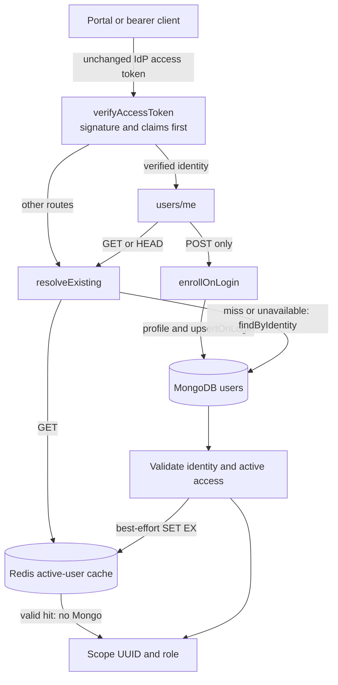

# Authentication & RBAC

> Status: **Explicit-login authentication and user-access caching implemented; 
> full RBAC, ownership enforcement, CLI interactive login, and internal-token
> designs remain deferred.** Original RBAC proposal: 2026-06-10; auth contract updated:
> 2026-09-18. This is not a statement that every deployed environment has migrated.

## Scope and deferred goals

Scope verifies IdP access tokens and resolves an active application user, but does
**not yet enforce full roles/permissions or ownership on its routes**. The existing
no-token/auth-not-configured anonymous rollout and public endpoints remain supported.
An authenticated identity that is missing or disabled in Scope is **not** anonymous.

The implemented boundary is narrow: only **`POST /api/v1/users/me`**
may JIT-create a user, refresh their profile/`lastLoginAt`, or apply bootstrap-admin
Every GET `/users/me` and other -authenticated routes verify the IdP token,
then read an existing active principal through one Redis-backed resolver. Clients
continue to send the **unchanged IdP access token on every call**; there is no
`/auth/login`, token exchange, Scope session JWT, or new signing-key configuration.

The following are **deferred RBAC goals**, not guarantees of the current rollout:

1. **Authenticate** every human-facing caller (CLI, API, Portal) using **Microsoft
   Entra ID** (formerly Azure AD).
2. Support a **pluggable identity-provider (IdP) abstraction** so that, once the
   project is open-sourced, other IdPs (Google, GitHub, generic OIDC, Keycloak,
   Auth0…) can be added without touching call sites.
3. Introduce **two roles** — `user` and `admin` — but model them as **named bundles of
   fine-grained permissions** (e.g. `scope/run:write`) so the system can grow to
   arbitrary roles/custom permission sets later **without a schema change**.
4. **Scope data ownership**: model ownership so that **owning data grants discoverability
   and editability**, while **shared deep links grant read-only access without ownership**.
   A first cut uses **two levels — personal (private) and global (shared)**: private data
   is discoverable, usable, and editable only by its owner; shared data is globally
   discoverable and usable by everyone but **read-only unless you own it**. An `admin` sees
   everything. (See §5.)
5. Keep a new **anonymous/public product mode out of scope.** In the future permission
   model, the `anonymous` principal carries **zero
   permissions** and is rejected by any permission-gated route. Treating it as a named
   principal is a guard *mechanism* convenience only — it is **not** a public experience and
   must not be granted permissions until a future, explicit public/demo mode is introduced
   over **public-only** data (see Open Question J).

> **Current milestone — explicit enrollment, then cached application access.**
> Portal/API authentication uses the existing Entra identity and singular Scope `role`.
> Already-enrolled CLI/raw-bearer callers remain compatible; a new identity must
> explicitly POST `/users/me` before other authenticated requests.
> CLI device-code login and ownership enforcement are separate work. In particular,
> **Scope-issued PAT / API tokens delivered through `SCOPE_TOKEN`** are very likely the
> right long-term answer for **user CI integrations and user-attributed automation**, but
> they are **explicitly out of scope for, and must not block, the user-auth milestone**
> (see Open Question H). Until then `SCOPE_TOKEN` is treated as a raw bearer escape hatch,
> not a Scope-managed credential.

> **Note on the Token Manager.** [apps/token-manager](../../apps/token-manager) is **not**
> a user-identity system. It stores **provider credentials** (GitHub Copilot / Claude /
> Cursor / Anthropic accounts and API keys) that the *agents* consume. This feature does
> **not** build on or extend the token-manager's `accounts`/`keys` schema. We reuse only
> its **infrastructure patterns** (MongoDB collection + Azure Key Vault via External
> Secrets) where relevant.

This document is the architecture spec and implementation plan. It deliberately
**lists open questions** (notably the exact permission matrix for `user` vs `admin`) that
must be resolved with stakeholders before or during implementation.

---

## Current implementation

| Component | In this branch | Relevant files |
|-----------|-------|----------------|
| API | Verifies the IdP signature and claims before any access-cache lookup. `/users/me` owns explicit enrollment; subsequent middleware resolves existing active users. Public/anonymous rollout is unchanged. | [apps/api/src/index.ts](../../apps/api/src/index.ts), [auth/middleware.ts](../../apps/api/src/auth/middleware.ts), [routes/users.ts](../../apps/api/src/routes/users.ts) |
| User access | `UserAccessResolver` reads a validated Redis snapshot or the exact `(idp, idpTenant, idpSubject)` Mongo record. Only explicit login invokes `upsertOnLogin`; no per-request JIT. | [auth/user-access-resolver.ts](../../apps/api/src/auth/user-access-resolver.ts), [auth/user-access-cache.ts](../../apps/api/src/auth/user-access-cache.ts), [auth/user-store.ts](../../apps/api/src/auth/user-store.ts) |
| Runs data model | `RequestResponseSchema` + embedded `RunStateSchema`; history in `runs` collection (`RunHistoryDocumentSchema`). **No owner field.** | [packages/shared/src/schemas/request.ts](../../packages/shared/src/schemas/request.ts) |
| Run listing | Cursor-paginated `GET /api/v1/requests` with filters; no per-user scoping. | [apps/api/src/routes/requests.ts](../../apps/api/src/routes/requests.ts) |
| CLI | Centralized `apiFetch()` injects `SCOPE_TOKEN` as a raw IdP bearer. No CLI interactive-login implementation is added here. New identities must explicitly enroll; ordinary CLI calls never enroll them. | [apps/cli/src/utils/api-client.ts](../../apps/cli/src/utils/api-client.ts), [CLI guidance](../../.agents/skills/scope-cli/SKILL.md) |
| Portal | MSAL supplies the IdP bearer; `AuthProvider` gates queries on `/users/me`. Fresh callback uses POST; cached-account reload uses GET. Scope UUID and role come from the API, not account claims. | [AuthContext.tsx](../../apps/portal/src/contexts/AuthContext.tsx), [apps/portal/src/lib/api.ts](../../apps/portal/src/lib/api.ts), [apps/portal/src/main.tsx](../../apps/portal/src/main.tsx) |
| Token Manager | Already has a `users`-like pattern for **provider** credentials (not app users). Reuse its KeyVault/Mongo patterns, not its schema. | [apps/token-manager/src/account-routes.ts](../../apps/token-manager/src/account-routes.ts) |
| Migrations | `mongo-migrate-ts`, numbered files with `up()`/`down()`. CosmosDB-compatible constraints apply. | [packages/db-migrations/src/migrations](../../packages/db-migrations/src/migrations) |

Key constraint: **coder workers** do **not** call the API for run state — they write to
MongoDB directly, so their traffic is out of scope for user auth. **But there is one
concrete internal API consumer today: the report-generator worker**
([apps/workers/report-generator](../../apps/workers/report-generator)). It calls the API
over HTTP (`SCOPE_MT_API_URL`) to read a specific run and write insights/reports:
`GET /api/v1/requests/:id`, `GET /api/v1/requests/:id/snapshots/:iteration`,
`GET /api/v1/report-templates/:id`, `GET /api/v1/insights/search`,
`POST /api/v1/insights`, `POST /api/v1/reports/:id/insights`
([tools.ts](../../apps/workers/report-generator/src/tools.ts),
[report-queue-processor.ts](../../apps/workers/report-generator/src/report-queue-processor.ts)).
The **scheduler** ([apps/scheduler](../../apps/scheduler)) does **not** call the API (it
touches MongoDB + Storage Queues directly), so it needs no API auth.

> **Service-to-service auth is a co-requisite of future ownership enforcement.** It
> is not introduced by explicit login/caching. The moment ownership scoping (§5) lands,
> `GET /api/v1/requests/:id` becomes owner-scoped and
> the report-generator — which has no user identity — would receive `404`s and its
> insight/report writes would be rejected. Service-to-service auth (§6) must therefore
> ship **together with** ownership scoping. Because the report-generator operates on **one
> specific user's run**, it should use the **on-behalf-of internal token** (§6) carrying
> that run's owner id, so `readScope`/`writeScope` resolve naturally — not a broad system
> credential (which would let any report job read any run).

---

## Architecture

### Overview — current IdP-token flow



### 1. Pluggable IdP abstraction (`packages/shared/src/auth/`)

A backend-side `AuthProvider` interface decouples token verification from Entra
specifics. Selection is config-driven; adding an IdP = new implementation + config,
no call-site changes.

```ts
// packages/shared/src/auth/types.ts
export interface VerifiedIdentity {
  /** Stable, IdP-unique subject (Entra: `oid`; OIDC: `sub`). */
  idpSubject: string;
  /** Provider id, e.g. "entra", "google", "oidc". */
  idp: string;
  /** Entra `tid`; part of the durable identity key. */
  idpTenant: string;
  email?: string;
  displayName?: string;
  emailVerified?: boolean;
}

export interface AuthProvider {
  readonly id: string;
  /** Verify a bearer access token. Throws AuthError on any failure. */
  verifyAccessToken(token: string): Promise<VerifiedIdentity>;
}

/** Shape of the IdP config the CLI and Portal **hardcode** for now (there is no
 *  `/auth/config` endpoint — see §3/§7/§8). Kept as a type so both clients hold an
 *  identical, reviewable shape and a future IdP swap is a one-line config change. */
export interface AuthClientConfig {
  provider: string;          // "entra"
  authority: string;         // https://login.microsoftonline.com/<tenant>
  clientId: string;          // app registration (CLI/portal public client)
  scopes: string[];          // ["api://<api-app-id>/access_as_user"]
  audience: string;          // expected `aud`
}
```

> **No IdP-side roles.** The `AuthProvider` extracts **identity only** — it does **not**
> read Entra App Roles or any IdP-asserted role/group claims. All authorization
> (roles → permissions) is owned by Scope (see §2). This keeps RBAC identical across
> every IdP and avoids per-tenant Entra app-role configuration.

`EntraIdAuthProvider` (the first implementation):

- **Multi-tenant**: validates against the Entra **common/organizations** issuer pattern
  and accepts **any tenant** — no `tid` pinning in code. Tenant restriction (if any) is
  configured at the **App Registration** level. `jose` caches keys from the configured
  JWKS endpoint (`AUTH_JWKS_URI`, otherwise derived from `AUTH_AUTHORITY`) and handles
  key rotation. Scope requires the selected JWK to publish an `issuer` and enforces that
  Entra-specific key restriction: a `{tenantid}` key issuer is expanded from the token's
  `tid`, while a tenant-specific key issuer must match exactly.
- Verifies signature (RS256), `iss` (per-tenant issuer template), `aud`
  (`AUTH_API_CLIENT_ID`), `exp`, `nbf`. Both the configured token issuer template and
  the selected signing key's issuer must match; missing or malformed key issuer metadata
  fails closed.
- Extracts `oid` → `idpSubject`, `tid` → `idpTenant`, `email` (falling back to
  `preferred_username`), optional boolean `email_verified`, and `name`. The
  `(idp, idpTenant, idpSubject)` triple — **not** email — is the durable identity key
  (see §2 and Open Question D).
- Uses `jose` for JWKS + verification (no heavyweight MSAL dependency on the API).

The provider is instantiated from env in API bootstrap:

```
AUTH_PROVIDER=entra                # selects implementation
AUTH_AUTHORITY=https://login.microsoftonline.com/common   # multi-tenant (or /organizations)
AUTH_API_CLIENT_ID=<api-app-id>    # expected audience (pinned)
AUTH_CLI_CLIENT_ID=<cli-client-id>        # public CLI client id
AUTH_PORTAL_CLIENT_ID=<portal-client-id>  # public Portal client id
AUTH_SCOPES=api://<api-app-id>/access_as_user
# Bootstrap admins are matched on the *verified subject*, NOT a mutable email — see §2 / Q C:
AUTH_BOOTSTRAP_ADMINS=entra:<tid>/<oid>,entra:<tid>/<oid>   # (idp:tenant/subject) tuples
AUTH_BOOTSTRAP_TENANTS=<tid-1>,<tid-2>   # tenant allowlist that bootstrap may apply within
AUTH_USER_CACHE_TTL_SECONDS=300         # positive safe integer; default only when unset
# Tenant filtering, if needed, is enforced at the App Registration — not here.
```
> **No dev/bypass mode — by design.** There is **no `AUTH_ENABLED` switch and no
> env-selectable synthetic principal**. With auth configured, every non-public bearer
> request verifies a real token before accessing Redis or MongoDB. No environment
> variable, header, or flag fabricates an authenticated principal. The previous
> `local-user`/`local-admin` + `X-Dev-User`/`DEV_USER` bypass is **removed entirely** — it
> was a standing privilege-escalation and "ships to prod by accident" risk.
>
> Auth-not-configured and no-token requests retain the existing anonymous rollout
> behavior; that does not enroll or authenticate anyone. Local sign-in uses a real
> token from the **Entra ID local emulator** (a **separate project**), which provides a
> standards-compliant local OIDC issuer; Scope consumes it purely as **another IdP
> configuration** (`AUTH_AUTHORITY`/`AUTH_API_CLIENT_ID`/JWKS pointed at the emulator) via
> the existing `AuthProvider` abstraction — **no Scope code path knows it is "dev".**

### 2. App users, roles & permissions (`users` collection)

Authorization lives entirely in **our** database, not in the IdP, so RBAC is portable
across IdPs and survives IdP migration. The IdP only proves *identity*; Scope owns
*authorization*.

**Current model:** the stored user's singular `role` (default `user`, eligible
bootstrap promotion to `admin`) is returned as metadata, not enforced as route RBAC.
The permission types, overrides, and role bundles below are **deferred design**,
not the current request/response contract.

**Deferred: permissions are the atomic unit.** A permission is a namespaced
`resource:action` string, e.g. `scope/run:write`. A **role** is a named bundle of
permissions. The proposed first roles are `user` and `admin`; because the model is
permission-first, adding custom roles or per-user permission overrides later is **not** a
schema change.

```ts
// packages/shared/src/auth/permissions.ts
export type Action = "read" | "write" | "delete" | "admin";
export type Permission = `${string}/${string}:${Action}`;

// Examples: "scope/run:read", "scope/run:write", "scope/run:delete",
//           "scope/criteria:write", "scope/user:admin", ...

/** Persisted application roles (what a `users` doc may store). */
export type UserRole = "user" | "admin";

/** Roles a *request principal* may carry at runtime. `anonymous`/`service` are never
 *  persisted on a `users` doc — they exist only on the in-flight principal. Keeping these
 *  separate from `UserRole` avoids the typing conflicts (and unsafe casts) that arise from
 *  overloading one `Role` union for both storage and request shapes. */
export type PrincipalRole = UserRole | "anonymous" | "service";

/** Roles are bundles of permissions. The set is data, not hardcoded logic. */
export const ROLE_PERMISSIONS: Record<UserRole, Permission[]> = {
  user:  ["scope/run:read", "scope/run:write", "scope/run:delete", /* own-scoped */ ],
  admin: ["scope/*:admin" /* resource wildcard ⇒ admin on every resource — see below */],
};
```

> **Wildcard semantics — specified, not implied.** `hasPermission(user, required)` must be
> precisely defined and **negatively unit-tested**, because wildcard authorization is a
> classic bypass source. Rules:
> - The **resource** segment may be the literal `*` meaning "every resource" (e.g.
>   `scope/*:admin` = admin on all resources). The `*` is a wildcard **only** in the
>   resource position; namespaces and actions are never wildcards.
> - **Action subsumption**: `admin` implies `read`/`write`/`delete` on the **same
>   resource**. So `scope/run:admin` satisfies `scope/run:read`. There is **no** cross-axis
>   implication: it does **not** satisfy `write`/`delete`/`read` on a *different* resource.
> - A held permission `H = hRes/hAct` satisfies a required `R = rNs/rRes:rAct` iff
>   `H.namespace == R.namespace` **and** (`hRes == rRes` or `hRes == "*"`) **and**
>   (`hAct == rAct` or `hAct == "admin"`).
> - **Required mandatory negative cases** (must be asserted in tests):
>   `scope/run:write` is **not** satisfied by `scope/criteria:admin` (different resource);
>   `scope/run:write` is **not** satisfied by `scope/run:read` (no action upgrade);
>   a required permission is **never** satisfied by the empty/anonymous set.

```ts
// Proposed RBAC extension of the users collection; permission overrides are deferred.
{
  _id: string,                 // **Scope User ID** — app-owned UUID; this is what
                               //   `ownerId` references everywhere (NOT the idpSubject).
                               //   Reserved value "system" is NEVER assigned to a live
                               //   principal (see middleware §3).
  idp: string,                 // "entra"
  idpTenant: string,           // Entra `tid` — part of the identity key (multi-tenant)
  idpSubject: string,          // Entra `oid` — stable per (tenant, user); identity link only
  email?: string,              // mutable, advisory; never an authorization input
  emailVerified?: boolean,     // captured when the IdP asserts it (email storage only)
  displayName?: string,
  role: UserRole,              // "user" | "admin"  (persisted role union only)
  /** Optional explicit grants/denies layered on top of the role. Empty today;
   *  present in the schema so future custom permissions need no migration. */
  permissionsAdd?: Permission[],
  permissionsRemove?: Permission[],
  createdAt: Date,
  updatedAt: Date,
  lastLoginAt?: Date,          // explicit enrollment POST time, not request activity
  disabledAt?: Date,           // soft-disable
}
```

> `_id` is **minted by Scope** on first login and is **stable for the lifetime of the
> user**, independent of the IdP. The `(idp, idpTenant, idpSubject)` triple is the *link*
> to the external identity; re-linking it to a new IdP keeps the same `_id` (and thus all
> owned data). `ownerId` on runs always stores this `_id`, and **never** the reserved
> `"system"` id.

**Effective permissions** = `ROLE_PERMISSIONS[role]` ∪ `permissionsAdd` −
`permissionsRemove`. The authz layer always checks **permissions**, never role names
directly — so swapping or adding roles never touches route code.

**Deferred permission model: the `anonymous` principal is a guard *mechanism*, not a
public experience.** A reserved,
non-persisted principal (`{ id: "anonymous", role: "anonymous", permissions: [] }`)
represents unauthenticated callers so route guards have a uniform shape. It carries
**zero permissions** and **any** permission-gated route rejects it. This convenience does
**not** make a public mode "free": route authors still own the *policy*, and the easy
default of "just check the permission" would silently expose data if anyone ever granted
`anonymous` a real permission. Therefore: **no permission is ever added to the anonymous
set in v1**; a future public/demo mode is a deliberate, explicit change scoped to
public-only data (Open Questions J), not an emergent property of this principal.

**Current JIT provisioning**: only an actual
`POST /api/v1/users/me`, after successful token verification, calls
`UserAccessResolver.enrollOnLogin()` and `UserStore.upsertOnLogin()`. A missing user
gets a Scope-owned UUID and default role `user`; an existing user's profile and
`lastLoginAt` are refreshed even if Redis already contains an active snapshot.
Every GET `/me`, cache expiry, and all other routes never upsert, enrich, promote, 
or write `lastLoginAt`.

`lastLoginAt` means **the explicit login upsert time**, not proof of an interactive
IdP prompt or callback: callers can invoke/retry the endpoint themselves. The existing
ordering is preserved: **the upsert (including profile/timestamp/promotion writes)
occurs before the resolver checks `disabledAt`**. A disabled user's login request can
therefore update those fields before returning `403`; it never admits/caches that user.

**Admin bootstrap is identity-keyed, not email-keyed** (Entra
`email`/`preferred_username` is mutable and not guaranteed verified, and in multi-tenant
mode any tenant can sign users in):

- On explicit login, a user is bootstrapped to `admin` **only if** their verified
  `(idp, idpTenant, idpSubject)`
  appears in `AUTH_BOOTSTRAP_ADMINS` **and** their `idpTenant` is in
  `AUTH_BOOTSTRAP_TENANTS`. Email is **never** the match key.
- Bootstrap does not require `email` or `email_verified`; ordinary Entra workforce
  and local-emulator access tokens can bootstrap without those claims.
- `email_verified` (where the IdP asserts it) is required before any email is even stored
  as advisory; an unverified email never influences a grant.
- **Bootstrap promotes but does not silently demote.** Presence in the list grants admin;
  *removal* from the list does **not** auto-demote a sitting admin (that requires an
  explicit administrative change), so a bad ConfigMap edit can't quietly strip admins.
  Admin mutation endpoints and the durable security audit (§F) remain deferred.

Index: database-enforced unique compound `(idp, idpTenant, idpSubject)`, named
`uniq_identity`. Both backends have a non-unique `email` index for advisory
lookup: sparse on native MongoDB, non-sparse on CosmosDB. Migration 029
creates the Cosmos identity index with the collection and refuses incompatible
existing collections without deleting data or weakening uniqueness. See
[migration 029](db-migrations.md#migration-029-users-identity-uniqueness) for
backend handling and the remaining live-Cosmos validation.

Folding `idpTenant` into the key is mandatory — `oid` is unique only *within*
a tenant, so `(idp, idpSubject)` alone collides across tenants and mis-identifies guest/B2B
users (Open Question D).

### 3. API authentication middleware

Registration in `apps/api/src/index.ts` is deliberately ordered:

1. CORS/body parsing and `/users/me` **`Cache-Control: no-store`** response policy.
2. `createAuthMiddleware()` verifies credentials, preserving exclusions for `/health`,
   `/ready`, `/about`, `/openapi.json`, `/api/v1/version`, and `/api-docs`.
3. `registerUsersRoutes()` registers `/users/me` through `apiRoute()`.
4. `createUserAccessMiddleware()` resolves existing users for the remaining routes.
5. Other routes in their existing relative order, then `authErrorHandler` (typed
   auth/access codes) and the existing logged unexpected-error handler.

Verification attaches request-local `req.auth = { identity, token }`, not application
access. The raw bearer is used only as needed for explicit-login enrichment; it is
never persisted, put in Redis, or logged. `req.user` is populated only after access
resolution (or with the existing anonymous principal when no token/auth configuration
is present). There is **no Scope-token verifier or query-based middleware bypass**:
adding `?login=true` to a different route does not enroll a user.

#### `/users/me` method contract

Both methods require a verified identity, return the same response (`id`, `role`,
optional `email`, `displayName`, `idp`, `idpTenant`), and set `req.user` from the
shared resolver. `id` is the **Scope UUID**, never Entra `oid`.

| Request | Behavior |
| --- | --- |
| `POST /api/v1/users/me` | Explicit enrollment/profile/timestamp/bootstrap writes, then access validation and cache warming. Returns `200` with the current-user representation. |
| `GET /api/v1/users/me` | Read-only existing-user resolution. |
| Other values, repeated `login`, arrays, objects, or an empty value | `400`; no enrollment. |
| `HEAD /api/v1/users/me?login=true` | Read-only resolution; Express dispatch to the GET handler must not cause JIT. |
| `?login=true` on another route | Normal existing-user resolution; no enrollment. |

Only the POST has side effects. All `/users/me` responses, including errors, are
`Cache-Control: no-store`; clients also request `cache: "no-store"`. **Do not prefetch,
poll, automatically retry transient failures, or conditionally HTTP-cache the
enrollment POST.** An explicit user retry is allowed. The existing one-time `401`
token-refresh retry is safe because authentication fails before enrollment.

#### Shared resolver and Redis contract

`UserAccessResolver` owns the same mapping, identity/reserved-ID validation,
disabled check, and cache warming for both paths. The Mongo identity lookup is exact:
`(idp, idpTenant, idpSubject)` = `(idp, tid, oid)` for Entra. Email, browser account
IDs, token text, and client-supplied Scope IDs are never lookup keys.

`RedisUserAccessCache` implements the API-local `UserAccessCache` interface (`get`,
`set`, `delete`, `close`) using `ioredis` and existing `REDIS_HOST`, `REDIS_PORT`,
`REDIS_PASSWORD`, and `REDIS_TLS` settings. There is no process-local access cache.

Canonical key (each variable component is independently `encodeURIComponent`-encoded):

```text
auth-user:v1:<Mongo database namespace>:<idp>:<tid>:<oid>
```

The namespace is the configured **MongoDB database name**. Independent Scope databases
sharing Redis must use distinct database names/namespaces (or separate Redis instances);
the identity tuple alone is insufficient deployment isolation. A minimal version-1
snapshot contains Scope ID, singular role, verified identity tuple, and optional
profile fields — **no bearer, negative entry, IdP-derived permissions, or Mongo object**.
Only existing active human principals are cached. Invalid JSON, unsupported versions,
malformed/reserved IDs, and mismatched tuples are logged, evicted best-effort, and
treated as misses rather than authorization.

`AUTH_USER_CACHE_TTL_SECONDS` defaults to **300 only when unset**. A supplied value
must be a positive safe integer; blank, zero, negative, fractional, nonnumeric, or
unsafe values fail startup, even when IdP auth is disabled. Setting a valid value
alone does not enable IdP auth.
Writes use atomic `SET ... EX <ttl>`; a hit only performs `GET`, so expiry is
**fixed/non-sliding**. Explicit login or a successful Mongo fallback starts a fresh TTL.

Redis results distinguish hit, miss, and unavailable. Expected read/write/delete
failures are rate-limited in logs (without tokens or cached PII), with recovery
logging. A missing/blank Redis host creates no Redis client and reports unavailable
with a rate-limited warning, so resolution uses Mongo. Connection/command waits and
reconnect backoff are bounded; offline command queuing/replay is
disabled. On miss/unavailability, Mongo is authoritative; a failed cache write does
not discard a successful Mongo result. Unexpected application errors are not converted
to cache misses or success.

**Consistency:** database-only role/disable changes may remain invisible until the
active snapshot's TTL expires. Hits do not extend that window. If a database lookup
or login discovers a missing, disabled, or invalid user, it denies access and
best-effort evicts any old entry; it never negatively caches the result. Future
role/disable mutation endpoints **must evict the matching key**. This cache is not a
browser session/revocation store; Portal logout does not delete shared Redis access.

#### Method-level flow walkthrough

1. **Fresh Portal callback → explicit login.** `initializeAuth()` records the
   account-bound redirect result; `getAccountKey()` and `getPendingRedirectLogin()`
   associate it with the current account. `wireApiAuth()` keeps the existing MSAL bearer
   transport. `AuthProvider` calls `api.enrollCurrentUser({ signal })`
   before mounting/querying authenticated application data. `createAuthMiddleware()`
   calls `AuthProvider.verifyAccessToken()` first. The POST `/users/me` handler calls
   `UserAccessResolver.enrollOnLogin(identity, token)`, which bypasses cache reads,
   invokes `ProfileEnricher.enrich()` (claims-only today), then
   `UserStore.upsertOnLogin()`. The resolver validates/maps the stored result and calls
   `RedisUserAccessCache.set()` best-effort before returning the Scope user. Only a
   successful handshake calls `consumeRedirectLogin()` and enables application queries.
2. **Ordinary request → cache hit.** Verification still runs first; for a normal
   route, `createUserAccessMiddleware()` calls `resolveExisting(identity)`.
   `RedisUserAccessCache.get()` validates the snapshot and tuple, then returns it.
   No Mongo read/write, enrichment, promotion, or `lastLoginAt` update occurs.
3. **Miss/expiry/invalid entry.** After verification, `resolveExisting()` calls
   `cache.get()`, then `UserStore.findByIdentity()` for that exact tuple.
   The shared validator rejects missing/disabled/reserved users or maps an active user
   and calls `cache.set()`. Expiry never triggers JIT.
4. **Redis unavailable.** `get()` reports unavailable and logs with rate limiting.
   `resolveExisting()` follows the same Mongo read/validation path. `set()`/`delete()`
   failure is best-effort; required Mongo failures still fail the request. Caching
   resumes after Redis recovers without replaying offline writes.
5. **Cached-account Portal reload → plain `/me`.** `initializeAuth()` restores an
   account without a new redirect login event. `AuthProvider` calls
   `api.getCurrentUser({ signal })`, producing GET `/users/me`.
   That route calls `resolveExisting()`, with the hit/miss/outage behavior above.
   It never refreshes profile or `lastLoginAt`; `user_not_enrolled` offers explicit
   sign-in rather than silently switching to enrollment.

#### Failure contract

| Condition | Response |
| --- | --- |
| Present but empty, malformed, or unsupported `Authorization` header on a non-public route with auth configured | `401`, `code: "invalid_token"`, before token verification or access lookup; never anonymous fallback. Only an absent header preserves the no-token anonymous rollout. |
| Invalid/expired IdP token | `401`, preserving verifier codes, **before Redis/Mongo access**. |
| No verified identity on `/users/me` | `401`; no enrollment or warming. |
| Missing stored user | `403`, `code: "user_not_enrolled"`; never anonymous fallback. |
| Disabled stored user | `403`, `code: "user_disabled"`; no active cache write. |
| Reserved `system` or invalid principal | `401`, `code: "invalid_principal"`; never admitted/cached. |
| Invalid `login` query | `400`; no writes. |
| JWKS unavailable or required auth service uninitialized | `503`. |
| Redis unavailable, required Mongo operation succeeds | Continue with Mongo result; log cache failure. |
| Required Mongo operation unavailable | `503`; never grant/anonymous fallback. |
| Unexpected implementation/database error | Logged centralized `500` path, not catch-all `503`. |

#### OpenAPI authentication metadata (implemented)

Both `GET` and `POST /api/v1/users/me` declare the HTTP bearer scheme `bearerAuth`
in OpenAPI. Swagger UI's **Authorize** control accepts the unchanged IdP access token
without its `Bearer` prefix, not an ID token or a Scope-issued token. GET retains its
documented `400`/`401`/`403`/`503` responses; POST documents
`401`/`403`/`503` and a `200` current-user response.

`apiRoute()` forwards optional `security` metadata only. There is no global
OpenAPI security requirement, and other operations retain their existing
anonymous rollout. This does not implement the deferred authorization guards
below.

### 4. Deferred: route-level authorization

Extend `ApiRouteConfig` (the `apiRoute()` helper) with optional fields so authz is
declarative and shows up in the OpenAPI spec (`security` + `401`/`403` responses):

```ts
interface ApiRouteConfig<...> {
  // ...existing...
  /** Default true. Set false for public endpoints. */
  auth?: boolean;
  /** Permission(s) required to call this route. Omit ⇒ any authenticated
   *  principal. e.g. "scope/run:write", or ["scope/user:admin"]. */
  permissions?: Permission | Permission[];
}
```

`apiRoute()` injects a per-route guard that runs after the global authn middleware:
if `auth !== false` and the principal is `anonymous` ⇒ `401`; if `permissions` is set
and the principal's **effective permissions** don't satisfy them (per the **specified
wildcard/subsumption semantics in §2** — e.g. `scope/*:admin` matches, but
`scope/criteria:admin` does **not** satisfy `scope/run:write`) ⇒ `403`. Guards check
**permissions, never role names**, so new roles work without touching routes.

> Roles still exist as the *authoring* convenience (you assign a user a role, which
> expands to permissions). Routes are authored against permissions.

### 5. Deferred: data ownership & scoping

The model rests on two ideas, kept deliberately small for v1:

1. **Ownership grants discoverability *and* editability.** The owner can find, use, and
   edit their data.
2. **Sharing is decoupled from ownership.** Data can be made readable to others **without
   transferring ownership** — either by marking it *shared* (globally discoverable,
   read-only to non-owners) or by handing out a *deep link* (read-only access to one
   specific item).

> **`ownerId` is a Scope User ID — never an IdP subject, never trusted from the client.**
> Ownership is keyed on the **Scope-owned** `users._id` (minted during JIT provisioning),
> **not** the Entra `oid` / OIDC `sub` (`idpSubject`). It is **always derived server-side
> from the authenticated principal** — never read from the request body. Consistency rules:
> - It survives **IdP migration** — re-link `(idp, idpTenant, idpSubject)` on the *same*
>   `users._id` and all owned data stays owned.
> - It keeps the data model **IdP-agnostic** (the open-source goal) — documents never embed
>   provider-specific identifiers.
> - `req.user.id` **is** the `users._id`. Any code that writes `ownerId` must use
>   `req.user.id`; writing an `idpSubject`, or a client-supplied `ownerId`, into `ownerId`
>   is a bug.
> - The reserved id `"system"` is a **legacy-backfill sentinel only** and is **never** a
>   live principal (§3). It is not a login, not an account, and grants no session.

#### Two-level visibility (v1): personal vs global

Every piece of **user-owned data** (runs and the user-authored catalog data —
criteria, profiles, MCP servers, etc.) carries:

- `ownerId: string` — the Scope User ID of the creator (set server-side).
- `visibility: "private" | "shared"` — **chosen by the user at creation** (default
  `"private"`). This is the "personal vs global" choice:
  - **private** — discoverable, usable, **and editable only by the owner** (and admins).
  - **shared** — **globally discoverable and usable by everyone**, but **read-only unless
    you own it**. Only the owner (or an admin) can edit or delete it.

Concretely, on `POST` (create) of a user-owned resource:

```ts
const doc = {
  ...validatedBody,                 // body MUST NOT carry ownerId; it is ignored/stripped
  ownerId: req.user.id,             // derived from the authenticated user — never trusted
  visibility: validatedBody.visibility ?? "private",
};
```

API responses **include `ownerId`** (and `visibility`) where relevant, so clients can show
owner / "shared by" and enable/disable edit affordances — but the server, not the response
shape, is the enforcement boundary.

#### Scoping helpers (one chokepoint per axis)

Reads and writes go through two resolvers so every call site is consistent. `<resource>`
is the permission namespace for the collection (e.g. `run`, `criteria`):

```ts
// DISCOVERY / READ: your own data (any visibility) PLUS everyone's shared data.
// Admins on the resource see everything.
function readScope(user: AuthenticatedUser, resource: string): Filter {
  if (hasPermission(user, `scope/${resource}:admin`)) return {};
  return { $or: [{ ownerId: user.id }, { visibility: "shared" }] };
}

// EDIT / DELETE: owner only (admins on the resource bypass).
function writeScope(user: AuthenticatedUser, resource: string): Filter {
  if (hasPermission(user, `scope/${resource}:admin`)) return {};
  return { ownerId: user.id };
}
```

- **Every** read/list merges `readScope`; **every** mutation merges `writeScope`.
- For single-resource fetches, return `404` (not `403`) when the doc exists but is neither
  owned, shared, nor reachable via a valid deep link — to avoid leaking existence.
- For a mutation on a *shared* doc the caller doesn't own, return `403` (the resource is
  legitimately discoverable, so existence isn't secret — it's an authorization failure).
- **Runs default to `private`** and are primarily shared via **deep links** (below);
  marking a run `shared` is allowed but is the global-discovery path.

#### Read-only deep-link sharing

A user may share a **deep link** that grants **read-only** access to **one specific item**
**without** ownership and **without** making it globally discoverable:

- A deep link is a **signed, revocable, read-only capability** bound to a single resource
  id (and optionally an `exp`). It is resolved on the read path **only** — it can never
  satisfy `writeScope`.
- The read handler accepts the link capability as an alternative to `readScope` **for that
  id alone**: `isOwnerOrShared(doc) || validDeepLink(token, doc._id)`.
- Deep-link grants are recorded (Scope-owned) so they can be **revoked** and audited; they
  confer **no** edit/delete and **no** broader discovery.

#### Associated data & analytics

- **Associated data** (run attempts, logs/SSE, archives, snapshots, reports tied to a run)
  is authorized **through its parent request**: resolve the parent with `readScope` (or a
  valid deep link) before serving the derived resource. No derived endpoint queries
  blob/secondary storage before the access check passes.
- Cross-cutting analytics (`/api/v1/analysis`, grouping) apply `readScope` for callers
  without the resource `:admin` permission; admins see global aggregates. (Whether *shared*
  data appears in another user's aggregates is an Open Question — see A.)

#### Future-proofing: sharing, groups & projects

The v1 axes above (`ownerId`, `visibility`, deep-link grants) are designed so that
**group/project** ownership can be added later **without re-modelling existing data or
rewriting every query**:

- **Keep all authorization flowing through the two chokepoints** (`readScope`/`writeScope`).
  When groups arrive, they generalize to include the ids of any group/project the user
  belongs to (a Mongo `$or`), and call sites don't change.
- **Reserve the remaining shape now, populate later** (all optional, ignored by v1 logic):
  - `ownerType: "user" | "group"` (defaults to `"user"`).
  - `groupId?: string` / `projectId?: string` — owning group/project (future
    `groups`/`projects` collections, also keyed by Scope-owned ids).
  - `sharedWith?: Array<{ principalId: string; principalType: "user" | "group";
    permissions: Permission[] }>` — explicit ACL entries beyond the deep-link case.
  - A future third visibility level (e.g. `group`) extends the union additively.
- **Permissions already namespace cleanly.** Group/project administration slots in as new
  permissions (e.g. `scope/group:write`) under the existing model — no route-guard change.
- **Membership lives in Scope, not the IdP** — keyed on `users._id`; any IdP group claims
  are advisory at most.

See Open Question **B** for the decisions (per-item ACL vs project-scoped, group roles)
that must be settled before that work is scheduled. **v1 ships `ownerId` +
`private`/`shared` visibility + read-only deep links**; the `group`/`project`/`sharedWith`
fields above are documented intent, not implemented yet.


### 6. Deferred: service-to-service auth

> This section preserves the future ownership/RBAC design. None of its Scope-issued
> JWTs, signing keys, service credentials, minting endpoints, or revocation lists are
> introduced by the current explicit-login/cache implementation. Human clients keep
> presenting the IdP bearer; there is no human token-exchange endpoint.

Internal callers (scheduler, report-generator, future internal API consumers) and any
worker that reaches the API authenticate with a **service principal**, not a user.
**No Entra App Roles are used**, and **no single all-powerful shared key exists** — each
service has its **own identity** and a **narrow, least-privilege** permission set owned by
Scope:

- **Per-service identity (primary).** Every internal caller is registered as a named
  service principal with an **explicit, minimal** permission set — **never** blanket
  `scope/*:admin`. Two interchangeable credential mechanisms:
  - **Per-service signed JWT (preferred).** Each service presents a Scope-signed service
    token (`iss = scope-api`, `aud = scope-internal`, `sub = service:<name>`, short `exp`,
    `jti`) verified with the Scope **public** key. The principal's permissions are
    **resolved from a Scope-owned service registry by `<name>`**, not read from the token,
    so they can be tightened/revoked centrally.
  - **Per-service key.** Where a pre-shared secret is simpler, each service gets its **own**
    `INTERNAL_API_KEY_<NAME>` (distinct secret, constant-time compared) presented on
    `X-Internal-Key` + `X-Service-Name`. There is **no** global key shared by all services.
- The resulting principal is
  `{ id: "service:<name>", role: "service", permissions: <registry[name]>, isService: true }`,
  where `<registry[name]>` is the **least-privilege** set for that service (e.g. the
  report-generator gets only `scope/insight:write`, `scope/report:write`, and reads runs
  **on behalf of the owner**, not a global run-read admin).
- **Optional (Entra client-credentials)**: a deployment may instead present a
  client-credentials access token mapped (by verified `oid` in `AUTH_SERVICE_SUBJECTS`) to
  the **same named, narrow** service principal. **Identity only** — no Entra app-role claim
  is read. This Entra token **terminates at the API** and is never forwarded.

> **Decided (Question E)**: per-service identities with **narrow** permissions are the
> design; a single shared `scope/*:admin` key is **rejected** (blast-radius). The optional
> Entra client-credentials path remains a footnote for deployments that already have one.

Service principals are scoped to **exactly their granted permissions** — they do **not**
get implicit full admin. A service may bypass *ownership* only for the resources its
permissions cover (system action), and every service mutation / cross-user read is
auditable (§F).

#### Propagating user identity downstream (Scope-minted internal token)

Some downstream calls need to run **on behalf of the originating user** (e.g. so the
downstream service applies the same ownership scoping). When that's required:

- **Never propagate the IdP token or any IdP settings.** The external Entra/OIDC access
  token (and its `authority`, `audience`, JWKS, tenant, scopes, etc.) **must not** leave
  the API boundary. Downstream services have **no** knowledge of the IdP and must never
  be configured with IdP verification material. The IdP token is verified once, at the
  edge, and discarded.
- **Mint a short-lived Scope internal bearer token instead.** The API issues its own
  signed JWT: `sub = users._id` (the **Scope User ID**), `iss = "scope-api"`,
  `aud = "scope-internal"`, a short `exp`, and a `jti`. It is signed with a **Scope-owned
  asymmetric signing key** — the API holds the **private** key; downstream services hold
  only the **public** key to verify. (An HMAC `INTERNAL_JWT_SECRET` is a simpler
  single-deployment alternative, but the public/private split is the chosen design.)
  **Independent of the IdP.**
- **Permissions are NOT baked into the token (revocation must work).** Embedding a
  `permissions` array means a disabled user, a demoted admin, or a removed permission keeps
  working until `exp` — revocation becomes theoretical. So:
  - **Preferred: carry `sub` only.** The future downstream path must resolve role,
    effective permissions, and `disabledAt` without JIT. Its invalidation/revocation
    policy must be defined before this feature ships. The current human IdP path uses
    a fixed-TTL active-user cache (§3), **not a live Mongo check on every request**;
    a live downstream lookup must not be mistaken for an existing human-path guarantee.
  - **If permissions must be carried** (e.g. downstream can't reach Mongo), bound the
    staleness explicitly: a hard **`exp` ceiling of ≤ 5 minutes** (not a vague "minutes")
    **and** a **`jti` revocation list** the verifier consults, so a token can be killed
    before `exp`. Both are required together; neither alone is sufficient.
- **Downstream validates the internal token, not the IdP token.** Each internal service
  verifies signature + `iss`/`aud`/`exp` against the Scope **public** key, checks `jti`
  against the revocation list, then reconstructs the same `AuthenticatedUser` (re-resolving
  permissions per above), so `readScope`/`writeScope` work identically downstream. This is
  a normal `AuthProvider`-style verification path, just with the **internal issuer**.
- **`X-Internal-Key`/service JWT vs internal user token are distinct.** A service credential
  authenticates a **service acting as itself** (narrow system principal). The minted user
  token authenticates a **service acting on behalf of a user** (carries the Scope User ID,
  subject to ownership scoping). A call uses one or the other; it must not use the IdP token
  for either.

> **Concrete v1 consumer — report-generator.** The report-generator worker reads a
> **specific user's run** to produce a report. So when the API enqueues a report job it
> includes the run's `ownerId`; the worker calls back with an **on-behalf-of internal
> token** minted for that owner (not the system `X-Internal-Key`), so the report-generator
> sees exactly what the run's owner can see. Flow:
>
> ```mermaid
> sequenceDiagram
>     participant API
>     participant Q as Report Queue
>     participant RG as report-generator
>     API->>Q: enqueue report job { reportId, requestId, ownerId }
>     RG->>API: GET /api/v1/requests/:id  (Bearer on-behalf-of token for ownerId)
>     API-->>RG: run (owner-scoped → 200)
>     RG->>API: POST /api/v1/reports/:id/insights (same token)
> ```
>
> The minting endpoint is API-internal: the worker exchanges its **own service** credential
> (a per-service JWT or `INTERNAL_API_KEY_<NAME>`) + the job's `ownerId` for a short-lived
> on-behalf-of token, or the token is handed to it directly on the queue message (short
> `exp`). Either way the IdP is never involved.

### 7. CLI authentication — current bearer compatibility, deferred interactive UX

Today `apiFetch()` attaches the caller's raw IdP `SCOPE_TOKEN`. Already-enrolled
users keep using it unchanged. A new identity must intentionally call
`POST /api/v1/users/me` with that bearer before ordinary authenticated commands;
GET `/me` returns `403 user_not_enrolled` rather than auto-enrolling.
No CLI code is added by this milestone. For the explicit enrollment request, use
`Cache-Control: no-store`, never prefetch it, and keep tokens out of logs.

The remaining interactive CLI design is **deferred**:

- New command group `scope auth`:
  - `scope auth login` — Entra **device-code flow** via
    `@azure/msal-node` `PublicClientApplication.acquireTokenByDeviceCode`. Provides a
    **great login UX** (see below). After successful device-code authentication, its
    first Scope API call must be POST `/users/me`; token refresh is not enrollment.
  - `scope auth logout` — clears the cached tokens from the `SecretStore` (OS keychain).
  - `scope auth status` / `scope auth whoami` — shows the signed-in identity + role
    (calls `GET /api/v1/users/me`).
- **Secure token storage via a Scope `SecretStore` abstraction.** We do **not** depend on
  `keytar` (unmaintained). Instead, Scope defines its **own** small `SecretStore` interface
  and wires the MSAL token cache (access + refresh tokens) through it:

  ```ts
  // packages/shared (or cli) — Scope-owned, swappable backend
  export interface SecretStore {
    get(account: string): Promise<string | null>;
    set(account: string, secret: string): Promise<void>;
    delete(account: string): Promise<void>;
  }
  ```

  - **Default backend: [`cross-keychain`](https://www.npmjs.com/package/cross-keychain)**
    (`magarcia/cross-keychain`) — cross-platform native storage (macOS Keychain via
    Security.framework, Windows Credential Manager, Linux Secret Service) with a
    `setPassword`/`getPassword`/`deletePassword` API. Used under service `scope-cli`,
    account = the API origin. Wired into MSAL as the `ICachePlugin`
    (`beforeCacheAccess`/`afterCacheAccess`). **Silent refresh** before each request; falls
    back to device-code when the refresh token is expired.
  - Because the backend sits behind `SecretStore`, swapping `cross-keychain` for another
    implementation later is a one-file change with **no call-site impact**.
  - *Fallback*: where no Secret Service is available (e.g. headless Linux/CI without a
    keyring), a `SecretStore` file backend writes a `0600` file at
    `~/.config/scope/auth.json` with a loud warning.
- **Device-code login UX** (`scope auth login`):
  1. Copy the user code to the **clipboard** (via `clipboardy`) and tell the user it's
     copied.
  2. Attempt to **open the browser** to the verification URL
     (`https://microsoft.com/devicelogin`) using the workspace convention
     `"$BROWSER" <url>` (fall back to `open`/`xdg-open`/`start`).
  3. Always **print the URL + code** as a manual fallback (for headless/SSH/remote
     sessions). A `--no-browser` flag skips the auto-open.
  4. Poll until authenticated; show a spinner and a clear success/identity summary.
- **Auth config is hardcoded** (authority, clientId, scopes, audience) in the CLI for now —
  there is **no** `GET /api/v1/auth/config` endpoint. Retargeting the IdP is a config/code
  change in the CLI (and Portal) rather than a runtime fetch.
- Every API call attaches `Authorization: Bearer <token>`. Resolution order:
  1. `SCOPE_TOKEN` env — a **raw bearer escape hatch** for CI / scripted use. (This is the
     slot a future **Scope-issued PAT** will fill for user-attributed automation; that PAT
     work is **out of scope** for this milestone — see Open Question H. Today it is just a
     bearer the caller supplies.)
  2. Cached token from the `SecretStore` (refresh if near expiry).
  3. No token ⇒ friendly error: "run `scope auth login`".

> **No dev-user shortcut.** There is **no `--dev-user`/`SCOPE_DEV_USER`/`X-Dev-User`**
> path: dev mode is gone (§1). Actual internal **services** authenticate with their own
> per-service credential (§6), not via the human CLI.

> [!IMPORTANT]
> **Large cross-cutting refactor — centralized `apiFetch()` on top of [`ky`](https://github.com/sindresorhus/ky).**
> **Historical refactor rationale (transport delivered; see subtask 7).** The CLI
> previously called `fetch` directly in ~every command
> ([apps/cli/src/commands/run.ts](../../apps/cli/src/commands/run.ts)
> alone has a dozen call sites, plus `run-get-action.ts`, and every other command
> module), and the **Portal** has its own ad-hoc `fetch` paths in
> [apps/portal/src/lib/api.ts](../../apps/portal/src/lib/api.ts) and
> `hooks/useHarExtraction.ts`. Auth makes a **single shared `apiFetch()` wrapper**
> mandatory — it must own bearer/service header injection, `401`→re-auth handling,
> base-URL normalization, and error shaping. **Migrating all existing call sites to it
> is a large, repo-wide change** and should be treated as its own tracked workstream
> (it touches every CLI command, the Portal API layer, and their tests), not a side
> effect of one subtask.
>
> **Use `ky` as the internal HTTP engine — keep an API-client facade in front of it.**
> Do **not** hand-roll a `fetch` wrapper. The facade (`apiFetch()` in the CLI, the
> `api`/`request()` layer in the Portal) is the only surface call sites see; **`ky`**
> lives *behind* it as the transport. This buys us `ky`'s hook pipeline
> (`beforeRequest` for auth-header injection, `afterResponse`/`beforeError` for
> response handling), first-class `Request`/`Response` semantics, and a single place to
> later enable retry/backoff. The facade configures one `ky` instance with
> `throwHttpErrors: false` (call sites keep their existing `response.ok` / `response.json()`
> handling and **must not** start catching thrown `HTTPError`s), `timeout: false`, and
> `retry: 0` for now (transient-retry is a later, opt-in tightening). Auth is injected
> in a `beforeRequest` hook from a **pluggable token provider** (CLI: `SCOPE_TOKEN` today,
> `SecretStore` later; Portal: MSAL token later) and must never clobber a caller-supplied
> `Authorization`. **Note:** `ky` invokes the global `fetch` with a `Request` object
> (`fetch(request, options)`), so tests that asserted `fetch(urlString, init)` must be
> updated to inspect the `Request` instead — this is expected and the assertions stay
> semantically equivalent (same URL, method, body, headers).
>
> **Design `apiFetch()` for debuggability from day one.** Route every request/response
> through a pluggable logging sink that can capture: method, URL, redacted headers
> (tokens/keys **always** scrubbed), request/response bodies (size-capped, secrets
> redacted), status, timing, and a correlation id. Because `ky`'s `afterResponse` hook
> clones the response on every call, the sink is wired in the **facade** (guarded so it
> only clones when a sink is actually registered) rather than as an always-on `ky` hook —
> this keeps the zero-overhead default path and avoids breaking thin mock responses in
> tests. This unlocks a **`scope --debug-zip <file>`** global flag: run any command with
> full request/response + client log capture, then bundle a redacted, shareable **support
> package** (a `.zip` containing the request log, CLI version/`about` info, OS info, and
> sanitized config) that users can send to the developers. Redaction is mandatory and
> tested — the zip must never contain a live token, refresh token, or any service key
> (`INTERNAL_API_KEY_<NAME>`).

### 8. Portal authentication

- MSAL (`@azure/msal-browser` + `@azure/msal-react`) uses **Auth Code + PKCE**
  redirect login. `MsalProvider` and `AuthProvider` are composed in
  [main.tsx](../../apps/portal/src/main.tsx). IdP settings are build-time
  `VITE_AUTH_*` configuration; there is no `/api/v1/auth/config` fetch.
- `initializeAuth()` distinguishes an account-bound completed callback from a
  cached-account reload. `AuthProvider` alone owns the Scope handshake via
  `api.enrollCurrentUser({ signal })` or `api.getCurrentUser({ signal })`:
  **callback → POST `/users/me`**; **cached account → GET `/users/me`**.
  A silent token refresh is not a new login.
- The context exposes signed-out/resolving/ready/denied/error states. **MSAL account
  presence is not application authentication.** In `main.tsx`, `RequireAuth` wraps
  all eager API-query providers and `App`, including its version/favicon request.
  `FeatureFlagProvider` also gates its query explicitly on Scope readiness. No
  signed-out exception may let feature flags race the handshake.
  Auth-disabled mode preserves anonymous behavior without a handshake.
- `AuthContext` owns the returned Scope UUID and singular `role`. MSAL account,
  username, and subject may remain display fallbacks, but they do not replace the
  API's identity or supply permissions.
- `useAccount()` observes active-account-only changes; `getAccountKey()` includes
  home/local account IDs, tenant, and environment. In-flight handshakes are
  deduplicated per account/login event. Re-render,
  StrictMode, focus, or query retries must not repeat a completed enrollment POST
  request. Consume a callback event only after success; explicit retries retain
  it. A plain `/me` `user_not_enrolled` denial shows a sign-in action, not automatic JIT.
- `wireApiAuth()` and the existing shared `api-client` interceptor remain the only
  bearer transport. The token provider **must not await the handshake** it is
  supplying a token for; ordering comes from provider/query gating, avoiding a
  deadlock or a second token/retry implementation.
- Errors preserve HTTP status and stable API `code`. Keep the existing one-time
  `401` token-refresh retry, then interactive redirect. `403` and `503` do not
  automatically reauthenticate: show denial/sign-in or retry/sign-out actions.
  Natural network retries in `ky` are disabled so a lost response cannot
  automatically replay an already-completed enrollment POST's writes.
- Logout/account change uses `clearSession()` to abort the handshake and shared API
  session signal (`setApiSessionSignal()`), cancel/clear QueryClient data, and
  discard the abandoned callback event. It ignores late
  results, clears Scope state, and prevents another account's query data from
  appearing. It does **not** delete the shared Redis cache entry.
- No new bearer store, Scope session token, or separate sign-in endpoint is
  introduced. `/users/me` uses client/server no-store; the enrollment POST is never
  prefetched or polled.
- `SCOPE_AUTH_ENABLED` (integration/production runtime) and
  `VITE_AUTH_ENABLED_LOCAL` (local build-time) disable the Portal feature wholesale
  (no MSAL, gate, token, or fabricated principal). They do not lock down the API;
  existing anonymous API rollout policy still applies.

**Deferred:** permission-aware navigation and admin/catalog-write gating based on
effective permissions, self-scoped runs, and user-management UI belong to RBAC.
The current Scope `role` is authoritative metadata, not evidence those features ship.

### 9. Deferred: SSE / log streaming authorization

`EventSource` cannot set custom headers, so **`fetch`-based streaming (`ReadableStream`)
is the preferred transport** for the live-log SSE endpoints in both Portal and CLI: it can
send the **normal `Authorization: Bearer` header**, identical to every other request. A
query-param token (`?access_token=`) is a **fallback only** (for clients that genuinely
cannot use fetch-streaming) and, when used, the token **must be short-lived and narrowly
scoped** to the stream, and **must never be logged** (scrubbed at the proxy and app layers).
The SSE endpoint applies the same `readScope` access check on the parent run.

### 10. Deferred RBAC/internal-auth secret storage

We classify the auth-related material and store each appropriately. The guiding rule:
**public verification material is fetched, not stored; real secrets go to Key Vault via
the existing External Secrets pipeline.**

| Material | Secret? | Where it lives | Notes |
|----------|---------|----------------|-------|
| **IdP JWKS** (signing public keys) | No | **Fetched at runtime** from the IdP's `jwks_uri`, cached in-memory in the API with TTL + `kid` rotation | Public keys; never persisted to disk or DB. |
| **OIDC discovery / authority / clientId / scopes / audience** | No | Plain env / ConfigMap for the API; **hardcoded into the CLI and Portal builds** (no `/auth/config` endpoint) | Non-secret configuration. |
| **`INTERNAL_API_KEY_<NAME>`** (per-service key, service-to-service) | **Yes** | **Azure Key Vault** \u2192 synced to a K8s Secret by **External Secrets Operator** (same pattern as `mongo-secrets`/`redis-secrets`); each service gets its **own** key mounted as env | Constant-time compared; **no single global key**; rotate per-service in Key Vault. || **`INTERNAL_JWT_SECRET` / internal signing key** (mints on-behalf-of user tokens) | **Yes** | **Azure Key Vault** → External Secret. **Asymmetric (chosen)**: API holds the **private** key; downstream verifiers hold only the **public** key. HMAC secret is a single-deployment alternative. | Scope-owned, **independent of the IdP**; rotate via Key Vault. || **Entra API client secret** (only if the optional confidential-client/client-credentials path in \u00a76 is used) | **Yes** | **Azure Key Vault** \u2192 External Secret | The public CLI/Portal clients are **public** clients (PKCE / device-code) and have **no** secret. |
| **CLI user tokens** (access/refresh) | **Yes** | User's machine via the Scope **`SecretStore`** abstraction (default backend **`cross-keychain`** → OS keychain, service `scope-cli`); `0600` file backend only where no keyring exists | MSAL token cache; never logged; silent refresh. **No `keytar`.** |
| **Portal tokens** | **Yes** | Browser memory via MSAL (session/`localStorage` per MSAL cache config) | No tokens in app code or repo. |
| **App user records / roles / permissions** | No (PII) | MongoDB `users` collection | Identity + authorization data, not credentials. |

When the deferred service-auth feature ships, local dev (`docker:up:infra` +
Lowkey Vault) should follow this same secret-storage shape. Current explicit-login
auth uses a real IdP or the Entra local emulator (§1), existing Redis configuration,
and `AUTH_USER_CACHE_TTL_SECONDS`; **it requires none of these future internal keys**.
Deployment/External Secrets overlays outside this repository must be updated and
verified separately when those deferred credentials are introduced.

---

## Subtasks

> This roadmap mixes delivered foundations with **deferred RBAC work**, marked below.
> `auth?`/permission defaults describe future guards, not today's anonymous rollout.
> Tests are Vitest, co-located as `<file>.test.ts`. The explicit-login/cache change
> does not add a collection/migration or require the deferred permission model.

1. 🟡 **Auth abstraction in `shared`** — Delivered: `AuthProvider`, `VerifiedIdentity`,
   `AuthClientConfig`, `AuthError`, `UserDocument`, `EntraIdAuthProvider`, and claims
   profile enrichment. **Deferred**: extend `packages/shared/src/auth/` with
   the `Permission`/`Action` types, `UserRole` +
   `PrincipalRole`, the `ROLE_PERMISSIONS` map + `hasPermission()` (with the **specified
   wildcard/subsumption semantics**, §2), and `UserDocument` permission overrides
   (`permissionsAdd`/`permissionsRemove`). Export from `shared`.
   **Done when** existing signed-JWT rejection tests remain green and `hasPermission`
   resolves role bundles +
   wildcards correctly **including the mandatory negative cases** (e.g. `scope/run:write`
   not satisfied by `scope/criteria:admin` or by `scope/run:read`).

2. 🟡 **`users` collection + ownership migration** — Delivered: `users` with unique
   `(idp, idpTenant, idpSubject)` index and read-only `findByIdentity()`; cache
   resolution reuses this index. **Deferred**: add `ownerId` (a **Scope User
   ID** = `users._id`) **and `visibility` (`"private"|"shared"`, default `private`)** to
   `requests`/`runs` and the user-owned catalog collections, with indexes (incl. a
   `visibility`+`ownerId` index for `readScope`); backfill `ownerId = "system"` (a reserved
   **sentinel** Scope User ID — **never** a login/live principal) for existing docs (see
   Decisions). **Done when** `pnpm migrate:up`/`down` succeed locally and indexes exist.
   Depends on 1.

3. ✅ **Explicit-login API authn + access cache** — Verify IdP JWT before cache,
   register `/users/me` before existing-user middleware, and share
   `UserAccessResolver`. Only POST `/users/me` enrolls/refreshes/bootstraps; every
   GET is read-only. Promotion uses exact identity + tenant allowlists and remains
   promote-only; email storage still requires verification. Normal requests use
   fixed-TTL Redis, then read-only indexed Mongo fallback. Missing/disabled users
   receive distinct `403`s; `system` receives `401`.
   Preserve anonymous/public rollout. **Deferred**: permissions, service/internal-JWT
   verification, and mutation-driven eviction endpoints.

4. ⬜ **Route authz in `apiRoute()`** — Add `auth`/`permissions` to `ApiRouteConfig`,
   per-route permission guard (wildcard-aware, per §2 semantics incl. negative cases), and
   OpenAPI `security`/`401`/`403` documentation. **Done when** a route requiring
   `scope/user:admin` returns `403` for a `user` token and `200` for `admin`, and the
   OpenAPI snapshot reflects security. Depends on 3.

5. ⬜ **Ownership: stamp + scope** — Split for sequencing (see Implementation Plan):
   - **5a (provenance, Phase 2)**: set `ownerId = req.user.id` (**derived server-side,
     never from the request body**) and `visibility` (validated `private`/`shared`) on
     creation (`POST /api/v1/requests` and user-owned catalog creates) and on
     retry/new-attempt runs. Return `ownerId`/`visibility` in responses. No read/write
     blocking yet.
   - **5b (enforcement, Phase 3)**: apply `readScope` (own + shared) and `writeScope`
     (owner only) to all `requests`/`runs` + user-owned catalog reads, lists, mutations,
     analysis, grouping, and derived-data endpoints (attempts, logs/SSE, archive,
     snapshots); add **read-only deep-link** resolution on the read path.
   **Done when** new items carry a real Scope User ID + visibility (5a); a `user` cannot
   get/mutate another user's **private** item (`404`), can read but not edit a **shared**
   item (`403` on write), and a valid deep link grants read-only access (5b); `admin` sees
   all. **5b must ship with subtask 11.** Depends on 3 (5a) / 3, 4, 11 (5b).

6. 🟡 **User endpoints** — Delivered: `/users/me` query/method/no-store contract (§3),
   returning Scope UUID, singular role, and optional profile/provider fields, not
   effective permissions. **Deferred**: `GET/PATCH /api/v1/users`, `/:id/role`,
   permission overrides, and soft-disable administration (`scope/user:admin`).
   Mutation endpoints must evict the namespaced active-user cache entry; until they
   exist, DB-only role/disable edits can remain stale until TTL expiry.
   **No `/api/v1/auth/config` or `/auth/login` endpoint.**

7. ✅ **Centralized `apiFetch()` refactor on `ky`** *(large, cross-cutting)* — Introduce a single
   `apiFetch()` wrapper in the CLI — **built on [`ky`](https://github.com/sindresorhus/ky)** as the
   internal transport behind the facade — that owns base-URL normalization, **`Authorization:
   Bearer` injection** (from `SecretStore`/`SCOPE_TOKEN`) via a `ky` `beforeRequest` hook, `401`→re-auth
   handling, error shaping, and a **pluggable logging sink** with mandatory secret redaction (no
   `X-Dev-User` path — dev mode is gone). **Migrate every existing `fetch` call site** — the CLI
   ([apps/cli/src/commands/run.ts](../../apps/cli/src/commands/run.ts), `run-get-action.ts`, and all
   other command modules) **and the Portal** ([apps/portal/src/lib/api.ts](../../apps/portal/src/lib/api.ts)
   `request()` + raw `fetch` sites, `hooks/useHarExtraction.ts`) — plus their tests. **Done when** no
   CLI/Portal module calls `fetch` directly (bar the documented health/external exceptions) and the
   existing CLI **and** Portal test suites pass against the wrapper. Depends on 6 (independent of 8 for
   the refactor itself, but auth header injection lands here).
   > **Delivered.** **CLI** — [apps/cli/src/utils/api-client.ts](../../apps/cli/src/utils/api-client.ts)
   > (tests in `api-client.test.ts`): `apiFetch(baseUrl, path, init?)` joins `normalizeUrl(baseUrl)` + path
   > and calls a cached `ky` instance (`throwHttpErrors: false`, `timeout: false`, `retry: 0`). A `ky`
   > `beforeRequest` hook injects `Authorization: Bearer` from the pluggable token provider
   > (default `process.env.SCOPE_TOKEN`) without clobbering caller headers and honouring a per-call
   > `skipAuth`. `401`→re-auth retry-once and the redacting logging sink live in the facade (the sink
   > clones the response only when registered, so the default path stays zero-overhead and thin test
   > mocks don't need `clone()`). Seams for subtasks 8/9: `setTokenProvider`, `setReauthHandler`,
   > `setApiLogSink`, `resetApiClient`; error shaping via `ApiError` + `readApiError(response)`. **Portal** —
   > [apps/portal/src/lib/api-client.ts](../../apps/portal/src/lib/api-client.ts) exports a shared `ky`
   > instance (`apiClient`) with a `setApiTokenProvider` auth seam and one forced `401`
   > retry (natural network/status retries disabled to avoid login replay); `lib/api.ts`
   > `request()`/`batchArchive` and `hooks/useHarExtraction.ts` now route through it (`recordServerDate`
   > stays in the facade). The **only** remaining direct `fetch` calls are: the wrappers themselves, the
   > CLI's external GitHub Releases poll in `utils/update-check.ts` (its own `token` auth — must never
   > receive `SCOPE_TOKEN`), and the Portal's root-level `/ready` health probe in `getReadiness` (no auth,
   > bespoke `503` handling). Because `ky` calls `fetch` with a `Request`, the few tests that asserted
   > `fetch(urlString, init)` were updated to inspect the `Request`. SecretStore/MSAL tokens (subtask 8)
   > and `--debug-zip` (subtask 9) plug into these seams without touching call sites. EventSource/SSE log
   > streams are left on direct `EventSource` pending subtask 13.

8. ⬜ **CLI auth** — `@azure/msal-node`; `scope auth login/logout/status/whoami`;
   **secure token storage via the Scope `SecretStore` abstraction** (default backend
   **`cross-keychain`**, `0600` file backend fallback with warning) wired as the MSAL
   `ICachePlugin` — **no `keytar`**; device-code login UX (clipboard copy via
   `clipboardy`, browser auto-open via `"$BROWSER"` with `--no-browser` + manual
   fallback, always print URL+code); **hardcoded IdP config** (no `/auth/config` fetch);
   `SCOPE_TOKEN` raw-bearer override. **Done when** a logged-in user can submit/list/get
   only their runs, tokens live in the keychain via `SecretStore`, and CI works via
   `SCOPE_TOKEN`. Depends on 6, 7.

9. ⬜ **CLI `--debug-zip` support package** — Wire the `apiFetch()` logging sink to a
   global `--debug-zip <file>` flag that captures redacted request/response logs + client
   logs for a command, then bundles a shareable, **redacted** `.zip` (request log, CLI
   version/`about`, OS info, sanitized config). **Done when** running any command with
   `--debug-zip` produces a zip, and a redaction test asserts no token/refresh-token/
   service key ever appears in the output. Depends on 7.

10. 🟡 **Portal auth** — Delivered: MSAL bearer transport plus one `AuthProvider`
    handshake, callback/reload distinction, query gating, account-bound deduplication/
    cancellation, and API-authoritative Scope identity/role (§8). **Deferred**:
    permission-aware nav/pages and self-scoped runs. IdP settings remain build-time
    `VITE_AUTH_*`; no `/auth/config`, Scope token store, or dev role switcher.

    > **MVP shipped (authentication only).** Delivered so far: MSAL sign-in
    > (auth-code + PKCE redirect), `MsalProvider` + `AuthProvider`, a `RequireAuth`
    > route guard, a header sign-in/sign-out `UserMenu`, and centralized token
    > acquisition + silent refresh + `401`→re-auth handled entirely inside the
    > `api-client` interceptor (`apps/portal/src/lib/api-client.ts`, via the
    > `setApiTokenProvider`/`setReauthHandler` seams). IdP config is build-time
    > (`VITE_AUTH_*`, see [ENV_VARIABLES.md](../../ENV_VARIABLES.md)) defaulting to
    > the `entra-local` emulator for local dev.
    > Docker's `builder` stage accepts these public settings as build arguments:
    > Compose forwards them through `portal.build.args`, and CI forwards the
    > same-named GitHub Actions configuration variables. They are embedded by
    > Vite, not read from the final nginx container's environment. The dev image
    > continues to read them from the Vite process environment. Changing the
    > IdP requires rebuilding the image; promoting one image preserves its IdP
    > settings. Empty optional redirect settings retain the current Portal origin.
    >
    > **Feature toggle (important).** Portal auth is **on by default (secure by
    > default)** but can be turned off per environment via **three independent
    > controls** — one each for local dev, integration, and production:
    > `VITE_AUTH_ENABLED_LOCAL` (local `vite dev` only, build-time) and
    > `SCOPE_AUTH_ENABLED` (integration and production, **runtime** container env).
    > Int/prod are runtime because the Portal image is **built once and promoted**
    > int→prod, so a build-time flag can't differ between them; the runtime value is
    > written into `/config.js` by `apps/portal/docker-entrypoint.sh` (same
    > mechanism as `SCOPE_DOCS_BASE_URL`). When off, the Portal skips MSAL entirely
    > — no sign-in gate, no account menu, no `Authorization` header. This is a
    > **rollout gate**, controlled per deployment while compatible API/Portal versions
    > are deployed. The API in this branch verifies tokens. It is **not** a dev auth-bypass: it
    > disables the feature wholesale and fabricates **no** principal (contrast the
    > forbidden `X-Dev-User`/synthetic-user bypass in §8 and the security matrix).
    > Disabling a control means the Portal sends no token; `/users/me` rejects that
    > request, while other routes retain existing anonymous rollout behavior.
    > It never fabricates an authenticated user. Resolution precedence: runtime
    > `authEnabled` (int/prod) wins; else `VITE_AUTH_ENABLED_LOCAL` (local dev); else
    > default enabled. See [ENV_VARIABLES.md](../../ENV_VARIABLES.md) "Feature
    > toggle".
    >
    > **One-command local dev.** Any `pnpm docker:dev:*` script that starts the
    > Portal brings up the `entra-local` emulator (compose `auth` profile) over
    > HTTPS with an mkcert-issued certificate covering both `localhost` and the
    > Compose hostname `entra-local` (`scripts/ensure-dev-certs.sh`), and
    > auto-registers the per-worktree Portal
    > redirect URI via a one-shot `entra-local-init` service. MSAL requires the
    > authority to be served over HTTPS (it rejects non-HTTPS authorities with
    > `authority_uri_insecure`), hence the mkcert TLS setup rather than plain HTTP.
    > The provisioning script renews older localhost-only or expiring certificates
    > and exports only the public CA. Compose shares that CA in a separate,
    > read-only volume with the API and redirect-registration helper via
    > `NODE_EXTRA_CA_CERTS`; the emulator health check trusts it too. The API
    > never receives the emulator private key, and no auth-related HTTPS call
    > disables certificate verification. The CA initializer remains optional
    > without the `auth` profile; recreate clients after rotating the CA because
    > Node loads extra CAs at startup.
    > The only interactive step is a one-time `mkcert -install` password prompt.
    > See [ENV_VARIABLES.md](../../ENV_VARIABLES.md) "Local dev setup (entra-local)".
    >
    > **Scope handshake delivered:** after callback the first Scope API request is
    > POST `/users/me`; a cached-account reload first uses GET `/users/me`.
    > `AuthContext` does not expose application-authenticated identity until that
    > succeeds; feature flags and route queries wait too. MSAL-only identity display
    > is no longer the contract. Self-scoping and permission-aware UI remain deferred.

11. ⬜ **Service-to-service auth** *(co-requisite of subtask 5)* — **Per-service** principal
    recognition: per-service JWT (verified with the Scope public key) **or**
    `INTERNAL_API_KEY_<NAME>` (constant-time compare) mapping to a **named, least-privilege**
    `service` principal (no blanket `scope/*:admin`). **Scope-minted on-behalf-of user
    token** (asymmetric JWT: private key signs at API, public key verifies downstream;
    `iss=scope-api`, `aud=scope-internal`, **`exp` ≤ 5 min**, **`jti`** checked against a
    revocation list, carrying **`sub` only** so downstream **re-resolves** permissions +
    `disabledAt`). **Migrate the report-generator worker**
    ([apps/workers/report-generator](../../apps/workers/report-generator)) to send an
    on-behalf-of token for the run's `ownerId` (carried on the report queue message), and
    **never** the IdP token. **Done when** the report-generator can read its target run +
    write insights/reports under ownership scoping, a revoked `jti`/disabled user is
    rejected mid-`exp`, and anonymous internal traffic is rejected. **Must ship together
    with subtask 5.** Depends on 3, 5.

12. ⬜ **Security audit log + metrics** — Add the append-only `security_audit` MongoDB
    collection (+ configurable TTL/prune — the retention window is an **explicit policy
    decision**, not a silent default) and a `recordSecurityEvent()` helper that writes
    Mongo **and** increments Prometheus counters, with a **defined failure mode** (a Mongo
    write failure must not silently drop the event — fail loudly / buffer / alert, and
    never block the security-sensitive operation's own outcome handling). Expose
    `GET /metrics` via `prom-client`. Emit events for **login / failed login / logout /
    user onboarding / key regeneration / role+permission-override changes / user
    disable / on-behalf-of token minting / per-service-key (internal) usage / cross-user
    (admin or service) access**. **Done when** the listed events appear in `security_audit`
    and on `/metrics`, the Mongo-failure path is tested, and a redaction test asserts no
    secret/token appears in `detail`. Depends on 3, 6, 11.

13. ⬜ **SSE auth** — `fetch`-stream `Authorization`-header injection in Portal/CLI
    (preferred); **short-lived, narrowly-scoped, never-logged** query-param fallback only;
    `readScope` check on the parent run. **Done when** log streaming works authenticated
    and is owner/shared-scoped. Depends on 5, 8, 10.

14. 🟡 **Deployment & config** — Current cache config is
    `AUTH_USER_CACHE_TTL_SECONDS` plus existing Redis settings; isolate independently
    backed deployments by Mongo database namespace. Validate the deployed API/Portal
    pairing and enrollment handshake before enabling Portal auth. No new signing
    secret is needed. External deployment overlays must be checked separately, not
    assumed updated by this branch. **Deferred RBAC/internal-auth deployment**: add
    the corresponding auth env vars to
    [ENV_VARIABLES.md](../../ENV_VARIABLES.md) and the API/portal K8s manifests
    (deployment, configmap), **External
    Secrets** for the **per-service `INTERNAL_API_KEY_<NAME>`** values + the **internal JWT
    signing key** (private at API, public at verifiers), and a
    **`ServiceMonitor`** scraping the API `/metrics` for the security counters.
    App Registration setup: **multi-tenant** public clients only (CLI device-code +
    Portal SPA PKCE), exposed `access_as_user` scope, redirect URIs, **tenant filtering
    at the registration** — **no Entra App Roles**. **Done when** the int overlay
    deploys with auth enforced (no bypass mode exists). Depends on 3–13.

15. 🟡 **Docs** — Explicit-login/cache guidance is updated in [AGENTS.md](../../AGENTS.md),
    [ENV_VARIABLES.md](../../ENV_VARIABLES.md), this spec, and the API/CLI skills.
    **Deferred:** update the `scope-api` /
    `scope-cli` skills, [docs/architecture/overview.md](overview.md), and
    [docs/architecture/app-design.md](app-design.md) to reflect auth/RBAC, the `users`
    model, `ownerId`, and the `security_audit`/metrics surface. **Done when** docs
    describe the auth flow and the open questions are resolved/recorded. Depends on
    all above.

---

## Deferred RBAC rollout (historical phase numbering)

The explicit-login/cache slice of Phase 1 is implemented without ownership changes,
CLI interactive login, or full API lockdown. The remaining work is sequenced so that
**authenticating the user and stamping `ownerId` on
created items comes first**; **enforcing permissions/ownership comes second**. This lets
us ship identity + provenance early (low risk — nothing is locked down yet), then turn on
enforcement once data is correctly attributed and the report-generator is ready.

```
Auth & RBAC rollout
│
├── Phase 0 — Foundations (no behavior change)              [subtasks 1, 2]
│   ├── shared/auth: AuthProvider, EntraIdAuthProvider, Permission, ROLE_PERMISSIONS
│   ├── users collection + unique identity index; non-unique email index (sparse on native MongoDB only)
│   └── add ownerId + visibility to requests/runs/catalog (+ indexes); backfill "system" sentinel
│       └── Gate: migrations up/down clean; shared unit tests green
│
├── Phase 1 — Authenticate the user (IDENTITY FIRST)        [subtasks 3, 6, 7, 8, 10]
│   │   Current slice: explicit enrollment + active-user resolution; no route RBAC.
│   ├── API authn middleware (verify token → req.user)       [3]
│   │     • verify every configured non-public bearer; anonymous rollout retained
│   │     • POST /users/me ONLY: JIT/profile/lastLoginAt/bootstrap
│   │     • ordinary requests: verify → Redis → indexed Mongo fallback (no writes)
│   ├── GET /users/me: Scope UUID + singular role; no permission expansion [6, partial]
│   ├── CLI: apiFetch() delivered; interactive login/SecretStore deferred [7, 8]
│   └── Portal: callback POST / cached-account GET handshake [10]
│       └── Gate: queries wait for Scope identity; new bearer identities enroll explicitly;
│                 anonymous/public rollout remains unchanged
│
├── Phase 2 — Stamp ownerId on created items (PROVENANCE)   [subtask 5a]
│   │   Goal: every NEW item records its owner + visibility; still no read/write blocking.
│   ├── POST /api/v1/requests sets ownerId = req.user.id (NEVER from body) + visibility
│   ├── retries/new attempts inherit ownerId onto runs
│   └── (reads/lists remain unscoped — admins & users see all, as today)
│       └── Gate: new items carry a real Scope User ID + visibility; dashboards show owner
│
│   ── PRIORITY LINE: everything above can ship before any lockdown ──
│
├── Phase 3 — Enforce ownership & service auth (LOCKDOWN)   [subtasks 5b, 11]
│   │   Goal: own+shared visibility enforced; report-generator keeps working.
│   ├── apply readScope/writeScope (+ deep links) to reads/lists/mutations/derived [5b]
│   ├── per-service auth + on-behalf-of internal token (sub-only, ≤5m, jti)        [11]
│   │     • report-generator migrated (MUST land with 5b)
│   └── SSE access check                                                          [13]
│       └── Gate: foreign private → 404; write on shared-not-owned → 403; reports green
│
├── Phase 4 — Enforce permissions (RBAC)                    [subtasks 4, 6b]
│   ├── apiRoute() auth/permissions guards + OpenAPI security  [4]
│   ├── admin user/role/permission endpoints                   [6b]
│   └── Portal/CLI permission-aware UI gating
│       └── Gate: admin-only routes 403 for user; role changes take effect
│
└── Phase 5 — Observability & hardening                     [subtasks 12, 9, 14, 15]
    ├── security_audit + Prometheus (/metrics)                 [12]
    ├── CLI --debug-zip support package                        [9]
    ├── deployment/config (secrets, ServiceMonitor, app regs)  [14]
    └── docs                                                   [15]
```

**Why this order**
- **Current compatibility boundary:** existing enrolled IdP-bearer callers and
  anonymous/public rollout stay supported. New bearer identities must explicitly
  enroll; disabled users are denied when observed after login or cache expiry.
  This is not a promise that every previously authenticated request still succeeds.
- **The hard cutover is Phase 3** (ownership enforcement + service-to-service auth shipped
  together). Doing identity + provenance first means that by the time we flip enforcement
  on, runs are already correctly attributed and the report-generator path is ready —
  avoiding `404`s and mis-scoped data.
- **Permission enforcement (Phase 4) is deliberately second**, per the priority: identity
  and ownership are the must-haves; fine-grained RBAC must add permission resolution
  rather than assume the current singular `role` is already a permission bundle.

> Subtask 5 is split for sequencing: **5a** (stamp `ownerId` + `visibility` on create,
> Phase 2) and **5b** (apply `readScope`/`writeScope` + deep links to reads/writes,
> Phase 3).

---

## Acceptance Scenarios

### Current explicit-login/cache contract

Use configured Entra/entra-local, the existing users identity index, and isolated
Redis test data. Do not stop a shared Redis service to simulate outages.

The opt-in
[`auth-flow.integration.test.ts`](../../apps/api/src/auth/auth-flow.integration.test.ts)
exercises real RS256 verification with locally generated keys and the registered
Express routes backed by real MongoDB/Redis. Start **isolated test infrastructure**,
set `AUTH_TEST_MONGO_URI` to its Mongo connection URI and `AUTH_TEST_REDIS_PORT` to
its unauthenticated loopback Redis port, then run from the repository root:

```bash
pnpm exec vitest run --config vitest.integration.config.ts apps/api/src/auth/auth-flow.integration.test.ts
```

Both variables are required to opt in; a **skipped suite is not validation**.
The suite creates/drops its own randomized Mongo database and cleans only its
namespaced Redis keys. It covers enrollment, read-only hits/expiry, token rejection
before cache access, disabled-user denial, and unavailable-cache Mongo fallback.
It does not replace the Portal callback/order checks or live IdP/JWKS outage tests.

| Scenario | Expected result |
| --- | --- |
| Fresh Portal callback | First Scope API call is `POST /api/v1/users/me`; feature flags and all other eager queries wait for success. |
| First enrollment | Scope UUID/default `user` role; verified profile handling; exact identity + tenant bootstrap independent of email verification; explicit `lastLoginAt` write; active cache warmed. |
| Login on active cache hit | Still bypasses the read cache and upserts, returning/warming the latest stored role. |
| Ordinary/plain `/me` hit | Verify token first; no Mongo operation, profile enrichment, bootstrap promotion, or `lastLoginAt` write; TTL not extended. |
| Miss/expiry | Exact identity Mongo read, validate/warm; missing user is `403 user_not_enrolled`, never JIT. |
| Tenant/provider/database isolation | Same `oid` in a different tenant/provider or independently namespaced database cannot reuse an entry. |
| Bad cache payload | Malformed/version-mismatched/identity-mismatched data is a logged, evicted miss, not an authenticated user. |
| Invalid/expired token with warm cache | `401` before all cache/DB operations. |
| Query/method boundary | Every GET is read-only; invalid/repeated/structured login values are `400`; only POST enrolls, while HEAD and other routes never do. |
| Disabled/reserved identity | `403 user_disabled` / `401 invalid_principal`; no negative cache, discovered old active entry evicted best-effort. |
| Disabled explicit login ordering | Existing upsert may refresh profile/timestamps before disabled validation returns `403`; still never caches/admit the user. |
| TTL | Unset → 300; positive safe integer override accepted; invalid values rejected; hits non-sliding; DB-only role/disable changes visible after expiry. |
| Redis outage/recovery | Bounded operations and rate-limited logs; Mongo fallback; successful DB result survives cache-write failure; no offline write replay. |
| Required Mongo/JWKS unavailable | `503`; never anonymous/success fallback. Unexpected implementation/database errors remain `500`. |
| Cached-account reload | Plain `/users/me` first, no `lastLoginAt` change; missing enrollment requires explicit sign-in. |
| Portal races/errors | Deduplicate same-account/login event; explicit retry retains failed callback; logout/account change cancels/ignores stale work and clears account data; no `403`/`503` redirect loop. |
| Compatibility | Existing enrolled raw IdP bearers, public probes, anonymous worker rollout, and auth-disabled Portal still work; CLI implementation unchanged. |
| HTTP cache policy | All `/users/me` responses, including errors, are no-store; client sends no-store and never prefetches login. |

### Deferred RBAC/CLI/internal-auth setup

- Start infra: `pnpm docker:up:infra`; run migrations: `pnpm migrate:up`.
- Register an Entra **API app** (expose `access_as_user`) and a **public client**
  (device-code + SPA redirect URIs), both **multi-tenant**. **No App Roles** —
  roles/permissions are managed in Scope. Tenant filtering (if any) is set on the
  registration.
- Env: `AUTH_PROVIDER=entra`, `AUTH_AUTHORITY`, `AUTH_API_CLIENT_ID`, `AUTH_SCOPES`,
  `AUTH_BOOTSTRAP_ADMINS=entra:<tid>/<oid>`, `AUTH_BOOTSTRAP_TENANTS=<tid>`,
  `AUTH_USER_CACHE_TTL_SECONDS=300`. Only the **deferred** service-auth scenarios need
  `INTERNAL_API_KEY_REPORTGEN` or internal signing material. No `AUTH_ENABLED`
  synthetic-principal bypass. Clients carry their own IdP configuration (no `/auth/config`).
- Two test identities: `admin@…` (its `(idp,tenant,subject)` in the bootstrap list) and
  `user@…` (not).

### Deferred RBAC/CLI/internal-auth scenarios

These are future enforcement criteria, **not implemented acceptance claims**. In
particular, the current no-token request to `/requests` is not globally locked down.
Any future "next request" role/disable guarantee requires mutation-driven cache eviction.

| # | Scenario | Steps | Expected Result |
|---|----------|-------|-----------------|
| 1 | Unauthenticated request rejected | `curl /api/v1/requests` (no header) | `401` (anonymous lacks the permission) |
| 2 | Public endpoints open | `curl /health`, `/about` | `200`, no token needed (there is **no** `/auth/config`) |
| 3 | CLI login (device code) | `scope auth login` → complete in browser → `scope auth whoami` | Code copied to clipboard, browser opens, URL+code also printed; after login shows identity + role |
| 4 | User sees only own runs | As `user`, submit a run; as `admin`, submit another; `scope run list` as `user` | Only the user's own run is listed |
| 5 | User cannot access foreign run | As `user`, `scope run get -i <admin-run-id>` | `404` (not `403`) |
| 6 | Admin sees all runs | `scope run list` as `admin` | Both runs listed |
| 7 | Permission-gated route blocked | As `user`, `PATCH /api/v1/users/<id>/role` (needs `scope/user:admin`) | `403` |
| 8 | Admin manages roles | As `admin`, promote `user`→`admin`; mutation evicts its access-cache key; user re-requests | New permissions effective after eviction; DB-only edits are TTL-bound |
| 9 | Portal login + scoping | Open Portal as `user` | Redirected to Entra; after login, Runs list shows only own runs; admin nav hidden |
| 10 | Portal admin UI | Open Portal as `admin` | Tokens/Accounts/Admin/Users pages visible; all runs listed |
| 11 | Shared vs private visibility | As `user`, create one `private` and one `shared` criterion; as another `user`, list/get/edit both | Both visible & usable; **only the owner** can edit; editing the shared one as non-owner → `403`; the private one is invisible to the other user (`404` on get) |
| 12 | Per-service key | report-generator presents `X-Internal-Key: $INTERNAL_API_KEY_REPORTGEN` + `X-Service-Name` | Authorized as a **narrow** service principal (only its granted perms; **not** `scope/*:admin`); wrong/absent key rejected; a different service's key can't act as report-gen |
| 13 | Owner-scoped logs | As `user`, stream logs of own run vs foreign private run | Own run streams; foreign private run `404` |
| 14 | Token refresh | Let CLI access token expire, run any command | Silent refresh succeeds; no re-login prompt |
| 15 | Expired/tampered token | Send a malformed/expired JWT | `401` |
| 16 | Permission override | As `admin`, add `permissionsRemove: ["scope/run:delete"]` to a user | That user can no longer delete runs (`403`) without a role change; the override change is audited |
| 17 | Keychain storage | After `scope auth login`, inspect the OS keychain; no plaintext token file when a keyring exists | Token present via `SecretStore`/`cross-keychain` (service `scope-cli`); `--no-browser` skips auto-open |
| 18 | Debug-zip redaction | `scope run get -i <id> --debug-zip /tmp/report.zip`; unzip and grep for token/key strings | Zip contains request log + env info; **no** token/refresh-token/service key present |
| 19 | Audit log written | Onboard a new user, logout, regenerate a service key, mint an on-behalf-of token | `security_audit` has `user_onboarded`, `login`, `logout`, `key_regenerated`, `token_minted` rows; no secrets in `detail` |
| 20 | Audit metrics exposed | `curl /metrics` after the above | `scope_auth_logins_total`, `scope_auth_onboarded_total`, `scope_auth_key_regenerations_total` counters incremented |
| 21 | Read-only deep link | Owner shares a deep link to a `private` run; recipient opens it, then attempts an edit | Recipient can **view** the run read-only; any write/delete → `403`; revoking the link → subsequent view `404` |
| 22 | Mutation-driven revocation | Future disable endpoint evicts the user's active-cache key, or revoke a future internal-token `jti` | Following resolution denies access; the current DB-only disable path remains TTL-bound, not an immediate live-DB check |
| 23 | No bypass mode | Set any env (`AUTH_ENABLED`, `DEV_USER`) and send `X-Dev-User` | Ignored entirely; request is still anonymous → `401`; no synthetic principal is ever created |

UI checks (Portal): login redirect, loading/empty/error states on Runs list, admin-only
nav hidden for `user`, role badge in header. Responsive at 375 / 768 / 1280 px.

---

## Constraints

Deferred CLI/RBAC/internal-token requirements below apply only when those features
ship; they are not dependencies or secrets introduced by explicit login/caching.

- **CosmosDB-compatible Mongo**: unique compound index `(idp, idpTenant, idpSubject)` and
  the new `ownerId`/`visibility` indexes must use features the Cosmos Mongo API supports
  (avoid partial/TTL index features not supported). Verify against existing migration patterns.
- **No secrets in tokens at rest**: CLI tokens in the OS keychain (`0600` file only as
  keyring-less fallback); never log tokens; never put tokens in URLs except the
  documented SSE fallback; the `--debug-zip` package is always redaction-tested.
- **`SecretStore` / `cross-keychain` dependency**: the CLI stores tokens behind a
  Scope-owned `SecretStore` interface backed by `cross-keychain` (replacing the
  unmaintained `keytar`). On Linux it still relies on a Secret Service (`libsecret`),
  so the CLI must **degrade gracefully** (file fallback + warning) when unavailable, and
  CI/packaging must account for the native path (or prefer `SCOPE_TOKEN` in CI to avoid
  the keyring entirely). Keeping the wrapper means the backing library can change later
  without touching call sites.
- **OpenAPI parity**: every route's `auth`/`permissions` must surface in the generated
  spec; the snapshot test must be updated.
- **CLI ↔ Portal parity** (AGENTS.md) remains a product goal. Interactive CLI auth
  is deferred; current bearer compatibility and explicit enrollment are documented.
- **No bypass / dev mode**: there is **no** env-toggled auth bypass. No `AUTH_ENABLED`,
  `DEV_USER`, or `X-Dev-User` synthetic principal exists in any environment. Local
  development authenticates against a real IdP; a future **Entra ID local emulator**
  (separate project) plugs in purely as an IdP configuration, with no code path that
  fabricates a principal.
- **JWKS resilience**: cache keys, handle rotation, fail closed on verification.
- **No IdP-side authorization**: roles/permissions are never read from IdP claims.
- **IdP token terminates at the API**: the external IdP access token and all IdP
  verification config (authority, audience, JWKS, tenant) never cross the API boundary;
  downstream identity is carried only by a short-lived Scope-minted internal token.
- **Security audit is mandatory and secret-free**: login/logout/onboarding,
  key-regeneration, **token minting (on-behalf-of)**, **service-key usage for cross-user
  reads**, and **permission overrides** are written to the append-only `security_audit`
  collection **and** Prometheus; the `/metrics` endpoint is the repo's first metrics
  surface (scraped cluster-internally); audit `detail` is redaction-tested. A failed
  Mongo audit write must **fail the security-sensitive operation closed** (not silently
  drop the record); the retention TTL is an explicit policy decision, not an incidental
  default.
- **Performance**: every non-public authenticated request verifies the IdP signature
  and claims first, usually locally with cached JWKS (fetch/rotation may require
  network). An active Redis hit performs **no Mongo lookup/write**. Miss/unavailability
  performs one indexed identity read and best-effort cache warming, never JIT.
  Explicit login bypasses the cache read and performs its required upsert.
- **Consistency and failures**: fixed TTL bounds active-user staleness; no sliding
  extension or negative cache. Redis failures fall back to Mongo, required Mongo/JWKS
  outages fail `503`, and unexpected errors remain `500`. Never log/cache raw tokens.

---

## Decisions

### Current explicit-login/access decisions

| Decision | Choice |
| --- | --- |
| Credential | IdP access token unchanged on every call, verified before any cache access; no Scope session JWT or `/auth/login`. |
| Enrollment | Only POST `/users/me`; every GET `/me` and other routes resolve existing active users. |
| Store identity | Exact `(idp, tid, oid)` lookup; Scope-owned UUID and database role returned to clients. |
| Cache isolation | `auth-user:v1:<encoded Mongo database namespace>:<encoded idp>:<encoded tid>:<encoded oid>`. |
| Expiration | `AUTH_USER_CACHE_TTL_SECONDS`, default 300 only when unset, positive safe integer, fixed/non-sliding `SET EX`. |
| Denial vs cache miss | Miss/unavailable reads Mongo; missing/disabled users are distinct `403`s, reserved `system` is `401`; no negative cache. |
| Bootstrap | Exact verified identity tuple + explicit tenant allowlist, independent of email verification, only on explicit login, promote-only. |
| Timestamp | `lastLoginAt` records the explicit upsert, not ordinary activity or trustworthy proof of an interactive callback; disabled check follows upsert. |
| Portal readiness | Callback POST `/me`, cached-account GET `/me`; API UUID/role authoritative; all queries gated and account-bound work deduplicated/cancelled. |
| Rollout | Public and anonymous behavior preserved; no full RBAC/ownership lockdown; enrolled CLI bearers remain compatible. |

### Retained RBAC roadmap decisions

The following records include **deferred** permission, internal-JWT, service-auth,
CLI-login, audit, and secret-storage designs; they do not change the current
credential or cache consistency contract.

| Decision | Options Considered | Choice | Rationale |
|----------|-------------------|--------|-----------|
| Where authorization lives | (a) Entra App Roles; (b) Scope DB; (c) Hybrid | **(b) Scope DB only** | Per feedback: **no Entra App Roles**. Portable across IdPs; IdP proves identity only. |
| Authorization model | Hardcoded role checks vs permission bundles | **Permissions (`scope/run:write`) as the atomic unit; roles are named bundles** | Two roles today, but future custom roles/permissions need **no schema or route change**. |
| Unauthenticated callers | Reject early vs first-class `anonymous` principal | **`anonymous` = zero-permission guard input only** | The guard *mechanism* treats it uniformly, but it grants **nothing**; a future public/demo mode is a separate, explicit decision over public-only data. Anonymous is never a route-author convenience. |
| Token verification lib (API) | MSAL-node, `jsonwebtoken`+jwks-rsa, `jose` | **`jose`** | Lightweight, modern, standards-based JWKS verification; no MSAL server dep. |
| IdP abstraction boundary | Verify-only vs full OAuth orchestration in API | **Verify-only `AuthProvider`** | API only validates bearer tokens; clients own the interactive flow. Simplest, most portable. |
| Client config delivery | Hardcode per build vs API-served | **Hardcoded in CLI + Portal** | One IdP for now; a config endpoint is unauthenticated attack surface and an indirection we don't need yet. Revisit if/when multiple IdP targets exist. |
| Ownership leak on foreign resource | `403` vs `404` | **`404`** | Avoids leaking existence of other users' runs. |
| New-user default role | `user` vs `admin` | **`user`** (admins via bootstrap/admin API) | Least privilege. |
| `ownerId` identity | IdP subject (`oid`/`sub`) vs Scope-owned `users._id` | **Scope User ID (`users._id`)** | Survives IdP migration; keeps run docs IdP-agnostic; `req.user.id` is this id. |
| Ownership & visibility model | Per-user silos vs owner + shareable | **Two visibility levels: `private` (owner-only) and `shared` (globally discoverable + usable, read-only unless owner)**; `ownerId` derived from `req.user.id` on create (**never** from the request body); deep links grant read-only access without ownership | Matches "find/edit what you own; read what's shared with you"; create-time owner derivation removes a spoofing vector. |
| Future sharing/groups | Generalize `ownerId` now vs reserve fields + single chokepoint | **`ownerId` + `visibility` in v1; reserve `ownerType`/`groupId`/`sharedWith`; scope via one `readScope`/`writeScope` resolver** | Additive later (groups, per-user shares) with no query rewrites or data re-modelling. |
| Backfill ownerId for existing runs | null/"system" vs assign to an admin | **`ownerId = "system"`** (a reserved Scope User ID; admin-visible; configurable via `AUTH_LEGACY_OWNER_ID`) **for legacy data only** | Admins already see everything; avoids mis-attributing legacy data to a real user. **The middleware must never set `req.user.id = "system"` for a live request** — no default, missing-user fallback, or bypass may produce it (hard `401` instead). |
| Service auth | mTLS, Entra client-credentials, shared key | **Per-service identities** (Question E): each service gets its own credential — `INTERNAL_API_KEY_<NAME>` or a per-service signed JWT — and a **narrow, least-privilege** permission set (**never** blanket `scope/*:admin`). Entra client-credentials **not required**. | No single global key whose leak grants everything; per-service perms + per-service rotation; works in any self-hosted/open-source env. |
| Downstream user identity | Forward IdP token vs Scope-minted internal token | **Scope-minted internal JWT (`iss=scope-api`, asymmetric, public-key verified); IdP token never leaves the API.** To keep authorization from going stale, the token carries **`sub` only and permissions are re-resolved downstream** (preferred), or — if perms are embedded — `exp ≤ 5min` **and** a `jti` revocation list, **both** required. `disabledAt`/revocation is re-checked on the internal-JWT path, not just the IdP path. | Downstream stays IdP-agnostic; revocation (disable user, demote admin, drop a permission) takes effect within minutes, not at token `exp`. |
| Internal-JWT staleness | Long-lived perms-in-token vs re-resolve / tight exp + jti | **Re-resolve from `sub` downstream (preferred); else `exp ≤ 5min` + `jti` denylist** | Embedding permissions makes revocation impossible until `exp`; a 5-minute ceiling plus a denylist makes "short exp" concrete and enforceable. |
| Entra tenancy | Single-tenant vs multi-tenant | **Multi-tenant** (Question D): accept configured tenants, no `tid` pinning in business logic; tenant filtering at the App Registration + `AUTH_BOOTSTRAP_TENANTS` allowlist for promotion | App-registration-level control; code stays tenant-agnostic. Because `oid` is unique only **within** a tenant (and guests carry their home-tenant `oid`), the unique identity index is **`(idp, idpTenant, idpSubject)`** — `tid` is part of the key. |
| Bootstrap-admin matching | Match on email vs identity tuple | **Match on `(idp, idpTenant, idpSubject)`, restrict to `AUTH_BOOTSTRAP_TENANTS`; promotion is independent of email verification and promote-only (removal from the list does not auto-demote)** | Entra `email`/`preferred_username` is mutable and not guaranteed verified; exact identity + tenant matching prevents promotion by email collision without depending on a nonstandard workforce email-verification claim. Promote-only behavior prevents silent demotion by a ConfigMap edit. |
| Security audit | None vs log-only vs Mongo + metrics | **Append-only `security_audit` in MongoDB + Prometheus counters** (Question F) for login/logout/onboarding, key-regeneration, **token minting**, **service-key cross-user reads**, and **permission overrides** | Durable forensic record + alerting; single `recordSecurityEvent()` helper; a failed audit write **fails the operation closed**; retention TTL is an explicit policy choice; no secrets in audit. |
| Secret storage | Env-only vs Key Vault + ESO | **Key Vault → External Secrets** for per-service `INTERNAL_API_KEY_<NAME>`/client secret; JWKS fetched (not stored); **CLI tokens via a Scope-owned `SecretStore` backed by `cross-keychain`** (`0600` fallback) | Matches existing `mongo-secrets`/`redis-secrets` pattern; public keys are not secrets; the `SecretStore` wrapper replaces unmaintained `keytar` and isolates the backing library. |
| CLI login UX | Print URL+code only vs assisted | **Clipboard copy + browser auto-open, manual fallback always shown** | Fast happy path, still works headless/SSH. |
| CLI debuggability | Ad-hoc logging vs structured sink + `--debug-zip` | **Centralized `apiFetch()` logging sink feeding a redacted `--debug-zip` support package** | Repeatable, shareable bug reports without leaking secrets. |
| Dev bypass | Env-toggled synthetic principal vs none | **None — removed entirely** | No env (`AUTH_ENABLED`/`DEV_USER`) or header (`X-Dev-User`) may fabricate a principal; it's a standing privilege-escalation risk. Local dev uses a real IdP; a future **Entra ID local emulator** (separate project) plugs in as an IdP config only. |
| Role typing | One `Role` union vs split persisted/runtime | **`UserRole = "user" \| "admin"` (persisted) vs `PrincipalRole = UserRole \| "anonymous" \| "service"` (request)** | Avoids the typing conflict/unsafe casts from putting `anonymous`/`service` on the persisted user; each layer uses the correct type. |
| Wildcard permission semantics | Implicit vs specified + tested | **`*` allowed only in the resource position; `admin` subsumes read/write/delete on the *same* resource; no cross-resource implication** | Wildcard authz is a classic bypass source; `hasPermission` is unit-tested for negative cases (e.g. `scope/run:write` is **not** satisfied by `scope/criteria:admin` or `scope/run:read`). |
| SCOPE_TOKEN / PAT | Block milestone on PAT vs raw-bearer now | **`SCOPE_TOKEN` is a raw bearer escape hatch now; Scope-issued PAT/API tokens are future and do not block the user-auth milestone** | The primary milestone is interactive user auth across Portal/API/CLI; PATs for CI/automation are valuable but separable. |
| SSE auth | Query param vs fetch-stream | **fetch-stream primary, query-param fallback** | Headers > tokens-in-URL; fallback documented and unlogged. |

---

## Open Questions

These must be resolved with stakeholders. Provisional recommendations are given but are
**not** final.

### A. Permission matrix — what can a `user` vs `admin` do?

The biggest open question. The **ownership model now applies beyond runs**: criteria,
profiles, MCP servers, and other user-created data are **owned** and carry a
`visibility` (`private`/`shared`), so a `user` can create and edit their own and read
others' `shared` ones (§5). What remains open is which resources are **admin-curated
catalog** (system-managed, not user-creatable) vs **user-owned**. The answer defines the
contents of `ROLE_PERMISSIONS` (which permissions each role's bundle contains). Proposed
default (to be confirmed):

| Resource | `user` permissions | `admin` permissions | Notes / question |
|----------|--------|---------|------------------|
| Runs (own) | `scope/run:read`, `:write`, `:delete` (own-scoped) | `scope/run:admin` (all runs) | Confirm a user may delete/retry their own runs. |
| Runs (shared) | `:read` (read-only, not owner) | full | Shared runs are discoverable read-only via §5. |
| Criteria | `:read`, `:write` (own; read shared) | `:admin` | **User-owned** (private/shared), per §5. |
| Scenarios / task-prompts | `:read`, `:write` (own; read shared) | `:admin` | User-owned or admin catalog? Provisional: user-owned. |
| Personas | `:read`, `:write` (own; read shared) | `:admin` | User-owned. |
| Profiles | `:read`, `:write` (own; read shared) | `:admin` | **User-owned** personal/shared profiles, per §5. |
| Agents / Models | `:read` | `:write` | Likely shared/admin-managed catalog. |
| MCP servers | `:read`, `:write` (own; read shared) | `:admin` | **User-owned** (private/shared), per §5. |
| Skills / Extensions | `:read` | `:write` | Admin catalog? Confirm. |
| Reports | own (derived from own runs) | all | How are report templates scoped? |
| Report templates | `:read` | `:write` | Shared? |
| Insights | own-scoped (derived) | all | Insights inherit the parent run's owner/visibility. |
| Prompt-features | `:read` | `:write` | Confirm. |
| Feature flags | — | `:write` | Admin-only. |
| Tokens (Token Manager) | — | full | **Admin-only** (provider/agent secrets — *not* a user system). Confirm no user access. |
| Accounts (Token Manager) | — | full | Admin-only. Confirm. |
| Users / roles | self (`me`) | `scope/user:admin` | Confirm self-service profile edits. |

**Question A1**: Which resources are **admin-curated catalog** (system-managed, not
user-creatable) vs **user-owned** (private/shared, per §5)? Provisional: criteria,
profiles, MCP servers, scenarios, and personas are **user-owned**; agents/models,
skills/extensions, and report templates remain **admin-curated** read-only catalog.

**Question A2**: For user-owned types, is the default `private` (recommended) — and is
there any type that should be forced `shared` (e.g. a globally useful MCP server an admin
promotes)?

### B. Sharing, groups & projects

**Question B**: the **deferred RBAC v1** plans two-level visibility (`private`/`shared`) and
read-only **deep links** (§5). What remains future is **groups/projects** and
**per-user/per-group ACLs**. §5 ("Future-proofing") reserves the data shape and routes
all scoping through one `readScope`/`writeScope` chokepoint so this is additive. Decisions
to settle **before** scheduling that work:

- **B1 — Unit of sharing**: beyond `shared` (global read-only) and deep links, do we add
  per-**run** ACLs vs **project/group** containers that own runs (membership grants
  access) vs both? Provisional: groups own runs (coarse-grained) **plus** optional per-run
  ACL (fine-grained).
- **B2 — Group permissions**: a single role per group (member/admin) vs full
  per-member permission sets? Provisional: reuse the same permission bundles, scoped to
  a group (`scope/group:*`).
- **B3 — Default visibility**: confirmed `private` for v1 (owner chooses `shared` at
  create time). Groups, when added, may introduce a third "group-visible" level.
- **B4 — Group/project identity**: confirm groups/projects are **Scope-owned** records
  keyed on `users._id` (not IdP groups). Provisional: yes; any IdP group claims are
  advisory only.
- **B5 — `ownerId` stays singular**: keep one `ownerId` (Scope User ID) and express
  groups via `ownerType`/`groupId`/`sharedWith`, rather than overloading `ownerId`.
  Provisional: yes.

v1 implements `private`/`shared` + deep links and reserves the remaining optional fields;
**none** of the group/ACL machinery ships yet.

### C. Admin bootstrap — **implemented**

**Decision** *(confirmed)*: `AUTH_BOOTSTRAP_ADMINS` is the **sole** bootstrap mechanism
for seeding the first admin, but it is matched on the **identity tuple
`(idp, idpTenant, idpSubject)`** — **not** on email, which is mutable and not guaranteed
verified. The matched explicit POST `/users/me` request must originate from a
tenant in `AUTH_BOOTSTRAP_TENANTS`. Neither `email` nor `email_verified` is required
for promotion; verified-email storage remains a separate, unchanged policy.
Bootstrap is **promote-only**: removing an entry does
**not** auto-demote an existing admin (prevents a misconfigured ConfigMap from silently
revoking access). We do **not** use Entra App Roles. Future admin user-management
endpoints (`scope/user:admin`) must invalidate the corresponding cache entry.

### D. Multi-tenant Entra — **decided**

**Decision**: The deployment is **multi-tenant Entra**. The `EntraIdAuthProvider`
validates tokens against the **common/organizations** issuer set and accepts any tenant —
**Scope does not pin or filter on `tid`** at the application layer. Any tenant
restriction (which orgs may sign in) is enforced at the **Entra App Registration** level
(supported account types / Conditional Access / tenant allowlist on the app), not in
code.

Implications:
- Issuer validation must accept the multi-tenant issuer pattern (per-tenant `iss`
  containing the caller's `tid`); `aud` is still pinned to `AUTH_API_CLIENT_ID`.
- JWKS is fetched/cached by `jose` from the configured endpoint; tenant identity
  still comes from verified `tid`/issuer claims, never an unverified cache key.
- Identity stays unique via **`(idp, idpTenant, idpSubject)`** where `idpSubject = oid`
  and `idpTenant = tid`. The Entra `oid` is **stable per user per tenant** — it is **not**
  globally unique, and guest/B2B users carry their **home-tenant** `oid`. Including `tid`
  in the key is therefore required: two different users in two tenants (or the same guest
  seen through two tenants) must not collide. The unique index is the three-part tuple.
- No code change is needed to add/remove tenants — it's an App Registration setting (plus
  the `AUTH_BOOTSTRAP_TENANTS` allowlist for admin promotion).

### E. Service-to-service mechanism — **decided, implementation deferred**

**Decision**: Service-to-service auth uses **per-service identities**, not one global
key. Each service principal gets its **own** credential — `INTERNAL_API_KEY_<NAME>` or a
per-service signed JWT — and a **narrow, least-privilege** permission set (**never**
blanket `scope/*:admin`). The optional Entra client-credentials path is **not required**.

For acting **on behalf of a user**, Scope mints an internal **JWT** signed by the API and
verified downstream with a **shared public key** (asymmetric). To keep authorization from
going stale:
- **Preferred**: the token carries **`sub` only** and downstream **re-resolves** the
  user's role/permissions (and `disabledAt`) from the database on each request.
- **If permissions are embedded** instead: `exp ≤ 5min` **and** a **`jti` revocation
  list** are **both** mandatory, and `disabledAt`/revocation is checked on the
  internal-JWT path — not only the IdP path.

Details:
- **Asymmetric by default**: the API holds the **private** signing key; downstream
  services hold only the **public** key to verify — no shared *secret* is distributed to
  verifiers. (`INTERNAL_JWT_SECRET` HMAC remains a simpler single-deployment option, but
  the public/private split is the chosen design.)
- The on-behalf-of token contains `sub = users._id`, `iss = "scope-api"`,
  `aud = "scope-internal"`, `exp ≤ 5min`, `jti` (and, only in the embedded variant,
  `role`/`permissions`).
- The per-service `INTERNAL_API_KEY_<NAME>` header path is for **system principal** calls
  (a service acting as itself, not on behalf of a user), each scoped to its own narrow
  permissions.

This removes the Entra client-credentials option from scope; §6, the secrets table, and
the decisions table reflect per-service identities + the public/private internal-JWT
approach.

### F. Security audit log — **decided, implementation deferred**

**Decision**: Scope keeps a **security audit log**, **persisted in MongoDB** and
**emitted to Prometheus** as metrics. Both sinks are written for every security event;
Mongo is the durable record, Prometheus is for alerting/dashboards.

**Events (v1, minimum)** — emitted at minimum for:
- **Explicit login** (POST `/users/me` completes successfully) and **failed login**.
  Ordinary token verification/cache hits are not login events. The endpoint invocation
  is not trustworthy proof of an interactive IdP prompt.
- **Logout** (explicit `scope auth logout` / Portal sign-out).
- **User onboarding** (JIT provisioning of a new `users` doc on first login).
- **Key regeneration** — rotation/regeneration of any `INTERNAL_API_KEY_<NAME>`, the
  internal JWT signing key, and (admin-initiated) any Token-Manager provider key the
  audit surface covers.
- **Token minting** — every on-behalf-of internal JWT mint (a privilege-escalation
  operation; record `actorUserId`, target `sub`, `jti`, `exp`).
- **Service-key usage for cross-user reads** — a service principal reading another user's
  data (the deferred cross-user path) is audited each time.
- **Permission overrides** — `permissionsAdd`/`permissionsRemove` writes and role changes.
- **User disable/enable**.

**MongoDB sink** — a new append-only `security_audit` collection:

```ts
// security_audit collection (append-only; never updated/deleted by app code)
{
  _id: string,                       // uuid
  ts: Date,
  event: "login" | "login_failed" | "logout" | "user_onboarded"
       | "key_regenerated" | "token_minted" | "permission_changed" | "role_changed"
       | "user_disabled" | "cross_user_access",
  actorUserId?: string,              // Scope User ID (users._id) — omitted for anonymous/failed
  actorIdp?: string,                 // "entra"
  actorIdpSubject?: string,          // for forensic correlation only
  targetUserId?: string,             // affected user (onboarding, role change, disable)
  resource?: string,                 // e.g. "run:<id>", "key:internal-jwt"
  ip?: string,
  userAgent?: string,
  outcome: "success" | "failure",
  detail?: Record<string, unknown>,  // structured, **no secrets/tokens** (redacted)
}
```

Retention is an **explicit policy decision**, not an incidental default: set the TTL index
on `ts` deliberately (e.g. 365 days) with sign-off from whoever owns the retention policy
— verify CosmosDB TTL support, else a scheduled prune job. **No secret material** is ever
written to `detail`.

**Failure mode** — `recordSecurityEvent()` writes Mongo **and** Prometheus in one call,
but the two sinks have **different** failure semantics: a failed **Mongo** write for a
security-sensitive operation (token mint, key regeneration, permission change, login)
**fails the operation closed** (the audit record is part of the operation's integrity),
whereas a Prometheus emit failure is best-effort and must never block the request. This
must be specified at every call site, not left to the helper's default.

**Prometheus sink** — counters on the API's `/metrics` endpoint (this introduces the
**first metrics surface** in the repo; see Constraints):
- `scope_auth_logins_total{outcome,idp}`
- `scope_auth_logouts_total`
- `scope_auth_onboarded_total`
- `scope_auth_key_regenerations_total{key_type}`
- `scope_auth_cross_user_access_total` (optional)

Use `prom-client`; expose `GET /metrics` (unauthenticated cluster-internal, scraped by a
`ServiceMonitor`). A thin `recordSecurityEvent(event)` helper writes both sinks so call
sites emit once.

### G. Quotas / rate limiting — **out of scope**

**Decision**: **Ignored for now.** No per-user quotas or rate limiting in this work. The
ownership model makes it straightforward to add later if needed.

### H. CI / non-interactive tokens

**Question H**: What does non-interactive automation present? Two separable concerns:
- **System jobs** will use a **per-service** `INTERNAL_API_KEY_<NAME>` service
  principal with narrow permissions when service auth ships (§6, Question E).
  Existing anonymous worker rollout remains unchanged in this milestone.
- **User-attributed automation / CI** uses `SCOPE_TOKEN`. **For the current milestone**,
  `SCOPE_TOKEN` is a **raw IdP bearer**. Existing enrolled callers are compatible;
  new identities must explicitly POST `/users/me` first. This keeps
  the user-auth milestone unblocked. **Scope-issued PAT/API tokens** (long-lived,
  user-minted, revocable) delivered via the same `SCOPE_TOKEN` slot are the likely
  **future** answer for CI and user-attributed automation, but they are **out of scope**
  for this work and must **not** block it.

### J. Unauthenticated / public mode

The current explicit-login change **preserves existing anonymous/public rollout**
when no token is provided or auth is not configured. It neither grants a synthetic
authenticated principal nor applies the deferred global permission guards.

**Deferred Question J**: The permission-model `anonymous` principal has **zero**
permissions and is **out of scope** to extend in this work. A public/demo mode is a
**separate, future, explicit**
decision: it would be introduced as an opt-in config granting at most `scope/run:read`
over **explicitly-public data only** (a separated public `ownerId`/`visibility`), and it
must never be reachable by accidentally granting a permission to `anonymous` on an
existing route. Until then, anonymous stays a zero-permission guard input only.

### I. SSE token handling

**Question I**: Confirm the Portal/CLI can use `fetch`-stream everywhere (vs needing
the query-param fallback) given the proxy timeouts in
[apps/portal/nginx.conf](../../apps/portal/nginx.conf).

---

## Review

> Retained review of the broader RBAC proposal. "Resolved" below means a design
> decision, not proof a deferred endpoint, permission guard, or internal token ships.
> Current auth/cache behavior and validation criteria are specified in §3/§8 and the
> current acceptance matrix above.

1. **Existence leak** — Returning `403` for foreign runs reveals they exist. **Resolved**:
   use `404` for owner-scoped single-resource fetches.
2. **Derived data bypass** — Logs/archives/snapshots could be fetched directly without
   checking the parent run's owner. **Resolved**: all derived endpoints load the parent
   request with `readScope` before serving; no blob access precedes the check.
3. **Worker / internal traffic locked out** — Workers write to Mongo directly (fine), but
   scheduler/report-generator call the API. **Resolved**: **per-service** principal auth
   (subtask 9) via `INTERNAL_API_KEY_<NAME>` with narrow least-privilege permissions (no
   single global key, no Entra App Roles).
4. **SSE can't set headers** — `EventSource` limitation. **Resolved**: fetch-stream
   primary, documented unlogged query-param fallback, owner check on parent run.
5. **Authorization coupled to Entra** would block other IdPs and contradicts the
   no-App-Roles requirement. **Resolved**: roles **and** permissions live in Scope DB;
   the IdP supplies identity only.
6. **Backfill mis-attribution & "system" backdoor** — assigning legacy runs to a real
   user is wrong, and a magic `system` owner with admin visibility becomes a permanent
   backdoor if a live request ever acquires it. **Resolved**: `ownerId = "system"` is used
   **only** for legacy backfill (admin-visible, configurable); the middleware **must never
   set `req.user.id = "system"` for a live request** — no default, missing-user fallback,
   or (now-removed) dev path may produce it. A live request that would resolve to `system`
   is a hard `401`.
7. **Dev-mode bypass is a standing escalation risk** — an env/header that fabricates a
   principal can be flipped on in the wrong environment. **Resolved**: dev mode is
   **removed entirely** — no `AUTH_ENABLED`, `DEV_USER`, `X-Dev-User`, or
   `local-user`/`local-admin`. Local dev uses a real IdP; a future **Entra ID local
   emulator** (separate project) plugs in only as an IdP configuration.
8. **JWKS network on hot path** — ordinary verification should use cached JWKS.
   **Resolved**: local RS256 verification with key-fetch/rotation as needed. Access
   caching never bypasses verification; a hit also avoids MongoDB, while a cache miss
   does a read-only exact-identity lookup.
9. **CLI token security** — tokens on disk, plus reliance on the unmaintained `keytar`.
   **Resolved**: tokens are stored behind a Scope-owned **`SecretStore`** interface backed
   by **`cross-keychain`** (`0600` file only as a keyring-less fallback), silent refresh,
   never logged; the wrapper isolates the backing library so it can change without
   touching call sites; the `--debug-zip` support package is redaction-tested.
10. **Hardcoded two-role check would not scale** — future custom roles would need route
    rewrites. **Resolved**: routes authorize on **permissions**; roles are just bundles,
    so new roles/permissions need no route or schema change.
11. **`ownerId` keyed on IdP subject** would break on IdP migration and leak
    provider-specific ids into run docs. **Resolved**: `ownerId` is the **Scope User ID**
    (`users._id`); `(idp, idpTenant, idpSubject)` is only the identity link and can be
    re-pointed at the same `_id`.
12. **No room for sharing/groups** — bolting them on later could force a data re-model.
    **Resolved**: v1 ships two-level `visibility` (`private`/`shared`) + read-only deep
    links, with reserved `ownerType`/`groupId`/`sharedWith` fields and a single
    `readScope`/`writeScope` chokepoint that makes groups/ACLs additive later.
13. **Forwarding the IdP token downstream** would leak provider tokens/config across the
    system and couple every service to the IdP; embedding stale permissions defeats
    revocation. **Resolved**: the IdP token terminates at the API; on-behalf-of calls carry
    a **Scope-minted internal token** (`iss=scope-api`) that downstream verifies with a
    Scope-owned key and that carries **`sub` only (re-resolved downstream)** — or, if
    permissions are embedded, `exp ≤ 5min` **plus** a `jti` revocation list, with
    `disabledAt` checked on the internal-JWT path.
14. **No security visibility** — auth events were unobservable. **Resolved**: append-only
    `security_audit` in MongoDB + Prometheus counters for login/logout/onboarding,
    key-regeneration, **token minting**, **service-key cross-user reads**, and
    **permission overrides**, written via one helper (Mongo write fails the operation
    closed); `detail` is redaction-tested so the audit never stores secrets, and the
    retention TTL is an explicit policy decision.
15. **Open scope creep** — the user explicitly asked for open questions on the
    user/admin permission matrix; these are surfaced in **Open Questions** rather than
    silently decided, so stakeholders sign off before implementation of subtasks 5–8.
16. **`ownerId` spoofing on create** — trusting `ownerId` from the request body lets a
    caller plant data as another user. **Resolved**: create **derives** the owner from the
    authenticated principal (`req.user.id`); the body's `ownerId` is ignored. `ownerId`
    is **returned** in responses where relevant, but never **accepted** on input.
17. **Bootstrap-admin trusts a mutable email claim** — Entra `email`/`preferred_username`
    is not guaranteed verified and is mutable; in multi-tenant mode an email collision
    could auto-promote the wrong user, and list edits could silently demote/promote.
    **Resolved**: bootstrap matches on the verified `(idp, idpTenant, idpSubject)`,
    is restricted to `AUTH_BOOTSTRAP_TENANTS`, and is **promote-only**.
    Neither email nor its verification flag influences promotion.
18. **Multi-tenant identity collision** — `(idp, idpSubject)` is **not** unique because
    `oid` is stable only per tenant and guests carry a home-tenant `oid`. **Resolved**:
    the unique index is **`(idp, idpTenant, idpSubject)`** — `tid` is part of the key.
19. **Wildcard authorization under-specified** — `scope/*:admin` semantics were ambiguous
    (a classic bypass source). **Resolved**: `*` is allowed only in the **resource**
    position; `admin` subsumes read/write/delete on the **same** resource; **no**
    cross-resource implication; `hasPermission` carries mandatory **negative** unit tests
    (e.g. `scope/run:write` is not satisfied by `scope/criteria:admin` or `scope/run:read`).
20. **Role typing conflict** — putting `anonymous`/`service` on the persisted `Role`
    union would force unsafe casts. **Resolved**: split `UserRole` (persisted) from
    `PrincipalRole = UserRole | "anonymous" | "service"` (request principal).
21. **Anonymous foot-gun** — a "first-class anonymous principal" makes "no code change for
    public mode" true for the guard *mechanism* but false for the guard *policy*, and
    invites accidental public exposure if any route ever grants a permission to anonymous.
    **Resolved**: anonymous is a **zero-permission guard input only**; a public/demo mode is
    a separate explicit decision over public-only data (Question J), not a default any route
    author can reach for.
22. **Deep-link read-only sharing** — shared access must not imply ownership or write.
    **Resolved**: a deep link is a signed, revocable, read-only capability to one resource;
    it satisfies `readScope` for that resource only and **never** `writeScope`, so a
    recipient can view but never edit, and revoking the link removes view access.
