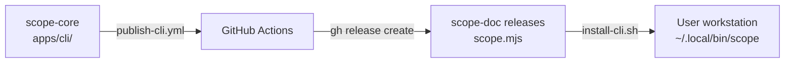

# CLI Distribution

How the Scope CLI is bundled, distributed, and updated as a standalone tool.

## Overview

The CLI is bundled into a single `.mjs` file using [esbuild](https://esbuild.github.io/), distributed via GitHub Releases on the `scope-doc` repo, and installed using the `gh` CLI. This allows users to run the CLI without checking out the monorepo.



## Building

The build script lives at `apps/cli/build.ts` (TypeScript, run via `tsx`):

```bash
pnpm build:cli        # from repo root
pnpm build            # from apps/cli/
```

This produces `apps/cli/dist/scope.mjs` (~1MB minified).

### Build-time injection

| Define | Source | Purpose |
|--------|--------|---------|
| `process.env.SCOPE_CLI_VERSION` | `apps/cli/package.json` version | Reported by `--version` |
| `process.env.SCOPE_DEFAULT_API_URL` | `SCOPE_DEFAULT_API_URL` env var or `https://msscope.azurewebsites.net` | Default API URL in bundled builds |

In dev mode (`pnpm cli` via tsx), these defines are not applied — the CLI falls back to `http://localhost:3100`.

### esbuild plugins

| Plugin | Purpose |
|--------|---------|
| `strip-shebang` | Removes the source shebang so esbuild's banner shebang is the only one |
| `shim-react-devtools` | Stubs out `react-devtools-core` (optional Ink peer dep, not installed) |

### Key design decisions

- **ESM format** with a `createRequire` polyfill banner (CJS won't work due to Ink's top-level await)
- **All dependencies bundled** — no `node_modules` needed at runtime
- **Node.js >= 20 required** at runtime

## Versioning

The **source of truth** for the CLI version is the git tag on `scope-core` using the `cli/v*` prefix (e.g. `cli/v0.2.0`). The `apps/cli/package.json` version is `0.0.0-dev` — a placeholder that CI resolves from the latest `cli/v*` tag and then bumps via `pnpm version` during the publish workflow. It is never committed back to `main`.

- Local builds produce `0.0.0-dev` — clearly indicating a dev build.
- Dev mode (`pnpm cli`) reports `0.1.0-dev`.
- Only CI-built releases carry a real version number.
- The `cli/v*` prefix allows other monorepo components to have their own tag namespaces.

## Publishing

The publish workflow (`.github/workflows/publish-cli.yml`) is triggered manually:

1. Select bump type: `patch` | `minor` | `major` (default: minor)
2. Workflow resolves the current version from the latest `cli/v*` tag
3. Bumps `apps/cli/package.json` via `pnpm version`
4. Builds the bundle with prod API URL (`vars.SCOPE_API_URL`)
5. Creates a git tag `cli/v<version>` on scope-core
6. Creates a GitHub Release on `scope-doc` with `scope.mjs`

### Required secrets/variables

| Name | Type | Purpose |
|------|------|---------|
| `SCOPE_DOC_TOKEN` | Secret | PAT with `contents:write` on scope-doc repo |
| `SCOPE_API_URL` | Variable | Production API URL injected at build time |

## Installation

Users install via the `gh` CLI (required since the repo is EMU-protected):

```bash
gh api repos/growth-ecosystems/scope-doc/contents/install-cli.sh -H "Accept: application/vnd.github.raw" | bash
```

The installer (`install-cli.sh` in scope-doc):
1. Downloads `scope.mjs` from the latest `cli/v*` release
2. Places it at `~/.local/bin/scope`
3. Makes it executable

Prerequisites: Node.js >= 20, `gh` CLI authenticated.

## Update check

After each command, the CLI performs a non-blocking check for newer versions:

- Queries the GitHub Releases API on `scope-doc` (3s timeout)
- Compares the current embedded version against the latest release tag
- If newer, prints a one-line notice with the upgrade command
- Suppressed by `SCOPE_NO_UPDATE_CHECK=1`
- Requires `GH_TOKEN` or `GITHUB_TOKEN` for private repo access (silently skips without it)

Source: `apps/cli/src/utils/update-check.ts`

## Local development vs bundled

| Aspect | Dev (`pnpm cli`) | Bundled (`scope`) |
|--------|-------------------|-------------------|
| Runner | tsx (TypeScript direct) | Node.js (single .mjs) |
| API default | `http://localhost:3100` | `https://msscope.azurewebsites.net` |
| Version | `0.1.0-dev` | Actual semver from CI bump |
| Command name | `pnpm cli` | `scope` |
| Update check | Disabled | Enabled |

## "Copy as CLI" affordance (Portal → CLI)

To reinforce CLI ⇄ Portal parity, the Portal surfaces the exact `scope` command
equivalent to a user's current view via a terminal-glyph (`>_`) button that
opens a GitHub-style modal with step-by-step instructions: (1) install the CLI,
(2) point it at the API, (3) run the generated command — each with its own copy
button, plus any parity caveats.

- **Component:** `apps/portal/src/components/CliCommand.tsx` — a `Dialog`-based
  modal mirroring GitHub's "Merging via command line" UX. Renders numbered steps
  (install one-liner from `cli-distribution.md`, `SCOPE_API_URL` pointing at the
  current origin, then the generated command) with per-block copy buttons and a
  notes callout for parity caveats.
- **Builders:** `apps/portal/src/lib/cli/buildCommand.ts` — pure functions that
  translate Portal state into a command. They only emit flags the CLI actually
  supports; anything the CLI can't express (e.g. Portal-only filters, priority,
  occurrences) is surfaced as a `note` rather than dropped. Secrets are never
  embedded. Unit-tested in `buildCommand.test.ts` (the tests double as a living
  parity check — see issue #1004).
- **Mount points (Phase 1):**
  - `RunDetail` header → `scope run get -i <id>` (reactive to the open run).
  - `RunsList` header → `scope run list` reflecting active filters/sort.
  - `RunsList` bulk bar → id-list action over the selection (`cancel` is
    variadic; `delete`/`retry`/`download` use a `for` loop for >1 id).
  - `SubmitRun` footer → `scope run submit …` built live from the form.

Subsequent phases extend the same `<CliCommand command={…} />` pattern to the
remaining resource pages (Criteria, Profiles, Task Prompts, MCP, Reports, etc.).
