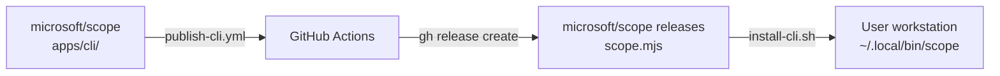

# CLI Distribution

How the Scope CLI is bundled, distributed, and updated as a standalone tool.

## Overview

The CLI is bundled into a single `.mjs` file using
[esbuild](https://esbuild.github.io/), distributed via GitHub Releases on
`microsoft/scope`, and installed using the `gh` CLI. This allows users to run
the CLI without checking out the monorepo.



## Building

The build script lives at `apps/cli/build.ts` (TypeScript, run via `tsx`):

```bash
pnpm build:cli        # from repo root
pnpm build            # from apps/cli/
```

This produces `apps/cli/dist/scope.mjs` (~1MB minified).

### Typecheck gate

esbuild strips types **without** typechecking and treats unknown identifiers as globals, so a
type error or an undefined identifier bundles cleanly and only fails at runtime. To close that gap,
the CLI's `build` script runs `tsc --noEmit` **before** esbuild:

```jsonc
// apps/cli/package.json
"build": "tsc --noEmit && tsx build.ts",
"build:tsc": "tsc --noEmit",   // standalone typecheck alias
```

Every CI/release entry point invokes the CLI `build` script: `pnpm build`
(`pnpm -r build`, used by the CI **Build** job) and `pnpm build:cli` (used by
`publish-cli.yml` and the **CLI Bundle Integration Tests** job). The CLI is
typechecked automatically wherever it is built, with no separate CI step.
`tsc` requires the `shared` package's `dist` to exist; every one of these entry
points builds `shared` first (topologically for `pnpm -r`, explicitly for
`build:cli`), which esbuild already required.

> **Motivation:** In PR #1151 an import of `normalizeUrl` was removed from `criteria.ts` while a
> call site remained, so `scope criteria export` threw `normalizeUrl is not defined` at runtime —
> yet CI stayed green because nothing typechecked the esbuild-bundled CLI. `tsc --noEmit` catches
> this class of error (`TS2304: Cannot find name 'normalizeUrl'`) and now fails the build.

`apps/cli` is the only esbuild-bundled TypeScript app; all other apps/workers/packages build with
`tsc` and are therefore already typechecked by `pnpm build`.

### Build-time injection

| Define | Source | Purpose |
|--------|--------|---------|
| `process.env.SCOPE_CLI_VERSION` | `apps/cli/package.json` version | Reported by `--version` |
| `process.env.SCOPE_DEFAULT_API_URL` | `SCOPE_DEFAULT_API_URL` env var or `https://msscope.azurewebsites.net` | Default API URL in bundled builds |

In dev mode (`pnpm cli` via tsx), these defines are not applied — the CLI falls back to `http://localhost:3100`.

### esbuild plugins

| Plugin | Purpose |
|--------|---------|
| `strip-shebang` | Removes the source shebang so esbuild's banner shebang is the only one |
| `shim-react-devtools` | Stubs out `react-devtools-core` (optional Ink peer dep, not installed) |

### Key design decisions

- **ESM format** with a `createRequire` polyfill banner (CJS won't work due to Ink's top-level await)
- **All dependencies bundled** — no `node_modules` needed at runtime
- **Node.js >= 20 required** at runtime

## Versioning

The **source of truth** for the CLI version is the git tag on `microsoft/scope`
using the `cli/v*` prefix (e.g. `cli/v0.2.0`). The `apps/cli/package.json`
version is `0.0.0-dev`, a placeholder that CI resolves from the latest
`cli/v*` tag and then bumps via `pnpm version` during the publish workflow.
It is never committed back to `main`.

- Local builds produce `0.0.0-dev` — clearly indicating a dev build.
- Dev mode (`pnpm cli`) reports `0.1.0-dev`.
- Only CI-built releases carry a real version number.
- The `cli/v*` prefix allows other monorepo components to have their own tag namespaces.

## Publishing

The publish workflow (`.github/workflows/publish-cli.yml`) is triggered manually:

1. Select bump type: `patch` | `minor` | `major` (default: minor)
2. Workflow resolves the current version from the latest `cli/v*` tag
3. Bumps `apps/cli/package.json` via `pnpm version`
4. Builds the bundle with prod API URL (`vars.SCOPE_API_URL`)
5. Creates a git tag `cli/v<version>` in the current repository
6. Creates a GitHub Release in the same repository (`github.repository`,
   `microsoft/scope` for official releases) with `scope.mjs`

Tag pushes and release creation use the workflow's built-in GitHub token
with `contents: write`. No cross-repository GitHub App token is needed.

### Required secrets/variables

| Name | Type | Purpose |
|------|------|---------|
| `SCOPE_API_URL` | Variable | Production API URL injected at build time |

## Installation

Users can fetch and run the installer with an authenticated `gh` CLI:

```bash
gh api repos/microsoft/scope/contents/website/install-cli.sh -H "Accept: application/vnd.github.raw" | bash
```

The installer (`website/install-cli.sh` in `microsoft/scope`):
1. Downloads `scope.mjs` from the latest `cli/v*` release in `microsoft/scope`
2. Places it at `~/.local/bin/scope`
3. Makes it executable

Prerequisites: Node.js >= 20, `gh` CLI authenticated.

When run directly, the installer also supports `curl` with `GH_TOKEN` or
`GITHUB_TOKEN` if `gh` is unavailable. `SCOPE_INSTALL_DIR` overrides the
destination and must be set on the `bash` side of an install pipeline.
Installation requires a published release with a `scope.mjs` asset;
tags alone are not enough.

## Update check

After each command, the CLI performs a non-blocking check for newer versions:

- Queries `microsoft/scope` releases via `gh`, falling back to the GitHub
  Releases API (2s timeout per attempt for the background check)
- Compares the current embedded version against the latest release tag
- If newer, prints a one-line notice with the upgrade command
- Suppressed by `SCOPE_NO_UPDATE_CHECK=1`
- Uses `gh` authentication or `GH_TOKEN`/`GITHUB_TOKEN` for authenticated
  API access; the REST fallback can also read public releases without a token

`scope update` uses the same repository for release discovery and asset
downloads. Its manual recovery command fetches `website/install-cli.sh`
from `microsoft/scope`.

This is the **one** place in the CLI that calls `fetch` directly rather than the
centralized `apiFetch()` wrapper (`apps/cli/src/utils/api-client.ts`): it targets the
external GitHub API with its own `token` auth and must never receive the Scope
`SCOPE_TOKEN` bearer that `apiFetch()` injects. All Scope-API requests go through
`apiFetch()` (see [auth-rbac.md](./auth-rbac.md) subtask 7).

`apiFetch()` is a thin facade over the [`ky`](https://github.com/sindresorhus/ky)
HTTP client: ky owns the underlying transport (a cached `ky.create()` instance with a
`beforeRequest` auth hook), while the facade keeps the CLI-specific concerns — URL
normalization, the single `401` re-auth retry, redacted logging, and `ApiError`
shaping. `update-check.ts` stays on raw `fetch` precisely because it must bypass that
auth hook.

For **scoped** operations the facade also appends the resolved project as a
`?projectId=` query param (see _Project scoping_ below): pass `{ projectId }` in the
`apiFetch` init and it is URL-encoded onto the query and stripped from the ky init (a
blank value is a no-op). This is the single seam through which every scoped command
inherits project scoping.

Source: `apps/cli/src/utils/update-check.ts`

## Project scoping

Every user-facing entity carries an immutable `projectId`
([Data Organization: Projects](./app-design.md#data-organization-projects)), so the
CLI must know **which** project a scoped command targets. The `scope project` group
manages the selection:

| Command | Purpose |
|---------|---------|
| `scope project list [--include-deleted]` | List projects (optionally including soft-deleted ones) |
| `scope project create --name <name> [--description <text>] [--use]` | Create a project (`--use` selects it after creating) |
| `scope project show` | Show the currently selected project |
| `scope project use <id>` | Persist the selected project to `~/.config/scope/config.json` |
| `scope project update <id> [--name <name>] [--description <text>]` | Update a project's name or description |
| `scope project delete <id>` | Soft-delete a project |
| `scope project restore <id>` | Restore a soft-deleted project |

Scoped commands (`run list`/`run submit`, and every entity `list`/`search`/`create`/
`import`) resolve the effective project with this precedence:

1. `--project <id>` flag (per-invocation override)
2. `SCOPE_PROJECT` environment variable
3. the saved selection from `scope project use <id>`

There is **no default project**. When none of these resolves, scoped commands
**fail fast**: `requireProjectId()` throws and the top-level handler in `index.ts`
prints a clean `Error: No project selected…` line and exits `1` — no request is
issued. Point reads and by-`_id` mutations (e.g. `run get -i <id>`) are globally
unique and need no project. See
[`SCOPE_PROJECT`](../../ENV_VARIABLES.md#scope_project) for the env-var reference.

## Local development vs bundled

| Aspect | Dev (`pnpm cli`) | Bundled (`scope`) |
|--------|-------------------|-------------------|
| Runner | tsx (TypeScript direct) | Node.js (single .mjs) |
| API default | `http://localhost:3100` | `https://msscope.azurewebsites.net` |
| Version | `0.1.0-dev` | Actual semver from CI bump |
| Command name | `pnpm cli` | `scope` |
| Update check | Disabled | Enabled |
