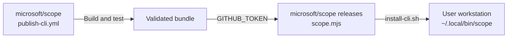

# CLI Distribution

How the Scope CLI is bundled, released, installed and updated from the public
`microsoft/scope` repository without internal repository dependencies.

## Overview

The CLI is bundled into a single `.mjs` file using [esbuild](https://esbuild.github.io/).
The manual release workflow builds and tests the bundle, then publishes it to
GitHub Releases in the same repository. The installer and updater use that public
release destination.


```mermaid
flowchart LR
    A[microsoft/scope<br/>publish-cli.yml] -->|Build and test| B[Validated bundle]
    B -->|GITHUB_TOKEN| C[microsoft/scope releases<br/>scope.mjs]
    C -->|install-cli.sh| D[User workstation<br/>~/.local/bin/scope]
```

## Building

The build script lives at `apps/cli/build.ts` (TypeScript, run via `tsx`):

```bash
pnpm build:cli        # from repo root
pnpm build            # from apps/cli/
```

This produces `apps/cli/dist/scope.mjs` (~1MB minified).

### Typecheck gate

esbuild strips types **without** typechecking and treats unknown identifiers as globals, so a
type error or an undefined identifier bundles cleanly and only fails at runtime. To close that gap,
the CLI's `build` script runs `tsc --noEmit` **before** esbuild:

```jsonc
// apps/cli/package.json
"build": "tsc --noEmit && tsx build.ts",
"build:tsc": "tsc --noEmit",   // standalone typecheck alias
```

Because the OSS CI entry points invoke the CLI `build` script — `pnpm build` (`pnpm -r build`,
used by the CI **Build** job) and `pnpm build:cli` (used by the
**CLI Bundle Integration Tests** and release jobs) — the CLI is now typechecked automatically wherever it is
built, with no separate CI step. `tsc` requires the `shared` package's `dist` to exist; every one
of these entry points builds `shared` first (topologically for `pnpm -r`, explicitly for
`build:cli`), which esbuild already required, so there is no new ordering constraint.

> **Motivation:** In PR #1151 an import of `normalizeUrl` was removed from `criteria.ts` while a
> call site remained, so `scope criteria export` threw `normalizeUrl is not defined` at runtime —
> yet CI stayed green because nothing typechecked the esbuild-bundled CLI. `tsc --noEmit` catches
> this class of error (`TS2304: Cannot find name 'normalizeUrl'`) and now fails the build.

`apps/cli` is the only esbuild-bundled TypeScript app; all other apps/workers/packages build with
`tsc` and are therefore already typechecked by `pnpm build`.

### Build-time injection

| Define | Source | Purpose |
|--------|--------|---------|
| `process.env.SCOPE_CLI_VERSION` | `apps/cli/package.json` version | Reported by `--version` |

There is no build-time or runtime default API destination. Both the bundle and
source-mode CLI require `SCOPE_API_URL` or a command's `-u/--url` option
(`--api-url` for MCP server create/update); the command-line option takes
precedence. Missing or blank URLs fail before an API request with configuration
guidance. `SCOPE_DEFAULT_API_URL` is no longer injected or read, and
`SCOPE_API_PORT` no longer derives a localhost destination. Local development
must also configure `SCOPE_API_URL` explicitly. Help, version, and CLI updates
remain available without API configuration.

### esbuild plugins

| Plugin | Purpose |
|--------|---------|
| `strip-shebang` | Removes the source shebang so esbuild's banner shebang is the only one |
| `shim-react-devtools` | Stubs out `react-devtools-core` (optional Ink peer dep, not installed) |

### Key design decisions

- **ESM format** with a `createRequire` polyfill banner (CJS won't work due to Ink's top-level await)
- **All dependencies bundled** — no `node_modules` needed at runtime
- **Pure shared runtime imports** — CLI gate constants and helpers come from
  `shared/types` and `shared/gates`, not the top-level `shared` barrel. The barrel
  also initializes server-side modules with dynamic Redis imports that esbuild
  cannot bundle. Type-only imports from `shared` are safe because they are erased.
- **Node.js >= 20 required** at runtime

### Standalone bundle validation

Build first, then exercise the actual artifact:

```bash
pnpm build:cli
node apps/cli/dist/scope.mjs --version
pnpm exec vitest run --config vitest.integration.config.ts \
  apps/cli/src/bundle.integration.test.ts \
  apps/cli/src/utils/update-check.integration.test.ts
```

Both suites copy the bundle outside the checkout and run it from that temporary
directory using `process.execPath`, empty `NODE_PATH`/`NODE_OPTIONS`, and
`--no-global-search-paths`. This prevents pnpm's Vitest launcher from making
workspace dependencies available to the child process and hiding missing bundled
modules. Coverage includes the extensionless installed `scope` executable, mock
API commands, missing-URL failures, explicit URL precedence, offline help/version,
and update checks; no release is published by these tests.

## Named connections

`scope env` stores explicit API URLs, optional Scope bearer tokens, and project
preferences in separate `environments/<name>.env` files. A separate
`active-environment` file stores only the selected name. Configuration lives in
`$XDG_CONFIG_HOME/scope` (default `~/.config/scope`) on macOS/Linux, and
`%LOCALAPPDATA%/scope` on Windows. Files contain plaintext credentials and use
owner-only permissions where supported. The legacy `config.json` (selected
project) and `update-check.json` cooldown live in the same directory; an
existing `~/.config/scope/config.json` is still read until the next
`scope project use` writes the new location.

```bash
scope env add local --url http://127.0.0.1:43127
scope env use local
scope project list
scope project use <project-id>
scope --env staging run list --project <project-id>
scope env use --clear
```

`local` is an ordinary name. The server does not edit CLI configuration and the
client does not discover a local server or infer a data-set identity.

| Priority | Connection selection |
| --- | --- |
| 1 | An explicitly supplied API URL option uses the legacy URL, auth, and project resolution for the operation, even when its value equals `SCOPE_API_URL`. |
| 2 | Root `--env <name>` selects that named connection. |
| 3 | The saved active environment is used. |
| 4 | Without either named selection, existing legacy configuration is used. |

`ScopeCommand` pins a named connection in `AsyncLocalStorage` for the full
command, including REST, SSE, polling, retries, and downloads. A named
connection without a token or project does not inherit ambient values or the
legacy project selection. Explicit `--project` still overrides its project.
For MCP create/update, `--api-url/-u` selects Scope; resource `--url` and the
MCP process's `--env` remain independent.

See [CLI usage](../../apps/cli/README.md) for `env show/set/unset/remove`.

## Versioning

The release workflow sorts valid `cli/v*` tags in `microsoft/scope` semantically
and bumps the highest version by the selected `patch`, `minor` or `major` increment.
Only when there are no matching tags does it bootstrap from the validated
`apps/cli/package.json` version's major/minor/patch components, logging that
decision and removing the development prerelease suffix before bumping. With the current
`0.0.0-dev` baseline, the default minor bump produces `0.1.0`. Invalid tags,
invalid package versions, and tag-read/fetch failures fail the workflow rather
than masquerading as an empty release history.

The version is written only in the release workspace before building; it is not
committed back to `main`. The release tag targets the exact checked-out source SHA.
Workflow-level concurrency serializes version selection through publication,
without cancelling an in-progress release.

- Local builds produce `0.0.0-dev` — clearly indicating a dev build.
- Dev mode (`pnpm cli`) reports `0.1.0-dev`.
- Release builds carry the selected version number.
- The `cli/v*` prefix allows other monorepo components to have their own tag namespaces.

## Publishing

Maintainers manually dispatch [Publish CLI](../../.github/workflows/publish-cli.yml)
on upstream `main` and select a bump type (default: minor). The read-only build
job checks out full tag history, installs locked dependencies, sets the version,
runs the typechecked bundle build and bundle integration tests, and checks the
bundle's reported version. The separate publish job downloads that exact artifact
and creates `cli/v<version>` with `scope.mjs` attached.

Only the publish job gets `contents: write`, using this repository's
`GITHUB_TOKEN`. Fork repositories and non-main refs cannot publish. No FLUX app,
internal release repository, cloud environment, OIDC or custom secret is needed.
Repository rules must permit the workflow token to create release tags; rules
are not changed by this workflow. No release exists until a maintainer explicitly
runs it successfully.

## Installation

Use the public installer with Node.js >= 20 and `curl`:

```bash
curl --fail --location https://raw.githubusercontent.com/microsoft/scope/main/install-cli.sh | bash
```

The installer selects a published, non-prerelease `cli/v*` release and downloads
`scope.mjs` with bounded retries. It verifies the reported version before
atomically replacing `~/.local/bin/scope` (`SCOPE_INSTALL_DIR` overrides the
directory). Missing releases, API/download errors and version mismatches fail
explicitly without replacing an existing installation. Installation does not
require GitHub authentication; public API rate limits still apply.

The published website's onboarding pages use this same URL.
`website/install-cli.sh` remains a compatibility entry point: it downloads
the canonical root script completely before running it, rather than
maintaining another release lookup or installation implementation.

`scope update` retains its `gh release download` implementation, so updating
in-place requires `gh` configured with GitHub authentication. Alternatively,
rerun the public installer without `gh`.

## Update check

After each command, the CLI performs a non-blocking check for newer versions:

- Checks `cli/v*` releases in `microsoft/scope` (2s per background lookup attempt)
- Compares the current embedded version against the latest release tag
- If newer, prints a one-line notice with the upgrade command
- Suppressed by `SCOPE_NO_UPDATE_CHECK=1`
- Uses `gh` when available, falling back to the public REST API; `GH_TOKEN` or
  `GITHUB_TOKEN` is optional for that fallback

This is the **one** place in the CLI that calls `fetch` directly rather than the
centralized `apiFetch()` wrapper (`apps/cli/src/utils/api-client.ts`): it targets the
external GitHub API with its own `token` auth and must never receive the Scope
`SCOPE_TOKEN` bearer that `apiFetch()` injects. All Scope-API requests go through
`apiFetch()` (see [auth-rbac.md](./auth-rbac.md) subtask 7).

`SCOPE_TOKEN` remains a raw **IdP access token**, not a Scope-issued credential.
Existing enrolled users are compatible; a new identity must intentionally call
`POST /api/v1/users/me` before ordinary authenticated commands. The enrollment
POST is no-store and must not be prefetched/polled. Interactive CLI login/keychain
support remains deferred; see [CLI authentication guidance](../../apps/cli/README.md#authentication).

`apiFetch()` is a thin facade over the [`ky`](https://github.com/sindresorhus/ky)
HTTP client: ky owns the underlying transport (a cached `ky.create()` instance with a
`beforeRequest` auth hook), while the facade keeps the CLI-specific concerns — URL
normalization, the single `401` re-auth retry, redacted logging, and `ApiError`
shaping. `update-check.ts` stays on raw `fetch` precisely because it must bypass that
auth hook.

For **scoped** operations the facade also appends the resolved project as a
`?projectId=` query param (see _Project scoping_ below): pass `{ projectId }` in the
`apiFetch` init and it is URL-encoded onto the query and stripped from the ky init (a
blank value is a no-op). This is the single seam through which every scoped command
inherits project scoping.

Source: `apps/cli/src/utils/update-check.ts`

## Project scoping

Every user-facing entity carries an immutable `projectId`
([Data Organization: Projects](./app-design.md#data-organization-projects)), so the
CLI must know **which** project a scoped command targets. The `scope project` group
manages the selection:

| Command | Purpose |
|---------|---------|
| `scope project list [--include-deleted]` | List projects (optionally including soft-deleted ones) |
| `scope project create --name <name> [--description <text>] [--use]` | Create a project (`--use` selects it after creating) |
| `scope project show` | Show the currently selected project |
| `scope project use <id>` | Persist the selected project to `config.json` in the CLI config directory (see Named connections) |
| `scope project update <id> [--name <name>] [--description <text>]` | Update a project's name or description |
| `scope project delete <id>` | Soft-delete a project |
| `scope project restore <id>` | Restore a soft-deleted project |

In legacy connection mode, scoped commands (`run list`/`run submit`, and every
entity `list`/`search`/`create`/`import`) resolve the effective project with this
precedence:

1. `--project <id>` flag (per-invocation override)
2. `SCOPE_PROJECT` environment variable
3. the saved selection from `scope project use <id>`

With a named connection, the order is instead `--project` then that
environment's `SCOPE_PROJECT`. `scope project use` updates the named file rather
than the legacy config. An explicit API URL opts back into the legacy mode.

There is **no default project**. When none of these resolves, scoped commands
**fail fast**: `requireProjectId()` throws and the top-level handler in `index.ts`
prints a clean `Error: No project selected…` line and exits `1` — no request is
issued. Point reads and by-`_id` mutations (e.g. `run get -i <id>`) are globally
unique and need no project. See
[`SCOPE_PROJECT`](../../ENV_VARIABLES.md#scope_project) for the env-var reference.

## Local development vs bundled

| Aspect | Dev (`pnpm cli`) | Bundled (`scope`) |
|--------|-------------------|-------------------|
| Runner | tsx (TypeScript direct) | Node.js (single .mjs) |
| API default | None; configure `SCOPE_API_URL` or `-u` | None; configure `SCOPE_API_URL` or `-u` |
| Version | `0.1.0-dev` | Embedded package version (`0.0.0-dev` locally) |
| Command name | `pnpm cli` | `scope` |
| Update check | Disabled | Enabled |
