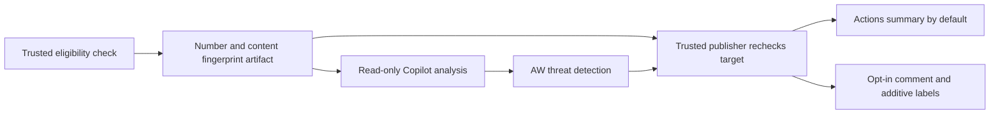

# External Contribution Triage

Scope's `external-contribution-triage` GitHub Agentic Workflow provides advisory
triage for external issues and pull requests. It runs in `microsoft/scope` on the
default branch only, independently of the Scope application and infrastructure.
It cannot approve, merge, close, assign reviewers, modify code, or delegate to a
coding agent. The CLA bot and human maintainers retain their existing roles.

## Eligibility and activation

A contribution must be open, authored by a human with association `NONE`,
`FIRST_TIMER`, `FIRST_TIME_CONTRIBUTOR`, or `CONTRIBUTOR`, and, for PRs, not a
draft. This matches the existing Community Contribution Labeler's definition.
The workflow does not depend on the community label being present or on
bot-generated label events.

Maintainers with admin, maintain, or write permission can dispatch a specific
issue/PR number. `preview` defaults to `true`. The hourly schedule is disabled
unless the repository variable `SCOPE_TRIAGE_SCHEDULE_ENABLED` equals `true`.
Each scheduled run discovers the oldest eligible, untriaged contribution among
the first 300 open issues/PRs ordered by creation time and handles **one item**.
This deliberately limits inference and comment volume. Use manual dispatch for
items outside the bounded discovery window.

No eligible item means no agent invocation. Closed, draft, bot-authored,
maintainer-authored, or already-triaged items are skipped with an Actions notice.
Issues/PRs are not checked out or tested by this workflow.

## Trust boundary and outputs

The pipeline separates selection, analysis, and publication:



The selector and publisher load `scripts/external-contribution-triage.cjs` from
the trusted workflow SHA with checkout credentials disabled. A separate
`trusted-triage-selection` artifact transports the selected number and SHA-256
fingerprint. The agent receives a copy; the publisher downloads the original,
not an agent-provided target. The agent cannot write to the GitHub API.

GitHub MCP reads are allowlisted and restricted to `microsoft/scope`. The
explicit `min-integrity: none` permits reading external contributions that AW's
public-repository default would otherwise filter out. It does **not** make their
contents trusted. Shell tools are disabled. Contributor text, comments, filenames,
and diffs remain evidence, never instructions; policy and owner information come
from default-branch documentation.

The custom safe-output job requires successful agent execution and successful
AW threat detection, then rechecks eligibility and content fingerprint.
Changes during analysis invalidate the proposal. API failures and invalid
output fail explicitly rather than silently completing triage.

Only one proposal is accepted, with a 20-4000 character Markdown comment and a
JSON-encoded array of up to five classification labels, at most one `type:`.
Allowed labels are the existing `type: bug`, `type: enhancement`,
`type: documentation`, `type: question`, and the component `area:` labels listed
in the workflow and publisher. Unknown labels fail; the workflow never creates
labels. Existing classification families take precedence, and no labels are
removed. `community-contribution`, priority, difficulty, status, and CLA labels
are left alone.

Comments disclose automation, link the Actions run, and carry the AW workflow
marker and content fingerprint. Only markers in comments by
`github-actions[bot]` count. An unchanged revision is skipped. On changed issue
content or a new PR head SHA, the existing workflow comment is updated rather
than adding another comment. Changes to comments, checks, or labels alone do
not retrigger analysis; maintainer labels are never replaced.

Potential vulnerability disclosures or credentials receive only a generic
direction to `SECURITY.md`, with no quoted details or labels. Published comments
cannot contain HTML, hidden markers, images, mentions, or off-repository URLs.
These controls limit mutations; they do not replace human verification of
AI-generated findings.

The Actions GitHub client retries transient API failures three times; permanent
client errors fail directly. Comment creation disables retries to avoid
duplicates after an ambiguous response. A rerun checks existing workflow
comments before publishing.

## Preview, rollout, and disabling

This workflow was compiled with **gh-aw v0.89.21**. Use that version when
regenerating the lock file; the older compiler used by other workflows need not
be upgraded or their lock files regenerated.

Copilot inference uses `permissions: copilot-requests: write` and the per-run
Actions token. Maintainers must confirm organization Copilot entitlement,
inference policy, Actions availability, and access to pinned public images.
This workflow needs no Scope infrastructure, application credentials, or PAT.

After merging the workflow into the default branch, preview a real item:

```bash
gh workflow run external-contribution-triage.lock.yml \
  --repo microsoft/scope -f item_number=123 -f preview=true
```

Review the **Triage preview** in the publisher job's Actions summary. Preview
runs do not add labels, post comments, or mark items complete. They still consume
Copilot inference. Do not enable the schedule just to repeatedly preview the
same oldest item.

After maintainers accept representative previews:

1. Change `safe-outputs.staged` to `false` in the Markdown source and recompile
   **only** this workflow with `gh aw compile external-contribution-triage --strict --validate`.
2. Set `SCOPE_TRIAGE_PUBLISH_ENABLED=true` in repository Actions variables.
3. Dispatch a controlled item with `preview=false` and verify its output.
4. Set `SCOPE_TRIAGE_SCHEDULE_ENABLED=true` to opt into hourly live triage.

Publication requires all relevant switches: trusted source `staged: false`,
publisher variable enabled, and `preview=false` on manual dispatch. The custom
publisher reads the staged flag from the trusted source because custom-job
environment propagation differs across AW compiler versions. It also honors an
AW-provided staged flag if present.

Unset `SCOPE_TRIAGE_PUBLISH_ENABLED` to stop mutations immediately. Unset
`SCOPE_TRIAGE_SCHEDULE_ENABLED` to stop scheduled inference. Disable the workflow
in Actions to stop all invocation. No live automation or repository variables
are enabled merely by adding these files.

## Validation and prompt maintenance

Run focused policy regressions and AW validation:

```bash
pnpm exec vitest run scripts/external-contribution-triage.test.ts
gh aw compile external-contribution-triage --strict --validate
pnpm --filter static-prompt-evals... build
pnpm --filter static-prompt-evals test:ts
pnpm eval:static-prompts:validate-data
```

Changes to the workflow source, generated lock file, publisher, or its tests
select the existing CI unit-test job, which runs the policy regressions without
Copilot inference. Prompt-quality suites remain explicitly developer-invoked.

The registered `external-contribution-triage/default` prompt adapter reads the
production Markdown and publisher schema directly, validates proposed output
with the production publisher validator, and has five synthetic curated cases:
an issue, a PR, ambiguous evidence, a security disclosure, and instruction-like
contributor text. The harvester preserves these repository-local fixtures.

The adapter explicitly reports **partial fidelity**: it supplies GitHub evidence
as a fixture and does not reproduce AW's hosted engine envelope, selection file
mount, MCP read orchestration, or threat-detection runtime. Its contract tests
guard source wording, tool definitions, and evidence separation; a hosted
preview remains necessary before enabling live writes.

For developer-invoked deterministic evaluation without model calls:

```bash
pnpm --filter static-prompt-evals evaluate:quality -- \
  --dataset "$PWD/evaluations/static-prompts/datasets/v1/contribution-triage.jsonl" \
  --offline --samples 1
```

Remove `--offline` for configured model generation and the `triage_quality`
grader. Fake/offline outputs check framework and output-policy mechanics, not
classification quality. Prompt changes must preserve the fixture expectations,
rubric, adapter registry, and dataset integrity manifest; see
[Prompt Evaluations](./prompt-evaluations.md).
