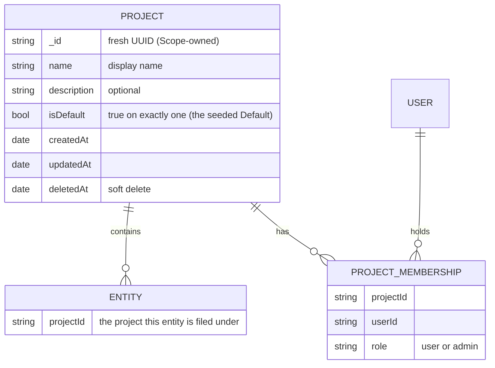
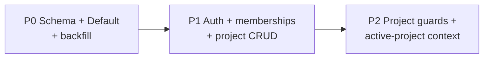

# Data Organization: Projects

> **Status:** Proposed — design proposal. Revised: 2026-09-18.

Scope currently stores all user-facing data in one flat, global namespace. This document
proposes a first-class way to **organize** that data **within a single Kubernetes cluster** by
introducing **the project** — a named container data is filed under.

This document defines the **data-organization layer**: the `projects` container, immutable
`projectId`, and project-based filing, filtering, and grouping. Authorization is defined in
[auth-rbac.md](auth-rbac.md): membership in a project is the access boundary for its data.

> **Delivery relationship.** The project container and `projectId` migration can land before
> authorization enforcement, but project-aware API and UI behavior must ship with the membership
> rules in auth-rbac. A `projectId` never grants access by itself.

---

## Problem

All Scope data — runs (`requests`), profiles, criteria, prompts, personas, scenarios,
codebases, reports, insights, MCP servers — lives in **one shared, flat space** with no
organizing container. This is a **pressing, present-day pain** — not a future one — already
surfacing in user reports:

- Users can't find their own work (scope-core#677 _"How can I find back 'my' runs?"_,
  scope-core#766 _"Improve UX when listing all runs"_).
- There is no way to say _"these runs, profiles, and criteria belong together"_ (a scenario,
  an experiment, a team's workstream).
- Everything shares one namespace, so listings mix unrelated work together and there is no
  durable grouping to file work under.

auth-rbac.md governs **who can see and edit** each item through project membership. This document
provides the durable container under which that membership applies, as well as the filing,
filtering, and grouping behavior.

**Findability and access are separate concerns.** `projectId` makes a project's work easy to file,
filter, and group; auth-rbac independently determines whether the signed-in caller may use that
project. The data migration can be delivered first, but project-aware user experiences require both
layers.

### Goals

1. A **first-class organizing container** ("project") that gives data a durable home so related
   runs, profiles, criteria, etc. can be **filed together** and **filtered/grouped** as a unit,
   instead of floating in one flat namespace.
2. **Additive data migration**: existing data is filed into a Default project without attempting
   to infer a document owner. Access is granted explicitly by project membership.
3. **Clean composition with access control**: provide the immutable `projectId` that auth-rbac
   uses to resolve a caller's project role.

### Non-goals

- **Authorization policy details.** [auth-rbac.md](auth-rbac.md) defines platform and project
  roles, the `project_memberships` collection, explicit readonly shares, permission resolution, and
  enforcement. This document does not duplicate that policy.
- **Cross-cutting tags/labels** — a companion organizing layer, specified in
  [data-tags.md](data-tags.md), not here. This doc covers only the project container.
- **Moving / re-filing entities between projects** — `projectId` is assigned once at creation and
  stays fixed; changing an entity's project is out of scope for this design.
- **Multi-cluster / cross-cluster** organization — explicitly out of scope. This is about
  organizing data *within a single cluster*.
- **Higher-level containers above the project** (a **workspace** grouping projects, an
  **organization** grouping workspaces) — out of scope. The project is the **single level of
  structure** here; such higher tiers are a natural additive future extension, discussed in
  [Alternatives considered](#alternatives-considered).
- **Code changes** — this document is a design proposal only. Schema/migration/route work is
  sequenced in [Phased rollout](#phased-rollout) for follow-up PRs.
- A new billing, quota, tenant, or organization boundary. Projects are Scope's project-data access
  boundary; they are not an external tenant or billing isolation primitive.

---

## Current state

Every user-facing collection is global and flat. Relevant collections today (see
[db.md](db.md)):

| Collection | Entity | Kind |
|------------|--------|------|
| `requests` | Runs (the core entity) | Durable |
| `profiles` / `profile-versions` | Run configuration profiles | Durable |
| `criteria` | Evaluation criteria (a DAG) | Durable |
| `task-prompts` | Content-addressed prompts (`task` / `agents.md`) | Content-addressed (immutable) |
| `mcp-servers` | MCP server configs | Durable |
| `codebases` / `codebase-revisions` | Source snapshots | Durable; revision `_id` is a fresh UUID (**not** content-addressed) |
| `reports` / `insights` | Judge output, derived from a run | Derived (follows parent) |
| `prompt-features` | Feature definitions (user-slug id); extractions embedded on `task-prompts` | Durable |
| `skills` / `skill-revisions` | Agent skills | Durable (skill) / deterministic derived-key id (revision) |

auth-rbac.md defines `projectId` as the authorization boundary for all project-scoped documents.
This document defines how that field is stored and how clients select their active project. The
documents do not carry `ownerId`, visibility, or generic sharing fields.

### Relationship to RBAC

| Layer | Responsibility | Integration |
|-------|----------------|-------------|
| **Organization** (this document) | `projects`, immutable `projectId`, explicit project selection, filing, filtering, and grouping | Supplies the target project for every project-scoped request. |
| **Authorization** ([auth-rbac.md](auth-rbac.md)) | User identity, platform roles, project memberships, explicit readonly shares, and route guards | Confirms the caller's role for that exact `projectId` before data is read or changed. |

The required `?projectId=` query parameter chooses a root resource's project; it never proves a
right to use that project. API routes validate membership before applying the project filter or
writing a new document.

---

## Recommended primitive

**The single organizing primitive is the Project** — a named container that data is *filed under*
and filtered/grouped by. It supplies the stable boundary that auth-rbac uses to authorize
collaboration and access.

| Primitive | Job | First lands | Cardinality |
|-----------|-----|-------------|-------------|
| **Project** | Primary **organizing container**; the thing data is *filed under* and filtered/grouped by | **P1** | Each entity has **one** `projectId` |

Cross-cutting, many-to-many labelling (a run belonging to several efforts) is deliberately **not**
folded into the project — that keeps the singular `projectId` a scalar rather than an array (see
[Alternatives considered](#alternatives-considered)).

> **Groups / teams are deliberately not a primitive here.** A project is the collaborative
> access boundary; [auth-rbac.md](auth-rbac.md) defines the account-to-project membership roles
> that govern it. This design does not introduce an additional group hierarchy.

### Why the Project

- **Project gives every entity a durable home.** A single `projectId` makes "show me only this
  workstream" a one-clause filter and is the key used by the RBAC layer to resolve membership.
- **Single `projectId` keeps everything cheap.** The reserved field is singular, so filing is one
  scalar write and filtering is one `{ projectId: { $in: […] } }` clause — no per-entity fan-out,
  no array-membership index gymnastics on Cosmos DB. It also hands the access layer a single scalar
  to key off later, should it choose to.
- **Organization and access have clear boundaries.** This document owns the container and field;
  auth-rbac owns membership and route authorization. The common `projectId` makes the two
  layers compose without document-level ownership or visibility fields.

Trade-offs and the rejected shapes (many-to-many projects, nested projects) are in
[Alternatives considered](#alternatives-considered).

---

## Data model

> The `projects` collection carries no ownership field and project-scoped entities carry no
> `ownerId` or visibility field. [auth-rbac.md](auth-rbac.md) adds the separate
> `project_memberships` collection, whose unique `(projectId, userId)` records grant `user` or
> `admin` access to the project's data.

### New collection: `projects`

Mirrors the first-class-entity pattern established by `codebases` (fresh-UUID `_id`, timestamps,
soft-delete `deletedAt`) — minus any ownership field:

| Field | Type | Notes |
|-------|------|-------|
| `_id` | `string` | Fresh Scope-owned UUID (no special-cased ids) |
| `name` | `string` | Display name |
| `isDefault?` | `boolean` | `true` on exactly one project — the seeded **Default** backfill target; **absent** on all others (keeps the sparse index a single entry) |
| `description?` | `string` | |
| `createdAt` / `updatedAt` / `deletedAt?` | `Date` | Soft-delete like `codebases` |

The organization migration introduces `projects`; the RBAC migration introduces
`project_memberships` as its separate authorization concern.

### Fields added to existing entities

Every [project-scoped](#which-entities-are-project-scoped) entity gains a single field:

- `projectId?: string` — the project this entity is **filed under** (exactly one). Missing ⇒
  **coalesces to the Default project** (see [Migration](#migration)); after backfill every
  project-scoped doc carries one, so none is ever project-less.

For the immutable [deterministically-keyed](#deterministically-keyed-entities-per-project-copies)
copies, `projectId` comes with an identity change (below).

This design adds no other fields to existing project-scoped documents. Authorization is resolved
from the separate membership collection; it adds neither document ownership nor visibility.

### Which entities are project-scoped

The scoping boundary is deliberately **broad**: nearly all user-facing data is project-scoped, and
only platform infrastructure stays global.

- **Project-scoped, single-copy** (carry `projectId`): runs (`requests`), profiles, criteria,
  personas, scenarios, MCP servers, codebases, reports, insights, **skills**, **extensions**,
  **report templates**, **prompt features** (a per-project catalog keyed by a user-chosen slug — the
  slug becomes unique *within* a project, not globally), and **codebase revisions** (a fresh-UUID
  child that **inherits `projectId` from its parent codebase**). Prompt-feature *extractions* are not
  a standalone entity — they are embedded on the task prompt (`TaskPromptDocument.features`) and
  follow it.
- **Project-scoped, deterministically-keyed** (carry `projectId`): **`task-prompts` and
  `skill-revisions` only.** Their `_id` is a deterministic UUIDv5 (a pure function of the entity, so
  project-independent), meaning the same logical entity computed in two projects collides; scoping
  them means **each project keeps its own copy**. Full mechanics in
  [Deterministically-keyed entities](#deterministically-keyed-entities-per-project-copies).
- **Global platform resources** (not project-scoped): **agents, models, feature flags, and
  secrets**. They are platform-admin-only for every method, as defined in
  [auth-rbac.md](auth-rbac.md).

### Deterministically-keyed entities: per-project copies

Two entities have a **deterministic `_id`** — a pure function of the entity rather than a random
UUID — so today one physical document is shared by every run that references it, deduplicating
cluster-wide:

- **`task-prompts` — content-addressed.** `_id = uuidv5(trimmed prompt text)`: the whole content is
  the key, so identical prompts collapse to one document.
- **`skill-revisions` — derived reference key.** `_id = uuidv5("{source}/{skillName}@{commitHash}")`:
  keyed by the version-pinned *ref* (the commit hash pins the version), **not** by hashing the
  revision's own bytes — so it is not content-addressed in the strict sense, but is equally
  deterministic.

In both cases the id is **project-independent**, so the same logical entity computed in two projects
would collide. (`codebase-revisions` are **not** deterministically keyed — their `_id` is a fresh
UUID keyed by `{codebaseId, revisionNumber}` — and `prompt-features` use a human-chosen slug; both
are ordinary [single-copy](#which-entities-are-project-scoped) project-scoped data, so the rest of
this section does not apply to them.)

Making them project-scoped means **each project keeps its own copy** — the same task prompt used in
two projects becomes two documents. This is the deliberate cost of strict project isolation (chosen
over a shared doc spanning multiple projects; see [Alternatives](#alternatives-considered)):

- **Identity becomes per-project.** `_id` can no longer be the bare deterministic UUIDv5 (it would
  collide across projects). Instead each copy takes a fresh `_id` with a **unique index on
  `{ projectId, keyId }`**, where `keyId` is the existing deterministic value (the content-addressed
  task-prompt id, or the skill-revision ref), retained as a field for equality/lookup **within** a
  project. *(A composite `_id` of `{projectId}:{keyId}` is an equivalent alternative.)*
- **Dedup narrows from cluster-wide to per-project.** Identical content is still deduplicated for
  runs **inside the same project**, but no longer across projects — write amplification grows with
  cross-project reuse of the same prompt text or skill revision.
- **Filed directly, not via a parent.** Each copy carries its own `projectId`, so these entities are
  filed and filtered like any other project-scoped data; the previous "reach through the parent run"
  indirection is gone.
- **Migration stays trivial.** At backfill time all data is in the single Default project, so each
  existing shared doc maps to exactly one project (Default) — no forking. Per-project copies only
  begin to diverge **after** migration, as the same content is reused inside newly created projects.

### Shape decisions

- **One project per entity — including copies.** An entity is filed under a single project;
  cross-cutting grouping is a separate concern, not multi-project
  filing. Deterministically-keyed entities preserve this invariant by keeping a
  [per-project copy](#deterministically-keyed-entities-per-project-copies) rather than one shared doc.
  (Multi-project filing is an [alternative considered](#alternatives-considered).)
- **Flat projects.** Nested/hierarchical projects (org → team → project) are deferred; a flat list
  covers the near-term need without path-scoping cost.
- **Membership is external to the project document.** `project_memberships` records the `user` or
  `admin` project role. Projects and their contents remain free of owner and visibility fields.

---

## Organization semantics

Projects are both the organizational container and the **authorization boundary** for
project-scoped data. This document defines filing and active-project selection; auth-rbac checks
membership before a caller can use the selected project.

- **`projectId` files an entity under exactly one project.** It is set at creation from the
  caller's **active project** (below) and stays fixed — moving an entity between projects is
  [out of scope](#non-goals). Auth-rbac uses the field to identify which membership grants access.
- **The active-project context is always set and acts as a narrowing filter.** A caller always
  operates inside exactly one project; that project selects an `AND { projectId }` clause after
  the API verifies membership. It does not grant access by itself. There is no "all projects" /
  cleared state; to reach other data a caller switches between projects they may access.
- **Only platform infra is global.** `agents` and `models` are the sole global catalog — they have
  no `projectId` and appear the same in every project. Everything else (including the
  deterministically-keyed [per-project copies](#deterministically-keyed-entities-per-project-copies))
  carries a `projectId` and filters accordingly.

The platform administrator may list all project metadata and administer memberships, but cannot
access a project's content without membership. Auth-rbac also defines the narrow explicit
readonly-share exception for one run or report and one recipient bound by immutable IdP
tenant/subject.

---

## Relationship to access control (auth-rbac)

**This document defines no authorization policy.** [auth-rbac.md](auth-rbac.md) owns the
platform-admin role, project `user`/`admin` roles, membership routes, readonly shares, and route
guards. The integration contract is:

- Every project-scoped route resolves an immutable `projectId` from the selected project, route
  path, validated create body, or parent entity.
- The guard loads the caller's `(projectId, userId)` membership before list/read/write/delete
  access. A project user can mutate user-editable resources and read the shared catalogs needed to
  compose runs; a project admin can manage all project resources and project RBAC.
- A platform admin may list all projects, delete any project, and manage RBAC on any project, but
  has no implicit project-content membership.
- The only membership exception is an explicit, read-only share of one run or report with one
  immutable IdP subject. The share does not permit project discovery, lists, writes, or any other
  resource, and neither a resource URL nor the current holder of an email/UPN alias gains access.

`projectId` is therefore a required authorization input, but never an authorization grant by
itself.

---

## Migration

**We create a Default project and file existing data into it — "unset" never means "global / no
project."** Every project-scoped entity is assigned to a **Default project** so today's listings
keep working. This mirrors the *shape* of how auth-rbac backfills legacy data, but requires none of
its fields.

- **Create + migrate (canonical).** Insert one **"Default"** project like any other (a fresh
  Scope-owned `_id`, `isDefault: true`), **capture its generated `_id`**, then **backfill that
  `_id`** as `projectId` onto all existing docs in the project-scoped collections. No id is
  special-cased — the Default is an ordinary project that happens to be seeded first and flagged
  `isDefault`. After it runs, every project-scoped entity physically carries a `projectId` — there is no null/global bucket. The
  Default project has no owner; its memberships are added explicitly through auth-rbac before
  anyone receives access to its contents.
- **Missing project IDs fail closed after migration.** The temporary pre-backfill compatibility
  path may resolve a missing `projectId` to the Default project only while the migration is in
  progress. After completion, every project-scoped document must have a `projectId`; routes reject
  a missing value rather than silently treating it as globally accessible or falling back to
  Default.
- **Authorization rollout.** The project migration itself does not infer legacy access. Before
  project guards are enforced, a platform admin explicitly establishes Default-project
  memberships. Once enforcement starts, only those memberships or an explicit readonly share
  resolved and persisted against the recipient's immutable IdP subject expose legacy content.
- **Going forward**, platform admins create projects and become their project admin atomically.
  New data lands only in an active project for which the caller has the required role.

Migration mechanics (`mongo-migrate-ts`, CosmosDB-RU constraints — see
[db-migrations.md](db-migrations.md)):

- A numbered migration creates the `projects` collection, inserts the Default project, and `$set`s
  `projectId` on scoped collections in **idempotent batches** (Cosmos RU-friendly; re-runnable).
  `down()` is log-only, per repo convention.
- Indexes (single-field + sparse + 2-field-for-sort, per the [CosmosDB skill](../../.agents/skills/cosmosdb-mongodb/SKILL.md) and app-design.md):

| Collection | Index | Purpose |
|------------|-------|---------|
| `projects` | `{ isDefault: 1 }` sparse | Resolve the Default project (one cached lookup); exactly one doc carries it (seed migration + app invariant) |
| `projects` | `{ createdAt: -1 }`, `{ deletedAt: 1 }` | Newest-first list, active (non-deleted) filter |
| scoped entities (e.g. `requests`) | `{ projectId: 1 }` sparse | Project authorization/filter |
| scoped entities | `{ projectId: 1, _id: 1 }` | Project-scoped newest-first / cursor sort |
| `project_memberships` | `{ projectId: 1, userId: 1 }` unique | Membership lookup and one role per account/project |
| `project_memberships` | `{ userId: 1, projectId: 1 }` | List the caller's accessible projects |

---

## Surfaces

Projects appear consistently in Portal, API, and CLI. Per the repo's **CLI↔Portal parity**
rule, every project capability in the Portal is also in the CLI.

### API

- **Project operations:** only a platform admin may create a project; its creator becomes the
  project's admin. Members can list their projects; platform admins can list all project metadata.
  Project admins can update project metadata; only platform admins can soft-delete a project.
- **Membership operations:** `GET /api/v1/projects/:projectId/members` and
  the member-invitation plus `PUT`/`DELETE /api/v1/projects/:projectId/members/:userId` routes are
  authorized for a project admin of that project or a platform admin. They are defined in
  [auth-rbac.md](auth-rbac.md).
- **How the project reaches the API — an explicit query parameter.** Root project-scoped
  operations carry `?projectId=<id>`. It makes the target visible in every request and follows the
  [by-id invariant](app-design.md#never-a-global-slug-only-action-on-a-project-scoped-entity-the-by-id-invariant).
  Child resources derive their project from their parent. A run/report readonly share remains an
  exact-resource grant to one immutable IdP subject as defined in
  [auth-rbac.md](auth-rbac.md); it is not a project-context override, and neither the resource URL
  nor a mutable email/UPN alias is a capability.
- **Not a URL path segment.** We deliberately do **not** nest routes under `/api/v1/projects/:id/…`.
  That would rewrite **every** existing route (a breaking change, contradicting the
  [non-breaking goal](#impact-on-existing-endpoints)) and conflate *context* with *identity* — an
  entity's `_id` is globally unique, so the project is scoping context, not part of its address.
  Point lookups stay at `…/:id`, but the API resolves the entity's `projectId` and enforces its
  project membership before returning it.
- **Resolution**: the header resolves through the
  [project-selection contract](#project-selection) to one selected project; the API verifies
  membership before list handlers apply its `projectId` filter.
- **Runs list integration**: `projectId` becomes a categorical **filter** + **facet** dimension and
  a new `groupBy: "project"` value, composing with the existing server-side
  filter/facet/group/cursor pipeline (app-design.md "Runs List Query API") — no new query engine,
  just another dimension.
- Entities accept `projectId` on **create only** (immutable thereafter — moving is
  [out of scope](#non-goals)); responses include it so clients can show the project and offer
  filtering.

### Impact on existing endpoints

**Routes remain stable, but access changes when project authorization is enabled.** P0 adds only
the schema field and backfill. Once P2 project guards land, callers must select a project they
belong to; an unchanged client cannot rely on falling back to the Default project.

| Endpoint class | Change | Backward compatibility |
|----------------|--------|------------------------|
| **List** — `GET /api/v1/{requests, profiles, criteria, codebases, reports, insights, mcp-servers, skills, extensions, task-prompts, prompt-features, report-templates}` | AND-filter by `?projectId=` after membership is verified | The caller must select a project they may access; results never cross project boundaries. |
| **Runs list** — `GET /api/v1/requests` | `projectId` added as a **filter + facet + `groupBy:"project"`** value in the existing filter/facet/group/cursor pipeline (#1138) — no new query engine | The selected project is mandatory after authorization is enabled. |
| **Create** — `POST /api/v1/…` | Accepts a target `projectId` or uses the active project | The API validates the caller's required project role before creating the document. |
| **Point read/update/delete** — `GET/PATCH/DELETE /api/v1/…/:id` | Routes remain stable; the API resolves the entity's project and checks membership before access. | `projectId` is immutable, so update/delete never re-file. A readonly share resolved to the recipient's immutable IdP subject is the narrow exception for one run or report. |
| **Global catalog** — `GET /api/v1/agents`, `GET /api/v1/models` | **No change** — stay global platform infrastructure | Fully unaffected. |
| **Infra / config** — `system`, `feature-flags`, `secrets` | **No change** — not user content, outside this layer | Fully unaffected. |

Two cross-cutting notes: (1) responses across project-scoped resources gain an additive `projectId`
field and the OpenAPI spec is regenerated (field + required `?projectId=` query parameter **added**;
nothing removed), so schema-strict clients keep validating. (2) The one **identity** change is for the two
[deterministically-keyed entities](#deterministically-keyed-entities-per-project-copies)
(`task-prompts`, `skill-revisions`): their `_id` moves from a bare deterministic id to a per-project
key, so an
internal lookup by that content id becomes project-scoped — called out in that section.

### Portal

- A **project switcher** in the app shell (top nav) sets and persists the active project; exactly
  one is **always** selected ([never a cleared "All projects" state](#organization-semantics)). Runs
  and catalog lists scope to it, shown as a context indicator (not a removable filter chip); other
  filters remain removable.
- Project management: a platform admin can create, list, and delete projects; a project admin can
  rename, describe, and manage members of their project.
- Project shown on list rows and detail pages.

### CLI

- `scope project list | create | use <id> | show`.
- Active project stored in CLI config (like `SCOPE_API_URL`); `--project <id>` per-command
  override; `SCOPE_PROJECT` env var. The client serializes that selection as `?projectId=` on
  every root project-scoped request. `scope run list` gains `--project` alongside its existing
  filters, keeping parity.

### Project selection

Portal and CLI may persist an active project for convenience, but every root project-scoped API
call sends its selection explicitly as `?projectId=`. The caller must have a membership in that
project. The Default project is a migration target, not an implicit fallback for a caller without
a selected, authorized project.

---

## Phased rollout

The project schema and Default-project backfill can land before access enforcement. Project CRUD,
active-project context, and all project-scoped routes must then ship with the membership rules in
[auth-rbac.md](auth-rbac.md); they are not independently deployable as unrestricted project access.

- **P0 — Schema + Default + backfill.** Add `projectId`; create `projects`; create the Default
  project; backfill scoped documents. No access is inferred from old documents.
- **P1 — Identity, memberships, and project APIs.** Add authenticated user records and
  `project_memberships`; let platform admins create projects and atomically become their project
  admin; add immutable-subject-bound project membership and pending-invitation management.
- **P2 — Project guards + context.** Require membership before applying project filters or serving
  point reads; add active-project context, Runs `projectId` filter/facet/`groupBy:"project"`, Portal
  switcher, and CLI project commands. Project and platform role semantics come from auth-rbac.

---

## Open questions

The questions that belong to this organization layer are:

- **Backfill target.** One global **Default** project for all legacy data is recommended. A platform
  administrator explicitly assigns project memberships before it becomes accessible; no historical
  user ownership is inferred.
- **Global platform resources.** Agents, models, feature flags, and secrets remain global and are
  platform-admin-only. A future project-private agent or model endpoint would require a separate
  design.
- **Deterministic-id dedup cost.** Per-project copies of `task-prompts` and `skill-revisions` trade
  cluster-wide dedup for isolation; confirm the storage/write amplification is acceptable, or whether
  high-reuse content warrants a shared-with-`projectIds` exception. (Large codebase snapshots are
  **not** affected — `codebase-revisions` are single-project children of their codebase, never copied.)

---

## Alternatives considered

- **Tags as the only primitive (no container).** Cheapest to build, but a flat tag namespace gives
  no durable "home" to file work under and no default scope for new data — every list still mixes
  everything together until you remember to filter. Tags are kept as a **companion** cross-cutting
  layer ([data-tags.md](data-tags.md)), not the primary container.
- **Many-to-many project filing per entity.** More flexible ("this run is in three projects"), but
  turns the singular `projectId` into an array, complicates every filter and index, and blurs
  "which project this belongs to." Rejected; the cross-cutting need is met by
  [tags](data-tags.md) at far lower cost.
- **Shared deduplicated docs with a `projectIds` set.** Instead of copying the deterministically-keyed
  entities (`task-prompts`, `skill-revisions`) per project, keep **one** deduplicated document carrying the
  *set* of projects that reference it. Preserves cluster-wide dedup and storage efficiency, but a
  single physical doc then spans multiple projects — breaking strict project isolation and the "one
  project per entity" invariant, and muddying project deletion (when may the shared doc be
  reclaimed?). Rejected in favour of **per-project copies** for clean isolation (see
  [Deterministically-keyed entities](#deterministically-keyed-entities-per-project-copies)).
- **Nested / hierarchical projects.** Appealing for org → team → project, but adds path-scoping
  complexity and Cosmos query cost. Deferred — a flat list covers the near-term need, and hierarchy
  can be added later without re-modelling (a project could gain an optional `parentId`).
- **Higher-level containers (workspace → organization).** A tier *above* the project — a
  **workspace** grouping projects, an **organization** grouping workspaces — is a natural future
  extension, but out of scope here. Unlike nesting projects (above), it introduces **new container
  collections above `projects`** rather than making projects self-similar. It stays purely additive:
  projects gain an optional `workspaceId`, workspaces an `organizationId`, while entities keep
  carrying a single `projectId` unchanged. Starting with one level (the project) keeps the first
  cut small; the higher tiers are layered on only when a concrete need appears.
- **Reuse `submissionId` / the Experiment grouping (scope-project#54).** Those are
  **batch/reporting** groupings, not a durable container. Projects generalize *above* them: a
  submission or experiment lives *within* a project.

---

## References

- [data-tags.md](data-tags.md) — the **companion** cross-cutting **tags** layer that composes on
  top of the project filter (same organization, not access; ships additively after projects).
- [auth-rbac.md](auth-rbac.md) — the access-control layer: platform administration, project
  membership roles, immutable-subject-bound run/report shares, and project-scoped route guards.
- [app-design.md](app-design.md) — Runs list query API (filters/facets/grouping/cursors) that
  the `projectId` dimension plugs into.
- [codebases.md](codebases.md) — the first-class-entity pattern (fresh-UUID `_id`, soft-delete,
  creator) that `projects` mirrors.
- [db.md](db.md) / [db-migrations.md](db-migrations.md) — collections, index strategy, and the
  migration framework.
- Tracking issue: growth-ecosystems/scope-project#142. Motivating pain: scope-core#677,
  scope-core#766. Related: scope-project#54 (Experiment), #55 (per-user isolation), #56
  (RBAC in Portal), #95 (shared run URLs).
