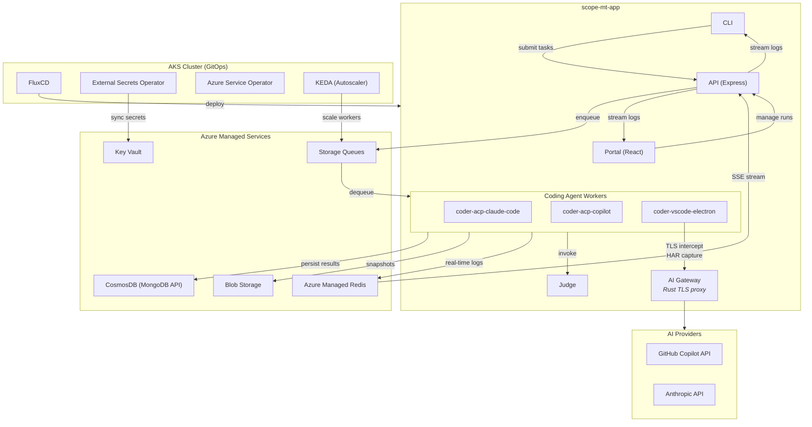

# System Overview

Scope is a platform for benchmarking AI coding agents. It orchestrates multiple coding agents (Claude Code, GitHub Copilot, VS Code Web), sends them tasks through configurable scenarios and personas, judges the quality of their output, and tracks everything with real-time logging.

The entire stack — application code, Azure infrastructure, and Kubernetes GitOps manifests — lives in a single monorepo.

## Architecture

## Repository Structure

| Folder | Purpose | Tech Stack |
|--------|---------|------------|
| `scope-mt-app/` | Application code: API, CLI, portal, judge, coding agent workers | TypeScript, pnpm workspaces, Docker |
| `scope-mt-infra/` | Azure infrastructure provisioned via `azd up` | Bicep, Azure Developer CLI |
| `docs/` | Central documentation hub (this folder) | Markdown |

## Application Packages

| Package | Description |
|---------|-------------|
| `api` | Express.js REST API — routes requests to workers, streams logs via SSE |
| `cli` | CLI tool for submitting tasks, streaming logs, and running benchmarks |
| `portal` | React web UI for managing runs, viewing insights, and configuring criteria |
| `judge` | Evaluates coding agent output against scenario criteria |
| `shared` | Shared types and utilities |
| `workers/coder-acp-claude-code` | Claude Code agent via Agent Client Protocol (ACP) |
| `workers/coder-acp-copilot` | GitHub Copilot agent via Agent Client Protocol (ACP) |
| `gateway` | AI Gateway — shared Rust TLS-intercepting proxy with plugin architecture (HAR capture, future: token refresh, rate limiting) |

## Data Flow

### User authentication

Configured human callers send the **IdP access token unchanged** on each API call.
The API verifies its signature/claims before resolving an active Scope UUID and role
through Redis (hit: no Mongo) or an exact `(idp, tid, oid)` Mongo lookup (miss/outage).
Only `POST /api/v1/users/me` performs JIT/profile/`lastLoginAt`/bootstrap writes.
Every GET is read-only. Enrollment responses use no-store, and clients must not 
prefetch or poll the POST.

The Portal calls that POST first after an IdP callback; cached-account
reloads use plain `/users/me`. All application queries wait for the handshake, and
the API response—not MSAL claims—owns the Scope identity/role. Enrolled CLI bearers
remain compatible; new identities must explicitly enroll. Full RBAC/ownership,
interactive CLI login, and Scope internal-token plans are deferred; existing public
and anonymous rollout behavior is preserved.

The access cache has a fixed/non-sliding TTL (`AUTH_USER_CACHE_TTL_SECONDS`, default
300 seconds), is namespaced by the Mongo database and identity tuple, and never
stores tokens. DB-only role/disable changes can remain stale until expiry; Redis
failure falls back to Mongo. See [Authentication & RBAC](auth-rbac.md) for the method
walkthrough, failures, cache isolation, and implemented/deferred boundary.

### Benchmark execution

1. **Submit** — A user submits a task via CLI or Portal, selecting a worker, model, criteria, and optionally an agent version. The API validates the selection (model must be in `supportedModels`, version must be active, at least one criterion required), resolves the agent version's queue, creates a run record in CosmosDB, and enqueues a message.
2. **Execute** — KEDA scales the target worker pod from 0→N. The worker dequeues the message, spins up the coding agent, and executes the task. The worker stamps `workerVersion` (exact build identity) on the run.
3. **Stream** — Workers publish real-time log events to Redis Pub/Sub. The API relays these as SSE streams to the CLI/Portal.
4. **Judge** — After the agent completes, the worker invokes the Judge to evaluate output against criteria. Results (pass/fail per criterion, scores) are persisted to CosmosDB.
5. **Snapshot** — Each iteration's workspace is snapshotted to Blob Storage for later inspection.

> A run may execute as a sequence of **gates** (`Select → Build → Test → Run →
> Deploy`), each with its own prompt, criteria subset, and iteration budget,
> running stop-on-failure against the same workspace. Requests without an explicit
> gate configuration run as a single Select gate (identical to before). See the
> [gates design doc](../design/gates.md) and
> [app-design.md](app-design.md#gates--multi-phase-evaluation-pipeline).

## Benchmarking Configuration

| Config Folder | Description |
|---------------|-------------|
| `config/scenarios/` | Task definitions with acceptance criteria |
| `config/personas/` | Simulated user profiles (personality, experience level, verbosity) |
| `config/criteria/` | Reusable evaluation criteria with DAG dependencies |
| `config/traits.yaml` | Trait definitions for persona composition |

## Infrastructure Layers

| Layer | Location | Managed By | What |
|-------|----------|------------|------|
| **Azure Resources** | `scope-mt-infra/infra/bicep/` | `azd up` | AKS, VNet, Key Vault, CosmosDB, Redis, Storage, Private Endpoints, Managed Identities |

All Azure services are deployed behind **Private Endpoints** within the AKS VNet.

For the detailed 5-layer architecture model, see [Architecture Layers](architecture-layers.md).
