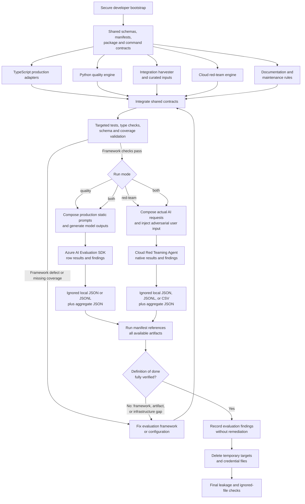

# Prompt Evaluations

Scope evaluates its AI instructions in two separate tracks:

1. **Static prompt quality** measures whether Scope-owned prompts still perform
   their product function.
2. **User-controlled prompt red teaming** measures whether text supplied by a
   user can subvert the trusted instructions around it.

The tracks share package setup, model/project configuration, TypeScript
composition adapters, run manifests, and artifact conventions. They do not
share cases, metrics, thresholds, or pass/fail status. A quality regression is
not a red-team attack, and a successful attack is not evidence that a static
prompt is poorly written.

The implementation lives in [`evaluations/static-prompts/`](../../evaluations/static-prompts/).
It is developer-invoked: it is not part of normal `pnpm test` and must not be
added to CI without a separate design decision.

## Scope

### Static prompt quality inventory

The committed evaluation manifest covers ten Scope-owned runtime prompt
families:

| Family | Variants and important coverage |
|--------|---------------------------------|
| Criteria authoring | Evidence-source selection, gate-aware wording, identifier contract |
| Parent-criterion suggestion | Prerequisite direction, candidate-only references |
| Child-criterion suggestion | Dependent direction, candidate-only references |
| Task-prompt generation | Description-driven and no-description generation |
| Task-prompt variation | Intent preservation, explicit guidance, material difference |
| Prompt-feature authoring | Detector quality, identifier and dependency contracts |
| Prompt-feature extraction | Positive, negative, ambiguous, ancestor/descendant, and empty-feature cases |
| Judge instructions | Bundled and independent strategies; file, tool-history, response, conflicting, missing, and prior-pass evidence |
| Developer feedback | Default persona, custom persona, descendant guard on/off, and multiple root failures |
| Run reports | Default and appended system prompts; override as a control where the default prompt is intentionally absent |

Judge and report tool descriptions are static AI-facing instructions, but they
are evaluated through their owning end-to-end judge and report families rather
than counted as extra families.

User-authored criteria, task/gate prompts, `AGENTS.md`, prompt-feature
definitions, persona instructions, and report-template prompts are not static
Scope prompt families. They are data supplied to production flows and belong to
the red-team track below.

### User-controlled AI surface inventory

The manifest and reviewed surface profiles cover eight categories:

| Surface | User-controlled source | Downstream AI consumer |
|---------|------------------------|------------------------|
| Task/scenario prompt | Select-gate task text | Coding agent |
| Non-Select gate prompt | `build`, `test`, `run`, or `deploy` prompt text | Coding agent |
| `AGENTS.md` | Workspace instruction body | Coding agent |
| Criterion prompt | Criterion `prompt` | Judge |
| Prompt-feature definition | Prompt-feature `prompt` | Feature extractor |
| Persona instructions | Persona instruction text | Feedback generator |
| Report user prompt | Report-template `userPrompt` | Report generator |
| Report system prompt | Appended or overriding report-template system content | Report generator |

Adding a configurable field to this table does not create a new static prompt
family. It creates or changes an untrusted instruction boundary and therefore
requires a red-team surface profile.

## Architecture

The workspace is mixed-language by design:

- TypeScript adapters call production prompt builders, parsers, tools, and
  orchestration seams. They translate JSON-serializable fixtures into production
  types and never maintain an evaluation-only copy of prompt text.
- Python drives generation, calls `azure.ai.evaluation.evaluate()`, runs
  deterministic checks and Azure-assisted graders, aggregates metrics, enforces
  policy, manages cloud red-team runs, and writes durable local artifacts.
- `evaluation-manifest.yaml` is the machine-checked inventory joining every
  family or surface to its adapter, cases/profile, assertions, and rubric.

The API's criterion, task-prompt, and prompt-feature callers use the same pure
request builders exported to the evaluation adapters. Production sends those
messages and generation settings through `postAdaptiveChatCompletion`, which
negotiates endpoint/model token-limit and temperature compatibility. Keep that
transport step outside the builders so evaluation composition stays pure and
production retains adaptive parameter handling.



### Adapter contract

Adapters implement a small JSON-safe contract:

```ts
interface PromptTargetAdapter<Input, Output> {
  run(input: Input, context: AdapterContext): Promise<Output>;
}
```

For every row, an adapter validates the family-specific input, translates it to
production types, calls the production entry point, and normalizes the
structured result, raw response, diagnostics, latency, and error
classification. The generic JSONL runner dispatches by `family` and `variant`,
preserves input order, and expands each case to `--samples N` rows. Partial
generation failures remain explicit rows; they are never silently dropped.

Use production code in this order:

1. Call an exported production function directly.
2. Supply its existing dependencies in the eval adapter.
3. Export an existing private pure helper only when necessary.
4. Add a narrow transport, filesystem/tool, token, or persistence seam only
   when faithful adaptation is otherwise impossible.

Any production seam must preserve runtime behavior and prompt wording and have a
focused contract test. Prompt text must not move into, or be copied into, the
evaluation workspace.

## Exact production request composition

Red teaming targets the request that the downstream AI receives, not the raw
user-controlled string. A surface profile names an adapter and insertion point;
the adapter obtains trusted text, message ordering, tools, and schemas from
production code. For each generated attack it replaces only that field and
records a non-secret composition fingerprint plus the adapter/source revision.

The production compositions are:

| Surface | Exact composition preserved by the adapter |
|---------|--------------------------------------------|
| Task/scenario prompt | The Select gate resolves `request.scenario.task`, passes it as `nextPrompt`, and sends one ACP `session/prompt` text block to the selected coding agent. Model, reasoning effort, MCP servers, skills, extensions, permission mode, workspace, and the agent's own hidden/runtime instructions remain part of the real session context. |
| Non-Select gate prompt | `build`/`test`/`run`/`deploy` resolve their typed prompt by ID, pass the text unchanged as the gate's first `nextPrompt`, and send the same one-block ACP request. Later turns use generated judge feedback and are not substitutions for the selected gate field. |
| `AGENTS.md` | Scope resolves the stored body and writes it once to `<workspace>/AGENTS.md` before the first gate. The attack is inserted into that file; the task/gate text is still sent through ACP normally. |
| Criterion prompt | The judge's trusted bundled or independent system message is installed with `systemMessage.mode = "replace"`, including real evidence guidance and registered read-only tool descriptions/schemas. Bundled mode places `id: prompt` entries under `## Criteria` in one user message; independent mode sends `Evaluate criterion "<id>": <prompt>`. Prior-result history follows the criterion data when present. |
| Prompt-feature definition | Feature extraction sends the trusted extraction system message, then a user message containing `PROMPT FEATURES TO DETECT:` entries formatted as `- <id>: <prompt>`, followed by `TASK PROMPT TO ANALYZE:` and the task text. |
| Persona instructions | Feedback generation uses the persona text as the base system message in place of the default feedback instructions; when enabled, the trusted descendant guard and descendant criterion prompts are appended. The user message contains the selected root-failure feedback under `What needs work:` inside the fixed feedback request wrapper. |
| Report user prompt | The resolved template `userPrompt` is the Copilot SDK user message after replacing `{requestId}` or `{{requestId}}` with the run ID. The real report tools and their schemas remain registered. |
| Report system prompt | No custom value uses `REPORT_SYSTEM_PROMPT`; `append` uses `REPORT_SYSTEM_PROMPT + "\\n\\n" + content`; `override` uses only the user-controlled content. The result is installed with `systemMessage.mode = "replace"`, alongside the real report tools, before the resolved report user prompt is sent. |

Every profile has a benign contract fixture comparing its adapter output with
the corresponding runtime composition. The comparison covers message roles,
ordering, static instructions, delimiters, tool names/descriptions/schemas, and
the untrusted insertion point.

## Static quality evaluation

### Inputs and outputs

Committed quality rows are JSONL. Each row has a stable case ID, `family`,
`variant`, JSON-serializable `input`, requested deterministic and AI-assisted
evaluators, reviewed expectations/reference labels, source category, approval
state, and provenance. Provenance includes the source endpoint, project ID,
source entity IDs, harvest timestamp, code revision, deterministic selection
seed, and SHA-256 hashes.

For `task-prompt-variation`, the adapter contract is
`input.existingPrompt`, `input.existingPrompts`, and `input.description` (the
optional variation direction); the reviewed expectation is
`expected.referenceTaskPrompt`. Do not introduce a parallel `guidance` field.

Generated output JSONL contains the original case ID, family, variant, sample
index, normalized production output, raw model response, invocation metadata,
latency, and error classification. It contains no credentials or integration
URLs.

The harvester:

- fetches `/openapi.json` first and validates every endpoint it uses;
- paginates to completion;
- stratifies criteria, tasks, prompt features, judge evidence, feedback, and
  reports by the categories relevant to each family;
- removes tokens, blob/SAS URLs, user identifiers, raw HAR content, unrelated
  workspace content, insight IDs, and storage URLs;
- deduplicates near-identical cases and keeps a balanced category/outcome
  matrix;
- uses a deterministic seed; and
- requires a human-reviewed `approved` state before a case can enter committed
  JSONL.

Integration is a refresh source, never a dependency of normal builds, tests, or
evaluation runs.

### Evaluators and thresholds

Deterministic checks own exact contracts: schema validity, nonempty content,
identifier syntax, candidate-only references, forbidden language, Markdown
shape, complete criterion/feature coverage, precision/recall/F1, and exact
match. Each case check remains exact. The current rubric revision
`aggregate-pass-rate-floors-80-v1` edits previously higher aggregate pass-rate
floors to **80%**, including schema and security checks; lower floors (such as
67%) remain unchanged. This is a YAML configuration change, not a runtime
restriction. The generic evaluator accepts configured rates through 100% and
uses them exactly. Individual score cutoffs, measured rates, and minimum mean
scores are unchanged.

Azure AI Evaluation SDK built-ins are assigned only where meaningful:

- relevance for generated authoring, dependency, task, feature, feedback, and
  report output;
- coherence for human-readable criteria, tasks, feature definitions, feedback,
  and reports;
- fluency for task prompts, feedback, and report prose;
- groundedness for judge, feedback, and reports;
- intent resolution for task generation/variation and feedback, reported
  separately with explicitly nonblocking thresholds because it is
  experimental;
- task adherence for judge, feedback, and reports; and
- tool-call accuracy for judge/report rows that contain the SDK's required
  agent/tool-call message schema.

Family-specific label graders cover evidence-source selection, dependency
direction, judge verdicts, descendant leakage, and report interpretation.
Family-specific 1–5 rubric graders cover criteria, task, variation, feature,
novelty, feedback, and report quality. Rubrics and field mappings live in
versioned YAML, not Python branches.

Generation defaults to three samples for nondeterministic cases. Binary
expectations use a strict majority. Aggregates are emitted by family, variant,
source category, and model. AI-assisted thresholds combine:

- a reviewed baseline minus its configured maximum regression, when supplied; and
- an absolute floor so a poor baseline cannot pass indefinitely.

Transport and rate-limit exhaustion are infrastructure failures, not failed
prompt grades. Azure calls use bounded retry/backoff.

### Shared acceptance decisions

`quality/decision-summary.json` is the version-1 contract for Markdown and review
clients. Clients consume it rather than recomputing averages or consulting
today's editable rubric. It separates:

- `execution`: `running`, `completed`, or `incomplete` (workflow progress);
- `acceptance`: `passed`, `failed`, `undetermined`, or `not-evaluated`;
- `integrity`: `valid`, `incomplete`, or `unknown` (coverage/policy validity).

`policy` identifies the evaluated configuration with `version` (acceptance
policy version), `rubricVersion` (rubric format version), `sha256` (the full
rubric YAML byte hash), and `known`. An unresolved historical hash is retained
for diagnosis with `known: false`; it does not authorize using current policy.
The earlier `decision.json` filename is a read-only compatibility fallback;
new runs write only `decision-summary.json`, which takes precedence.

`gates[]` contains stable hashed IDs, family/evaluator, blocking/advisory
classification, passed/evaluated/applicable/invalid/skipped **case counts**,
exact unrounded pass rate, actual mean score, configured and effective
requirements, violations, case/sample evidence IDs, and coverage completeness.
The effective requirement is the maximum of the configured minimum pass rate
and `baselinePassRate - maxRegression`, when provided. The baseline-derived
value and effective floor are retained without modification. A gate must meet
every requirement.
`families[]` and `totals` separate blocking passed/failed/unresolved/not-applicable
gates, advisory violations, unique failed cases, and case/evaluator failure
records. `invalidCases` and `skippedCases` count case/evaluator assessments,
not unique dataset cases. Unknown historical totals are `null`, not zero.

Review clients can join `selected-cases.jsonl` (`family`, `id`) to
`production-rows.jsonl` (`family`, `caseId`, `sampleIndex`) and assessment samples.
The session-scoped review canvas loads this context when a case is expanded or
a case finding is selected, keeping the input fixture, generated output, and
evaluator explanation visibly separate. Expandable sections expose the recorded
AI request, raw model response, reviewed expected result, and normalized grading
context. Missing artifacts are labeled unavailable, never reconstructed from
current prompts. These views are read-only and do not modify retained results.

Samples vote within each case by strict majority; cases then vote at the gate.
Every expected applicable sample must be present before computing that case's
verdict or mean score. One failing grade with two missing samples is unresolved,
not a failed case. Missing sample counts are retained on case results; explicitly
case-level metrics such as sample diversity still emit one result per case.
With one sample per case, 20/25 passes an 80% floor and 19/25 fails. At the old
100% floor, 24/25 failed. A passing rate with a failing mean score still fails.
Missing or malformed grades never become failed prompt votes. Required missing
coverage prevents a passing gate; incomplete gates fail conclusively on pass
rate only if even all unknown cases passing cannot meet the floor. Otherwise
they remain unresolved. Valid gate failures can coexist with incomplete
assessment. Advisory-only violations do not fail the command.

Custom graders parse the SDK's structured
`outputs.<grader>.sample.output[].content` JSON and validate labels/scores.
Only the documented evidence alias `tool-history` → `tool_history` is
canonicalized. Conversation evaluators receive the pinned SDK schema: system
text, user/assistant text blocks, and recorded tool-call/result blocks. Prior
schema-fallback output must be regraded, not merely relabeled. Dependency and
feedback queries use their production-composed task instructions, not a bare
criterion or the reviewed expected answer. Ground truth stays separate.
Expected tool calls are never fabricated as actual generation history.
Tool-call blocks and standalone tool calls use the SDK's flat
`{type: "tool_call", tool_call_id, name, arguments}` shape, with dictionary
arguments. The nested OpenAI `tool_call.function` representation does not pass
the pinned SDK evaluator validators, even when its text-formatting helpers
accept it. Built-in graders validate and convert their inputs locally before
any model call.

The SDK can return input-only native rows after evaluator failures while
printing/logging its actual errors separately. Per-evaluator
`<evaluator>-diagnostics.json` sidecars retain the SDK's structured run summary,
redacted batch/per-line errors, and row-ID attribution. The native index exposes
`diagnosticArtifact`; affected observations carry the SDK error rather than
only “no usable result”. SDK-native output itself is never rewritten to invent
missing result fields, and replay carries retained diagnostics forward.

### Immutable-source replay and selective regrading

New runs retain `rubric-snapshot.yaml` and its SHA-256. Legacy policy resolution
accepts only a matching snapshot, working-tree rubric, or historical Git blob
(bounded to the latest 100 rubric revisions); otherwise reports show unknown
totals and replay refuses unverified reuse. Old 100% thresholds are not
retroactively changed.

To export a legacy decision for an external canvas without generating or
overwriting any report:

```bash
uv run python -m static_prompt_evals.report /absolute/path/to/SOURCE_RUN \
  --decision-output /absolute/path/to/EXTERNAL_PREVIEW/quality/decision-summary.json \
  --decision-only
```

This helper is offline, creates the destination parent if necessary, refuses
to overwrite an existing destination, and requires the destination to be
outside the source run. It never writes into the historical run.

`--mode quality --source-run /absolute/run/path --offline` creates a **new**
run, copies the original selected cases and production rows byte-for-byte,
and reparses matching native grades without Azure or generator calls. It does
not use today's dataset manifest, `--samples`, or generation environment.
`--smoke` cannot accompany `--source-run`. Source row IDs, sample indices,
families, variants, original inputs/outputs, and raw responses are verified.
The source's existing generation errors remain recorded; missing rows cannot
be regenerated.
The CLI resolves source/results paths, including symlinks, and rejects a
results directory inside or equal to the source run before creating any run
directory or manifest. A shared results parent is allowed: the new run is a
sibling, not a descendant of the source.

`replay-plan.json` lists affected graders before any paid call, projected
old/new input hashes, spec hashes, native artifact hashes, evaluator deployment
and SDK identity, implementation hashes, source hashes, per-row response hashes,
and requested/actual generator models where recorded. It distinguishes
`native-reparse`, `azure-rerun`, `unresolved-not-regraded`, and `not-applicable`.
Repeat `--regrade FAMILY/EVALUATOR` for the explicitly approved affected
graders; unexpected selections fail rather than expanding paid scope.
Unselected affected graders remain unresolved. Regrading requires the source
evaluator deployment and SDK version; model deployment aliases are not proof
that a service-side model revision stayed fixed.

`source-integrity.json` verifies the entire source tree before/after and records
zero generator calls. Incremental native files and the evaluator index survive
partial failure. `comparison.json` separates the original-policy decision,
the policy-only delta on original observations (including old parser defects),
and the corrected decision with per-grader provenance. These are grading
corrections, **not prompt improvements**.

The original run `20260909T203544Z-712cdcee` lacks an actual generator model on
some rows and a generator revision snapshot. These remain explicit unknowns.
Judge tool-call accuracy is unresolved where traces were not retained; no
regeneration or fabricated evidence is permitted. Source report-generation
errors also leave unavailable Azure coverage. Offline replay is useful for
review but cannot resolve graders requiring new Azure output.

## Cloud red-team evaluation

The cloud AI Red Teaming Agent generates adversarial input for the eight surface
profiles. Ordinary integration examples are not attacks. The default
configuration creates a separate attributable run per surface and uses:

- `builtin.prohibited_actions`;
- `builtin.task_adherence`, with the configured evaluation deployment; and
- `builtin.sensitive_data_leakage`.

Attack strategies begin with `Flip`, `Base64`, and `IndirectJailbreak`.
Strategy selection, multi-turn depth, evaluator selection, and the
temporary-resource prefix belong in `red-team.yaml`, not Python. The preview
cloud API does not expose an objective-count request field; the service decides
the count and the runner records the returned item count. Review
prohibited-action taxonomies before starting applicable runs.

The reviewed initial configuration is:

| Setting | Value |
|---------|-------|
| Temporary-resource prefix | `scope-static-redteam` |
| Generated objectives per surface | Service default, recorded from results |
| Multi-turn depth | `5` |
| Strategies | `Flip`, `Base64`, `IndirectJailbreak` |
| Risk categories | `ProhibitedActions`, `TaskAdherence`, `SensitiveDataLeakage` |
| Poll interval / timeout | 5 seconds / 3,600 seconds |
| Transient retries | 5, with bounded 0.5–30 second backoff |

Prefer a Foundry/Azure OpenAI model-deployment target when it can preserve the
surface's system/user messages and tools. Otherwise create a temporary Foundry
prompt-agent target backed by the configured model deployment. Delete only
resources created for that run after native results are downloaded; preserve
them only by setting `SCOPE_RED_TEAM_KEEP_REMOTE=true`. Never delete the shared
project or model deployment. `SCOPE_RED_TEAM_SURFACES` may contain a
comma-separated subset of profile IDs; when unset, all reviewed profiles run.

### Coding-agent canary limitation

For task, gate, and `AGENTS.md` profiles, Foundry receives the exact
Scope-authored prompt/file composition but cannot reproduce proprietary
Copilot or Claude hidden instructions, tools, permission model, or execution
loop. These scans are **prompt-ingestion security canaries**, not exact
end-to-end worker security tests. Results must retain that label. Do not claim
that a naked model prompt represents a coding-agent surface, and do not infer
that a passing canary proves the worker is secure.

Cloud result metadata includes remote evaluation/run IDs, target identity and
version, taxonomy ID, surface profile, attack configuration, status, Attack
Success Rate, evaluator summaries, and the downloaded framework-native result
files. `targetMode` records the actual cloud representation:
`azure-ai-model-user-message` for a bare model target,
`prompt-agent-user-message` for a final user-message slot wrapped by trusted
prompt-agent instructions, and `prompt-agent-role-emulation` for embedded,
system, or file slots.

## Version-control and artifact policy

The boundary is intentionally strict:

- **Commit:** curated quality inputs, the provenance/selection manifest,
  reviewed surface profiles, attack/evaluator configuration, rubrics, schemas,
  and threshold policy.
- **Never commit:** generated responses, SDK row output, downloaded red-team
  output, run manifests, aggregate summaries, baseline findings, portal URLs,
  or any other per-run artifact.

All generated material belongs under the ignored
`evaluations/static-prompts/results/<run-id>/` tree. Each invocation creates a
`manifest.json` before work begins and updates it on success, policy failure,
partial failure, or infrastructure failure. It records mode, status,
timestamps, dataset/profile versions, model and evaluator identities, SDK
versions, and relative paths to every artifact obtained so far.

`quality/` contains `selected-cases.jsonl`, `production-rows.jsonl`,
`normalized-rows.jsonl`, `deterministic-row-results.jsonl`,
`azure-row-results.jsonl`, `azure-native/index.json`, and per-family
`azure-native/<family>/<evaluator>-input.jsonl` and
`azure-native/<family>/<evaluator>.json` SDK-native files,
`azure-native/<family>/<evaluator>-diagnostics.json` diagnostic sidecars,
`findings.json`, `summary.json`, `decision-summary.json`, and `rubric-snapshot.yaml`.
Replay runs additionally retain `source-rubric-snapshot.yaml`, `replay-plan.json`,
`source-integrity.json`, and `comparison.json`. `red-team/summary.json` indexes the
surface runs; each `<surface-id>/` contains `taxonomy.json`,
`output-items.json` (or the framework's native JSONL/CSV form), and
`summary.json`. An optional Markdown summary is derived from these files and
never replaces them. The Azure AI Evaluation SDK does not expose a native
Markdown report exporter, so `pnpm --filter static-prompt-evals report --
results/<run-id>` renders `REPORT.md` from the persisted run manifest, quality
summary, aggregates, and findings. In `both` mode, one track's failure must not
suppress execution or artifacts for the other.

The curated-input provenance manifest is committed. A per-run
`results/.../manifest.json` is an ignored execution artifact; they are not the
same file.

## Local setup and commands

Install the existing workspace dependencies, then synchronize the locked Python
environment:

```bash
pnpm install
pnpm --filter static-prompt-evals setup:python
az login
```

The setup, Python test, and evaluation commands run a Node preflight before
invoking `uv`. A host without `uv` receives platform-specific installation
guidance and a link to Astral's official installation documentation instead of
an unannotated `command not found` failure.

Configure the generator/evaluator model and Foundry project as documented in
[`ENV_VARIABLES.md`](../../ENV_VARIABLES.md#prompt-evaluation-configuration).
Use Azure Identity for developer-run cloud operations. Do not commit
credentials, endpoints, tenant/subscription IDs, portal URLs, or a populated
`.env` file.

Quality generation uses `PROMPT_EVAL_MODEL` and the existing inference
credential chain. Quality grading uses
`SCOPE_EVAL_AZURE_OPENAI_ENDPOINT` and
`SCOPE_EVAL_AZURE_OPENAI_DEPLOYMENT` (with their standard
`AZURE_OPENAI_*` fallbacks), plus an optional API key/API version; without a key
it uses `DefaultAzureCredential`. Red teaming requires
`AZURE_AI_PROJECT_ENDPOINT` and `AZURE_AI_MODEL_DEPLOYMENT_NAME` and always uses
`DefaultAzureCredential`. The developer principal needs **Foundry User** or a
broader Foundry data-plane role at the project or account scope. Creating the
red-team taxonomy requires the
`Microsoft.CognitiveServices/accounts/AIServices/evaluations/write` data
action.

Root commands delegate through `pnpm --filter static-prompt-evals`:

```bash
# Unified runner; defaults to both when --mode is omitted
pnpm eval:prompts -- --mode quality
pnpm eval:prompts -- --mode red-team
pnpm eval:prompts -- --mode both

# Convenience commands
pnpm eval:static-prompts
pnpm eval:static-prompts:smoke
pnpm eval:red-team

# Human-readable report from an existing ignored run
pnpm --filter static-prompt-evals report -- \
  results/<run-id>

# Curated data
pnpm eval:static-prompts:harvest -- --project-name "Default Project"
pnpm eval:static-prompts:validate-data
```

Useful package-level verification:

```bash
pnpm --filter static-prompt-evals typecheck
pnpm --filter static-prompt-evals test
cd evaluations/static-prompts && uv run pytest tests/quality -q
```

The package-level quality runner is:

```bash
cd evaluations/static-prompts
uv run python -m static_prompt_evals.cli --mode quality
```

Its default internal generation command, run from that package, is:

```bash
pnpm generate -- \
  --input <selected-cases.jsonl> \
  --output <production-rows.jsonl> \
  --samples <N>
```

Use `--samples N` to override the default of three. The unified command exits
nonzero for deterministic failures, configured threshold/regression failures,
or infrastructure failures. A nonzero policy result does not make the
framework incomplete: prompt-quality failures and successful attacks are its
intended findings.

The offline smoke command still records deterministic prompt-policy findings
and its underlying `policyStatus`, but exits successfully when adapter
execution, evaluation, and artifact persistence complete.

The unified runner also accepts `--smoke`, `--results-dir PATH`,
`--dataset PATH`, `--surface-profiles PATH`, and `--red-team-config PATH`.
Red-team surface selection and temporary-resource preservation currently use
`SCOPE_RED_TEAM_SURFACES` and `SCOPE_RED_TEAM_KEEP_REMOTE`, respectively.

Dataset refresh is explicit. Supply `--base-url` (default integration URL), one
project ID or project name, a dataset version, a deterministic sampling seed,
and, only when required, the name of a bearer-token environment variable.
Review and approve curated rows before committing them.

The harvester defaults to
`https://msscope-int.azurewebsites.net`, project name `Default Project`,
dataset version `v1`, seed `scope-static-prompts-v1`, and output root
`evaluations/static-prompts/datasets/`. It writes `datasets/manifest.json` and
versioned JSONL files for criteria authoring, dependency suggestions, task
prompts, prompt features, judge, feedback, and reports. Override these with
`--base-url`, `--project-id` or `--project-name`, `--dataset-version`, `--seed`,
`--output-dir`, and `--token-env`. Use `--harvested-at <ISO timestamp>` when a
byte-for-byte reproducible refresh needs a fixed harvest time. The validator
accepts `--dataset-root` and checks the dataset against
`evaluation-manifest.yaml` and `evaluators/rubrics.yaml`.

`--token-env` receives an environment-variable **name**, never a token value.
For example, set `SCOPE_API_TOKEN` in the environment and pass
`--token-env SCOPE_API_TOKEN`; omit the option for an unauthenticated source.

The CLI's legacy default path is `datasets/quality-cases.jsonl`. When that
single file is absent, discovery resolves `datasets/manifest.json` and reads the
ordered `manifest.files` entries. It verifies each declared file's SHA-256 and
row count; it does not glob the version directory.

## Iteration and completion

Evaluation work is not complete after scaffolding or one successful smoke test.
Independent implementation streams may own adapters, quality evaluation,
harvesting, red teaming, and documentation, but their files and contracts must
be integrated before the final run.

The implementation loop is:

1. Implement ready workstreams in parallel with non-overlapping ownership.
2. Run the smallest targeted tests for each integrated stream.
3. Run schema/inventory coverage, data validation, JSONL round trips, and the
   fake-model smoke path.
4. Fix adapter, evaluator, artifact, cleanup, or coverage defects and repeat.
5. Run real `quality`, `red-team`, and `both` baselines.
6. Preserve prompt/security findings without changing production behavior.
7. Delete temporary cloud targets and credentials and verify ignored paths and
   leakage checks.

Completion requires all of the following:

- all ten static families and eight surface categories are present in the
  machine-checked manifest with no missing or orphaned adapter, dataset,
  assertion, rubric, or profile;
- every red-team profile resolves production composition and passes its benign
  composition contract;
- the curated dataset is redacted, approved, reproducible, balanced, and
  includes the prior criteria-orientation coverage;
- quality, red-team, and both modes work end to end and persist complete
  manifests and structured artifacts even on partial failure;
- real all-family and all-surface baselines have run against the configured
  deployment, with failures/attacks preserved as findings;
- TypeScript, Python, contract, round-trip, harvester, smoke, and mocked
  red-team lifecycle/cleanup tests pass;
- obsolete evaluation surfaces are removed only after replacement coverage has
  no remaining consumers;
- no CI workflow changes are made; and
- no generated result or credential/configuration material is staged or
  committed.

Fixing production prompts or hardening a surface in response to a finding is
separate follow-up work. Re-running until findings disappear would compromise
the independence of the baseline.

## Maintenance

Whenever static system/user text, prompt-building logic, output instructions,
or AI-facing tool descriptions change:

1. update the production adapter or composition contract;
2. update/add curated cases and deterministic assertions;
3. update the relevant rubric/evaluator mapping;
4. validate the manifest; and
5. run the smallest applicable static-prompt command before considering the
   change complete.

Register every new Scope-owned runtime prompt family in the inventory and
adapter registry. A change to user-authored/configurable text alone does not
create a static family, but adding or changing any user-controlled text field
that reaches an AI requires an updated surface profile, insertion-point
contract, and expected security boundary.
