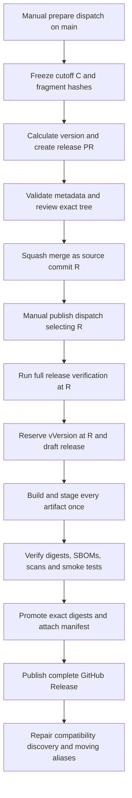

# Release Strategy

> **Status:** Proposed architecture, not implemented.
> **Research baseline:** `7a9124c4` on `main`, inspected on 2026-10-02.
> All configurations, new commands, artifact names, and workflow files below
> are proposals. This document does not authorize publication or deployment.

## 1. Executive recommendation

Release Scope as **one coordinated product**, initially `0.1.0`, with all
first-party runtime images, the database migration image, and the standalone CLI
built from the same reviewed source commit. Use **Changie 1.26.0** for
contributor-authored YAML fragments and changelog rendering, with a small
repository-owned validator and release coordinator for the policies Changie
does not provide.

Require structured release metadata in **every PR**, including an explicit
`No user-facing change` fragment for appropriate documentation, tests,
maintenance, and generated release changes. Separate note categories from
version impact. Publish public images to
`ghcr.io/microsoft/scope-<component>`; do not require public consumers to obtain
Azure credentials.

Use trunk-based development and two explicit `workflow_dispatch` stages:
**prepare a release PR**, then **publish its exact merged commit** after review
and verification. Reserve an immutable source tag before artifact publication,
keep the GitHub Release in draft until the complete artifact set and digest
manifest exist, and update moving aliases last. A Git tag or one image appearing
in a registry is **not** proof of a complete release.

This favors a small maintainer team's ability to understand, approve, and
recover a release over independent package publishing or elaborate branch
automation. Publication must not deploy production or execute migrations
against a production database.

## 2. Current-state findings

The following are observations, not descriptions of the proposed system.

| Finding | Repository evidence | Consequence |
| --- | --- | --- |
| Scope is a mixed TypeScript/Rust monorepo. | [Root manifest](../../package.json), [workspace list](../../pnpm-workspace.yaml), [gateway crate](../../apps/gateway/Cargo.toml). | Version synchronization must cover JSON, Cargo metadata, CLI injection, and images, not just npm. |
| Services share runtime code and data contracts. | [Package architecture](app-design.md), `workspace:*` dependencies in application manifests, [shared queue processor](../../packages/shared/src/queue/queue-processor.ts). | Independent versions would require a compatibility matrix the project does not currently maintain. |
| Existing version fields are not one product version. | Root and many manifests are `1.0.0`; gateway is `0.1.0`; Windows worker is `0.0.1`; CLI is `0.0.0-dev`; source-mode CLI falls back to `0.1.0-dev`. | Do not interpret the root's `1.0.0` as a published compatibility promise. Establish an explicit baseline. |
| CLI publication already has a manual upstream-main guard. | [Publish CLI](../../.github/workflows/publish-cli.yml). It selects a bump, mutates the CLI version only in its build workspace, tests `scope.mjs`, and creates `cli/v*` at the checked-out SHA. | Reuse its bundle tests and destination, but replace its uncommitted version mutation and independent version selection. |
| CLI consumers depend on the old tag namespace. | [Installer](../../install-cli.sh), [updater](../../apps/cli/src/commands/update.ts), [update checker](../../apps/cli/src/utils/update-check.ts), [distribution design](cli-distribution.md). | Changing only the release tag would break installation/update discovery. Older updaters do not consistently filter prereleases. |
| OCI publishing is not part of public application CI. | [CI](../../.github/workflows/ci.yml), [contributor CI guidance](../../CONTRIBUTING.md#testing). Integration images are built/loaded locally. | Add a separate trusted publisher, not publishing permissions to fork PR CI. |
| Current image build lists differ. | [Bake](../../docker-bake.hcl) has eight local targets. [ACR script](../../build-acr.sh) lists thirteen images, including Windows, but not the migration image. [Migration Dockerfile](../../packages/db-migrations/Dockerfile) exists separately. | A release catalog must explicitly enumerate artifacts; neither existing list is complete by itself. |
| Image tags are currently development/build identities. | Bake and [k3d build script](../../scripts/k3d-build.sh) use local `scoped/<component>:latest`. The ACR script uses `${ACR_NAME}.azurecr.io/scoped/*` with `latest`, timestamps, commit abbreviations, and some provider-version tags. | Keep developer registries separate from public SemVer releases. Provider versions are not the Scope version. |
| Compose is a source-built developer environment. | [Compose](../../docker-compose.yml), [development override](../../docker-compose.dev.yml). `db-migrate` uses the API's `builder` stage and `tsx`, not the standalone migration Dockerfile. | Ship a distinct release Compose example using runtime images; preserve source builds and hot reload. |
| Windows has a native build chain. | [Windows build script](../../scripts/build-windows-worker.ps1), three Windows Dockerfiles, CI's `windows-2022` job. | Build on a Windows Docker engine; the Linux Bake matrix cannot build this artifact. |
| Provider dependencies have their own pins. | Copilot [versions file](../../apps/workers/coder-acp-copilot/versions.env): `1.0.65`, also used by Windows. Claude [versions file](../../apps/workers/coder-acp-claude-code/versions.env): ACP `0.52.0`, SDK `0.3.191`. | Preserve these pins and report resolved installed versions separately from product versions. |
| Locked dependencies exist, but image builds are not fully reproducible. | [pnpm lock](../../pnpm-lock.yaml), [Cargo lock](../../apps/gateway/Cargo.lock); floating base images, apt/apk installs, and downloaded tools in worker Dockerfiles. | Pin build inputs and retain original outputs; the same source SHA alone does not guarantee identical rebuilt bytes. |
| Migrations are a release compatibility surface. | [Migration design](db-migrations.md), [required migration list](../../packages/db-migrations/src/required-migrations.ts), currently including `030-create-resource-indexes.ts`. | Publish a migration artifact matching the runtime set and document upgrade/rollback constraints. |
| Contribution metadata is currently prose/checklists. | [Contribution guide](../../CONTRIBUTING.md), [PR template](../../.github/PULL_REQUEST_TEMPLATE.md), [CODEOWNERS](../../.github/CODEOWNERS). No Changie configuration or fragment check was found. | Introduce a required check without removing the CLA, demos, testing, or compatibility sections. |
| Other workflows are not product release orchestration. | Pages, secret scanning, labeling, worker-version checks, and generated agentic workflows under [workflows](../../.github/workflows). | Pages remains continuous site deployment. Dependency/worker bots must also supply fragments. |
| Some architecture descriptions retain historical deployment references. | [Overview](overview.md) and [system architecture](system-architecture.md) discuss AKS/Flux and removed VS Code workers. No tracked Kustomize/Flux deployment manifests were found in this checkout. [Current Bicep](../../infra/main.bicep) and [azd manifest](../../azure.yaml) provision shared developer CosmosDB, not production images. | Do not invent deployment paths or treat historical workers as current release artifacts. Deployment owners must identify the real production configuration. |

Read-only GitHub inspection returned three tags, `cli/v0.0.0`, `cli/v0.0.1`,
and `cli/v0.0.2`, and an empty accessible Releases list. Local tag history
agreed. Tags alone do not establish that a downloadable release exists; do not
delete or retarget them. Recheck upstream before choosing the adoption baseline.

The repository API reported public visibility, MIT licensing, all three merge
methods enabled, `main` unprotected, and a disabled branch ruleset named
`default-rules`. These are time-bound observations, not a full audit of
organization policy. Required release checks are **not enforced today**.

## 3. Requirements, assumptions, and unresolved questions

### Required invariants

1. Every merged PR contributes validated release metadata tied to its changes.
2. Every artifact in a release catalog comes from the same reviewed commit;
   provider/tool dependencies and platform-specific bases are recorded.
3. Full versions, source tags, published release assets, and recorded image
   digests never change to different contents.
4. Only a published, complete canonical GitHub Release is a release discovery
   entry point. Registry tags and moving aliases are not transactional.
5. Contributors can author and validate metadata without publishing credentials.
6. Failed releases remain recoverable without rewriting source history or
   consuming fragments invisibly.

### Defaults and maintainer decisions

| Topic | Recommended default | What needs verification or approval |
| --- | --- | --- |
| Product/registry | One version; public GHCR packages under `microsoft`. | Organization administrator must approve package creation, public visibility, repository linkage, and allowed actions/OIDC. Registry ownership/permissions were not inspected. |
| Initial version | First candidate `0.1.0-rc.1`, then stable `0.1.0`. | Confirm there is no later externally distributed contract/version; agree on the initial compatibility boundary. |
| Platforms | Linux `amd64`; Windows `amd64` with Server Core LTSC 2022. | Confirm runner capacity, registry foreign-layer behavior, supported host builds, and redistribution rights. ARM64 is not initially supported. |
| Release contents | Fourteen first-party images plus `scope.mjs`. | Legal review must clear provider binaries and bundled tools before public redistribution. If an artifact cannot ship, change the reviewed catalog before preparation, not by skipping a failed job. |
| Support | Latest stable pre-1.0 minor line only. | Any customer need for older lines requires an explicit support decision and maintenance branch. |
| Merge/review | Squash merge; protected, up-to-date PRs; code-owner review of policy files. | Enable rulesets/branch protection and dismiss stale approvals. No setting is changed by this proposal. |
| Release approval | Protected `release` environment, maintainer approval, main-only dispatch. | An administrator must configure reviewers, bypass restrictions, and immutable GitHub Releases. |
| Deployment | Operators promote reviewed digests separately. | Locate external AKS/Flux/ACR consumers and identify their owners. No production deployment state was inspected. |
| Portal configuration | One portable public Portal artifact. | Current MSAL settings are build-time arguments. Runtime configuration must be expanded before promising one reusable image across tenants; otherwise a reviewed variant catalog is required. |

Do not ship credentials, `.env` files, access tokens, real benchmark traces, or
production auth configuration. Public OAuth client IDs are not secrets, but a
build tied to one environment is still not a portable release.

## 4. Artifact inventory and versioning model

### Artifact catalog

Except for gateway, Docker build contexts below are the repository root. An
unnamed final production stage means the last stage, not `builder` or `dev`.
The component name becomes the suffix of `ghcr.io/microsoft/scope-<component>`.

| Component | Build entry point / target | Distribution and consumers | Current version source | Proposed treatment |
| --- | --- | --- | --- | --- |
| `api` | `apps/api/Dockerfile`, final production stage | OCI; Portal, CLI, workers, scheduler | Manifest `1.0.0`; `GIT_COMMIT`/`BUILD_TIME` build args | Required product image |
| `judge` | `apps/judge/Dockerfile`, final production stage | OCI; coding workers | Manifest `1.0.0` | Required product image |
| `portal` | `apps/portal/Dockerfile`, nginx final stage | OCI; browser users | Manifest `1.0.0`; Vite build metadata | Required portable product image after auth-config work |
| `token-manager` | `apps/token-manager/Dockerfile`, final production stage | OCI; credential-consuming services | Manifest `1.0.0` | Required product image |
| `scheduler` | `apps/scheduler/Dockerfile`, final production stage | OCI; database/queue dispatch | Manifest `1.0.0` | Required product image |
| `gateway` | `apps/gateway/Dockerfile`, `runtime`; context `apps/gateway` | OCI; AI traffic capture | Cargo and package manifests `0.1.0` | Required product image; no crates.io package |
| `coder-acp-copilot` | `apps/workers/coder-acp-copilot/Dockerfile`, final production stage | OCI; Copilot task queue | Manifest `1.0.0`; shared Copilot pin | Required Linux product image |
| `coder-acp-claude-code` | `apps/workers/coder-acp-claude-code/Dockerfile`, final production stage | OCI; Claude task queue | Manifest `1.0.0`; ACP/SDK pins | Required Linux product image |
| `coder-acp-copilot-windows` | `Dockerfile.base` -> `Dockerfile.deps` -> `Dockerfile.windows`, `production`, under `apps/workers/coder-acp-copilot-windows` | OCI; Windows Copilot task queue | Manifest `0.0.1`; Linux Copilot pin | Required Windows product image; base/deps are build inputs, not public product artifacts |
| `report-generator` | `apps/workers/report-generator/Dockerfile`, final production stage | OCI; report queue | Manifest `1.0.0` | Required product image |
| `post-processor` | `apps/workers/post-processor/Dockerfile`, final production stage | OCI; HAR/ATIF and post-processing queues | Manifest `1.0.0`; worker build identity | Required product image; queue variants share this image |
| `model-scanner-copilot` | `apps/model-scanners/copilot/Dockerfile`, final production stage | OCI; model registry | Manifest `1.0.0` | Required product image |
| `model-scanner-anthropic` | `apps/model-scanners/anthropic/Dockerfile`, final production stage | OCI; model registry | Manifest `1.0.0` | Required product image |
| `db-migrations` | `packages/db-migrations/Dockerfile`, single stage | OCI; operator migration job | Manifest `1.0.0`; ordered migration files | Required matching migration image, not automatic production execution |
| CLI | `pnpm build:cli`, `apps/cli/build.ts` | GitHub Release `scope.mjs`; Node workstations and CI | `apps/cli/package.json` injected into bundle | Required product-versioned asset; no npm publish |
| Runtime libraries | `packages/{shared,telemetry,github-auth,model-scanning,llm-eval}` and consumed workspace code | Embedded/installed in relevant images or CLI | Mostly placeholder package versions | Synchronize release-owned runtime manifests; no standalone npm artifacts |
| Developer tooling | `packages/{test-utils,version-checking}`, `apps/version-checkers/*`, cookie updater, `evaluations/static-prompts` | Workspace-only tools | Private manifests; evaluation `uv.lock` | Not independent public releases; retain internal versions |
| Website | `website/package.json`; `static.yml`; separate lockfile | Astro/Starlight to Pages | Website `0.0.1` | Continuous docs site, not an OCI product artifact |
| Configuration/infrastructure | `config/`, Compose, gateway defaults, developer Bicep | Source archive and release deployment examples | Git revision; not package SemVer | Include compatible examples in release assets; no registry republishing |
| Third-party services/sidecars | MongoDB, Redis, Azurite, Lowkey Vault, Entra Local, DevProxy, MCPJungle | Referenced vendor images | Vendor tags in Compose | Record supported dependency pins; do not relabel them as Scope artifacts |

The initial catalog therefore contains **13 Linux images, one Windows image,
and one CLI bundle**. Include `LICENSE`, `NOTICE`, upgrade instructions, release
Compose configuration, checksums, and a release manifest as associated assets.
GitHub's source archives are source distribution, not additional npm packages.

### Authoritative version

Introduce a root `VERSION` containing the exact product SemVer without `v`.
Release preparation, not publication, updates it. A reviewed
`release/catalog.json` enumerates runtime artifacts, contexts, targets,
platforms, and release-owned manifests. A schema-aware synchronization script
updates:

- Root manifest; the CLI and fourteen artifact manifests; runtime library
  manifests listed in the catalog.
- Gateway `Cargo.toml` and its own package entry in `Cargo.lock`, with no
  unrelated dependency upgrades.
- Changelog and the committed `release/versions/<version>.json` preparation
  record; embedded product metadata/build interfaces where necessary.

Keep `workspace:*` dependency relationships. Do not assign the product version
to Copilot, Claude, language runtimes, or other vendor dependencies.
Mark non-publishable workspace packages explicitly `private: true` during
adoption where that flag is currently absent. This is not a plan to run
`pnpm publish` or `cargo publish`.

Validate synchronization using the frozen pnpm lock and Cargo lock;
regenerate only required lock metadata and reject unrelated resolution changes.
Publication checks a clean checkout: it **does not edit versions** after review.
Use a development marker for source-mode CLI output derived from `VERSION`,
rather than its current unrelated hardcoded fallback.

### Compatibility contract and impact

Scope's public contract includes REST/SSE shapes and authentication behavior,
CLI commands/flags/output formats, documented configuration/import-export
formats, queue/worker protocols, stored data, and operator upgrade procedures.
The common `/api/v1` path is not proof that every future product release is
compatible.

| Impact | Scope examples | Product version rule |
| --- | --- | --- |
| `patch` | Correct a crash without changing accepted input; compatible dependency/security update; repair queue redelivery; image-only rebuild with unchanged interfaces | `0.2.3` -> `0.2.4`, or `1.2.3` -> `1.2.4` |
| `minor` | Add an optional CLI flag, compatible API field/endpoint, or optional configuration capability; introduce deprecation with a working migration period | `0.2.3` -> `0.3.0`, or `1.2.3` -> `1.3.0` |
| `major` | Remove supported flags/fields; require new authentication/configuration; incompatible queue protocol; destructive stored-data transition | At >=1.0, `1.2.3` -> `2.0.0` |
| `none` | Documentation/test-only change or maintenance with no shipped behavior change | No release bump by itself |

Below `1.0.0`, use the stricter project convention: **every incompatible change
bumps the minor version**, sets `Breaking: "yes"`, and supplies migration
guidance. Patch releases must remain compatible within a `0.<minor>` line.
An intentional transition to `1.0.0` is a separate reviewed milestone, not an
automatic effect of one breaking fragment. For a breaking pre-1.0 fragment,
record `Impact: minor`; `Impact: major` is reserved for that milestone or the
post-1.0 contract.

`Added`, `Fixed`, and `Security` are reader-facing categories, not bump rules.
A newly added required config key can be breaking; a security fix that removes
a supported auth mechanism can also be breaking. A migration is not
automatically major: additive, backward-compatible migrations can be minor or
patch. Changes to persisted data must state compatible upgrade sources,
required migration ordering, rollback limits, and any backup requirement.
Never imply that every `down()` safely reverses data loss.

A worker protocol change affects the scheduler, workers, shared code, and
stored in-flight messages. Prefer expand/contract changes and queue draining
to a blind rolling mixed-version upgrade. The supported default is one
manifest-selected runtime set and a CLI from the same product version.
Older/newer CLI compatibility is supported only when explicitly documented and
tested; a same-major tag alone is insufficient while below 1.0.

### Version calculation and approval

The coordinator takes the highest declared impact across eligible public
fragments since the previous completed release on the selected support line.
It checks pre-1.0 rules and breaking flags independently, proposes the minimum
next version, and rejects an explicitly requested version below that minimum.
A larger bump needs a written rationale in the release PR. Do not let a
maintainer's `bump=patch` input override breaking metadata.

Consult completed release manifests, existing/reserved tags, and prepared
versions; abort on malformed history, API/fetch failure, collisions, or a
version already bound to another source. An abandoned reservation still
occupies its version. Hotfix-line versions need not exceed a newer minor
line's version, but must increase monotonically on their own line.

The first release is an explicit reviewed bootstrap to `0.1.0-rc.1`, not
`semver.inc(rootPackage.version)`. Create a baseline fragment and notes defining
the current supported surfaces, migrations, providers, and platforms; do not
pretend the entire historical commit log was fragment-managed.

Allow `alpha.N`, `beta.N`, and `rc.N`, starting with positive integers and no
leading zeros. For example:
`0.1.0-alpha.1 < 0.1.0-beta.1 < 0.1.0-rc.2 < 0.1.0-rc.10 < 0.1.0`.
Reject build metadata (`+...`) for public versions to avoid equivalent SemVer
precedence and container-tag encoding ambiguities. The channel must agree with
the suffix. Candidate counters never reuse a reserved identifier.

`VERSION=0.1.0`, source tag `v0.1.0`, CLI `--version=0.1.0`, image tag
`:0.1.0`, and notes `.changes/v0.1.0.md` all describe the same release.
The record's source SHA is the **merged release commit**, not the commit from
which preparation started.

## 5. Changie evaluation and proposed configuration

### Why Changie

Changie fits a product whose primary artifacts are images rather than published
npm packages. Independent YAML fragments avoid shared-changelog conflicts;
components and categories organize notes without forcing independent releases.
Custom prompts can capture version impact and breaking guidance.

Official documentation verifies `new`, explicit-version/automatic `batch`,
`merge`, custom choices, templates, and fragment preservation options.
At research time the latest upstream release was **v1.26.0**. The website's
configuration reference links some older source revisions, so the examples
below also use [tagged configuration source][changie-config-source],
[new command source][changie-new-source], and
[batch command source][changie-batch-source] for that pin.

| Changie handles | Scope must implement separately |
| --- | --- |
| Interactive and noninteractive fragment creation | PR-relative validation, strict schema, UUID uniqueness, and semantic policy |
| Component/kind/custom fields and Go-template rendering | No-user-facing filtering and multi-component coverage |
| Explicit SemVer batches; `auto` via per-kind templates | Pre-1.0 rules, approved bump calculation, completed-release/reservation history |
| Version note files and merged changelog | JSON/Cargo synchronization and compatibility/migration review |
| `--keep`, `--move-dir`, dry runs | Frozen fragment selection, archival ledger, cumulative prerelease notes, recovery |
| Optional regex replacements | Publication, tag ownership, OCI manifests, PR/release orchestration, signatures |

Do not use regex replacements as the authoritative JSON/TOML updater. Do not
claim `changie batch` validates the full Scope schema or provides publication
transactions. `--allow-no-changes` defaults to true; use false and also check
for public, non-`none` changes. A fragment's mere existence does not justify a
release.

### Proposed `.changie.yaml`

This is a single Changie project; `components` group notes, not versions.
The `none` kind is accepted during authoring but removed from the rendering
input by the Scope coordinator.

```yaml
changesDir: .changes
unreleasedDir: unreleased
headerPath: header.md
changelogPath: CHANGELOG.md
versionExt: md
versionFormat: '## {{.Version}}'
componentFormat: '### {{.Component}}'
kindFormat: '#### {{.Kind}}'
fragmentFileFormat: '{{.Custom.Id}}'
changeFormat: >-
  - {{if eq .Custom.Breaking "yes"}}**Breaking:** {{end}}{{.Body}}
  {{if .Custom.Migration}} Upgrade: {{.Custom.Migration}}{{end}}
body:
  minLength: 12
components:
  - Platform
  - API
  - CLI
  - Portal
  - Judge
  - Scheduler
  - Token Manager
  - Gateway
  - Copilot Worker
  - Claude Worker
  - Windows Worker
  - Post-processing
  - Reports
  - Model Scanners
  - Database
  - Configuration
  - Deployment
  - Documentation
  - Tooling
kinds:
  - {label: Added, key: added, auto: '{{.Custom.Impact}}'}
  - {label: Changed, key: changed, auto: '{{.Custom.Impact}}'}
  - {label: Deprecated, key: deprecated, auto: '{{.Custom.Impact}}'}
  - {label: Removed, key: removed, auto: '{{.Custom.Impact}}'}
  - {label: Fixed, key: fixed, auto: '{{.Custom.Impact}}'}
  - {label: Security, key: security, auto: '{{.Custom.Impact}}'}
  - {label: No user-facing change, key: none, auto: none}
custom:
  - {key: Id, type: string, minLength: 36, maxLength: 36}
  - {key: Impact, type: enum, enumOptions: [none, patch, minor, major]}
  - {key: Breaking, type: enum, enumOptions: ["no", "yes"]}
  - {key: Migration, type: block, optional: true}
newlines:
  afterChangelogHeader: 1
  beforeComponent: 1
  beforeKind: 1
  endOfVersion: 1
```

Changie validates the UUID's length here, not its syntax or uniqueness. Scope
must validate those. Quote `"yes"`/`"no"` and all custom fragment values:
Changie's custom map stores strings. Kinds are represented by configured keys
in the proposed canonical fragment schema.

### Fragment schema and examples

Require exactly `component`, `kind`, `body`, `time`, and `custom`; require
`custom.Id`, `Impact`, `Breaking`, and `Migration` (empty string permitted only
for nonbreaking entries). Validate UTF-8 text, a UUID matching the filename,
an RFC 3339 timestamp, known enums, and a non-placeholder body after trimming.
Do not infer inclusion from timestamps: the source tree and ledger define the
release boundary. PR numbers/authors come from verified GitHub PR association,
not contributor-supplied identifiers. Store that association in the preparation
ledger for note links and acknowledgements.

Illustrative contributor fragment,
`.changes/unreleased/08c2f5e5-182c-4a87-a425-6468ba8ae144.yaml`:

```yaml
component: CLI
kind: fixed
body: Keep the configured API URL when exporting evaluation criteria.
time: 2026-10-02T09:00:00Z
custom:
  Id: "08c2f5e5-182c-4a87-a425-6468ba8ae144"
  Impact: "patch"
  Breaking: "no"
  Migration: ""
```

Illustrative breaking entry while below 1.0:

```yaml
component: Configuration
kind: changed
body: Require an explicit project ID for catalog import operations.
time: 2026-10-02T09:01:00Z
custom:
  Id: "47de6e02-0701-42d1-bf83-1f64c2b78682"
  Impact: "minor"
  Breaking: "yes"
  Migration: "Pass --project <project-id> or set SCOPE_PROJECT before importing."
```

This example illustrates policy, not an assertion that this change is pending.
Breaking metadata must explain who is affected and the replacement/upgrade
path. If no safe migration exists, say so explicitly with operational guidance;
`N/A`, `TBD`, and whitespace do not pass.

Illustrative no-user-facing record:

```yaml
component: Documentation
kind: none
body: Document the coordinated release process; shipped behavior is unchanged.
time: 2026-10-02T09:02:00Z
custom:
  Id: "d51bca06-670a-44fc-a314-d8c4ea8659d2"
  Impact: "none"
  Breaking: "no"
  Migration: ""
```

Require `kind=none` iff `Impact=none`; it must explain why there is no
user-facing effect. Dependency updates are not automatically `none`: rebuilding
a shipped dependency usually merits at least `patch`. Test-only dependency
updates can be `none`. Reviewers remain responsible for truthful impact.

### Installation and authoring

Propose a repository-owned installer that selects an upstream **1.26.0**
binary for Linux/macOS/Windows, checks its SHA-256 against a committed
`release/tools.lock.json`, and exposes it through `pnpm changie`. Commit
checksums verified against that tagged release; do not trust a checksum
downloaded from an arbitrary URL supplied by a PR. Do not use `@latest`,
an unpinned action, or an unpinned container. The official installation guide
also supports npm, Mise, and the Changie action, but the checked binary keeps
local and CI behavior identical without an uncontrolled installer.

Proposed wrapper commands (not available in this checkout yet):

```bash
pnpm release:tools
pnpm release:note
pnpm release:metadata -- --base origin/main --head HEAD
```

`release:note` supplies a fresh UUID and refuses to overwrite an existing
filename, then invokes `changie new` interactively for the remaining values.
Raw `changie new` also works, but asks for the configured `Id`.

Noninteractive equivalent using the verified Changie flags:

```bash
pnpm changie new --interactive=false --component CLI --kind fixed \
  --body "Keep the configured API URL when exporting evaluation criteria." \
  --custom Id=08c2f5e5-182c-4a87-a425-6468ba8ae144 \
  --custom Impact=patch --custom Breaking=no --custom Migration=
```

Use a newly generated UUID rather than copying the example. Bots use the same
schema/command; they need no special exemption and no publisher token.

### Consumption, archival, and notes

The coordinator freezes a preparation commit `C` and enumerates **all** pending
fragments at `C`, recording UUIDs, original paths, exact byte hashes, and merged
PR associations. It renders in a temporary workspace containing only the
selected public fragments and the approved configuration/version history:

```bash
changie batch v0.1.0 --allow-no-changes=false --keep
changie merge
```

These commands run in the temporary rendering workspace, not indiscriminately
against the live checkout. Copy the generated version notes/changelog back.
Archive the original pending files, including `none` records, under
`.changes/archive/v<version>/`, and remove only the exact frozen originals
after verifying their hashes. Archive files are never fed to ordinary batching.
Changie's `--move-dir` is a valid built-in alternative for an unfiltered batch,
but does not implement the filtered ledger policy by itself.

Commit the archives, notes, and preparation ledger together in the release PR.
Existing archives remain byte-for-byte unchanged. Do not use `--force`,
`--remove-prereleases`, or wholesale unreleased-directory deletion.

For candidate sequences, archive each new UUID **once**, on first inclusion.
Later candidates and stable promotion reference those archive entries plus
newly selected fragments. Deduplicate UUIDs within each release's notes.
Candidate and stable notes may intentionally repeat the same change across
versions, but a stable release must include the cumulative changes since the
previous stable release. Keep prior candidate notes/history.

If a prepared release is abandoned, its archived changes are not considered
shipped. A later preparation includes their ledger references until a completed
release covers them. Never use "fragment file removed" as proof of publication.

Use the committed `.changes/v<version>.md` as the core GitHub Release body,
adding the manifest, compatibility/upgrade section, verified PR links,
contributors, and artifact instructions. Do not regenerate notes from whatever
has merged into `main` by publication time.

Illustrative stable notes:

```markdown
## v0.1.0

### CLI
#### Fixed
- Keep the configured API URL when exporting evaluation criteria.

### Configuration
#### Changed
- **Breaking:** Require an explicit project ID for catalog import operations.
  Upgrade: Pass --project <project-id> or set SCOPE_PROJECT before importing.

### Installation and upgrades
Use the complete digest set in release-manifest.json. Back up stored data and
run the matching migration image before starting services that require it.
```

`No user-facing change` entries stay in the archive/ledger and never appear in
public notes, even as empty category headings.

## 6. Contributor workflow and required PR enforcement

### Required check

Add `.github/workflows/release-metadata.yml` with one stable required check
name, **`Release metadata`**, on every `pull_request` to `main` and approved
maintenance branches. No path filter: docs-only, generated, and bot PRs must
run it. Trigger on `opened`, `reopened`, `synchronize`, `ready_for_review`, and
base/metadata-relevant `edited` events. Associate results with the current
head/merge SHA, not just the PR number.

Use `contents: read`, no secrets, no OIDC, no registry access, no
`pull_request_target`, and checkout credentials disabled. Run the validator,
schema, lock, and configuration from the trusted base revision in a separate
directory. Read the PR's fragment blobs as bounded **data** using Git; do not
install PR dependencies, execute PR scripts, follow symlinks, or load a
PR-supplied Changie template/configuration. Proposed policy changes get normal
code-owner review and apply only after merge.

A required status name alone is not a cryptographic guarantee that a PR has
not altered its workflow. Protect workflow/policy changes with mandatory
code-owner review and dismissed stale approvals; use an organization ruleset
requiring a centrally controlled workflow if available. The trusted publication
gate revalidates merged metadata. Administrators must verify those rules rather
than assuming CODEOWNERS is enforced.

### What satisfies the check

Compute the merge base of the actual PR head and fetched current base; inspect
the complete diff, not the last commit or filename presence in HEAD.

| Change | Treatment |
| --- | --- |
| New pending UUID absent from base and all archives | Qualifies after schema and policy validation |
| Edits to a fragment added earlier in this same PR | Qualify; the fragment is still new relative to the PR base |
| Existing base fragment left untouched, renamed, copied, or cosmetically edited | Does not satisfy the current PR |
| Correction of another merged PR's pending metadata | Require a new `none` correction record explaining the original UUID, metadata-only scope, and maintainer review; validate both records |
| Deletion or alteration of previously archived metadata | Reject; add an explicit correction instead of rewriting history |
| Release PR moving pending records to archives | Permit only the deterministic preparation recipe described below; never allow a label or bot username to bypass validation |

A new fragment must have a new UUID as well as a new path. Compare normalized
content/identity to catch copying an unrelated existing fragment under another
filename; require a meaningful description of this PR's effect. Automated
checks cannot prove prose truthfulness, so reviewers must reject borrowed or
misleading metadata.

Validate all newly added/changed fragments; one valid file cannot hide another
malformed one. Reject duplicate YAML keys, aliases/custom tags, unsupported
fields, invalid UTF-8, symlinks, excessive sizes, missing/unknown components or
kinds, blank descriptions, absent/invalid impact, inconsistent `none` fields,
and breaking entries without meaningful upgrade guidance. Enforce breaking
impact against the current support line's product version.

Maintain a reviewed path-to-component map. A PR spanning API and CLI needs
both components' fragments, or a `Platform` fragment explicitly describing
both; require reviewer confirmation for the cross-cutting case. Shared/runtime,
configuration, deployment, and migration changes are not silently ignored.
Use multiple fragments for distinct user effects, including different impacts.
One documentation/test-only PR may have one explanatory `none` record.

The generated release PR includes a **new pending `Tooling`/`none` fragment**
describing release bookkeeping. Leave that one record pending for the next
release; do not include it in its own frozen input. This avoids a self-referential
fragment hash and satisfies the same every-PR rule. Release verification also
checks that:

- The head was generated from the declared cutoff `C`.
- Only release-owned versions/lock metadata, notes, ledger/archives, deployment
  examples, and the bookkeeping fragment changed.
- Every removed pending fragment matches a newly archived original and ledger
  hash; existing history is unchanged.
- Regeneration produces the same notes and version diff.

Fork PRs use this exact read-only process. GitHub may require approval for a
first-time contributor's Actions run; an unapproved run is pending, not an
exemption. Dependabot and worker-upgrade automation must create a fragment or
receive a maintainer-added fragment before merge.

### Stale results, merge methods, and merge queues

Fragment edits cause `synchronize` and a new SHA/check run; cancel obsolete
PR-validation runs. Require branches to be up to date and dismiss stale review
approvals. The proposed default is squash merge; metadata files survive squash
without depending on individual commit messages.

If a merge queue is enabled later, add `merge_group: checks_requested` to
metadata **and CI**, validate each queued PR's metadata independently, and run
compatibility checks on the merge-group tree. One PR's fragment must not satisfy
another queued PR. Obtain membership from GitHub's queue/PR data, not a fragile
branch-name parser; fail closed if membership is unavailable. Queue release PRs
alone after regenerating against the queue base, or retain the no-queue release
merge procedure. A `pull_request`-only check cannot satisfy merge-queue gates.

Require `Release metadata`, the applicable CI checks/summary, secret scanning,
CLA, and code-owner review through branch protection/rulesets. Existing CI has
workflow-level path filters: before requiring `CI Summary` on every PR, provide
an always-running entry point that explicitly handles documentation-only PRs,
otherwise such PRs can wait forever on a check that was never created.

### Contributor feedback and documentation

Example failure messages:

```text
Release metadata missing: add a new .changes/unreleased/<uuid>.yaml.
Run pnpm release:note; documentation/test-only work still needs kind=none.

<path>: custom.Impact is required; choose none, patch, minor, or major.
<path>: Breaking=yes requires migration guidance and a compatible bump.
<path>: this UUID already exists on the PR base; it does not describe this PR.
Release preparation is stale: main changed after cutoff C; regenerate the PR.
```

Add the proposed local commands to `CONTRIBUTING.md`, explain user-oriented
descriptions and pre-1.0 breakage, and add a fragment path/impact checklist to
the existing PR template **without replacing its sections**. Link the schema,
examples, and troubleshooting. PR-body prose is helpful review context but is
not the canonical metadata source; file edits inherently invalidate stale
checks.

## 7. Branching, tagging, prereleases, and hotfixes

`main` remains the integration/default branch. Use short-lived topic branches
and temporary `release-prep/<version>` branches. Do not introduce permanent
`develop`, environment, or release branches for ordinary releases.

Recommend squash merging normal and release PRs. For a release PR, the final
merged commit `R` must have cutoff `C` as its parent and the reviewed preparation
tree as its tree. Require an up-to-date branch; if more PRs merge first,
regenerate against the new cutoff, include their fragments, rerun checks, and
obtain fresh approval. Do not silently merge new code into an old set of notes.
Publication independently checks this relationship and rejects a stale merge.
Repair an unreserved preparation with another reviewed preparation PR if
necessary; never force-reset `main`.

After `R` merges, later changes on `main` do **not** block publishing `R`:
select it explicitly from the merged release PR. Verify ancestry to the
authorized protected line and the declared preparation tree; never substitute
the current tip or the PR branch head.

Stable source tags are `v<version>`; prereleases use tags such as
`v0.2.0-rc.1`. The publisher creates annotated tags at `R`, with the release
version, preparation-record hash, build-plan hash, and orchestration SHA in
the message. Protect tag creation,
updates, and deletion using rulesets; only the release publisher/approved
maintainers can create tags, and nobody should bypass the no-rewrite rule.
Existing `cli/v0.0.*` history remains untouched.

Default hotfixes ship from `main` when its unreleased work is safe to include.
If `main` contains changes that cannot belong in the supported patch, create
`release/0.2` from the last complete `v0.2.x`, protect it, and backport the fix
through a PR with a new fragment. Prepare `0.2.(x+1)` there. Forward-port the
fix to `main` as a separate PR with its own metadata, noting the backport
relationship; do not cherry-pick consumed release archives or mix release
ledgers. Support older lines only by explicit policy, then delete unused
maintenance branches after end-of-support.

All dispatches execute the orchestration workflow on upstream `main`; a
validated `base_ref` can select an approved maintenance line for source
preparation/publication. Contributors cannot supply an arbitrary workflow ref
or unreviewed source branch to a privileged job.

Prereleases are opt-in and marked `prerelease: true` on GitHub. They never
update stable aliases. Default support remains the latest completed stable
minor line; candidates are not an additional supported line.

Stable promotion is a **new reviewed release PR and rebuild**. Removing
`-rc.N` changes committed and embedded version metadata, including the CLI
and OCI version labels, so retagging candidate bytes as stable would misreport
the version. Require `promote_from` to identify a complete candidate and
verify that code changes are limited to approved release metadata if this is
a pure promotion. Reuse caches, not different-version artifacts.

## 8. Release lifecycle

The lifecycle deliberately reserves the tag **before** pushing artifacts.
This gives the version a durable source identity and makes recovery unambiguous;
the tradeoff is that a failed attempt can leave a source tag and draft release.
Only the published canonical release's complete manifest advertises success.

The flow below separates review, verification, staging, and discovery.



| Stage | Input and output | Permissions / failure behavior |
| --- | --- | --- |
| Freeze | Main-only dispatch; fixed `C`, supported base line, pending fragments, previous completed manifest | Read-only discovery. Fail on ambiguous history or invalid metadata; persist hashes, not a moving branch name. |
| Prepare | Approved target version/channel; notes, archives, synchronized versions, catalog hash, `release/versions/<version>.json` | Trusted preparation job needs contents/PR write only to create/update its branch and PR. No registry access. One outstanding attempt per line, including merged-but-unpublished preparations and drafts; complete or explicitly abandon it before preparing another. |
| Review/merge | Deterministic preparation diff; reviewed head; up-to-date `C` | Normal PR gates and approval. Stale base requires regeneration. Record merged `R`; no automatic merge. |
| Select publication | Release PR number, exact `R`, version/channel, optional promotion reference | Read-only gate checks the PR was merged into the allowed protected line, approved preparation and tree relationship, catalog, and version. Reject arbitrary SHAs, branches, direct commits, or changed workflow policies. |
| Verify | Clean checkout of `R`, frozen locks and inputs | Build/test jobs are read-only. Required tests cannot silently skip. Failure before reservation permits correcting the preparation before a version is bound to artifacts. |
| Reserve | Verified `R`; immutable build plan and fixed build timestamp | After environment approval, contents-write job compare-and-creates `v<version>` and draft release; attach `release-plan.json` without clobbering. Existing matching reservation means resume; mismatch is fatal. |
| Stage | Checkout tag peeled to `R`; fixed build plan | Trusted jobs stage OCI images under candidate tags and retain CLI bytes/checksums. Only these jobs need packages write. Record receipts immediately; any failure keeps release draft. |
| Validate set | Every catalog output, immutable digests, attestations, vulnerability reports, assembled smoke tests | Verify anonymously readable images/platforms and matching source/version; reject missing artifacts or mismatches. Test the actual staged runtime images, not only `dev` images. |
| Promote/attach | Verified complete candidate set | Copy the same manifests/digests to full-version tags; attach CLI, checksums, manifest, notes, licenses, SBOMs and upgrade assets to draft. Existing outputs must match exactly. Partial promotion still leaves draft. |
| Publish | All required assets verified; tag still points to `R` | Publish canonical GitHub Release, stable or prerelease as appropriate. Set `latest` only for the newest stable line. Its manifest is the completion marker. No tag/release event triggers a second build. |
| Advertise | Completed canonical release | Create the stable CLI compatibility release, then update appropriate moving aliases with monotonic version checks. Failure here means a complete release with pending discovery repair, not a need to rebuild. |

Release gates reuse documented commands: frozen install, `pnpm build`,
`pnpm lint`, `pnpm test`, license-header/NOTICE checks,
`pnpm build:gateway`, `pnpm test:gateway`, `pnpm lint:gateway`, and
`pnpm fmt:gateway`. Use the pinned Rust toolchain and locked Cargo resolution.
Run the standalone CLI bundle and update-check integration tests documented in
[CLI distribution](cli-distribution.md), queue integration tests, migration
upgrade tests, Linux worker tool checks, and the native Windows build/smoke test.

Full release verification is an explicit trusted reusable workflow that checks
out `R`, not merely "CI Summary was green" for a path-filtered PR. Record any live-model tests that
cannot run without paid/provider credentials separately; never report their
absence as validation of live-model access. Credential-free runtime/tool/queue
gates are mandatory. Maintainers must approve a documented live-provider test
policy rather than silently accepting skipped required tests.

The immutable build plan includes `R`, cutoff `C`, version/channel, catalog and
note hashes, fragment ledger hash, resolved base image digests, tool/checksum
pins, provider versions, platforms, and the orchestration workflow's revision.
Use `R`'s committer timestamp as the fixed `BUILD_TIME`, not the rerun's current
clock. The plan is external to the source tree: embedding the commit's own SHA
or future image digests in that commit would be self-referential.

## 9. Workflow design and permissions

### Inputs

Propose one `release.yml` with `stage` choices `prepare`, `publish`, `resume`,
and `repair-aliases`, invoking reusable trusted workflows for gates/builds.

| Input | Validation |
| --- | --- |
| `stage` | Exact allowed choice; privileges selected only after validation |
| `version` | Canonical SemVer without `v` or build metadata; allowed prerelease suffix; approved minimum impact and no conflicting reservation |
| `channel` | `stable`, `alpha`, `beta`, or `rc`; matches version; no stable alias for candidates |
| `base_ref` | `main` by default; otherwise a maintainer-approved protected `release/<minor-line>` from the support catalog |
| `source_sha` | Prepare: fixed dispatch SHA when using main, or resolved approved line tip; publication/resume: required full 40-hex merged release SHA, never an arbitrary ref |
| `release_pr` | Required positive PR number for publish/resume; validate repository, merge target, merged SHA and approved recipe |
| `promote_from` | Optional canonical complete candidate tag; stable promotion requires matching version core and approved source-tree differences |

Resolve inputs through API/Git calls with explicit error handling and bounded
retries. Pass input data via environment variables/argument arrays; do not
interpolate untrusted strings into shell code. Do not support arbitrary image
lists, registry destinations, commands, or `force` flags at dispatch.

Illustrative workflow pseudocode, **not copy-ready workflow YAML**:

```text
on workflow_dispatch(stage, version, channel, base_ref, source_sha, release_pr):
  require repository == "microsoft/scope"
  require workflow ref == "refs/heads/main"
  acquire concurrency group "scope-product-release" (do not cancel running work)
  discover and validate inputs using read-only credentials

  prepare:
    freeze C; validate all metadata; calculate minimum version
    refuse a second unresolved release attempt on the same support line
    render selected fragments; archive originals; synchronize owned versions
    add new Tooling/none bookkeeping fragment
    create/update PR with contents:write + pull-requests:write

  publish or resume:
    select R from the merged, reviewed release PR, not from current main
    revalidate preparation, catalog, notes, tag/asset collisions
    run required verification at R with contents:read
    obtain approval from protected "release" environment
    compare-and-create tag and draft release with contents:write
    persist fixed plan; reuse existing matching plan on resume
    build/stage catalog matrix at tag R with packages:write + contents:read
    attest only trusted outputs with id-token:write + attestations:write
    verify complete set; promote exact digests without overwriting differences
    attach and verify all final assets; publish draft with contents:write
    repair stable CLI discovery and eligible aliases

  repair-aliases:
    load and verify an already complete release; never build or replace assets
    repair only compatibility discovery and monotonic aliases
```

At workflow level default to `contents: read`; grant write permissions only to
the individual jobs needing them. Do not grant deployment, issues, repository
administration, or Azure access. Public GHCR publication uses the repository
`GITHUB_TOKEN` with `packages: write`, not a maintainer PAT. Signing/attestation
jobs additionally need narrowly scoped OIDC and `attestations: write`.
Preparation needs GitHub's "Allow Actions to create and approve pull requests"
setting enabled for PR creation; the workflow does not approve its own PR.

Use one global concurrency group shared by preparation/publication/recovery,
with `cancel-in-progress: false`. GitHub's default concurrency behavior can
replace an existing **pending** run even when running work is not cancelled;
do not assume an unlimited FIFO queue. Surface superseded dispatches and
redispatch deliberately. Durable compare-and-create reservations and
same-plan checks, not concurrency alone, provide idempotency.

### GitHub event behavior

Current [official trigger documentation][github-triggers] says ordinary
events caused by `GITHUB_TOKEN`, including `push` and release events, do not
start new runs; `workflow_dispatch` and `repository_dispatch` are exceptions.
It also documents an important newer exception: token-created/updated PRs
can generate `opened`/`synchronize`/`reopened` workflow runs in an
**approval-required** state.

Therefore prepare with `GITHUB_TOKEN`, have a maintainer approve the release
PR's workflows, review/merge normally, then explicitly dispatch publication.
Do not depend on an automatic push/tag/release chain or assume that generated
PR CI starts unattended. If the organization's rollout differs, explicitly
dispatch read-only verification of the exact PR SHA and ensure the required
PR check is genuinely satisfied before merge; never waive the check.
An optional future GitHub App can remove the workflow-approval friction, but
introduces a private-key secret and is not required for the initial design.

Privileged workflows run only reviewed merged source, not PR head code.
No `workflow_run` artifact from an untrusted PR is accepted as publication
input. Use artifact IDs, source/plan hashes, and digest verification between
trusted jobs; a matching artifact filename is not sufficient.

## 10. Artifact naming and publishing policy

### Registries, tags, and platform constraints

| Reference | Policy |
| --- | --- |
| `ghcr.io/microsoft/scope-api:0.1.0` | Full version; immutable by publisher policy, compare before every write |
| `ghcr.io/microsoft/scope-api:0.2.0-rc.1` | Full candidate version; never overwritten |
| `ghcr.io/microsoft/scope-api:sha-<full-R>-v0.1.0` | Candidate/build identity; includes version so promotion builds cannot collide |
| `ghcr.io/microsoft/scope-api@sha256:<digest>` | Preferred operator reference; manifest/index digest recorded in release manifest |
| `:0.1` | Moving alias to latest complete stable patch within `0.1` |
| `:latest` | Latest complete stable product version, never prerelease or an older-line hotfix |
| `:preview` | Latest complete candidate on the current candidate line; explicitly opt-in |
| `:1` and later majors | Only after 1.0; latest complete stable release within that major |
| `:0` | Do not create: pre-1.0 minor lines can be mutually incompatible |

Aliases update only after the canonical release is complete, and never
downgrade according to SemVer. Updating fourteen aliases is not atomic; advise
consumers to select **one complete manifest's digests**, not fourteen `latest`
tags. A published release can be usable before alias repair finishes.

Linux initial builds use `linux/amd64`. The worker Dockerfiles have some ARM
download selection, but that does not demonstrate ARM support for all vendor
tools/agent binaries. Add `linux/arm64` only after native platform tests for
every required component, including gateway's native crypto toolchain.

Windows uses `windows/amd64` with LTSC 2022 `os.version` metadata and native
container smoke tests. Build base/deps locally and record them as build inputs;
only `production` ships. GHCR officially supports Windows foreign layers,
but test anonymous pulls on a compatible Windows host and verify layer
redistribution/licensing. Do not advertise cross-platform support from a Linux
emulator build alone.

Create release-specific Bake targets/catalog generation rather than reuse the
local default group unchanged. Gateway requires its directory context and
`runtime` target. The ACR wrapper's root-context/default-target invocation is
not the release recipe. Migration/report/scanner targets need explicit catalog
entries, and Windows needs its separate runner/chain.

### Build identity and supply chain

Apply OCI labels/annotations:
`org.opencontainers.image.source=https://github.com/microsoft/scope`,
`version=<VERSION>`, `revision=<full-R>`, `licenses=MIT`, a fixed
`created` timestamp, and meaningful title/description. The MIT label describes
Scope's first-party code, not a claim that every bundled provider binary has
MIT terms. Include and review license/NOTICE material appropriate to each image.

Preserve provider/tool versions in worker self-registration and benchmark
records. A product version does not replace the installed Copilot/ACP version
or the exact build identity used for reproducibility.

Pin actions to reviewed full commit SHAs with version comments; pin Changie,
image-copy tools, vulnerability scanners, SBOM tools, BuildKit/buildx, runtime
toolchains, and base images/checksums. Keep pins in the reviewed catalog/tool
lock and allow updates through normal PRs with metadata. Track remaining
apt/apk/vendor nondeterminism rather than promising bit-for-bit rebuilding.

For Linux, BuildKit can attach provenance and SBOM attestations with
`--provenance=mode=max --sbom=true`; registry export preserves them whereas
classic Docker `--load` can lose or reject them. Never put secrets in build
args, especially with maximum provenance. Use GitHub artifact attestations for
the final image digests, CLI, and release manifest; consumers verify the
repository/workflow identity and source SHA, not just the presence of a
signature. GitHub currently documents `actions/attest`; pin the approved action
commit during implementation.

Checking out `R` does not change the main-dispatched workflow's `github.sha`.
Record that orchestration SHA separately. Require a signed predicate binding
the actual checked-out `R`, version, and build-plan hash to each subject digest,
not an assumption that default workflow provenance identifies `R`.
The [attest action's inputs][github-attest-inputs] support `predicate-type`
and `predicate-path` for such a custom predicate; use a separate invocation
from SBOM attestation. Verification must check both the trusted signing
workflow identity and this explicit source/plan binding.

Do not assume the native Windows Docker chain supports Linux BuildKit's
attestation flags. Generate a Windows SBOM separately and attest its pushed
digest through the trusted GitHub attestation job.

Scan the actual staged digests and CLI dependency set. Block known fixable
high/critical vulnerabilities by default; require documented, time-limited,
reviewed exceptions for unavoidable vendor/base findings. Store scanner
versions, database timestamps, results, and exceptions. Clear
`NOTICE-REVIEW.txt` redistribution decisions before the first public image
release; a generated NOTICE alone does not grant redistribution rights.

Build each artifact once for a given `(version, R, plan)` and reuse it by digest.
Copy to the **same GHCR image repository's** final version tags, preserving the
index and attestations; verify digest equality after copying. If mirroring to
ACR transforms an index or drops attestations, record separate mirror digests
and provenance rather than asserting equality. Never rebuild just to move an
alias.

### Complete release manifest

Generate `release-manifest.json` from build receipts, not from predicted tags.
Require schema version, product version/channel, source/cutoff commits, source
tag, catalog/plan/notes hashes, provider versions, every image/index and platform
digest, CLI SHA-256, asset checksums, migration compatibility, and build/
attestation references. Every artifact inherits the same `sourceCommit`; any
different-source exception is invalid.

The following YAML is an illustrative compact rendering of the required image
map. All SHAs are synthetic examples, not downloadable artifacts. Actual JSON
also contains platform digests, hashes, and evidence fields described above.

```yaml
schemaVersion: 1
version: "0.1.0"
channel: stable
sourceCommit: "0123456789abcdef0123456789abcdef01234567"
sourceTag: v0.1.0
registryPrefix: ghcr.io/microsoft/scope-
images:
  api: sha256:aaaaaaaaaaaaaaaaaaaaaaaaaaaaaaaaaaaaaaaaaaaaaaaaaaaaaaaaaaaaaaaa
  judge: sha256:bbbbbbbbbbbbbbbbbbbbbbbbbbbbbbbbbbbbbbbbbbbbbbbbbbbbbbbbbbbbbbbb
  portal: sha256:cccccccccccccccccccccccccccccccccccccccccccccccccccccccccccccccc
  token-manager: sha256:dddddddddddddddddddddddddddddddddddddddddddddddddddddddddddddddd
  scheduler: sha256:eeeeeeeeeeeeeeeeeeeeeeeeeeeeeeeeeeeeeeeeeeeeeeeeeeeeeeeeeeeeeeee
  gateway: sha256:ffffffffffffffffffffffffffffffffffffffffffffffffffffffffffffffff
  coder-acp-copilot: sha256:1111111111111111111111111111111111111111111111111111111111111111
  coder-acp-claude-code: sha256:2222222222222222222222222222222222222222222222222222222222222222
  coder-acp-copilot-windows: sha256:3333333333333333333333333333333333333333333333333333333333333333
  report-generator: sha256:4444444444444444444444444444444444444444444444444444444444444444
  post-processor: sha256:5555555555555555555555555555555555555555555555555555555555555555
  model-scanner-copilot: sha256:6666666666666666666666666666666666666666666666666666666666666666
  model-scanner-anthropic: sha256:7777777777777777777777777777777777777777777777777777777777777777
  db-migrations: sha256:8888888888888888888888888888888888888888888888888888888888888888
cli:
  asset: scope.mjs
  sha256: "9999999999999999999999999999999999999999999999999999999999999999"
```

The manifest lists payload-asset hashes, excluding itself and the checksum
index. A separate `SHA256SUMS` lists the manifest and payload hashes, excluding
itself; attest the manifest. This avoids both direct and indirect checksum
self-references. Generate release
Compose references from this map. Schema validation rejects an omitted image,
unknown component, duplicate entry, invalid digest, wrong platform, or
source/version mismatch.

### CLI migration and deployment

Update the installer, updater, update checker, their tests, and installation
docs to prefer canonical complete `v*` stable releases, select with SemVer
ordering and pagination, and fall back to historical stable `cli/v*` releases.
Explicit version installation must download the matching bundle/checksum and
verify its reported version before replacing an existing installation.
Preview installation remains explicit.

For older installed CLIs, publish a **stable-only compatibility**
`cli/v<version>` tag/release after the canonical product release completes.
It points to the same `R` and attaches the same CLI bytes/checksum. This is a
discovery bridge, not an independent CLI version or second build. Keep it
through the pre-1.0 transition, with removal announced before 1.0. Do not
create prerelease compatibility releases: old updaters can otherwise pick them.
Set `make_latest=false` on compatibility releases so they cannot replace the
canonical product release in GitHub's latest-release discovery.
Do not recreate/overwrite old tags or published assets during migration.

GHCR becomes the public distribution source. ACR/local development remain
separate. Identify external deployment consumers before replacing their
`scoped/*:latest` references; optionally mirror exact released digests into an
operator-owned ACR after completion. Publication needs no Azure credentials.
Update source-install instructions, release Compose examples, and the actual
external deployment manifests to pin the complete set.

Operators separately approve deployment, back up data, drain incompatible
queues if necessary, apply the version-matched migration job, and roll out the
matching images. Installation examples must not silently start paid providers
or treat the local auth emulator as production security.

## 11. Failure recovery and maintainer runbook

### Idempotency rules

The identity is `(version, merged R, preparation hash, catalog hash, build-plan
hash)`. A run number is evidence, not release identity. A duplicate dispatch
with the same identity either resumes or verifies an already complete release
and performs no writes. Any differing identity for an existing version fails.

Persist the plan in the draft release and per-artifact receipts/checksums as
outputs are staged. Reserve source identity with compare-and-create Git refs;
after a race, read and compare rather than force-push. The annotated tag binds
the plan hash before the draft asset is uploaded. If that upload fails, recover
the exact plan from the original run and recorded pins; if it cannot be
reconstructed and verified, stop rather than attach a different plan.
Immediately after a successful push, capture its digest and attest its identity.

If a push succeeded but a receipt was lost, recover the candidate tag's digest
and verify source/version, expected plan annotations, and signed provenance
before adopting it. An unverifiable result is not a successful resume. Retain
candidate images and build outputs until completion/recovery; configure
cleanup so a draft release's candidates are never pruned automatically.

| Failure/event | Recovery |
| --- | --- |
| Additional PRs merge during preparation | Regenerate from the new cutoff, include their fragments, rerun checks/review. After valid `R` merges, publish `R` even if main advances again. |
| Two maintainers prepare concurrently | Global concurrency plus one-unresolved-attempt-per-line check returns the existing matching preparation or rejects the conflicting target. A merged unpublished release is still outstanding. Do not generate two independent releases from the same fragments. |
| Duplicate publish/resume | Compare tag, plan, receipts, assets and completion state. Reuse matching results; reject mismatches. |
| Some images staged/published, another fails | Keep draft; leave aliases unchanged; reuse verified digests and build only missing artifacts using the same plan. Never advertise an incomplete set. |
| Tag created, draft/plan creation fails | Tag remains at `R`. Resume with the same approved preparation and create the missing draft/plan; refuse any other source. |
| Cancellation after reservation | Do not delete/move the tag. Inspect draft/receipts/candidate tags, then resume the same identity. |
| CLI upload or final tag promotion fails | Compare existing asset hashes/digests, upload/copy only missing matching outputs, revalidate all assets, then publish. No `--clobber`. |
| Release publication request times out | Read live release state and assets before retrying. If already complete, verify and proceed only to discovery repair. |
| Canonical release complete, compatibility release/aliases fail | Run `repair-aliases`; reuse manifest/bundle, respect monotonic aliases and immutable compatibility assets. Do not rebuild or retract the valid canonical release. |
| Only `none` fragments | Fail preparation with an actionable "no releasable changes" summary; keep pending records for the next real release. Initial baseline and explicit stable promotion are reviewed exceptions. |
| Stable promotion without new fragments | Require a complete `promote_from`; use cumulative archived notes, update versions in a new PR, and rebuild with stable embedded metadata. |
| Artifact differs for an existing full version | Stop. Diagnose compromise/input drift; never replace it. If a code/build change is needed, abandon the incomplete attempt and prepare a new version. |
| Prepared/reserved version abandoned | Preserve archives and reservation history. Carry unshipped change references into the next approved release; mark the draft abandoned for maintainers, not published. |

Before the first publication, enable GitHub immutable-release protection; it
locks release assets/source tags when the draft is published. It does **not**
make GHCR tags immutable, and GitHub permits
editing release notes even on immutable releases; publisher policy must still
preserve the canonical notes/hash and recorded digests. Published discovery
repairs must not change immutable assets.

### Maintainer procedure

1. Check the support line, outstanding preparation/drafts, metadata results,
   registry permission/public-pull readiness, provider licensing, and minimum
   proposed version.
2. Dispatch preparation on upstream main. Review user-facing notes, impact,
   upgrade/rollback guidance, catalog/platforms, synchronized versions, and
   fragment hashes. Approve token-created PR workflows when prompted.
3. Regenerate if the base advances; merge the up-to-date release PR using squash.
   Record its merged SHA `R`, not the release branch head.
4. Dispatch publish with the approved version, channel, PR, and exact `R`.
   Review the verification summary before environment approval.
5. Confirm complete canonical release, anonymous image pulls, CLI version and
   checksum, signed manifest/digests, compatibility release, and alias results.
   Operators decide separately whether/when to deploy.
6. For failure, inspect state first, then use resume or alias repair. A
   different source/build recipe requires another reviewed version, not force.

Illustrative invocation after implementation (replace the synthetic SHA and
example PR number with actual approved values):

```bash
gh workflow run release.yml --repo microsoft/scope --ref main \
  -f stage=prepare -f version=0.1.0-rc.1 -f channel=rc -f base_ref=main

gh workflow run release.yml --repo microsoft/scope --ref main \
  -f stage=publish -f version=0.1.0-rc.1 -f channel=rc -f base_ref=main \
  -f release_pr=1500 \
  -f source_sha=0123456789abcdef0123456789abcdef01234567
```

These are examples only; this proposal does not create or invoke a release
workflow.

## 12. Phased implementation plan

| Phase | Files to create or modify | Deliverable / exit condition |
| --- | --- | --- |
| 1. Adopt policy and authoring | New `VERSION`, `.changie.yaml`, `.changes/header.md`, fragment examples/baseline, `release/catalog.json`, `release/tools.lock.json`; root scripts; contributor guide and PR template | Pinned tool and strict metadata validator work on Linux/macOS/Windows; agree on initial contract and legal/catalog blockers |
| 2. Enforce metadata | New `scripts/release/{note,validate-metadata}.ts`, schema and co-located tests, `.github/workflows/release-metadata.yml`; CODEOWNERS; always-running CI entry/gates | External/bot/docs/release PRs all pass or fail consistently; administrator makes `Release metadata` required and protects policy changes |
| 3. Prepare deterministically | New release coordinator/version-sync/ledger helpers and tests under `scripts/release/`; `release/versions/`; changelog; preparation workflow | Frozen-source release PR preserves fragment archives, rejects stale base, synchronizes JSON/Cargo/CLI metadata |
| 4. Make artifacts releasable | New release Bake/catalog targets; relevant Dockerfiles; Windows build script; Portal runtime auth config; NOTICE handling | Production targets, portable Portal config, pinned inputs, all fourteen artifacts, native smoke tests, licensing clearance |
| 5. Stage and publish | New `.github/workflows/release.yml` and reusable verification/build workflows; digest-manifest/schema/copy/recovery helpers | Dry-run/mock lifecycle and recovery scenarios pass; GHCR linkage/public access, release environment, tag rules, action/OIDC policy and immutable-release settings verified by administrators |
| 6. Migrate discovery/install | Retire/replace `publish-cli.yml`; installer, website installer compatibility entry point, CLI update/check code and tests, CLI distribution docs; release Compose example | Single product-version publisher; canonical lookup plus stable-only legacy bridge; no independent CLI bump race |
| 7. Roll out separately | README, installation/upgrade docs, external deployment repository/manifests identified by owners; optional ACR mirror | Candidate then stable publication after approval; operators explicitly approve deployment/migration |

No phase is implemented in this documentation contribution. Do not introduce a
metadata requirement before the authoring tool/examples and bot path work;
do not enable publishing before full catalog/compatibility/licensing gates are
ready.

## 13. Acceptance criteria and validation scenarios

These are implementation acceptance tests, not claims that current workflows
already provide the behavior.

| Scenario | Required result |
| --- | --- |
| External fork contribution | Valid fragment passes with read-only permissions, no secrets/OIDC/install of PR code; normal CLA/review apply. An approval-pending run cannot merge as success. |
| Missing metadata, including docs/test PR | `Release metadata` fails with local authoring instructions. An unchanged base fragment or another PR's fragment cannot satisfy it. |
| Invalid metadata | Reject missing impact, unknown kind/component, duplicate keys/UUIDs, nonstring custom values, blank description, missing breaking guidance, aliases/symlinks, and malformed timestamp. |
| Fragment edited after success | New SHA requires a fresh result and review; old green check cannot authorize the edited metadata. |
| Multi-component/bot/generated PR | Cover all changed components or reviewed cross-cutting description; bot gets no bypass; generated release PR adds fresh `none` bookkeeping and validates archival recipe. |
| Normal stable release | `R` parent/cutoff relationship is verified; tag peels to `R`; all fourteen image receipts and CLI originate at `R`; clean publication workspace reports the committed version; manifest completeness gates publication. |
| Prerelease | `0.2.0-rc.1` is ordered correctly, marked prerelease, keeps stable aliases/legacy CLI discovery unchanged; cumulative notes contain each UUID once. |
| Stable promotion | References complete candidate, retains candidate history, renders cumulative public changes and excludes `none`; new stable build reports stable metadata rather than reusing rc-labeled bytes. |
| Hotfix/backport | `0.2.4` uses the approved support line without unreleased `0.3` changes; newer-line `latest` does not move backward; forward-port PR supplies its own metadata. |
| Main advances during preparation/publication | Stale preparation cannot publish. Once valid `R` merges, later main changes neither enter its notes nor change its checkout. |
| Concurrent/duplicate dispatch | Matching request reuses preparation/reservation; conflicting identity fails; cancelled pending dispatch is visible; running publisher is not cancelled to start a competitor. |
| Partial publication | Inject failure after one image push or during full-version promotion. Release stays draft, aliases unchanged; resume reuses original digests and finishes only missing outputs. |
| Tag-before-publication failure | Reserve tag, fail draft/plan or asset upload, then resume exact `R`; any attempt to bind the version to another commit fails. |
| Published release mutation attempt | Different digest, asset bytes, tag target, or catalog fails; no force/clobber path. Immutable GitHub release assets cannot be edited. |
| Alias/legacy bridge repair | Canonical release remains complete; repair uses original digests and CLI bytes; no rebuild, downgrade, or candidate selection by an old CLI. |
| No releasable changes | Only `none` records yield no PR/tag/release; baseline/promotion requires an explicit reviewed exception. |
| Token-generated operations | Demonstrate approval-required generated-PR checks on this organization; publication works via explicit dispatch without suppressed push/tag/release triggers. |
| Merge queue, if enabled | Every PR independently supplies metadata; queue SHA runs CI and metadata; unsupported membership discovery fails closed rather than borrowing another PR's fragment. |
| Install/deployment | Anonymous Linux and compatible Windows pulls succeed; CLI checksum/version checks preserve existing install on failure; release Compose pins one complete set; publication does not deploy or touch a production DB. |

Before rollout, exercise failure injection with a disposable registry/repository
and synthetic data. Check the actual tagged-source/manifest relationship, not
just workflow completion. Implementation tests must cover ledger/hash
preservation, notes deduplication, synchronization, SemVer ordering, race
handling, and same-version mismatch rejection.

### Proposal consistency review

The design builds the tag's exact merged `R`, preserves original fragment
bytes and historical candidate notes, requires fresh PR-relative metadata,
and refuses different contents for an existing version. It deliberately
distinguishes a reserved source tag, partially present OCI tags, and a
complete published release. Changie is the authoring/renderer, not the
transaction coordinator; the implementation plan explicitly owns the missing
policy logic.

## 14. Alternatives, tradeoffs, and official references

| Approach | Fit and tradeoff |
| --- | --- |
| **Changie + small Scope coordinator (recommended)** | Artifact-neutral YAML/custom metadata, contributor-friendly fragments and reviewed notes. Requires Scope-specific validation, sync, and recovery code, but avoids pretending npm package publishing solves OCI releases. |
| **Changesets** | Strong monorepo/package version and dependency management with contributor-written changesets. Better if Scope begins independently publishing reusable npm packages. Less natural for one Rust/OCI product; image catalog, non-user-facing records, and transactional publication still need custom orchestration. |
| **Release Please** | Automates release PRs, version updates, changelogs and tags from Conventional Commits. The repository already uses many conventional-looking commits, but allows multiple merge methods and lacks an enforced commit contract. Explicit every-PR structured impact/no-change/migration requirements still need an additional validator; OCI publication/recovery remain separate. |

Do not infer independent release needs just because manifests have versions.
If a genuinely reusable package gains independent external consumers later,
split that artifact's contract and release policy explicitly; retain the
runtime product's coordinated digest set.

Official sources consulted on 2026-10-02:

- [Changie configuration][changie-config], [installation][changie-install],
  [new][changie-new], [batch][changie-batch], [merge][changie-merge], and
  [v1.26.0 release][changie-release]. Tagged source verifies the illustrative
  config, fields, commands, and preservation flags used here.
- [Semantic Versioning 2.0.0][semver]: public compatibility, 0.x convention
  boundaries, prerelease ordering, build metadata, and immutable versions.
- [GitHub workflow triggers][github-triggers],
  [event reference][github-events], and [concurrency][github-concurrency]:
  token suppression/approval exceptions, dispatch/merge-group behavior, and
  pending-run replacement.
- [GitHub container publishing][github-publishing] and
  [Container registry][github-ghcr]: workflow token authentication,
  repository linkage, initial private visibility, anonymous public pulls,
  Windows foreign layers, and digest references.
- [GitHub environments][github-environments],
  [artifact attestations][github-attestations], and
  [immutable releases][github-immutable]: administrative approval boundaries,
  signing permissions, and draft-before-publication asset protection.
  The [attest action definition][github-attest-inputs] verifies custom-predicate
  inputs used to distinguish the checkout SHA from the dispatch SHA.
- [Docker build attestations][docker-attestations]: provenance/SBOM flags,
  index storage, registry export and image-store limitations.
- [Changesets official README][changesets] and
  [Release Please official README][release-please]: alternative capabilities
  and publishing/branch-management boundaries.

[changie-config]: https://changie.dev/config/
[changie-install]: https://changie.dev/guide/installation/
[changie-new]: https://changie.dev/cli/changie_new/
[changie-batch]: https://changie.dev/cli/changie_batch/
[changie-merge]: https://changie.dev/cli/changie_merge/
[changie-release]: https://github.com/miniscruff/changie/releases/tag/v1.26.0
[changie-config-source]: https://github.com/miniscruff/changie/blob/v1.26.0/core/config.go
[changie-new-source]: https://github.com/miniscruff/changie/blob/v1.26.0/cmd/new.go
[changie-batch-source]: https://github.com/miniscruff/changie/blob/v1.26.0/cmd/batch.go
[semver]: https://semver.org/
[github-triggers]: https://docs.github.com/en/actions/how-tos/write-workflows/choose-when-workflows-run/trigger-a-workflow
[github-events]: https://docs.github.com/en/actions/reference/workflows-and-actions/events-that-trigger-workflows
[github-concurrency]: https://docs.github.com/en/actions/how-tos/write-workflows/choose-when-workflows-run/control-workflow-concurrency
[github-publishing]: https://docs.github.com/en/actions/tutorials/publish-packages/publish-docker-images
[github-ghcr]: https://docs.github.com/en/packages/working-with-a-github-packages-registry/working-with-the-container-registry
[github-environments]: https://docs.github.com/en/actions/how-tos/deploy/configure-and-manage-deployments/manage-environments
[github-attestations]: https://docs.github.com/en/actions/how-tos/secure-your-work/use-artifact-attestations/use-artifact-attestations
[github-attest-inputs]: https://github.com/actions/attest/blob/v4/action.yml
[github-immutable]: https://docs.github.com/en/code-security/concepts/supply-chain-security/immutable-releases
[docker-attestations]: https://docs.docker.com/build/metadata/attestations/
[changesets]: https://github.com/changesets/changesets/blob/main/README.md
[release-please]: https://github.com/googleapis/release-please/blob/main/README.md
