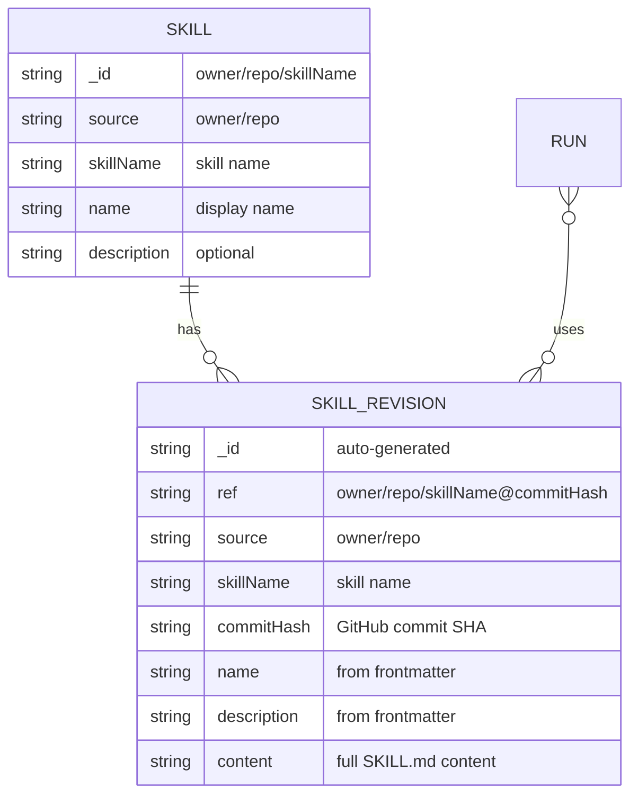
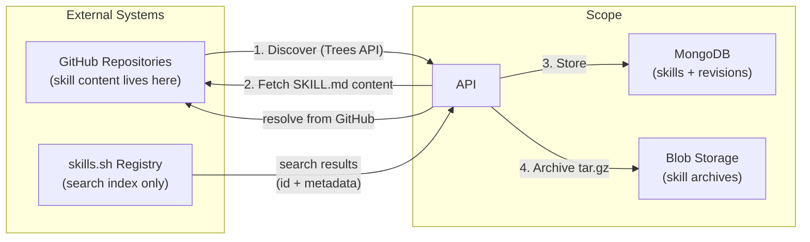
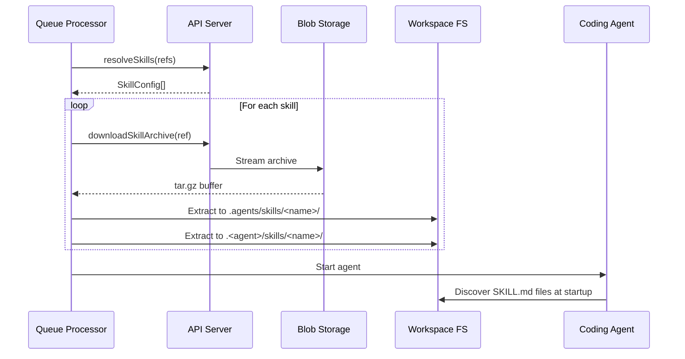

# Skills Architecture

> **Status:** Current as of February 2026.

Skills are reusable instruction packages that enhance coding agents with domain-specific knowledge. Scope integrates the [Agent Skills specification](https://agentskills.io/specification) to let benchmarks include skills alongside scenarios, personas, and MCP servers.

## Overview

```mermaid
flowchart TB
    subgraph Registration["Skill Registration"]
        GitHub["GitHub Repository<br/>(contains SKILL.md)"]
        API["API: POST /skills"]
        DB["MongoDB<br/>skills + skillRevisions"]
    end

    subgraph Resolution["Skill Resolution (Submit)"]
        CLI["CLI / Portal"]
        Resolve["API: resolve slug → ref"]
        Queue["Azure Storage Queue"]
    end

    subgraph Delivery["Skill Delivery (Worker)"]
        Worker["Queue Processor"]
        Archive["Blob Storage<br/>(skill-archives)"]
        Extract["Skill Extractor"]
        Workspace["Workspace Filesystem"]
        Agent["Coding Agent"]
    end

    GitHub -->|register| API
    API -->|store| DB
    CLI -->|submit with skills| Resolve
    Resolve -->|enqueue skillRevisions[]| Queue
    Queue -->|dequeue| Worker
    Worker -->|download archive| Archive
    Worker -->|extract| Extract
    Extract -->|write to disk| Workspace
    Agent -->|discover at startup| Workspace
```

## Data Model



- **Skill** — A registered skill, identified by `owner/repo/skillName`. Points to a GitHub repository containing a `SKILL.md` file.
- **SkillRevision** — An immutable, content-addressed snapshot of a skill at a specific commit. The `ref` format is `owner/repo/skillName@commitHash`.
- **Run.skillRevisions** — Array of skill revision refs attached to a run. These are resolved at submit time and remain immutable throughout the run lifecycle.

### Portal display

Run details display each skill slug with the first seven characters of its pinned commit hash. Legacy runs containing only bare `skills` slugs remain supported.

## Import Paths

Skills can be added to Scope's internal library through two distinct flows. In both cases, **GitHub is always the source of skill content** — the actual SKILL.md files live in GitHub repositories. Skills.sh is a separate search/discovery registry that indexes publicly available skills.



### Path 1: GitHub Discovery (primary)

Used when the user knows which GitHub repository contains skills.

1. User provides a GitHub repo (`owner/repo`) via Portal wizard or CLI
2. API calls `GET /api/v1/skills/discover?source=owner/repo` — scans the repo's well-known directories using the Trees API
3. User selects one or more discovered skills
4. API registers each skill (`POST /api/v1/skills`) and auto-resolves: fetches content from GitHub, archives it, and creates a `SkillRevision`

This is the **Portal Import Wizard** flow and the **CLI `skill import`** flow. The skill's `origin` is set to `"manual"`.

### Path 2: Skills.sh Search (discovery aid)

Used when the user doesn't know which repo contains the skill they want.

1. User searches via Portal or CLI (`skill search -q "react"`)
2. API queries both the internal DB and the [skills.sh](https://skills.sh) external registry
3. User selects a result from skills.sh
4. API imports it the same way as Path 1 — registers the skill and resolves content from GitHub

The skill's `origin` is set to `"skills-sh"` to indicate it was discovered through that registry.

### Key distinction

| Aspect | GitHub (Path 1) | Skills.sh (Path 2) |
|--------|-----------------|---------------------|
| What it provides | Actual skill content (SKILL.md files) | Search index / metadata |
| When to use | Know the repo containing skills | Browsing/searching for skills |
| Content source | Direct from GitHub | Still fetched from GitHub |
| Origin value | `"manual"` | `"skills-sh"` |

## Lifecycle

### 1. Registration

Skills are registered via the API by providing a GitHub source (`owner/repo`) and skill name. The API stores the skill record and immediately attempts to auto-resolve it: it fetches `SKILL.md` from GitHub at the latest commit, parses its YAML frontmatter (name, description, license, compatibility, etc.), uploads a tar.gz archive of the skill directory to Blob Storage, and creates the first `SkillRevision`. If auto-resolution fails (e.g., GitHub 404, network error), the skill record is still saved and the user can retry via `POST /api/v1/skills/:id/resolve`.

#### Lenient spec validation

Frontmatter is validated against the [Agent Skills spec](https://agentskills.io/specification), but validation is **non-blocking** for everything except a usable `description`. Spec *constraint* violations (length/format) do **not** fail the import — they are collected into the revision's `validationWarnings` array, which is surfaced in the Portal (`SkillDetail.tsx` banner + resolve toasts) and the CLI. This lets off-spec skills (e.g. an upstream skill with a 1057-char description) be imported while still flagging the deviation.

The one hard requirement is a present, non-empty `description`. The `description` is the metadata an agent loads at startup to decide *when* to activate a skill (per the spec's progressive-disclosure model), and it has no fallback — a skill without one can never be invoked, so it is rejected at parse time (`skill-parser.ts`) rather than imported as a dead entry. A missing `name`, by contrast, is recoverable: the spec requires `name` to match the parent directory, so the parser tolerates an absent name and `SkillResolver.resolve` falls back to the directory name.

| Frontmatter issue | Behavior |
|-------------------|----------|
| `name` longer than 64 characters | Warning, imports |
| `name` not lowercase alphanumeric + hyphens (bad format) | Warning, imports |
| `name` starts/ends with a hyphen or has consecutive hyphens | Warning, imports |
| `name` does not match the parent directory | Warning, imports |
| `name` missing | Recovered from the directory name, warning, imports |
| `description` longer than 1024 characters | Warning, imports |
| `compatibility` longer than 500 characters | Warning, imports |
| **`description` missing or empty** | **Hard error — rejected** (skill would be unusable) |
| **Unparseable YAML frontmatter** | **Hard error — rejected** |

`validateSkillFrontmatter` (`skill-validator.ts`) returns an `error` only for a missing `description` and `warnings` for every other issue (a missing `name`, which is recovered from the parent directory, and every spec-constraint violation). `SkillResolver.resolve` never throws on validation; it merges any errors and warnings into the stored `validationWarnings`. (The empty-`description` case never reaches the validator because `skill-parser.ts` rejects it first.)

#### Discovery

`GET /api/v1/skills/discover?source=owner/repo` lists every `SKILL.md` found under well-known directories (`skills/`, `.agents/skills/`, `.github/skills/`, `.claude/skills/`, `.copilot/skills/`, `.roo/skills/`, `.cursor/skills/`, and the repo root). Implementation: a single recursive Trees API call to enumerate the repo, then per-skill best-effort frontmatter parsing via `raw.githubusercontent.com` (which doesn't count against the API rate limit). The portal exposes this as a multi-step import wizard: the user enters a repository, picks one or more discovered skills, and the wizard fires parallel `POST /api/v1/skills` requests with per-skill progress feedback. Returns `404` if the repository does not exist, `400` for malformed sources, and `502` for upstream GitHub errors (including rate limits — set `GITHUB_TOKEN` on the API to raise the limit).

Each discovery result is enriched with **library state** so the wizard can distinguish skills that are already imported from skills that have upstream updates:

- `existsInLibrary` — a `SkillDocument` with this `source` + `skillName` exists.
- `currentRevisionCommitSha` — `commitHash` of the most recent stored `SkillRevision`.
- `latestUpstreamCommitSha` — latest commit touching the skill path on GitHub (resolved via `SkillResolver.getLatestCommitSha`).
- `updateAvailable` — `existsInLibrary && currentRevisionCommitSha !== latestUpstreamCommitSha`.
- `lastImportedAt` — ISO timestamp of the most recent revision.

The API runs `listBySkill(limit:1)` + `getLatestCommitSha` in parallel for each already-imported skill; upstream-lookup failures fall back to no-update rather than blocking discovery. The wizard renders three per-row badges driven by these fields — **New** (not in library, default-selected), **Update available** (default-selected, tooltip shows `current → upstream` short SHAs), and **Up to date** (dimmed, default-unchecked) — and "Select all" skips up-to-date entries.

### 2. Resolution (Submit Time)

When a run is submitted with skill slugs (e.g., `owner/repo/skillName`), the API resolves each slug to the latest `skillRevision` ref (`owner/repo/skillName@commitHash`). These immutable refs are stored on the run document.

### 3. Archiving

Each skill revision has a tar.gz archive stored in Azure Blob Storage (`skill-archives` container). The archive contains the full skill directory contents. Archives are served via:

```
GET /api/v1/skill-revisions/by-ref/:ref(*)/archive
```

### 4. Delivery (Worker)

When a worker picks up a queued run, the queue processor:

1. **Resolves** skill revision refs to `SkillConfig` objects via the API
2. **Downloads** each skill's tar.gz archive via `SkillClient.downloadSkillArchive(ref)`
3. **Extracts** to the workspace filesystem using `extractSkillsToWorkspace()`

The agent then discovers skills natively from the filesystem at startup.



### Filesystem Layout

Skills are extracted to well-known directories per the Agent Skills spec:

```
/workspace/
├── .agents/skills/           # Universal (Agent Skills spec)
│   └── <skillName>/
│       └── SKILL.md
├── .claude/skills/           # Claude Code specific
│   └── <skillName>/
│       └── SKILL.md
└── .copilot/skills/          # Copilot specific
    └── <skillName>/
        └── SKILL.md
```

Agent-specific directories are populated based on the worker type. The universal `.agents/skills/` directory is always populated.

## Agent Discovery

Coding agents automatically discover skills from well-known filesystem directories at startup:

- **GitHub Copilot** scans `.copilot/skills/` and `.agents/skills/`
- **Claude Code** scans `.claude/skills/` and `.agents/skills/`

No prompt injection or discovery hints are needed — the skill extractor places files on disk and agents find them natively per the [Agent Skills specification](https://agentskills.io/specification).

## Resubmit Behavior

When runs are resubmitted:

- **Default**: `skillRevisions` from the original run are copied to the new run
- **Override**: The resubmit dialog supports three modes:
  - **Keep** — retain the original run's skills
  - **Clear** — remove all skills (`skillRevisions: null`)
  - **Choose** — select specific skills from the union of all selected runs' skill revisions

## Key Files

| File | Purpose |
|------|---------|
| `packages/shared/src/skills/skill-client.ts` | API client for skill resolution and archive download |
| `packages/shared/src/skills/skill-extractor.ts` | Download + extract skill archives to workspace |
| `packages/shared/src/skills/skill-prompt.ts` | Discovery prompt generation (`<available_skills>` XML) |
| `packages/shared/src/skills/skill-resolver.ts` | Resolve skill slugs → revision refs via GitHub |
| `packages/shared/src/skills/skill-parser.ts` | Parse SKILL.md frontmatter (hard-requires `description`; recovers missing `name`) |
| `packages/shared/src/skills/skill-validator.ts` | Lenient spec validation → non-blocking `validationWarnings` |
| `packages/shared/src/queue/queue-processor.ts` | Orchestrates skill extraction before agent processing |
| `apps/api/src/index.ts` | REST endpoints for skills, revisions, archives |
| `apps/portal/src/pages/RunsList.tsx` | Skills column + resubmit override UI |
| `apps/portal/src/pages/SkillDetail.tsx` | Skill detail view + `validationWarnings` banner/toasts |
