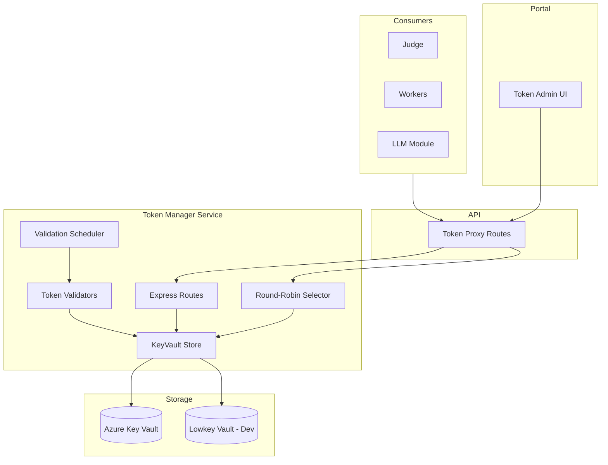
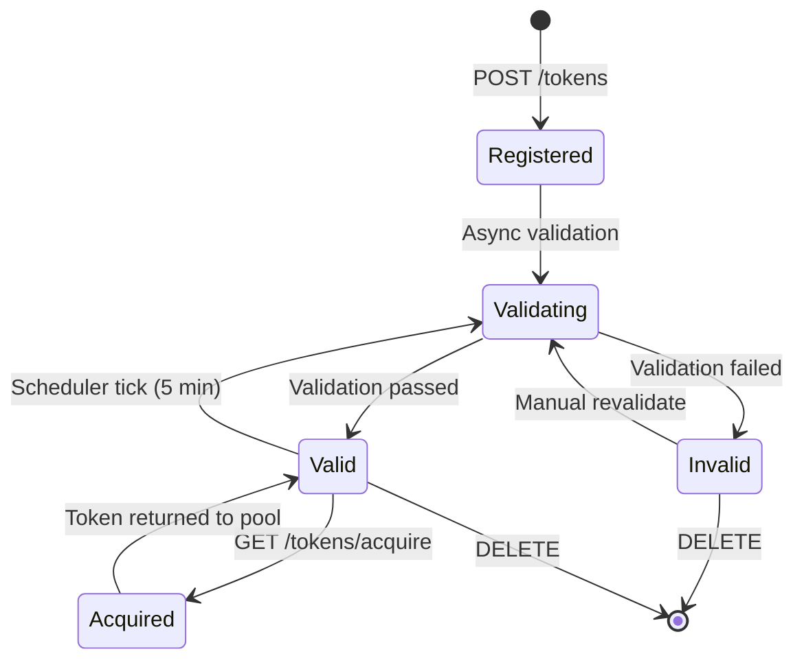

# Token Manager

The Token Manager is a centralized service for managing API tokens used by workers and services. It provides secure storage, automatic validation, and round-robin distribution of tokens.

## Architecture



## Capability-Based Model

The Token Manager uses a **capability-based model** where tokens are associated with the features they enable, rather than being tied to specific worker types. This allows flexible token reuse across services.

### Token Types

| Type | Prefix | Description |
|------|--------|-------------|
| `github-pat-classic` | `ghp_` | Classic GitHub Personal Access Token |
| `github-pat-fine-grained` | `github_pat_` | Fine-grained GitHub PAT with scoped permissions |
| `github-oauth` | `gho_` / `ghu_` | OAuth token from `gh auth login` |
| `github-oauth-cookie-state` | `{` (JSON) | Browser-extracted session cookies |
| `anthropic-api-key` | `sk-ant-` | Anthropic API key for Claude |
| `azure-ai-foundry` | `{` (JSON) | Endpoint + API key + optional model for an Azure AI Foundry chat-completions deployment |

The `azure-ai-foundry` secret stores a JSON blob:

```json
{ "endpoint": "https://<resource>.services.ai.azure.com/models", "apiKey": "…", "model": "gpt-4.1-mini" }
```

It is registered from the Portal at `/secrets/keys/new`. Credential validation
uses a 16-token completion budget, starts with `max_completion_tokens` and
configured sampling controls, then retries only when Foundry returns a
structured unsupported-parameter error. Output-limit and other unrelated
client errors remain validation failures.
The API uses the same negotiation at runtime and caches the learned shape in
memory by endpoint and deployment. The cache has no time-based expiration:
compatibility is relearned after an API process restart or when Azure rejects a
cached shape. A cached downgrade (for example, omitting `temperature`) cannot
detect that an Azure deployment changed in place to support the parameter,
because the downgraded request continues to succeed. Normal application
deployments restart the API and therefore renegotiate automatically. If a
Foundry deployment is upgraded or repointed under the same endpoint and model
name without restarting Scope, restart the API replicas to clear the cache and
relearn the preferred request shape. Credentials written by earlier versions
may contain a `requestProfile` field; the parser accepts and ignores it.

### Capabilities

| Capability | Description |
|------------|-------------|
| `github-models` | Access to GitHub Models API (GPT-4o, etc.) |
| `github-public-api` | Read-only access to the GitHub REST API for public repos (skill discovery / resolution) |
| `copilot-sdk` | GitHub Copilot SDK integration |
| `copilot-cli` | GitHub Copilot CLI authentication |
| `claude-code-cli` | Anthropic Claude Code CLI |
| `azure-ai-inference` | Chat-completion inference against an Azure AI Foundry deployment (used by the portal's AI features) |

`github-public-api` is granted to **any** valid GitHub bearer token (PAT classic, PAT fine-grained, OAuth, scopeless OAuth) since public-repo reads require no scopes.

### Acquisition Fallback Chain

`TokenManagerClient.acquireToken(capability)` resolves a token in three tiers, returning the first one that succeeds:

1. **Capability-specific env var** — e.g. `GITHUB_MODELS_TOKEN` for `github-models`, `ANTHROPIC_API_KEY` for `claude-code-cli`. Mapping lives in `KEY_CAPABILITY_ENV_VARS`.
3. **Token Manager HTTP service** — `GET /tokens/acquire?capability=...` against `TOKEN_MANAGER_URL`. This is the only tier used in production K8s deployments, where no static token env vars are mounted.

The API's discovery endpoint uses this chain via the `github-api-token` helper to acquire a `github-public-api` token per call, so each request can be served by a different token in round-robin.

### Token Type + Permissions → Capabilities Matrix

| Token Type | Permissions / Scope | How to Obtain | Validity | GitHub Models | Copilot SDK | Copilot CLI | Claude Code CLI | VS Code Copilot |
|------------|---------------------|---------------|----------|:-------------:|:-----------:|:-----------:|:---------------:|:---------------:|
| **GitHub PAT (classic)** `ghp_` | `copilot` | Settings → Tokens (classic) | No expiry or custom | ❌ | ✅¹ | ✅¹ | ❌ | ✅¹ |
| **GitHub PAT (fine-grained)** `github_pat_` | `models:read` | Settings → Fine-grained tokens | Max 1 year | ✅ | ❌ | ❌ | ❌ | ❌ |
| **GitHub OAuth** `gho_` | (all via OAuth flow) | `gh auth login` → `gh auth token` | Until revoked | ✅ | ✅¹ | ✅¹ | ❌ | ✅¹ |
| **GitHub OAuth cookie state** | (browser session) | Browser DevTools → cookies | Session-bound | ❌ | ❌ | ❌ | ❌ | ✅² |
| **Anthropic API Key** `sk-ant-` | (full access) | console.anthropic.com | Until revoked | ❌ | ❌ | ❌ | ✅ | ❌ |

¹ Requires active GitHub Copilot license.  
² Injected into VS Code Web browser context.

## Token Lifecycle



### States

| Status | Description |
|--------|-------------|
| `unknown` | Just registered, validation pending |
| `valid` | Token validated successfully, available for acquisition |
| `invalid` | Validation failed (wrong permissions, expired, etc.) |
| `expired` | Token has expired (detected during validation) |
| `error` | Validation encountered an error (network, rate limit, etc.) |

## API Endpoints

### Key Management

| Method | Endpoint | Description |
|--------|----------|-------------|
| `GET` | `/api/v1/keys` | List all keys (optionally filter by capability) |
| `POST` | `/api/v1/keys` | Register a new key |
| `POST` | `/api/v1/keys/preview` | Preview capabilities without registering |
| `GET` | `/api/v1/keys/:id` | Get key details (excludes secrets; includes the non-secret Foundry model name) |
| `PUT` | `/api/v1/keys/:id` | Update metadata and the optional Azure AI Foundry model override |
| `DELETE` | `/api/v1/keys/:id` | Delete a key |
| `POST` | `/api/v1/keys/:id/validate` | Trigger manual validation |

### Key Acquisition

| Method | Endpoint | Description |
|--------|----------|-------------|
| `GET` | `/api/v1/keys/acquire?capability=X` | Acquire a key for given capability |

The acquire endpoint uses round-robin selection among valid, enabled keys that provide the requested capability.

Updating the model override rewrites only the `model` property of the Foundry
credential stored in Key Vault; the endpoint and API key are preserved. The
key returns to `unknown` while the Token Manager validates the new deployment
in the background. The Portal polls the detail endpoint until that validation
finishes.

## Usage Tracking

Each key tracks:

| Field | Description |
|-------|-------------|
| `acquireCount` | Number of times token has been acquired |
| `lastAcquiredAt` | Timestamp of most recent acquisition |

This helps identify heavily-used tokens and detect potential issues with token distribution.

## MCP Secrets

Separately from Key Vault-backed API tokens, the Token Manager stores **MCP server secrets** (the
`env` values and `headers` a run needs to authenticate to an MCP server) in its **own MongoDB
collection** (`mcp-secrets`), exposed via `mcp-secret-routes.ts`. Secrets are **project-scoped**:

- Each secret document carries a `projectId`, a `mcpId` (the MCP server's **human slug**, never the
  server's internal UUID `_id`), and a `name`.
- The unique index is `{ projectId, mcpId, name }` (was the global-unique `{ mcpId, name }`), so the
  same slug + secret name can exist independently in different projects. The index is reconciled by
  **migration 028**, which drops the legacy global-unique `{ mcpId, name }` and (re)creates the
  compound `{ projectId, mcpId, name }`. token-manager also creates the compound index idempotently
  at startup (a harmless no-op once the migration has run).
- Every route filter and the insert path require `projectId` (read from the request); all client
  methods (`storeSecret`, `storeEnv`, `storeHeaders`, `listSecrets`, `resolveSecrets`,
  `deleteSecret`, `deleteAllSecrets`) take `projectId` as their first argument and forward it.
- On startup the service **backfills** `projectId` on any pre-existing secrets (deriving it from the
  referenced server, which is unambiguous because slugs were globally unique before the Projects
  feature).

These secrets live in the Token Manager's DB, but the db-migration Job reaches the same MongoDB (both
mount `mongo-config` + `mongo-secrets`, so they resolve the same `MONGO_DATABASE` /
`MONGO_CONNECTION_STRING`). The unique-index reconciliation therefore runs through
`packages/db-migrations` as **migration 028**; only the `projectId` value backfill still runs at
token-manager startup (moving that backfill into a migration too is a noted follow-up). See
[db.md → Per-project entity keying](db.md#per-project-entity-keying-migration-027) and
[mcp-gateway.md](mcp-gateway.md) for how a run resolves and hydrates these secrets project-scoped.

## Configuration

### Environment Variables

| Variable | Default | Description |
|----------|---------|-------------|
| `TOKEN_MANAGER_URL` | `http://token-manager:3003` | Token Manager service URL |
| `KEYVAULT_URL` | - | Azure Key Vault URL for token storage |
| `VALIDATION_INTERVAL_MS` | `300000` (5min) | Interval between validation runs |

### Local Development

For local development, the Token Manager uses [Lowkey Vault](https://github.com/nagyesta/lowkey-vault), an Azure Key Vault emulator. It's configured in `docker-compose.yml`:

```yaml
lowkey-vault:
  image: nagyesta/lowkey-vault:2.8.59
  ports:
    - "8443:8443"
  environment:
    LOWKEY_VAULT_NAMES: "scope-mt-vault"
```

## Integration Examples

### Acquiring a Token (Worker)

```typescript
import { TokenManagerClient } from "shared";

const client = new TokenManagerClient(process.env.TOKEN_MANAGER_URL);
const result = await client.acquireToken("copilot-sdk");

if (result) {
  console.log(`Using token ${result.id} for Copilot SDK`);
  // Use result.secret for API calls
}
```

### LLM Module Integration

The API's portal-LLM modules (`llm.ts`, `prompt-feature-llm.ts`,
`task-prompt-llm.ts`) all go through a shared
`acquireInferenceClient()` helper in `apps/api/src/llm-token.ts`. The
helper resolves a chat-completions client in this order, returning the
first source that succeeds:

1. **Azure AI Foundry via env vars** —
   `AZURE_AI_INFERENCE_ENDPOINT` + `AZURE_AI_INFERENCE_API_KEY`.
   Endpoint URLs missing the `/models` suffix are auto-corrected with a
   warning.
2. **Azure AI Foundry via the Token Manager** — fetched directly via
   `POST {TOKEN_MANAGER_URL}/api/v1/keys/acquire {capability:
   "azure-ai-inference"}` so the helper receives the full JSON blob
   (endpoint + key + model), not just the API key. The capability
   `azure-ai-inference` is derived from any registered `azure-ai-foundry`
   key.
3. **GitHub Models** — `GITHUB_MODELS_API_KEY` env var, then
   `TokenManagerClient.acquireToken("github-models")`, then `GITHUB_TOKEN`.

Each successful acquisition logs a single line:

```
[llm-token] inference provider: source=… via=… endpoint=… model=…
```

`via` distinguishes `azure-ai-foundry-env`,
`azure-ai-foundry-token-manager`, `github-models-env`,
`github-models-token-manager`, and `github-token`.

When none of the three tiers is configured, the helper throws a single
"LLM not configured" error that the route handlers convert into a 503
with an actionable message pointing at `/secrets/keys/new`.

**No automatic failover at request time.** The chain only steps down
when the predecessor returns *nothing* (env var unset, no key
registered). It does **not** step down when the predecessor returns a
credential that then 4xx/5xx's on the chat-completion call — that error
propagates to the user verbatim. This is intentional: silent fallback
would mask a misconfigured higher-priority backend (e.g. a wrong Foundry
deployment name) and the operator would never realise they were paying
the slower fallback's latency.

```typescript
import { acquireInferenceClient } from "./llm-token.js";

const { client, model: foundryModel } = await acquireInferenceClient();
const modelName = explicit || foundryModel || process.env.LLM_MODEL || "gpt-4.1";
await client.path("/chat/completions").post({ body: { messages, model: modelName, … } });
```

The legacy `acquireGitHubModelsToken()` helper still exists for callers
that specifically need a GitHub Models bearer token; it follows the same
1→3 chain restricted to the GitHub Models tiers.
