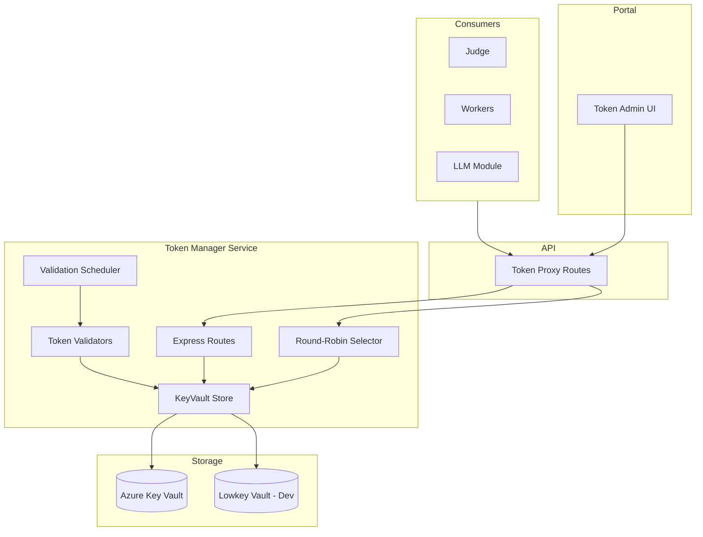
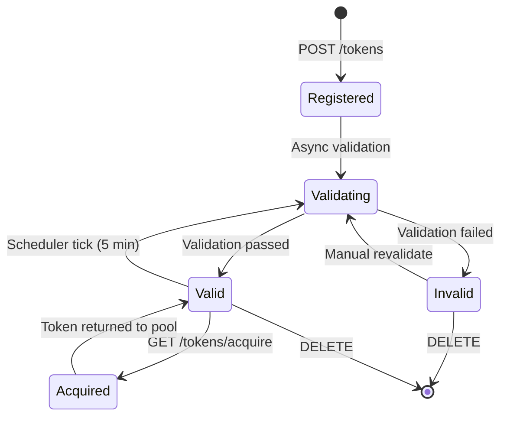

# Token Manager

The Token Manager is a centralized service for managing API tokens used by workers and services. It provides secure storage, automatic validation, and round-robin distribution of tokens.

## Architecture


```mermaid
graph TB
    subgraph Portal
        UI[Token Admin UI]
    end

    subgraph API
        Proxy[Token Proxy Routes]
    end

    subgraph TokenManager[Token Manager Service]
        Routes[Express Routes]
        Scheduler[Validation Scheduler]
        RoundRobin[Round-Robin Selector]
        Validators[Token Validators]
        Store[KeyVault Store]
    end

    subgraph Storage
        KV[(Azure Key Vault)]
        LKV[(Lowkey Vault - Dev)]
    end

    subgraph Consumers
        Judge[Judge]
        Workers[Workers]
        LLM[LLM Module]
    end

    UI --> Proxy
    Proxy --> Routes
    Routes --> Store
    Store --> KV
    Store --> LKV
    Scheduler --> Validators
    Validators --> Store
    Consumers --> Proxy
    Proxy --> RoundRobin
    RoundRobin --> Store
```

## Capability-Based Model

The Token Manager uses a **capability-based model** where tokens are associated with the features they enable, rather than being tied to specific worker types. This allows flexible token reuse across services.

### Token Types

| Type | Prefix | Description |
|------|--------|-------------|
| `github-pat-classic` | `ghp_` | Classic GitHub Personal Access Token |
| `github-pat-fine-grained` | `github_pat_` | Fine-grained GitHub PAT with scoped permissions |
| `github-oauth` | `gho_` / `ghu_` | OAuth token from `gh auth login` |
| `github-oauth-cookie-state` | `{` (JSON) | Browser-extracted session cookies |
| `anthropic-api-key` | `sk-ant-` | Anthropic API key for Claude |
| `azure-ai-foundry` | `{` (JSON) | Endpoint + API key + optional model for an Azure AI Foundry chat-completions deployment |
| `openai-api-key` | `{` (JSON) | OpenAI endpoint + API key + model |
| `openrouter-api-key` | `{` (JSON) | OpenRouter endpoint + API key + provider-qualified model |
| `openai-compatible` | `{` (JSON) | Bearer-authenticated OpenAI-compatible chat endpoint + API key + model |

The `azure-ai-foundry` secret stores a JSON blob:

```json
{ "endpoint": "https://<resource>.services.ai.azure.com/models", "apiKey": "…", "model": "gpt-4.1-mini" }
```

It is registered from the Portal at `/secrets/keys/new`. The API
validates new keys by issuing a single `chat/completions` probe against
the endpoint with `max_tokens=1`, so a misconfigured endpoint (missing
`/models` suffix) or a wrong deployment name surfaces immediately at
registration time.

The three new compatible credential types store the same JSON shape, with **all
three fields required**:

```json
{ "endpoint": "https://api.openai.com/v1", "apiKey": "…", "model": "gpt-4.1" }
```

Portal presets are OpenAI (`https://api.openai.com/v1`, `gpt-4.1`) and OpenRouter
(`https://openrouter.ai/api/v1`, `openai/gpt-4.1`). The compatible option requires
an explicit base endpoint and model. Supported protocol: non-streaming, text-only
`POST /chat/completions`, bearer authentication, and an OpenAI-style
`choices[].message.content` response. HTTPS is required except for explicit
HTTP localhost/loopback endpoints. URL credentials, queries, fragments, and
redirects are rejected. Endpoint URLs are resolved from the API/Token Manager
network, not from the browser (a container's `localhost` is that container).

Preview, registration validation and scheduled revalidation issue a minimal
chat request against the chosen model. These probes can incur provider usage.
New provider validators and inference transports use one bounded shared retry
layer for transient failures; authentication and other permanent 4xx responses
do not retry. Portal OpenAI and Foundry authoring requests for recognized
GPT-5/o1/o3/o4 model IDs use `max_completion_tokens` and omit unsupported
temperature. Both transports share a small, pure request-parameter normalizer;
Foundry still uses the existing Azure REST client, authentication and endpoint.
Legacy Foundry models such as `gpt-4.1` retain their existing request shape,
including `max_tokens` and temperature. These Portal parameter adaptations do
not change Token Manager validation probes. New provider transports do not echo
raw error bodies; existing Foundry error handling is preserved.

**Anthropic remains `anthropic-api-key` with the existing raw `sk-ant-…` value.**
No credential conversion or new Anthropic secret type is needed. Portal
inference uses native `/v1/messages` with `x-api-key` and `anthropic-version`;
it omits optional temperature and uses the service's sampling defaults, because
Sonnet 5 rejects that deprecated parameter. Model, system instructions, messages,
token limit and parsed text output retain their existing shape.
Claude Code and the model scanner retain their existing credential behavior.
Subscription OAuth keys do not provide the `anthropic-api` capability.

### Capabilities

| Capability | Description |
|------------|-------------|
| `github-models` | Access to GitHub Models API (GPT-4o, etc.) |
| `github-public-api` | Read-only access to the GitHub REST API for public repos (skill discovery / resolution) |
| `copilot-sdk` | GitHub Copilot SDK integration |
| `copilot-cli` | GitHub Copilot CLI authentication |
| `claude-code-cli` | Anthropic Claude Code CLI |
| `azure-ai-inference` | Chat-completion inference against an Azure AI Foundry deployment (used by the portal's AI features) |
| `openai-api` | Portal authoring against OpenAI |
| `openrouter-api` | Portal authoring against OpenRouter |
| `openai-compatible` | Portal authoring against a configured compatible endpoint |

`github-public-api` is granted to **any** valid GitHub bearer token (PAT classic, PAT fine-grained, OAuth, scopeless OAuth) since public-repo reads require no scopes.

### Acquisition Fallback Chain

`TokenManagerClient.acquireToken(capability)` resolves a token in three tiers, returning the first one that succeeds:

1. **Capability-specific env var** — e.g. `GITHUB_MODELS_TOKEN` for `github-models`, `ANTHROPIC_API_KEY` for `claude-code-cli`. Mapping lives in `KEY_CAPABILITY_ENV_VARS`.
3. **Token Manager HTTP service** — `GET /tokens/acquire?capability=...` against `TOKEN_MANAGER_URL`. This is the only tier used in production K8s deployments, where no static token env vars are mounted.

The API's discovery endpoint uses this chain via the `github-api-token` helper to acquire a `github-public-api` token per call, so each request can be served by a different token in round-robin.

### Token Type + Permissions → Capabilities Matrix

| Token Type | Permissions / Scope | How to Obtain | Validity | GitHub Models | Copilot SDK | Copilot CLI | Claude Code CLI | VS Code Copilot |
|------------|---------------------|---------------|----------|:-------------:|:-----------:|:-----------:|:---------------:|:---------------:|
| **GitHub PAT (classic)** `ghp_` | `copilot` | Settings → Tokens (classic) | No expiry or custom | ❌ | ✅¹ | ✅¹ | ❌ | ✅¹ |
| **GitHub PAT (fine-grained)** `github_pat_` | `models:read` | Settings → Fine-grained tokens | Max 1 year | ✅ | ❌ | ❌ | ❌ | ❌ |
| **GitHub OAuth** `gho_` | (all via OAuth flow) | `gh auth login` → `gh auth token` | Until revoked | ✅ | ✅¹ | ✅¹ | ❌ | ✅¹ |
| **GitHub OAuth cookie state** | (browser session) | Browser DevTools → cookies | Session-bound | ❌ | ❌ | ❌ | ❌ | ✅² |
| **Anthropic API Key** `sk-ant-` | (full access) | console.anthropic.com | Until revoked | ❌ | ❌ | ❌ | ✅ | ❌ |

¹ Requires active GitHub Copilot license.  
² Injected into VS Code Web browser context.

## Token Lifecycle


```mermaid
stateDiagram-v2
    [*] --> Registered : POST /tokens
    Registered --> Validating : Async validation
    Validating --> Valid : Validation passed
    Validating --> Invalid : Validation failed
    Valid --> Acquired : GET /tokens/acquire
    Acquired --> Valid : Token returned to pool
    Valid --> Validating : Scheduler tick (5 min)
    Invalid --> Validating : Manual revalidate
    Invalid --> [*] : DELETE
    Valid --> [*] : DELETE
```

### States

| Status | Description |
|--------|-------------|
| `unknown` | Just registered, validation pending |
| `valid` | Token validated successfully, available for acquisition |
| `invalid` | Validation failed (wrong permissions, expired, etc.) |
| `expired` | Token has expired (detected during validation) |
| `error` | Validation encountered an error (network, rate limit, etc.) |

## API Endpoints

### Key Management

| Method | Endpoint | Description |
|--------|----------|-------------|
| `GET` | `/api/v1/keys` | List all keys (optionally filter by capability) |
| `POST` | `/api/v1/keys` | Register a new key |
| `POST` | `/api/v1/keys/preview` | Preview capabilities without registering |
| `GET` | `/api/v1/keys/:id` | Get key details (excludes secret) |
| `DELETE` | `/api/v1/keys/:id` | Delete a key |
| `POST` | `/api/v1/keys/:id/validate` | Trigger manual validation |
| `GET` | `/api/v1/keys/portal-ai` | Read the instance's non-secret Portal AI selection |
| `PUT` | `/api/v1/keys/portal-ai` | Replace the Portal AI selection |

### Key Acquisition

| Method | Endpoint | Description |
|--------|----------|-------------|
| `POST` | `/api/v1/keys/acquire` | Acquire a key for a capability supplied in the JSON body (internal only) |

The acquire endpoint uses round-robin selection among valid, enabled keys that provide the requested capability.

The internal acquisition method is `POST /api/v1/keys/acquire` with
`{ capability, keyType?, strictKeyType?, keyId? }`. Existing callers retain
`keyType` preference/fallback behavior. Portal explicit selections use
`strictKeyType: true`, so an unavailable provider does not silently select
another type. Optional `keyId` pins a credential; it is still checked for
capability, type, enabled/valid state, deletion and expiry. Without `keyId`,
selection round-robins within that provider's credential type. Expired keys
are excluded even before the next scheduler tick.

### Selecting the Portal AI provider

After registering a credential at `/secrets/keys/new`, use the **Portal AI**
controls at `/secrets/keys` to select a provider, optionally pin a credential,
and optionally override its model. The controls call the existing authenticated
API transport and Secrets proxy:

```http
PUT /api/v1/keys/portal-ai
Content-Type: application/json

{"provider":"openrouter","keyId":"<registered-key-id>","model":"openai/gpt-4.1"}
```

The response and `GET` shape are `{ provider, keyId?, model? }`. Supported
`provider` values are `auto`, `azure-ai-foundry`, `github-models`, `anthropic`,
`openai`, `openrouter`, and `openai-compatible`. `keyId` and `model` are optional
nonempty strings. `{"provider":"auto"}` clears overrides and restores the legacy
Foundry → GitHub Models chain; `auto` does not accept `keyId` or `model`.
If provided, the pinned key must be valid, enabled, unexpired and compatible
with the selected provider.

Both public routes are registered through the API's `apiRoute`/OpenAPI
registry. `PortalAiSettingsSchema` documents the response, and
`UpdatePortalAiSettingsSchema` validates PUT input in both API and Token Manager.
The schemas use the canonical `PORTAL_AI_PROVIDERS` values, reject blank optional
fields and disallow overrides with `auto`. They are exported from `shared`.
The routes remain discoverable when Token Manager is disabled and return **503**
without making an upstream request; the existing secret CRUD proxies keep their
previous conditional registration and forwarding behavior.

The selection is one non-secret document (`_id: "default"`) in Token Manager's
`portal-ai-settings` collection, atomically replaced on update. An absent
document means `auto`. No migration or custom index is required: existing key
documents and vault values are unchanged, and settings use the built-in `_id`
index. This is not a model catalog or provider registry.

An explicit selection takes precedence over legacy Foundry environment defaults,
uses the stored credential rather than a provider environment variable, and
never falls through to another provider on errors. Pin a key when compatible
endpoints/models differ. Settings-read failures also fail closed rather than
guessing another backend. Anthropic's default model is
`claude-sonnet-5`; use the model override to choose another available
model. Compatible provider secrets carry their required model. Existing
extraction calls with an explicit `model` argument retain that override.

All existing Portal AI calls automatically use this saved selection; request
and result shapes remain unchanged:

| POST endpoint | Body | Result |
|---|---|---|
| `/api/v1/criteria/generate-prompt` | `{ behavior, currentId?, gates? }` | `{ prompt, suggestedId, suggestedParents, suggestedChildren }` |
| `/api/v1/prompt-features/generate-prompt` | `{ behavior, currentId? }` | `{ prompt, suggestedId }` |
| `/api/v1/task-prompts/generate` | `{ description?, existingPrompt? }` | `{ taskPrompt }` |
| `/api/v1/prompt-features/extract-from-text` | `{ text, model?, type? }` | `{ features, suggestedFeatures?, cached }` |

Existing project query parameters remain unchanged. The API helpers also accept
an optional final `PortalAiSettings` argument for an explicit per-call selection;
the public routes use the saved setting, not a new body field. Judge, feedback,
reports, coding-agent credentials and worker scheduling do not use this setting.

## Usage Tracking

Each key tracks:

| Field | Description |
|-------|-------------|
| `acquireCount` | Number of times token has been acquired |
| `lastAcquiredAt` | Timestamp of most recent acquisition |

This helps identify heavily-used tokens and detect potential issues with token distribution.

## MCP Secrets

Separately from Key Vault-backed API tokens, the Token Manager stores **MCP server secrets** (the
`env` values and `headers` a run needs to authenticate to an MCP server) in its **own MongoDB
collection** (`mcp-secrets`), exposed via `mcp-secret-routes.ts`. Secrets are **project-scoped**:

- Each secret document carries a `projectId`, a `mcpId` (the MCP server's **human slug**, never the
  server's internal UUID `_id`), and a `name`.
- The unique index is `{ projectId, mcpId, name }` (was the global-unique `{ mcpId, name }`), so the
  same slug + secret name can exist independently in different projects. The index is reconciled by
  **migration 028**, which drops the legacy global-unique `{ mcpId, name }` and (re)creates the
  compound `{ projectId, mcpId, name }`. token-manager also creates the compound index idempotently
  at startup (a harmless no-op once the migration has run).
- Every route filter and the insert path require `projectId` (read from the request); all client
  methods (`storeSecret`, `storeEnv`, `storeHeaders`, `listSecrets`, `resolveSecrets`,
  `deleteSecret`, `deleteAllSecrets`) take `projectId` as their first argument and forward it.
- On startup the service **backfills** `projectId` on any pre-existing secrets (deriving it from the
  referenced server, which is unambiguous because slugs were globally unique before the Projects
  feature).

These secrets live in the Token Manager's DB, but the db-migration Job reaches the same MongoDB (both
mount `mongo-config` + `mongo-secrets`, so they resolve the same `MONGO_DATABASE` /
`MONGO_CONNECTION_STRING`). The unique-index reconciliation therefore runs through
`packages/db-migrations` as **migration 028**; only the `projectId` value backfill still runs at
token-manager startup (moving that backfill into a migration too is a noted follow-up). See
[db.md → Per-project entity keying](db.md#per-project-entity-keying-migration-027) and
[mcp-gateway.md](mcp-gateway.md) for how a run resolves and hydrates these secrets project-scoped.

## Configuration

### Environment Variables

| Variable | Default | Description |
|----------|---------|-------------|
| `TOKEN_MANAGER_URL` | `http://token-manager:3003` | Token Manager service URL |
| `KEYVAULT_URL` | - | Azure Key Vault URL for token storage |
| `VALIDATION_INTERVAL_MS` | `300000` (5min) | Interval between validation runs |

### Local Development

For local development, the Token Manager uses [Lowkey Vault](https://github.com/nagyesta/lowkey-vault), an Azure Key Vault emulator. It's configured in `docker-compose.yml`:

```yaml
lowkey-vault:
  image: nagyesta/lowkey-vault:2.8.59
  ports:
    - "8443:8443"
  environment:
    LOWKEY_VAULT_NAMES: "scope-mt-vault"
```

## Integration Examples

### Acquiring a Token (Worker)

```typescript
import { TokenManagerClient } from "shared";

const client = new TokenManagerClient(process.env.TOKEN_MANAGER_URL);
const result = await client.acquireToken("copilot-sdk");

if (result) {
  console.log(`Using token ${result.id} for Copilot SDK`);
  // Use result.secret for API calls
}
```

### LLM Module Integration

The API's portal-LLM modules (`llm.ts`, `prompt-feature-llm.ts`,
`task-prompt-llm.ts`) all go through a shared
`acquireInferenceClient()` helper in `apps/api/src/llm-token.ts`. The
helper first honors the saved explicit Portal AI selection above. In automatic
mode it resolves a chat-completions client in this order, returning the
first source that succeeds:

1. **Azure AI Foundry via env vars** —
   `AZURE_AI_INFERENCE_ENDPOINT` + `AZURE_AI_INFERENCE_API_KEY`.
   Endpoint URLs missing the `/models` suffix are auto-corrected with a
   warning.
2. **Azure AI Foundry via the Token Manager** — fetched directly via
   `POST {TOKEN_MANAGER_URL}/api/v1/keys/acquire {capability:
   "azure-ai-inference"}` so the helper receives the full JSON blob
   (endpoint + key + model), not just the API key. The capability
   `azure-ai-inference` is derived from any registered `azure-ai-foundry`
   key.
3. **GitHub Models** — `GITHUB_MODELS_API_KEY` env var, then
   `TokenManagerClient.acquireToken("github-models")`, then `GITHUB_TOKEN`.

Each successful acquisition logs a single line:

```
[llm-token] inference provider: source=… via=… endpoint=… model=…
```

`via` distinguishes `azure-ai-foundry-env`,
`azure-ai-foundry-token-manager`, `github-models-env`,
`github-models-token-manager`, and `github-token`.

When none of the three tiers is configured, the helper throws a single
"LLM not configured" error that the route handlers convert into a 503
with an actionable message pointing at `/secrets/keys/new`.

**No automatic failover at request time.** The chain only steps down
when the predecessor returns *nothing* (env var unset, no key
registered). It does **not** step down when the predecessor returns a
credential that then 4xx/5xx's on the chat-completion call — that error
propagates to the user verbatim. This is intentional: silent fallback
would mask a misconfigured higher-priority backend (e.g. a wrong Foundry
deployment name) and the operator would never realise they were paying
the slower fallback's latency.

```typescript
import { acquireInferenceClient } from "./llm-token.js";

const { client, model: foundryModel } = await acquireInferenceClient();
const modelName = explicit || foundryModel || process.env.LLM_MODEL || "gpt-4.1";
await client.path("/chat/completions").post({ body: { messages, model: modelName, … } });
```

The legacy `acquireGitHubModelsToken()` helper still exists for callers
that specifically need a GitHub Models bearer token; it follows the same
1→3 chain restricted to the GitHub Models tiers.
