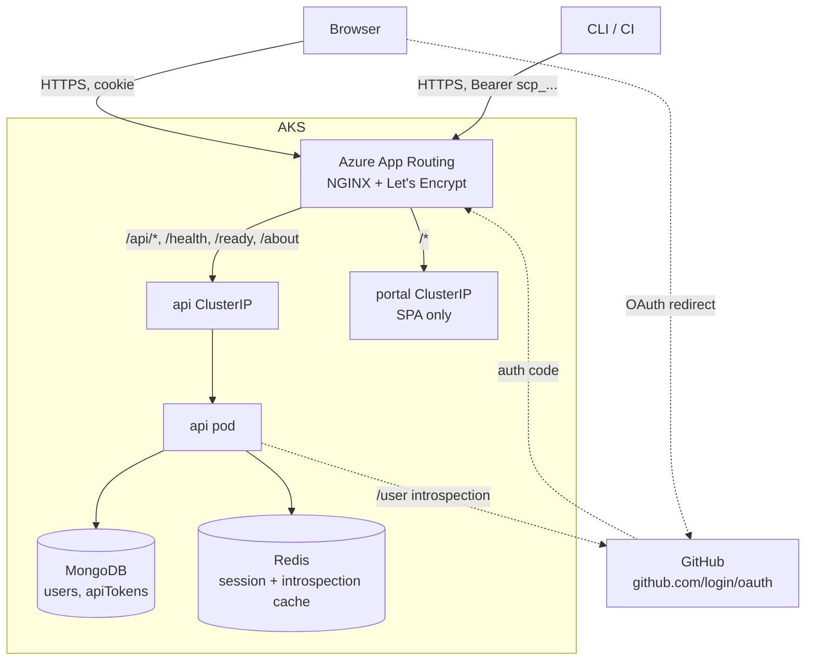
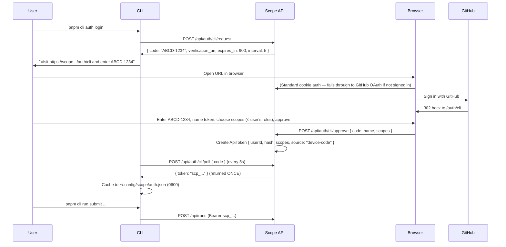

# User Authentication

> **Status:** Design — not yet implemented. Tracked in [scope-project#83](https://github.com/growth-ecosystems/scope-project/issues/83).

The Scope Portal, API, and CLI currently expose every endpoint without identity. This document specifies how we add user authentication using a **GitHub App** as the initial identity provider, with a **built-in user management system** owned by Scope, and **Scope-issued tokens** for CLI/automation so that the CLI surface stays IdP-agnostic.

## Goals

- Require an authenticated identity for every Portal page and every API call (with a small allow-list for `/health`, `/ready`, `/about`).
- Keep authorization decisions inside Scope — admins manage who has access via Portal/CLI without touching GitHub.
- Preserve frictionless local development via an `AUTH_DISABLED` escape hatch.
- Maintain CLI ↔ Portal feature parity (per [AGENTS.md](../../AGENTS.md)).
- Lay groundwork for additional identity providers (Entra, etc.) without churn in the data model, middleware, Portal admin UI, or CLI.
- Lay groundwork for finer-grained authorization (teams, allowlists) without implementing it now.

## Non-goals (v1)

- Fine-grained per-resource ACLs. v1 ships three coarse roles: `viewer`, `submitter`, `admin`.
- Per-resource ownership / "my runs only" filters (deferred to a follow-up issue).
- Replacing agent-side or worker-side auth flows (Copilot tokens, MCP secrets, GitHub cookies for VS Code Web).
- Multi-IdP at launch — the structure supports it, but only GitHub ships in v1.

## Why GitHub (vs Entra) for v1

- Engineers using Scope are GitHub users by definition (they consume Copilot/Claude Code via GitHub-issued credentials).
- A GitHub App issues short-lived user access tokens **with refresh tokens** (OAuth Apps don't), giving us modern token hygiene without bespoke refresh logic.
- Reuses an identity our users already have — no "new account to create" onboarding step.
- No tenant-admin negotiation, no group-membership setup.

The introspection-vs-JWT tradeoff (GitHub tokens are opaque) is mitigated by the Redis cache that's already in the stack. Adding Entra later is a sibling provider implementation behind the same interface — see [§ IdP portability](#idp-portability).

## Approach summary

- **Identity provider:** GitHub App. No GitHub org-membership check — access is gated by an explicit Scope-managed allowlist.
- **Authorization:** Owned by Scope via a `users` MongoDB collection.
- **Browser:** OAuth web flow → encrypted `HttpOnly` session cookie holding the GitHub access+refresh tokens. JS never sees a token.
- **CLI/CI:** Scope-issued opaque token (`scp_…`), obtained via a Scope device-code-style flow. The CLI never talks to GitHub directly. This makes the CLI fully IdP-agnostic.
- **IdP-portable from v1:** GitHub-specific code lives behind an `IdentityProvider` interface; the `User` schema uses an `identities[]` array.

## Architecture



The API is the only component that talks to GitHub. The Portal never sees a GitHub token (HttpOnly cookie). The CLI holds a Scope token — it has no knowledge of which IdP authenticated the user.

## Auth token types

Excludes worker/agent tokens (Copilot, Claude API keys, GitHub cookies for VS Code Web — those have their own lifecycle).

| # | Token | Format | Lifetime | Issuer | Stored where | Used by | Purpose |
|---|---|---|---|---|---|---|---|
| 1 | **Session cookie** | `scope_session=<AES-256-GCM blob>` (`HttpOnly; Secure; SameSite=Lax`) | 8 h sliding (auto-refreshed) | Scope API | Browser cookie jar | Portal (browser) | Carries the user's GitHub access + refresh tokens, encrypted with `SESSION_COOKIE_KEY`. Never visible to JS. |
| 2 | **GitHub user access token** | Opaque `ghu_…` | 8 h | GitHub (App OAuth) | Inside #1's encrypted payload | API → GitHub introspection only | Provider-side credential. Validates user identity on cache miss. Invisible outside the API. |
| 3 | **GitHub refresh token** | Opaque | 6 mo | GitHub | Inside #1's encrypted payload | API only | Refreshes #2 silently before expiry. |
| 4 | **OAuth `state`** | Random 32-byte hex | 5 min | Scope API | Redis | Scope API | CSRF protection on `/api/auth/github/callback`. |
| 5 | **CLI device-code request code** | Opaque | 15 min (`CLI_DEVICE_CODE_TTL_SECONDS`) | Scope API | Redis | CLI ↔ user browser ↔ API | Pairs a CLI session with browser approval at `/auth/cli`. Exchanged for #6. |
| 6 | **Scope API token** | `scp_<22 base62>` | 90 d default (`CLI_TOKEN_DEFAULT_TTL_DAYS`), or admin-set | Scope API | `apiTokens` collection (sha256 only); `~/.config/scope/auth.json` on client (mode `0600`) | CLI, CI | Bearer token for all CLI/automation calls. IdP-agnostic. Bound to a `User` (`kind: "human" \| "service"`); scopes ⊆ user's roles. Revocable individually or by disabling the user. |
| 7 | **Local-dev bypass** | (no token — `AUTH_DISABLED=true` env var) | n/a | n/a | n/a | API | Injects a synthetic admin user. Never set in deployed envs. |

Key distinctions:

- **Tokens the API issues:** #1, #4, #5, #6.
- **Tokens GitHub issues:** #2, #3 (only ever held by the API, embedded inside #1).
- **Tokens that travel as bearer-equivalent to Scope APIs:** #1 (browser, as cookie) and #6 (CLI/CI, as `Authorization: Bearer`).

From the user's point of view there are **two** credentials they hold:
1. The **session cookie** (browsers).
2. The **`scp_…` API token** (CLI, CI, scripts).

Everything else is implementation plumbing.

## Data model

### `users`

Replaces the empty placeholder at [packages/shared/src/schemas/account.ts](../../packages/shared/src/schemas/account.ts) with `user.ts`:

```ts
User {
  _id: ObjectId
  kind: "human" | "service"     // service accounts have no identities[]
  identities: [{
    provider: "github"          // future: | "entra" | ...
    subject: string             // stable provider-side ID (GitHub: githubId as string)
    login: string               // refreshed every login
    email: string | null
  }]
  primaryLogin: string          // denormalized for display + lookups
  name: string | null
  avatarUrl: string | null

  status: "active" | "pending" | "disabled"
  roles: ("admin" | "submitter" | "viewer")[]

  invitedBy: ObjectId | "bootstrap" | null
  createdAt: Date
  lastSeenAt: Date | null
  disabledAt: Date | null
  disabledBy: ObjectId | null
  notes: string | null
}
```

Indexes: unique compound `(identities.provider, identities.subject)`, unique `primaryLogin`.

**Bootstrap rule:** `BOOTSTRAP_ADMIN_GITHUB_LOGINS` (comma-separated) — on API startup, upsert each as `{ status: "active", roles: ["admin"], invitedBy: "bootstrap" }`. Solves the first-admin problem.

### `apiTokens`

```ts
ApiToken {
  _id: ObjectId
  userId: ObjectId            // who owns it
  name: string                // user-supplied label, e.g. "laptop", "ci-main"
  prefix: string              // first 8 chars of the token, for display ("scp_a1b2c3d4")
  hash: string                // sha256(fullToken) — only this is stored
  scopes: ("admin" | "submitter" | "viewer")[]   // ⊆ user's roles at issue time
  createdAt: Date
  lastUsedAt: Date | null
  expiresAt: Date | null      // null = no expiry; default 90d
  revokedAt: Date | null
  source: "device-code" | "portal-issued" | "ci-bootstrap"
}
```

Indexes: unique on `hash`, compound on `(userId, revokedAt)`.

The full token is shown to the user **once** on creation. We store only `sha256(token)`. Wire format: `scp_<22 chars base62>` — opaque, prefix tells humans (and log scrubbers) what it is.

### Migrations

One migration in [packages/db-migrations](../../packages/db-migrations) creates both collections + indexes. Idempotent.

## Components

### 1. GitHub App registration

One App per environment (`Scope (int)`, `Scope (prod)`), or one App with multiple callback URLs.

| Property | Value |
|---|---|
| Permissions | `User → Email (read)` only |
| Request user authorization during installation | Yes |
| Expire user tokens | Yes (8h access, 6mo refresh) |
| Callback URLs | `https://<host>/api/auth/github/callback` per env |
| Webhooks | Disabled |
| Device flow | Disabled — CLI uses Scope's own device-code flow |

No org permissions — authorization lives entirely in Scope's `users` collection.

### 2. API folder layout (IdP-portable)

```
apps/api/src/auth/
  middleware.ts            // IdP-agnostic — extracts token, dispatches to cookie or scp_ branch
  policy.ts                // route → required role table
  require-role.ts          // role helper middleware
  user-routes.ts           // /api/users/* admin endpoints
  token-routes.ts          // /api/tokens/* self-service + /api/auth/cli/{request,poll,approve}
  session-cookie.ts        // AES-256-GCM envelope
  providers/
    types.ts               // IdentityProvider interface
    registry.ts            // resolves provider by name
    github/
      introspect.ts        // GET /user, Redis-cached
      oauth-routes.ts      // /api/auth/github/{login,callback,logout}
```

`IdentityProvider` interface:

```ts
interface IdentityProvider {
  name: string
  buildAuthorizeRedirect(state: string): string
  exchangeCode(code: string): Promise<{ accessToken; refreshToken; accessExpiresAt }>
  introspect(token: string): Promise<{ subject; login; name?; email? } | null>
  refresh(refreshToken: string): Promise<{ accessToken; refreshToken; accessExpiresAt }>
}
```

v1 ships one implementation (`github`). Adding Entra later is a sibling folder — no changes to middleware, policy, user routes, admin UI, or CLI.

### 3. Middleware behaviour

Per request, before any route except `/health`, `/ready`, `/about`, `/api/auth/*`:

```
1. Extract token:
   - Cookie scope_session (browser, decrypted) → "session" branch
   - Authorization: Bearer scp_… (CLI/CI) → "scope-token" branch
   - SSE only: ?access_token= query param
2. Dispatch:

   SESSION BRANCH:
     a. Redis lookup auth-cookie:<sha256(token)> → { userId, accessExpiresAt }
     b. On miss or expiring: provider.introspect() (or provider.refresh())
        - On 401, clear cookie, return 401.
     c. Lookup User by (provider, subject); apply status checks.

   SCOPE-TOKEN BRANCH:
     a. Redis lookup auth-token:<sha256(token)> → { userId, scopes }  (60s TTL)
     b. On miss: ApiToken.findOne({ hash, revokedAt: null, expiresAt > now })
        - If not found, 401.
     c. Lookup User by token.userId; apply status checks.
     d. Effective roles = user.roles ∩ token.scopes.

3. User status handling (both branches):
   - "active"  → set lastSeenAt, attach req.user, proceed.
   - "pending" → 403 { code: "USER_PENDING" }.
   - "disabled" → 403 { code: "USER_DISABLED" }.

4. attach req.user = { id, login, name, roles }
```

The two branches converge on the same `User` lookup and the same `req.user` shape. Browsers always use the cookie path; CLI/CI always use the Bearer path.

**Revocation semantics:**
- Disabling a user → `User.status === "disabled"` is checked after the token lookup → all their cookies and tokens are rejected immediately (after Redis TTL — ≤60s for tokens, ≤5min for cookies).
- Revoking a single token → effective on next cache miss (≤60s).
- Portal sign-out → invalidates only the cookie, not CLI tokens (different surfaces).

### 4. OAuth web flow

Under `/api/auth/github` (one set per provider; Portal selects via login page):

| Route | Purpose |
|---|---|
| `GET /login` | Generate `state` (random, Redis 5 min), 302 to `provider.buildAuthorizeRedirect(state)`. |
| `GET /callback` | Validate `state`, `provider.exchangeCode(code)`, upsert `User`, set encrypted `scope_session` cookie, 302 to `/` (or `/pending`). |
| `POST /logout` | Clear cookie, evict Redis cache entry. |

Cookie payload (encrypted with `SESSION_COOKIE_KEY` from Key Vault): `{ accessToken, refreshToken, accessExpiresAt, userId }`. The browser never sees a GitHub token in JS.

### 5. CLI device-code flow (Scope-issued tokens)

Pattern: classic OAuth device code, but Scope is the auth server.



Endpoints:

| Route | Method | Auth | Purpose |
|---|---|---|---|
| `/api/auth/cli/request` | POST | none | CLI requests a pairing code. Stores `cli-code:<code> → { expiresAt }` in Redis. |
| `/api/auth/cli/approve` | POST | session (any active user) | Browser approves a code. Stores `cli-code:<code> → { userId, scopes, name, status: "approved" }`. |
| `/api/auth/cli/poll` | POST | none | CLI polls. Returns `slow_down`/`authorization_pending`/`{ token }`. On success, mints `ApiToken`, deletes Redis entry. |

### 6. Token management endpoints

Self-service (any active user, manages their own):

| Route | Method | Purpose |
|---|---|---|
| `/api/tokens` | GET | List own tokens (no `hash`, no `token` — just `prefix`, `name`, scopes, dates). |
| `/api/tokens` | POST | Issue a new token (Portal "Generate token" button). Returns `scp_…` once. |
| `/api/tokens/:id` | DELETE | Revoke own token. |

Admin (manage anyone's):

| Route | Method | Purpose |
|---|---|---|
| `/api/users/:id/tokens` | GET | List a user's tokens. |
| `/api/users/:id/tokens/:tokenId` | DELETE | Revoke a user's token (e.g. for service accounts, or compromised tokens). |

### 7. User management endpoints

Admin-only except `/me`:

| Route | Method | Role | Purpose |
|---|---|---|---|
| `/api/auth/me` | GET | any | Returns `{ login, name, roles, avatarUrl, kind }`. |
| `/api/users` | GET | admin | List, paginated, filterable by `status`, `role`, `kind`. |
| `/api/users/:id` | GET | admin | Single user with audit fields. |
| `/api/users/invite` | POST | admin | Body `{ provider, login, roles }`. Resolves `subject` via provider lookup. Inserts as `active`. |
| `/api/users/service` | POST | admin | Create a service account `{ name, roles }`. No identities. Admin then issues tokens for it. |
| `/api/users/:id/roles` | PUT | admin | Set roles. Evicts that user's Redis cache (cookie + token). |
| `/api/users/:id/status` | PUT | admin | `active`/`disabled`. Records `disabledAt`/`disabledBy`. Evicts Redis. |
| `/api/users/:id` | DELETE | admin | Hard delete. Refuses if user owns runs (forward-compat). |

Every admin action emits a structured log line `{ action, actorId, targetId, before, after }` via existing logging in [packages/shared/src/logging](../../packages/shared/src/logging).

### 8. Role semantics

Intentionally coarse for v1, per the issue's non-goals:

- **viewer** — read everything (runs, iterations, criteria, etc.).
- **submitter** — viewer + submit/retry runs.
- **admin** — submitter + criteria/persona/scenario/agent/skill/MCP CRUD + user management + token management for any user.

Route → required role mapping in one table in `apps/api/src/auth/policy.ts`.

### 9. Portal

In [apps/portal](../../apps/portal):

- **Fetch interceptor** — on 401 → redirect to `/api/auth/github/login`. On 403 with `code: "USER_PENDING"` or `"USER_DISABLED"` → full-screen status page.
- **`<UserBadge>`** — top-right, avatar + login + sign-out. Reads `/api/auth/me`.
- **`/settings/tokens` page** — every user manages their own API tokens.
- **`/auth/cli` page** — CLI approval landing page. Form: enter pairing code → name token → choose scopes → approve.
- **`/admin/users` page** — admin-only (gated by `useCurrentUser().hasRole("admin")`). Table view (TanStack Query + shadcn DataTable), row actions for change-role / disable / enable, "Invite user" dialog accepting a GitHub login, "Service accounts" tab.
- **No SDK, no localStorage, no token in JS.** Auth state lives in the HttpOnly cookie.

### 10. CLI

Per CLI ↔ Portal parity in [AGENTS.md](../../AGENTS.md):

**Auth subcommands:**
- `pnpm cli auth login` — Scope device-code flow. Caches `{ token, expiresAt, name }` in `~/.config/scope/auth.json` (mode `0600`).
- `pnpm cli auth logout` — wipes cache + revokes the token via `/api/tokens/:id`.
- `pnpm cli auth status` — prints token name, expiry, result of `/api/auth/me`.

**Token subcommands:**
- `pnpm cli tokens list`
- `pnpm cli tokens revoke <prefix-or-name>`

**User-mgmt subcommands** (admin scope required, server-side enforced):
- `pnpm cli users list [--role admin] [--status pending] [--kind service]`
- `pnpm cli users invite <github-login> [--role submitter|admin|viewer]`
- `pnpm cli users service create <name> [--role submitter]`
- `pnpm cli users role <login> <role[,role...]>`
- `pnpm cli users disable <login>`
- `pnpm cli users enable <login>`
- `pnpm cli users delete <login>`
- `pnpm cli users tokens list <login>`
- `pnpm cli users tokens revoke <login> <prefix>`

**Token type:** the cached token IS a Scope `scp_…` token. The CLI has zero IdP knowledge — adding Entra later requires no CLI release.

**Overrides:**
- `SCOPE_TOKEN=scp_…` — strictly a Scope token. Bypasses cache. Used in CI from a service-account token.
- `SCOPE_AUTH_DISABLED=true` — local-dev only, sends no auth header (paired with API's `AUTH_DISABLED`).

### 11. Local-dev bypass

`AUTH_DISABLED=true` short-circuits API middleware and injects `{ login: "local-dev", roles: ["admin"] }` (admin so all routes work). Default `true` in [docker-compose.dev.yml](../../docker-compose.dev.yml). Default `false` everywhere else. Logged loudly at startup when on.

### 12. Ingress (TLS)

GitHub App callback URLs require HTTPS. Today both API and Portal are plain-HTTP `LoadBalancer` Services. An HTTPS-terminating ingress is a hard prerequisite for this design, but the *specific* ingress technology is **not decided in this document** — it has its own tradeoffs and is tracked separately. Three options are on the table:

| Option | Status | Note |
|---|---|---|
| **A. Azure App Routing add-on (NGINX)** | GA, **deprecated** | Ingress NGINX upstream retired March 2026; App Routing NGINX sunset Nov 2026. Forces a second migration in ~6 months. |
| **B. Azure App Routing Gateway API** (`approuting-istio`) | **Preview** | Adds Istio control plane to the cluster. Managed TLS via Azure DNS / Key Vault not yet supported. |
| **C. Application Gateway for Containers (AGC)** | **GA** | Azure-managed L7. Supports both Ingress v1 and Gateway API. No NGINX/Istio in cluster. No scheduled deprecation. |

Whatever option is chosen, the auth design needs from it:

- HTTPS on a stable hostname per env (`scope-int.…`, `scope.…`).
- Path routing: `/api/*`, `/health`, `/ready`, `/about`, `/openapi.json`, `/api-docs` → api; `/*` → portal.
- SSE-friendly buffering/timeouts (no response buffering, ≥1h read/send timeout).
- Both Services switched to `ClusterIP` (no more public `LoadBalancer`).
- Slimmed-down [apps/portal/nginx.conf](../../apps/portal/nginx.conf) (SPA fallback only — no `/api/*` proxy).

The ingress decision must land before Phase 1 of the rollout but does not block writing the rest of the design.

### 13. Secrets

**No `scope-core-infra` PR required.** The Key Vault and ESO wiring already exist:

| Concern | Where |
|---|---|
| Key Vault resource + RBAC | `scope-core-infra` (`infra/bicep/keyvault.bicep`) — already done |
| Secret *values* in the vault | Out of band: `az keyvault secret set` (operator) |
| `ExternalSecret` + materialized `Secret` | `scope-core` ([deploy/base](../../deploy/base)) — new file alongside [deploy/base/external-secret.yaml](../../deploy/base/external-secret.yaml) |
| API Deployment env wiring | `scope-core` ([deploy/base](../../deploy/base)) |
| Rotation runbook | This document |

Two Key Vault secrets:
- `github-app-client-secret` — copy from GitHub App registration.
- `session-cookie-key` — `openssl rand -base64 32`.

A small `scripts/seed-auth-secrets.sh` wrapping the two `az keyvault secret set` calls is reasonable for repeatability.

## IdP portability

Already-IdP-agnostic by construction:

- `User.identities[]` array — one entry today, ready for more.
- `req.user` shape — provider-neutral.
- Authorization layer (`requireRole`, route policy, admin endpoints, Portal admin UI, CLI `users` subcommands) — pure Scope.
- Session cookie envelope — opaque payload, provider-neutral.
- **CLI tokens (`scp_…`) — fully provider-independent.** The CLI has no IdP code.

Adding Entra later means:

| Layer | Change |
|---|---|
| `auth/providers/entra/` | New folder: JWT verification, OAuth/PKCE, callback. |
| `User.identities` | Append `{ provider: "entra", subject: oid, ... }` for users who link both. |
| `/api/auth/{provider}/login` | Already templated by provider name. |
| Portal | Login page becomes "Sign in with GitHub | Sign in with Microsoft" instead of immediate redirect. |
| CLI | **Zero changes.** |
| Admin UI | "Invite user" dialog gets a provider dropdown. |
| Config | `IDP_ENABLED=github,entra`, per-provider client IDs/secrets. |

No changes to: data model beyond the array, role system, route policy, audit logging, SSE auth, cache layer, ingress, or CLI.

## Configuration reference

To be added to [ENV_VARIABLES.md](../../ENV_VARIABLES.md) when API/Portal/CLI phases land.

| Variable | Component | Purpose |
|---|---|---|
| `AUTH_DISABLED` | api | When `true`, bypass and inject local-dev admin user. Default `false`. |
| `IDP_ENABLED` | api | Comma-separated providers; v1 = `github`. |
| `GITHUB_APP_CLIENT_ID` | api | OAuth client ID. |
| `GITHUB_APP_CLIENT_SECRET` | api (secret) | OAuth client secret. From Key Vault. |
| `SESSION_COOKIE_KEY` | api (secret) | 32-byte AES-256-GCM key for cookie encryption. From Key Vault. |
| `SESSION_COOKIE_DOMAIN` | api | Cookie `Domain` attribute. |
| `NEW_USER_DEFAULT_STATUS` | api | `active` (auto-admit) or `pending` (admin-approval). |
| `NEW_USER_DEFAULT_ROLE` | api | Default role on first login (`viewer`/`submitter`). |
| `BOOTSTRAP_ADMIN_GITHUB_LOGINS` | api | Comma-separated logins seeded as admin. |
| `CLI_TOKEN_DEFAULT_TTL_DAYS` | api | Default lifetime for new CLI tokens. Default `90`. |
| `CLI_DEVICE_CODE_TTL_SECONDS` | api | Pairing-code lifetime. Default `900`. |
| `SCOPE_TOKEN` | cli | Override token cache. Must be a Scope `scp_…` token. |
| `SCOPE_AUTH_DISABLED` | cli | Skip `auth login` and send no Authorization header. |

Recommended defaults: int → `NEW_USER_DEFAULT_STATUS=active`, prod → `pending`.

## Phased rollout

Each phase is a separate worktree + PR off `main`.

| # | Branch | Description |
|---|---|---|
| 0 | `docs/user-auth-design` | This document. |
| 1 | `infra/https-ingress` | Stand up an HTTPS-terminating ingress (option per [§ 12 Ingress (TLS)](#12-ingress-tls)), switch API/Portal Services to `ClusterIP`, slim [apps/portal/nginx.conf](../../apps/portal/nginx.conf), DNS cutover for int. **HTTPS only — no auth yet.** |
| 2 | `feat/api-user-model` | `User` schema (`identities[]`, `kind`) + `ApiToken` schema in [packages/shared](../../packages/shared), Mongoose models, DB migration + indexes, bootstrap admin seeding on API startup. |
| 3 | `feat/api-github-auth` | `auth/providers/github/` + `IdentityProvider` interface, session-cookie middleware branch, OAuth endpoints, encrypted cookie, refresh-on-expiry, role helper, route-policy table, `/api/auth/me`, `AUTH_DISABLED` bypass. Still gated behind `AUTH_DISABLED=true` in deployed envs. |
| 3b | `feat/api-cli-tokens` | Scope-token middleware branch, `/api/auth/cli/{request,poll,approve}`, `/api/tokens/*` self-service, hash storage, revocation on user disable. |
| 4 | `feat/api-user-management` | `/api/users/*` admin endpoints, service accounts, audit logging, Redis cache eviction. |
| 5a | `feat/portal-auth-and-admin` (parallel with 5b) | Fetch interceptor, `<UserBadge>`, pending/disabled screens, `/settings/tokens`, `/auth/cli`, `/admin/users`. |
| 5b | `feat/cli-auth-and-users` (parallel with 5a) | Scope device-code flow in the CLI, `pnpm cli auth *`, `pnpm cli tokens *`, `pnpm cli users *`. |
| 6 | `chore/auth-deploy-cutover` | `ExternalSecret` for `github-app-client-secret` + `session-cookie-key`, configmap with client ID + bootstrap admins per env, `scripts/seed-auth-secrets.sh`, flip `AUTH_DISABLED=false` int → prod via promotion workflow. Prod ingress DNS cutover with zero-downtime sequence. |
| (deferred) | `feat/per-run-ownership` | Backfill `ownerId` on `runs`. Separate issue. |
| (deferred) | `feat/idp-entra` | Add `auth/providers/entra/` sibling. Schema and CLI already support it. |

Dependency order: **0 → 1 → 2 → 3 → 3b → 4 → (5a ∥ 5b) → 6**.

## Open questions

1. **Default for new logins** — auto-`active` (low friction) or `pending` (safer)? Proposed: `active` for int, `pending` for prod.
2. **Default role** — `submitter` (matches today's open semantics) or `viewer` (stricter)? Proposed: `submitter`.
3. **GitHub App ownership** — who owns the App registration in `growth-ecosystems`? Same person owns the secret in Key Vault.
4. **Ingress technology** — pick between options A/B/C in [§ 12 Ingress (TLS)](#12-ingress-tls). Must be decided before Phase 1.
5. **Cookie encryption key rotation** — keep one active + one previous to allow zero-downtime rotation, or accept brief mass re-login on rotation?
6. **CLI token max TTL** — cap at 1 year? Allow no-expiry tokens for service accounts only?

## References

- Issue: [scope-project#83](https://github.com/growth-ecosystems/scope-project/issues/83)
- Architecture overview: [docs/architecture/overview.md](overview.md)
- App design: [docs/architecture/app-design.md](app-design.md)
- Deployment model: [docs/architecture/deployment.md](deployment.md)
- Token manager (worker tokens, separate concern): [docs/architecture/token-manager.md](token-manager.md)
- GitHub Apps user-to-server: <https://docs.github.com/apps/creating-github-apps/authenticating-with-a-github-app/generating-a-user-access-token-for-a-github-app>
- OAuth 2.0 Device Authorization Grant (RFC 8628): <https://datatracker.ietf.org/doc/html/rfc8628>
- Azure App Routing: <https://learn.microsoft.com/azure/aks/app-routing>
