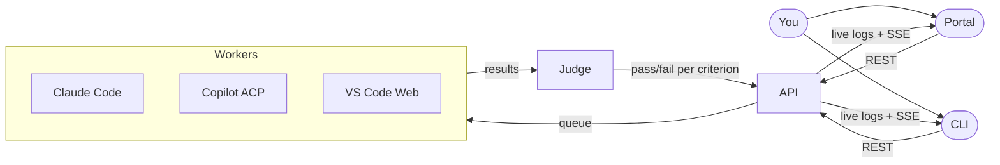

# Scope — User Onboarding Guide

Welcome to **Scope**, a platform for benchmarking AI coding agents. This guide walks you through everything you need to use Scope as a benchmarking operator — submitting runs, reviewing results, managing evaluation criteria, and generating reports.

## What is Scope?

Scope orchestrates coding tasks across multiple AI coding agents (GitHub Copilot, Claude Code, VS Code Web + Copilot), evaluates their output against a criteria DAG, and provides real-time log streaming, session video recordings, and AI-generated analysis reports.



## Accessing Scope

### Portal (Web UI)

The portal is the primary way to interact with Scope. Once services are running:

```
http://localhost:5100
```

Or use the convenience command:

```bash
pnpm open:portal
```

**Environment indicators:**
- **White favicon** = integration environment
- **Black favicon** = production environment
- The footer shows the git branch, commit hash, and build time for both portal and API

### CLI

The CLI is the power-user interface. All commands start with:

```bash
pnpm cli --help
```

Use `--help` at any subcommand level to discover options:

```bash
pnpm cli run --help
pnpm cli run submit --help
```

**Output formats** are available on most list/get commands via `-o`:
- `table` (default) — formatted table
- `json` — for scripting
- `yaml` — structured data
- `tsv` — pipe to `cut`, `awk`, etc.
- `markdown` — for reports and insights

## Core Workflow

### 1. Submit a Run

A **run** sends a coding task to an AI agent, which iterates on the solution until all evaluation criteria pass (or max iterations is reached).

**Portal:** Navigate to **New Run** and fill in:
- **Task** — the coding prompt (free text or pick from saved task prompts)
- **Model** — the LLM model for the agent (e.g., `gpt-4.1`, `claude-sonnet-4-20250514`)
- **Criteria** — evaluation criteria the solution must satisfy
- **Max iterations** — how many fix-attempt loops (default: 10)
- **Occurrence count** — submit the same run N times for statistical analysis
- Optionally: MCP servers, skills, agent version

**CLI:**
```bash
# Quick run with inline task
pnpm cli run submit -m "Create a Hello World Express API" -w coder-acp-copilot

# Run from a scenario file
pnpm cli run submit -s config/scenarios/hello-world-express.yaml

# Run with specific model and max iterations
pnpm cli run submit -m "Create a React snake game" -w coder-acp-copilot --model gpt-4.1 --max-iterations 5
```

### 2. Monitor Progress

Runs go through these statuses: **pending** → **processing** → **iterating** → **completed** / **failed** / **exhausted**

**Portal:** The Runs list auto-refreshes. Click a run to see:
- **Summary** — status, worker, model, run time, error details
- **Logs** — live-streaming output from the agent
- **Conversation** — turn-by-turn timeline of agent interactions
- **Criteria Results** — pass/fail per criterion with feedback
- **Video** — recorded session (VS Code Web worker)
- **Network** — HAR capture of HTTP traffic
- **Artifacts** — downloadable test snapshots

**CLI:**
```bash
# Stream logs in real time
pnpm cli run logs -i <run-id>

# Check status
pnpm cli run status -i <run-id>

# Get full run details
pnpm cli run get -i <run-id>
```

### 3. Review Criteria Results

After a run completes, the **Judge** evaluates the agent's output against each criterion. Criteria form a dependency DAG — if a parent criterion fails, descendant criteria are automatically skipped.

The run detail view shows pass/fail for each criterion with the judge's feedback explaining why it passed or failed.

### 4. Generate Reports

Reports are AI-generated analyses of one or more runs. They can be triggered automatically (via report templates) or manually.

**Portal:** From a run's detail page, click **Generate Report**. View the report in the Reports section — it renders as formatted markdown with insights.

**CLI:**
```bash
# Generate a report for a run
pnpm cli report generate -i <run-id>

# View the report as markdown
pnpm cli report get -i <report-id> -o markdown
```

### 5. Curate Insights

Reports produce **insights** — extracted observations about agent behavior. You can upvote, downvote, or block insights to curate quality.

**Portal:** The Insights page lists all extracted insights with voting controls.

**CLI:**
```bash
pnpm cli insight list
pnpm cli insight upvote -i <insight-id>
pnpm cli insight block -i <insight-id>
```

## Key Concepts

### Workers (AI Agents)

| Worker | Description | Auth |
|--------|-------------|------|
| `coder-acp-copilot` | GitHub Copilot via Agent Communication Protocol | GitHub token |
| `coder-acp-claude-code` | Claude Code via ACP | Anthropic API key |

Each worker supports different models. Check **Agents** in the portal to see which models each agent supports and their available versions.

### Criteria

Criteria define what the agent's output must contain or satisfy. They are organized as a DAG (directed acyclic graph) where criteria can depend on others.

Example criteria: `has_react`, `has_typescript`, `has_azure_bicep`

Criteria can be managed via:
- **Portal:** Criteria page — create, view dependency graph
- **CLI:** `pnpm cli criteria list`, `pnpm cli criteria create`, `pnpm cli criteria graph`
- **Bulk import:** `pnpm cli criteria import config/criteria/`

### Prompt Features

Prompt features are LLM-detected patterns in task prompts (e.g., "asks for an API", "asks for Docker"). They help classify tasks and can trigger specific report templates.

Manage via: **Features** in the portal or `pnpm cli prompt-feature` commands.

### Task Prompts

Saved task prompts are reusable, content-addressed task definitions. When you create a task prompt, Scope automatically extracts prompt features from it.

Manage via: **Tasks** in the portal or `pnpm cli task-prompt` commands.

### Scenarios

Scenario files (in `config/scenarios/`) bundle a task with its criteria into a reusable YAML definition:

```yaml
task: Create a Hello World Node.js/Express REST API

criteria:
  - Has a package.json with express as a dependency
  - Has a main entry file that creates an Express server
  - Has a GET / route that returns a hello world response
  - Server listens on a configurable port
```

Submit a scenario:
```bash
pnpm cli run submit -s config/scenarios/hello-world-express.yaml
```

### Report Templates

Report templates control what the AI report generator focuses on. You can configure:
- **User prompt** — what to analyze
- **System prompt** — append or override the default system prompt
- **Triggers** — auto-generate reports when criteria match, task prompts match, or on every run

Manage via: **Templates** in the portal or `pnpm cli report-template` commands.

### MCP Servers

Scope supports attaching remote [Model Context Protocol](https://modelcontextprotocol.io/) servers to runs. This gives agents access to external tools during execution.

Register servers via: **MCP** in the portal or `pnpm cli mcp server create`.

### Skills

Skills are agent prompt enhancements imported from GitHub repositories. They inject domain-specific instructions into the agent's context during a run.

Import via: **Skills** in the portal or `pnpm cli skill import`.

### Secrets (Keys & Accounts)

The **Secrets** section manages authentication credentials:
- **Accounts** — GitHub username/password/TOTP for the VS Code Web worker's automated authentication.

## Portal Feature Flags

Some portal sections are gated behind feature flags. Toggle them in **Admin** (bottom of the nav bar):

| Flag | Controls |
|------|----------|
| `tokens` | Secrets management (keys + accounts) |
| `agents` | Agent & model viewing |
| `models` | Model tracking across providers |
| `mcp` | MCP server registry |
| `skills` | Skills import & management |

Disabled sections are hidden from the nav bar.

## Statistics & Analysis

The **Statistics** page (default landing page) shows:
- Total runs, completed runs, pass rate
- Average iterations to success
- Pass rate charts per task/worker combination
- Success @ T (CDF) curves — probability of success within T iterations

Use the criteria filter to define what "success" means for your analysis.

The **MDP** (Markov Decision Process) view visualizes state transitions — how runs move through criterion/feature states, with node visit counts and edge transition probabilities.

## CLI Quick Reference

| Task | Command |
|------|---------|
| Submit a run | `pnpm cli run submit -m "task" -w coder-acp-copilot` |
| Submit from scenario | `pnpm cli run submit -s config/scenarios/hello-world-express.yaml` |
| List runs | `pnpm cli run list` |
| Stream run logs | `pnpm cli run logs -i <id>` |
| Download run artifacts | `pnpm cli run download -i <id>` |
| List criteria | `pnpm cli criteria list` |
| Import criteria | `pnpm cli criteria import config/criteria/` |
| View criteria DAG | `pnpm cli criteria graph` |
| Generate a report | `pnpm cli report generate -i <run-id>` |
| List agents | `pnpm cli agent list` |
| List insights | `pnpm cli insight list` |
| Demo mode (all agents) | `pnpm cli run demo -m "task"` |

## Environment Variables

| Variable | Default | Purpose |
|----------|---------|---------|
| `SCOPE_MT_API_URL` | `http://localhost:3100` | API endpoint for CLI |
| `JUDGE_STRATEGY` | `bundled` | `bundled` (fast) or `independent` (accurate, DAG-aware) |
| `JUDGE_MAX_PARALLELISM` | `3` | Max parallel criteria evaluations |
| `FEEDBACK_MAX_CRITERIA` | `1` | Max failed criteria to surface per iteration |
| `LLM_MODEL` | `gpt-4.1` | Model for criteria prompt generation |

See [ENV_VARIABLES.md](../ENV_VARIABLES.md) for the complete reference.
